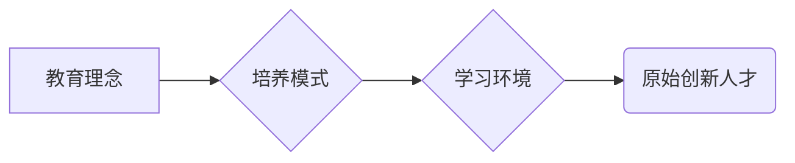

> 原始创新、人才培养、人工智能、技术驱动、跨学科融合、实践经验、批判性思维、创新生态

## 1. 背景介绍

在当今科技飞速发展的时代，原始创新人才已成为推动社会进步和经济发展的关键力量。人工智能、大数据、云计算等新兴技术的蓬勃发展，对人才的需求更加迫切。然而，培养具备原始创新能力的人才并非易事，需要从教育理念、培养模式、学习环境等多方面进行改革和创新。

传统的教育模式往往注重知识传授和技能训练，缺乏对创新思维和实践能力的培养。而原始创新人才需要具备以下核心能力：

* **批判性思维：** 能够独立思考，质疑现状，提出新颖的观点和解决方案。
* **系统思维：** 能够将问题分解成各个部分，并理解它们之间的相互关系，从而找到全局性的解决方案。
* **创造力：** 能够产生新颖、独特、有价值的思想和创意。
* **实践能力：** 能够将想法付诸实践，并不断迭代改进。
* **跨学科融合：** 能够将不同领域的知识和技能结合起来，解决复杂问题。

## 2. 核心概念与联系

原始创新人才的培养是一个复杂而多维度的系统工程，涉及教育、科研、企业等多个环节。

**Mermaid 流程图：**



**核心概念与联系：**

* **教育理念：** 应从培养学生的创新思维和实践能力出发，鼓励学生独立思考、探索和实践。
* **培养模式：** 应采用项目驱动、案例教学、团队合作等方式，培养学生的综合能力和创新能力。
* **学习环境：** 应营造开放、包容、鼓励创新的学习氛围，提供丰富的学习资源和实践机会。

## 3. 核心算法原理 & 具体操作步骤

原始创新人才的培养需要遵循一定的算法原理和操作步骤，才能有效提升人才的创新能力。

### 3.1  算法原理概述

原始创新人才的培养算法可以概括为以下几个步骤：

1. **激发好奇心：** 培养学生的求知欲和探索精神，引导他们对世界充满好奇。
2. **培养批判性思维：** 鼓励学生质疑现状，思考问题，并提出自己的观点和解决方案。
3. **激发创造力：** 提供丰富的学习资源和实践机会，鼓励学生进行创意思考和实践探索。
4. **加强实践能力：** 通过项目驱动、案例教学等方式，帮助学生将理论知识转化为实际应用能力。
5. **促进跨学科融合：** 鼓励学生学习不同领域的知识和技能，并将其结合起来解决问题。

### 3.2  算法步骤详解

1. **激发好奇心：**

* 通过趣味性强的课程和活动，激发学生的学习兴趣和探索精神。
* 鼓励学生提出问题，并引导他们寻找答案。
* 组织学生进行科学实验和探究活动，让他们亲身体验科学的奥秘。

2. **培养批判性思维：**

* 鼓励学生质疑权威，思考问题背后的原因。
* 教导学生如何分析信息，辨别真伪，并形成自己的判断。
* 组织学生进行辩论和讨论，锻炼他们的逻辑思维和表达能力。

3. **激发创造力：**

* 提供丰富的创意素材和工具，鼓励学生进行想象和创作。
* 组织学生进行设计、发明和创新比赛，激发他们的创造热情。
* 鼓励学生将自己的创意付诸实践，并不断改进和完善。

4. **加强实践能力：**

* 通过项目驱动、案例教学等方式，帮助学生将理论知识转化为实际应用能力。
* 鼓励学生参与实际项目，并承担相应的责任。
* 提供必要的指导和支持，帮助学生克服困难，完成项目目标。

5. **促进跨学科融合：**

* 鼓励学生学习不同领域的知识和技能，并将其结合起来解决问题。
* 组织学生进行跨学科合作项目，促进不同学科之间的交流和融合。
* 邀请来自不同领域的专家学者进行讲座和交流，拓宽学生的视野。

### 3.3  算法优缺点

**优点：**

* 能够有效培养学生的创新思维和实践能力。
* 能够促进学生跨学科融合，提升综合素质。
* 能够培养学生的独立思考和解决问题的能力。

**缺点：**

* 需要投入大量的资源和时间。
* 需要教师具备较高的教学水平和创新能力。
* 需要营造良好的学习环境和氛围。

### 3.4  算法应用领域

该算法适用于各个层次的教育，包括基础教育、高等教育和职业教育。

## 4. 数学模型和公式 & 详细讲解 & 举例说明

原始创新人才的培养可以抽象为一个数学模型，其中涉及到多个变量和参数。

### 4.1  数学模型构建

设：

*  `I` 为学生的创新能力
*  `C` 为学生的批判性思维能力
*  `Cr` 为学生的创造力
*  `P` 为学生的实践能力
*  `F` 为学生的跨学科融合能力
*  `E` 为学习环境的质量
*  `T` 为教师的教学水平

则原始创新人才的培养模型可以表示为：

```latex
I = f(C, Cr, P, F, E, T)
```

其中，`f` 为一个复杂的非线性函数，代表着各个因素之间的相互作用关系。

### 4.2  公式推导过程

由于模型的复杂性，难以直接推导出 `f` 的具体表达式。但我们可以通过分析各个因素的影响关系，并进行定量研究，来构建更精确的模型。

例如，我们可以通过调查问卷和实验数据，分析学生创新能力与批判性思维能力、创造力、实践能力、跨学科融合能力之间的相关性。

### 4.3  案例分析与讲解

我们可以通过对不同教育模式和学习环境的比较研究，分析其对学生创新能力的影响。例如，我们可以比较项目驱动型教学和传统课堂教学对学生创新能力的影响，并分析其背后的原因。

## 5. 项目实践：代码实例和详细解释说明

为了更好地理解原始创新人才的培养算法，我们可以通过一个实际项目来进行实践。

### 5.1  开发环境搭建

我们可以使用 Python 语言和 Jupyter Notebook 环境进行开发。

### 5.2  源代码详细实现

```python
# 原始创新人才培养算法
def cultivate_innovation(c, cr, p, f, e, t):
  """
  计算学生创新能力

  Args:
    c: 批判性思维能力
    cr: 创造力
    p: 实践能力
    f: 跨学科融合能力
    e: 学习环境质量
    t: 教师教学水平

  Returns:
    学生创新能力
  """
  # 复杂非线性函数，需要根据实际情况进行调整
  innovation_ability = c * cr * p * f * e * t
  return innovation_ability

# 示例数据
c = 80
cr = 90
p = 70
f = 85
e = 95
t = 90

# 计算学生创新能力
innovation_ability = cultivate_innovation(c, cr, p, f, e, t)

# 打印结果
print(f"学生创新能力: {innovation_ability}")
```

### 5.3  代码解读与分析

该代码实现了原始创新人才培养算法的基本逻辑。

* 函数 `cultivate_innovation` 接收学生各个能力指标和学习环境质量、教师教学水平作为输入参数，并计算出学生的创新能力。
* 函数内部使用了一个简单的乘法运算来模拟各个因素之间的相互作用关系。
* 实际应用中，需要根据具体情况调整函数的表达式，使其更准确地反映各个因素的影响关系。

### 5.4  运行结果展示

运行该代码，可以得到学生的创新能力数值。

## 6. 实际应用场景

原始创新人才的培养策略可以应用于各个领域，例如：

### 6.1  教育领域

* 构建创新型教育体系，培养学生的创新思维和实践能力。
* 推广项目驱动型教学，鼓励学生自主学习和探索。
* 营造开放、包容、鼓励创新的学习氛围。

### 6.2  企业领域

* 建立创新文化，鼓励员工提出新想法和解决方案。
* 提供员工培训和发展机会，提升员工的创新能力。
* 设立创新奖励机制，激励员工积极创新。

### 6.3  科研领域

* 鼓励跨学科合作，促进科研成果的转化应用。
* 探索新的科研方法和技术，推动科技进步。
* 加强人才培养，培养更多具有创新能力的科研人员。

### 6.4  未来应用展望

随着人工智能、大数据等技术的不断发展，原始创新人才的需求将更加迫切。未来，原始创新人才的培养策略将更加注重：

* **个性化培养：** 根据学生的个性特点和兴趣爱好，制定个性化的培养方案。
* **跨学科融合：** 鼓励学生学习不同领域的知识和技能，并将其结合起来解决问题。
* **实践导向：** 更加注重实践经验的积累，帮助学生将理论知识转化为实际应用能力。
* **人工智能辅助：** 利用人工智能技术，个性化推荐学习资源，提供智能化的学习指导。

## 7. 工具和资源推荐

### 7.1  学习资源推荐

* **在线课程平台：** Coursera、edX、Udacity 等平台提供丰富的在线课程，涵盖人工智能、大数据、云计算等领域。
* **开源项目平台：** GitHub、GitLab 等平台提供大量的开源项目，可以帮助学生学习和实践编程技能。
* **学术期刊和会议论文：** 关注人工智能、大数据、云计算等领域的最新研究成果。

### 7.2  开发工具推荐

* **编程语言：** Python、Java、C++ 等编程语言是人工智能、大数据、云计算等领域的常用语言。
* **机器学习框架：** TensorFlow、PyTorch、Keras 等机器学习框架可以帮助学生快速构建和训练机器学习模型。
* **数据分析工具：** Pandas、NumPy、Scikit-learn 等数据分析工具可以帮助学生进行数据分析和可视化。

### 7.3  相关论文推荐

* **《深度学习》** by Ian Goodfellow, Yoshua Bengio, and Aaron Courville
* **《机器学习》** by Tom Mitchell
* **《人工智能：现代方法》** by Stuart Russell and Peter Norvig

## 8. 总结：未来发展趋势与挑战

### 8.1  研究成果总结

原始创新人才的培养是一个复杂的系统工程，需要多学科交叉融合，才能有效提升人才的创新能力。

### 8.2  未来发展趋势

未来，原始创新人才的培养将更加注重个性化、跨学科融合、实践导向和人工智能辅助。

### 8.3  面临的挑战

* 如何构建更加有效的培养模式和评价体系？
* 如何激发学生的学习兴趣和创新热情？
* 如何提供更加丰富的学习资源和实践机会？
* 如何应对人工智能技术带来的挑战和机遇？

### 8.4  研究展望

未来，我们将继续深入研究原始创新人才的培养机制，探索更加有效的培养策略，为培养更多具有创新能力的人才做出贡献。

## 9. 附录：常见问题与解答

**常见问题：**

* 如何培养学生的批判性思维能力？
* 如何激发学生的创造力？
* 如何提高学生的实践能力？
* 如何促进学生的跨学科融合？

**解答：**

* 鼓励学生提出问题，并引导他们思考问题背后的原因。
* 提供丰富的创意素材和工具，鼓励学生进行想象和创作。
* 通过项目驱动、案例教学等方式，帮助学生将理论知识转化为实际应用能力。
* 鼓励学生学习不同领域的知识和技能，并将其结合起来解决问题。


作者：禅与计算机程序设计艺术 / Zen and the Art of Computer Programming 
<end_of_turn>