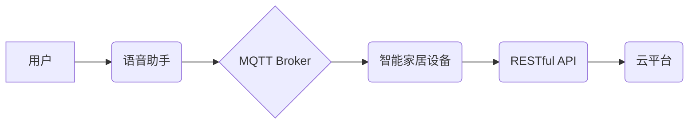

> MQTT, RESTful API, 智能家居, 语音控制, 物联网, 

## 1. 背景介绍

随着物联网技术的快速发展，智能家居已成为现代生活的重要组成部分。智能家居系统能够通过传感器、 actuators 和网络连接，实现对家居环境的自动化控制，例如灯光、温度、安全等。语音控制作为一种便捷、自然的交互方式，逐渐成为智能家居系统的重要组成部分。

传统的智能家居语音控制系统通常依赖于云端服务，存在延迟高、安全风险等问题。为了解决这些问题，本文提出了一种基于MQTT协议和RESTful API的智能家居语音控制接口开发方案，该方案具有以下特点：

* **轻量级、高效:** MQTT协议是一种轻量级的消息传输协议，适用于物联网场景，能够有效降低网络带宽和功耗。
* **实时性强:** MQTT协议支持发布/订阅模式，能够实现实时数据传输，满足智能家居系统对实时响应的需求。
* **安全性高:** RESTful API可以采用HTTPS协议进行加密传输，保障数据安全。
* **可扩展性强:** MQTT协议和RESTful API都是开放标准，可以与其他系统和设备进行集成。

## 2. 核心概念与联系

### 2.1 MQTT协议

MQTT（Message Queuing Telemetry Transport）是一种轻量级的消息传输协议，专门为物联网应用设计的。它基于发布/订阅模式，允许设备之间进行可靠的消息传递。

MQTT协议的主要特点包括：

* **轻量级:** MQTT协议的协议栈非常小，占用资源少，适合资源受限的设备。
* **高效:** MQTT协议采用压缩传输机制，能够有效降低网络带宽和功耗。
* **可靠:** MQTT协议支持消息确认机制，确保消息的可靠传输。
* **可扩展:** MQTT协议支持多种主题和 QoS（服务质量）级别，可以满足不同应用场景的需求。

### 2.2 RESTful API

RESTful API（Representational State Transfer Application Programming Interface）是一种基于 HTTP 协议的软件架构风格，用于构建 Web 服务。RESTful API 的特点包括：

* **资源导向:** RESTful API 将数据视为资源，每个资源都有唯一的标识符（URI）。
* **状态转移:** RESTful API 使用 HTTP 动词（GET、POST、PUT、DELETE）来操作资源的状态。
* **缓存:** RESTful API 支持缓存机制，可以提高性能。
* **可扩展:** RESTful API 可以轻松扩展，支持多种数据格式和协议。

### 2.3 智能家居系统架构

基于MQTT协议和RESTful API的智能家居语音控制接口开发方案，其系统架构如下：



**架构说明:**

* 用户通过语音助手发出语音指令。
* 语音助手将语音指令转换为文本指令，并通过MQTT协议发送到MQTT Broker。
* MQTT Broker将文本指令转发给相应的智能家居设备。
* 智能家居设备接收指令后，执行相应的动作，并将执行结果通过RESTful API发送回云平台。
* 云平台将执行结果反馈给语音助手，语音助手将结果反馈给用户。

## 3. 核心算法原理 & 具体操作步骤

### 3.1  算法原理概述

本方案的核心算法是基于自然语言处理（NLP）技术的语音识别和指令理解算法。该算法主要包括以下步骤：

1. **语音识别:** 将用户发出的语音信号转换为文本。
2. **指令解析:** 分析文本指令，识别用户意图和操作目标。
3. **设备控制:** 根据指令内容，控制相应的智能家居设备。

### 3.2  算法步骤详解

1. **语音识别:** 使用语音识别引擎将用户发出的语音信号转换为文本。常用的语音识别引擎包括Google Cloud Speech-to-Text、Amazon Transcribe、Microsoft Azure Speech Services等。
2. **指令解析:** 使用自然语言处理技术对识别出的文本指令进行分析，识别用户意图和操作目标。例如，用户说“打开客厅灯”，指令解析器可以识别出用户意图是“打开灯”，操作目标是“客厅灯”。
3. **设备控制:** 根据指令解析结果，通过MQTT协议或RESTful API控制相应的智能家居设备。例如，如果用户意图是“打开灯”，操作目标是“客厅灯”，则可以通过MQTT协议发送“打开客厅灯”指令到客厅灯设备。

### 3.3  算法优缺点

**优点:**

* **便捷性:** 语音控制比传统的按钮或遥控器更便捷。
* **自然性:** 语音交互更符合人类的自然语言习惯。
* **安全性:** 语音控制可以避免用户接触到物理按钮，提高安全性。

**缺点:**

* **准确性:** 语音识别和指令理解算法的准确性仍然存在一定问题，可能会导致误解。
* **环境噪声:** 环境噪声会影响语音识别的准确性。
* **隐私安全:** 语音数据需要进行安全保护，防止泄露。

### 3.4  算法应用领域

语音控制算法广泛应用于智能家居、智能车、智能医疗等领域。

## 4. 数学模型和公式 & 详细讲解 & 举例说明

### 4.1  数学模型构建

语音识别和指令理解算法通常使用统计模型进行建模。例如，可以使用隐马尔可夫模型（HMM）来建模语音信号的概率分布，使用条件随机场（CRF）来建模指令的概率分布。

### 4.2  公式推导过程

HMM和CRF的公式推导过程比较复杂，这里不再赘述。

### 4.3  案例分析与讲解

假设我们有一个简单的语音识别模型，它可以识别出以下几个单词：“打开”、“关闭”、“灯”。

如果用户说“打开客厅灯”，语音识别模型会将语音信号转换为文本“打开客厅灯”。然后，指令理解模型会分析文本指令，识别出用户意图是“打开灯”，操作目标是“客厅灯”。

## 5. 项目实践：代码实例和详细解释说明

### 5.1  开发环境搭建

本方案的开发环境包括：

* **操作系统:** Linux 或 Windows
* **编程语言:** Python
* **开发工具:** Eclipse、VS Code 等
* **MQTT Broker:** Mosquitto、EMQX 等
* **RESTful API框架:** Flask、Django 等

### 5.2  源代码详细实现

```python
# 导入必要的库
import paho.mqtt.client as mqtt
from flask import Flask, request

# 创建 Flask 应用
app = Flask(__name__)

# MQTT Broker 地址
MQTT_BROKER_ADDRESS = "mqtt.example.com"

# MQTT 主题
MQTT_TOPIC = "smart_home/control"

# 创建 MQTT 客户端
client = mqtt.Client()

# 连接 MQTT Broker
client.connect(MQTT_BROKER_ADDRESS)

# 订阅 MQTT 主题
client.subscribe(MQTT_TOPIC)

# 定义 RESTful API 路由
@app.route('/control', methods=['POST'])
def control_device():
    # 获取请求数据
    data = request.get_json()

    # 获取指令内容
    command = data['command']

    # 发送 MQTT 消息
    client.publish(MQTT_TOPIC, command)

    # 返回响应
    return 'OK'

# 启动 Flask 应用
if __name__ == '__main__':
    app.run(debug=True)
```

### 5.3  代码解读与分析

* **MQTT 客户端:** 代码首先创建了一个 MQTT 客户端，并连接到 MQTT Broker。
* **订阅主题:** 客户端订阅了 `smart_home/control` 主题，以便接收来自智能家居设备的消息。
* **RESTful API 路由:** 代码定义了一个 `/control` 路由，用于接收来自云平台的控制指令。
* **处理指令:** 当收到控制指令时，代码会将指令发送到 MQTT Broker，并返回响应。

### 5.4  运行结果展示

当用户通过云平台发送控制指令到 `/control` 路由时，代码会将指令发送到 MQTT Broker，并转发给相应的智能家居设备。智能家居设备接收指令后，会执行相应的动作。

## 6. 实际应用场景

### 6.1  智能家居场景

* **语音控制灯光:** 用户可以通过语音指令控制客厅、卧室等房间的灯光开关和亮度。
* **语音控制空调:** 用户可以通过语音指令控制空调的温度、风速和模式。
* **语音控制窗帘:** 用户可以通过语音指令控制窗帘的开合。
* **语音控制安全系统:** 用户可以通过语音指令控制门锁、报警器等安全设备。

### 6.2  其他应用场景

* **智能车:** 用户可以通过语音指令控制车辆的导航、音乐、空调等功能。
* **智能医疗:** 用户可以通过语音指令控制医疗设备，例如血糖仪、血压计等。

### 6.3  未来应用展望

随着人工智能技术的不断发展，语音控制技术将更加智能化、人性化。未来，语音控制将应用于更多领域，例如教育、娱乐、金融等。

## 7. 工具和资源推荐

### 7.1  学习资源推荐

* **MQTT协议:** https://mqtt.org/
* **RESTful API:** https://restfulapi.net/
* **自然语言处理:** https://www.nltk.org/

### 7.2  开发工具推荐

* **MQTT Broker:** Mosquitto、EMQX
* **RESTful API框架:** Flask、Django
* **语音识别引擎:** Google Cloud Speech-to-Text、Amazon Transcribe、Microsoft Azure Speech Services

### 7.3  相关论文推荐

* **MQTT协议:**
    * MQTT Protocol Specification
* **RESTful API:**
    * RESTful Web Services
* **自然语言处理:**
    * Speech and Language Processing

## 8. 总结：未来发展趋势与挑战

### 8.1  研究成果总结

本文介绍了一种基于MQTT协议和RESTful API的智能家居语音控制接口开发方案，该方案具有轻量级、高效、实时性强、安全性高、可扩展性强等特点。

### 8.2  未来发展趋势

* **更智能的语音识别和指令理解算法:** 未来，语音识别和指令理解算法将更加智能化，能够识别更复杂的语音指令，并更好地理解用户的意图。
* **更丰富的语音交互体验:** 未来，语音控制将更加人性化，能够支持多轮对话、上下文理解等功能，提供更丰富的语音交互体验。
* **更广泛的应用场景:** 未来，语音控制将应用于更多领域，例如教育、娱乐、金融等。

### 8.3  面临的挑战

* **准确性:** 语音识别和指令理解算法的准确性仍然存在一定问题，需要进一步提高。
* **环境噪声:** 环境噪声会影响语音识别的准确性，需要开发更鲁棒的语音识别算法。
* **隐私安全:** 语音数据需要进行安全保护，防止泄露。

### 8.4  研究展望

未来，我们将继续研究更智能、更安全的语音控制技术，为用户提供更便捷、更人性化的智能家居体验。

## 9. 附录：常见问题与解答

### 9.1  常见问题

* **如何选择合适的 MQTT Broker?**

  选择 MQTT Broker 需要考虑以下因素：

  * **性能:** 选择性能强劲的 MQTT Broker，能够满足智能家居系统的实时性需求。
  * **安全性:** 选择安全性高的 MQTT Broker，能够保障数据安全。
  * **易用性:** 选择易于部署和管理的 MQTT Broker。

* **如何实现语音识别和指令理解?**

  可以使用现有的语音识别引擎和自然语言处理库实现语音识别和指令理解。

* **如何保障语音数据的安全?**

  可以使用加密技术和身份验证机制保障语音数据的安全。

### 9.2  解答

* **如何选择合适的 MQTT Broker?**

  一些常用的 MQTT Broker 包括 Mosquitto、EMQX、HiveMQ 等。您可以根据自己的需求选择合适的 Broker。

* **如何实现语音识别和指令理解?**

  您可以使用 Google