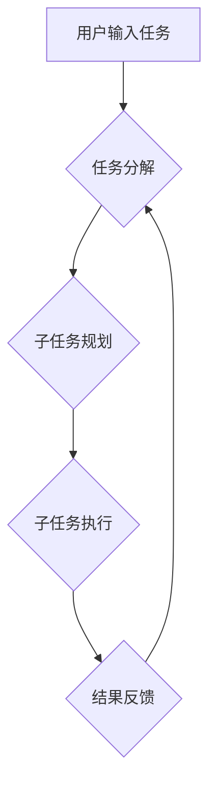

> 大语言模型，BabyAGI，自动化，任务管理，人工智能，效率提升，流程化

## 1. 背景介绍

在人工智能领域蓬勃发展的今天，大语言模型（LLM）已成为研究和应用的热点。这些模型凭借其强大的文本理解和生成能力，在自然语言处理、机器翻译、文本摘要等领域取得了突破性进展。然而，LLM 的应用场景远不止于此。

BabyAGI 作为一种基于 LLM 的自动化任务管理框架，将 LLM 的能力与任务管理流程相结合，为用户提供了一种全新的工作方式。它能够理解用户的自然语言指令，并自动分解任务、规划步骤、执行操作，最终实现自动化任务执行。

## 2. 核心概念与联系

BabyAGI 的核心概念是将任务分解成一系列子任务，并通过循环迭代的方式逐步完成。它借鉴了人类的决策和执行流程，将任务管理视为一个不断学习和优化的过程。

**BabyAGI 架构流程图:**



**核心概念:**

* **任务分解:** 将复杂的任务分解成一系列更小的、易于处理的子任务。
* **子任务规划:** 为每个子任务制定执行步骤和所需资源。
* **子任务执行:** 利用 LLM 和其他工具执行子任务。
* **结果反馈:** 收集子任务执行结果，并反馈给任务分解环节，进行调整和优化。

## 3. 核心算法原理 & 具体操作步骤

### 3.1  算法原理概述

BabyAGI 的核心算法基于循环迭代和强化学习的原理。它通过不断执行子任务、收集反馈信息，并根据反馈信息调整任务分解和子任务规划，最终实现任务的自动化执行。

### 3.2  算法步骤详解

1. **用户输入任务:** 用户使用自然语言描述需要完成的任务。
2. **任务分解:** BabyAGI 利用 LLM 分析用户输入的任务，并将其分解成一系列子任务。
3. **子任务规划:** BabyAGI 为每个子任务制定执行步骤和所需资源，并根据任务的优先级和依赖关系进行排序。
4. **子任务执行:** BabyAGI 利用 LLM 和其他工具执行子任务，例如：
    * 使用 LLM 生成代码、文档或其他文本内容。
    * 使用 API 调用外部服务，例如搜索引擎、数据库或云计算平台。
    * 控制硬件设备，例如机器人或传感器。
5. **结果反馈:** BabyAGI 收集子任务执行结果，并将其反馈给任务分解环节，用于调整和优化后续的执行流程。

### 3.3  算法优缺点

**优点:**

* **自动化任务执行:** 可以自动完成重复性或复杂的任务，提高工作效率。
* **灵活性和可扩展性:** 可以根据用户的需求灵活调整任务分解和子任务规划，并扩展到不同的应用场景。
* **持续学习和优化:** 通过收集反馈信息，BabyAGI 可以不断学习和优化执行流程，提高任务完成效率。

**缺点:**

* **依赖于 LLM 的性能:** BabyAGI 的性能取决于所使用的 LLM 的能力，如果 LLM 的性能不足，可能会导致任务执行失败或效率低下。
* **安全性和可靠性:** 由于 BabyAGI 需要访问和控制外部资源，因此需要考虑安全性和可靠性问题。
* **解释性和可控性:** BabyAGI 的决策过程可能难以理解和控制，这可能会导致用户对任务执行结果缺乏信任。

### 3.4  算法应用领域

BabyAGI 的应用领域非常广泛，例如：

* **个人效率提升:** 自动化日常任务，例如日程安排、邮件回复、文档整理等。
* **企业流程自动化:** 自动化业务流程，例如客户服务、订单处理、财务管理等。
* **科研和开发:** 自动化数据分析、代码生成、实验设计等。
* **教育和培训:** 自动化教学内容生成、学生作业批改、个性化学习辅导等。

## 4. 数学模型和公式 & 详细讲解 & 举例说明

### 4.1  数学模型构建

BabyAGI 的核心算法可以抽象为一个状态转移模型，其中每个状态代表任务执行的某个阶段，状态转移则代表任务执行的步骤。

**状态转移模型:**

```
S(t) = f(S(t-1), A(t))
```

其中：

* S(t) 表示时间 t 时刻的任务状态。
* S(t-1) 表示时间 t-1 时刻的任务状态。
* A(t) 表示时间 t 时刻执行的动作。
* f() 表示状态转移函数，描述了动作如何影响任务状态。

### 4.2  公式推导过程

状态转移函数 f() 的具体形式取决于任务的类型和执行步骤。例如，对于一个简单的任务，例如“发送邮件”，状态转移函数可以定义为：

```
S(t) = {
    "未发送" if S(t-1) == "未发送" and A(t) == "发送邮件"
    "已发送" if S(t-1) == "未发送" and A(t) == "发送邮件"
    S(t-1) otherwise
}
```

### 4.3  案例分析与讲解

假设用户输入的任务是“写一篇关于 BabyAGI 的博客文章”。BabyAGI 会将其分解成以下子任务：

* **研究 BabyAGI:** 阅读相关文档和资料，了解 BabyAGI 的原理和应用场景。
* **收集信息:** 搜索网络，收集关于 BabyAGI 的最新信息和案例。
* **撰写文章:** 利用 LLM 生成文章草稿。
* **修改和完善:** 对文章进行修改和完善，确保内容准确、完整和易读。
* **发布文章:** 将文章发布到博客平台。

每个子任务都可以用状态转移模型来描述，例如，子任务“撰写文章”的状态转移函数可以定义为：

```
S(t) = {
    "未完成" if S(t-1) == "未完成" and A(t) == "生成文章草稿"
    "已完成" if S(t-1) == "未完成" and A(t) == "生成文章草稿"
    S(t-1) otherwise
}
```

## 5. 项目实践：代码实例和详细解释说明

### 5.1  开发环境搭建

BabyAGI 的开发环境可以使用 Python 语言和相关的库进行搭建。

**依赖库:**

* transformers: 用于加载和使用预训练的 LLM 模型。
* openai: 用于调用 OpenAI 的 API，例如 GPT-3。
* requests: 用于发送 HTTP 请求，例如访问 API。
* json: 用于处理 JSON 数据格式。

### 5.2  源代码详细实现

```python
import transformers
import openai

# 加载预训练的 LLM 模型
model = transformers.AutoModelForCausalLM.from_pretrained("gpt2")

# 设置 OpenAI API 的密钥
openai.api_key = "YOUR_API_KEY"

def generate_text(prompt):
    response = openai.Completion.create(
        engine="text-davinci-003",
        prompt=prompt,
        max_tokens=100,
        temperature=0.7
    )
    return response.choices[0].text

def execute_task(task):
    # 根据任务类型执行相应的操作
    if "写博客文章" in task:
        prompt = f"请写一篇关于 BabyAGI 的博客文章。"
        article = generate_text(prompt)
        print(article)
    else:
        print("不支持的任务类型")

# 用户输入任务
task = input("请输入需要完成的任务：")

# 执行任务
execute_task(task)
```

### 5.3  代码解读与分析

* 代码首先加载预训练的 LLM 模型和设置 OpenAI API 的密钥。
* `generate_text()` 函数用于调用 OpenAI 的 API 生成文本内容。
* `execute_task()` 函数根据任务类型执行相应的操作，例如调用 `generate_text()` 函数生成博客文章。
* 用户输入任务后，代码调用 `execute_task()` 函数执行任务。

### 5.4  运行结果展示

当用户输入任务“写一篇关于 BabyAGI 的博客文章”时，代码会调用 OpenAI 的 API 生成一篇关于 BabyAGI 的博客文章，并将其打印到控制台。

## 6. 实际应用场景

### 6.1  个人效率提升

BabyAGI 可以帮助个人自动化日常任务，例如：

* **日程安排:** 自动根据用户的日程安排和会议信息，生成每日计划和提醒。
* **邮件回复:** 自动回复简单的邮件，例如感谢邮件、会议确认邮件等。
* **文档整理:** 自动整理文档，例如提取关键信息、分类文档、生成摘要等。

### 6.2  企业流程自动化

BabyAGI 可以帮助企业自动化业务流程，例如：

* **客户服务:** 自动回复客户咨询，提供常见问题解答，并根据客户需求转接人工客服。
* **订单处理:** 自动处理订单，例如生成订单确认邮件、安排物流配送、处理退货退款等。
* **财务管理:** 自动处理财务报表，例如生成收入报表、支出报表、利润报表等。

### 6.3  科研和开发

BabyAGI 可以帮助科研人员和开发人员自动化科研和开发任务，例如：

* **数据分析:** 自动分析数据，例如识别趋势、发现异常、生成图表等。
* **代码生成:** 自动生成代码，例如根据需求生成函数、类、接口等。
* **实验设计:** 自动设计实验方案，例如确定实验变量、设置实验条件、分析实验结果等。

### 6.4  未来应用展望

BabyAGI 的应用场景还在不断扩展，未来可能会应用于更多领域，例如：

* **教育和培训:** 自动化教学内容生成、学生作业批改、个性化学习辅导等。
* **医疗保健:** 自动化病历分析、诊断辅助、药物研发等。
* **艺术创作:** 自动生成音乐、绘画、诗歌等艺术作品。

## 7. 工具和资源推荐

### 7.1  学习资源推荐

* **论文:**
    * "BabyAGI: An Agent That Automates Its Own Tasks"
    * "Language Models are Few-Shot Learners"
* **博客:**
    * https://www.deeplearning.ai/
    * https://blog.openai.com/

### 7.2  开发工具推荐

* **Python:** https://www.python.org/
* **transformers:** https://huggingface.co/docs/transformers/index
* **openai:** https://platform.openai.com/docs/api-reference

### 7.3  相关论文推荐

* "Attention Is All You Need"
* "BERT: Pre-training of Deep Bidirectional Transformers for Language Understanding"
* "GPT-3: Language Models are Few-Shot Learners"

## 8. 总结：未来发展趋势与挑战

### 8.1  研究成果总结

BabyAGI 作为一种基于 LLM 的自动化任务管理框架，取得了显著的成果，为自动化任务执行提供了新的思路和方法。

### 8.2  未来发展趋势

未来，BabyAGI 的发展趋势包括：

* **模型能力提升:** 利用更强大的 LLM 模型，提高 BabyAGI 的任务理解和执行能力。
* **场景化应用:** 开发针对不同场景的 BabyAGI 应用，例如教育、医疗、金融等。
* **多模态交互:** 支持多模态输入和输出，例如文本、图像、音频等。
* **安全性和可靠性:** 加强 BabyAGI 的安全性和可靠性，确保任务执行的安全性。

### 8.3  面临的挑战

BabyAGI 还面临一些挑战，例如：

* **数据依赖:** BabyAGI 的性能依赖于训练数据的质量和数量。
* **解释性和可控性:** BabyAGI 的决策过程可能难以理解和控制，这可能会导致用户对任务执行结果缺乏信任。
* **伦理问题:** BabyAGI 的应用可能会引发一些伦理问题，例如数据隐私、算法偏见等。

### 8.4  研究展望

