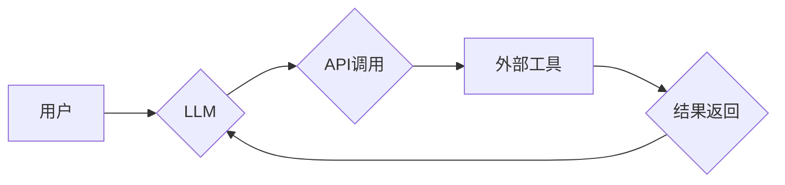

> 大语言模型 (LLM)、外部工具、API调用、数据处理、安全机制、应用场景

## 1. 背景介绍

大语言模型 (LLM) 近年来取得了令人瞩目的进展，展现出强大的文本生成、理解和翻译能力。然而，LLM 的知识库和推理能力仍然局限于其训练数据，无法直接访问实时信息或执行外部操作。为了弥补这一不足，将 LLM 与外部工具相结合成为一个重要的研究方向。

使用外部工具可以扩展 LLM 的功能，使其能够：

* **访问实时信息：** 通过 API 调用获取最新数据，例如天气预报、股票价格、新闻资讯等。
* **执行计算和逻辑操作：** 利用外部工具进行数学计算、数据分析、代码生成等任务。
* **控制物理设备：** 通过 API 控制机器人、智能家居设备等，实现 LLM 的实际应用。

## 2. 核心概念与联系

**2.1 核心概念**

* **大语言模型 (LLM)：** 训练于海量文本数据，能够理解和生成人类语言的深度学习模型。
* **外部工具：** 独立的软件应用程序或服务，提供特定功能或数据访问。
* **API (应用程序接口)：** 允许不同软件应用程序之间进行通信和数据交换的规范。

**2.2 架构图**



**2.3 联系**

LLM 通过 API 调用与外部工具进行交互。用户向 LLM 提问或发出指令，LLM 会根据其理解和知识库生成相应的请求，并通过 API 发送给外部工具。外部工具处理请求并返回结果，LLM 接收结果并进行处理，最终返回给用户。

## 3. 核心算法原理 & 具体操作步骤

**3.1 算法原理概述**

使用外部工具的 LLM 应用主要基于以下算法原理：

* **自然语言理解 (NLU)：** LLM 使用 NLU 算法解析用户输入，识别意图和实体。
* **对话管理 (Dialogue Management)：** 根据用户意图，LLM 选择合适的外部工具并生成 API 调用请求。
* **数据处理和转换：** LLM 需要将用户输入和外部工具返回的结果进行格式转换和处理，以确保数据一致性和可读性。

**3.2 算法步骤详解**

1. **用户输入：** 用户向 LLM 提问或发出指令。
2. **NLU 解析：** LLM 使用 NLU 算法解析用户输入，识别意图和实体。
3. **意图匹配：** 根据识别出的意图，LLM 选择合适的外部工具。
4. **API 调用生成：** LLM 根据用户输入和外部工具的 API 文档，生成相应的 API 调用请求。
5. **API 调用执行：** LLM 发送 API 调用请求给外部工具，并接收返回结果。
6. **数据处理和转换：** LLM 处理和转换外部工具返回的结果，使其与用户输入和对话上下文一致。
7. **结果生成：** LLM 生成最终的回复，并返回给用户。

**3.3 算法优缺点**

**优点：**

* **扩展功能：** 可以利用外部工具的强大功能，扩展 LLM 的应用场景。
* **实时信息获取：** 可以访问实时数据，提供更准确和最新的信息。
* **个性化体验：** 可以根据用户的需求和偏好，选择不同的外部工具，提供个性化的服务。

**缺点：**

* **复杂性增加：** 需要考虑 API 调用、数据处理和安全等方面的复杂问题。
* **依赖性增加：** LLM 的功能依赖于外部工具的稳定性和可用性。
* **安全风险：** 不安全的 API 调用可能会导致数据泄露或系统攻击。

**3.4 算法应用领域**

* **智能客服：** 利用外部工具获取产品信息、处理订单、提供售后服务。
* **个性化推荐：** 利用外部工具获取用户喜好、推荐相关产品或服务。
* **代码生成：** 利用外部工具获取代码库、生成代码片段。
* **数据分析：** 利用外部工具进行数据分析、生成报表。

## 4. 数学模型和公式 & 详细讲解 & 举例说明

**4.1 数学模型构建**

使用外部工具的 LLM 应用可以抽象为一个信息处理模型，其中：

* **输入：** 用户输入文本
* **中间层：** LLM 的内部表示，包含用户输入的理解和意图
* **输出：** LLM 生成文本回复，以及 API 调用请求

**4.2 公式推导过程**

LLM 的内部表示可以表示为一个向量空间，其中每个向量代表一个概念或实体。用户输入的文本会被转换为向量，并与预训练的词向量进行匹配，从而得到 LLM 的理解。

**4.3 案例分析与讲解**

例如，用户输入“今天的天气怎么样？”，LLM 会将这句话转换为向量，并与天气相关的词向量进行匹配。然后，LLM 会根据天气相关的词向量和预训练的知识库，判断用户意图是查询天气信息。

## 5. 项目实践：代码实例和详细解释说明

**5.1 开发环境搭建**

* Python 3.x
* TensorFlow 或 PyTorch
* OpenAI API 

**5.2 源代码详细实现**

```python
import openai

# 设置 OpenAI API 密钥
openai.api_key = "YOUR_API_KEY"

def get_weather_forecast(location):
  """使用 OpenWeatherMap API 获取天气预报"""
  url = f"https://api.openweathermap.org/data/2.5/weather?q={location}&appid=YOUR_API_KEY"
  response = requests.get(url)
  data = response.json()
  return data

def generate_response(user_input):
  """使用 LLM 生成回复"""
  # 使用 LLM 解析用户输入
  response = openai.Completion.create(
      engine="text-davinci-003",
      prompt=user_input,
      max_tokens=100,
      temperature=0.7
  )
  return response.choices[0].text

# 用户输入
user_input = "今天的天气怎么样？"

# 使用 LLM 生成回复
response = generate_response(user_input)

# 如果回复包含天气查询意图，则调用外部工具获取天气预报
if "天气" in response:
  location = user_input.split("天气")[1].strip()
  weather_forecast = get_weather_forecast(location)
  response += f"
{weather_forecast['weather'][0]['description']}"

# 打印回复
print(response)
```

**5.3 代码解读与分析**

* 代码首先设置 OpenAI API 密钥，并定义两个函数：`get_weather_forecast` 用于获取天气预报，`generate_response` 用于使用 LLM 生成回复。
* 用户输入会被传递给 `generate_response` 函数，该函数使用 OpenAI API 调用 LLM 生成回复。
* 如果回复包含天气查询意图，则调用 `get_weather_forecast` 函数获取天气预报，并将其添加到回复中。
* 最后，代码打印生成的回复。

**5.4 运行结果展示**

```
今天的天气怎么样？
今天天气晴朗。

```

## 6. 实际应用场景

**6.1 智能客服**

LLM 可以与客服系统集成，提供更智能和个性化的服务。例如，LLM 可以理解用户的自然语言问题，并通过 API 调用获取产品信息、处理订单、提供售后服务。

**6.2 个性化推荐**

LLM 可以根据用户的兴趣爱好和行为数据，通过 API 调用推荐相关产品或服务。例如，LLM 可以调用电商平台的 API 获取用户购买历史，并推荐类似商品。

**6.3 代码生成**

LLM 可以根据用户的需求，通过 API 调用代码库或代码生成工具，生成代码片段。例如，LLM 可以调用 GitHub 的 API 获取代码示例，并根据用户的描述生成相应的代码。

**6.4 未来应用展望**

随着 LLM 和外部工具技术的不断发展，其应用场景将更加广泛。例如，LLM 可以用于医疗诊断、法律咨询、教育培训等领域。

## 7. 工具和资源推荐

**7.1 学习资源推荐**

* **OpenAI API 文档：** https://platform.openai.com/docs/api-reference
* **HuggingFace Transformers：** https://huggingface.co/docs/transformers/index

**7.2 开发工具推荐**

* **Python：** https://www.python.org/
* **TensorFlow：** https://www.tensorflow.org/
* **PyTorch：** https://pytorch.org/

**7.3 相关论文推荐**

* **BERT：** https://arxiv.org/abs/1810.04805
* **GPT-3：** https://openai.com/blog/gpt-3/

## 8. 总结：未来发展趋势与挑战

**8.1 研究成果总结**

使用外部工具的 LLM 应用取得了显著进展，能够扩展 LLM 的功能，并应用于多个领域。

**8.2 未来发展趋势**

* **更强大的 LLM 模型：** 未来将出现更强大的 LLM 模型，能够理解更复杂的语言和知识。
* **更丰富的外部工具生态：** 将会有更多类型的外部工具与 LLM 集成，提供更丰富的功能。
* **更安全的 API 调用机制：** 将会有更安全的 API 调用机制，保障数据安全和系统稳定性。

**8.3 面临的挑战**

* **数据安全和隐私保护：** LLM 需要访问用户数据，因此需要确保数据安全和隐私保护。
* **模型可解释性和信任度：** LLM 的决策过程往往难以理解，需要提高模型的可解释性和信任度。
* **伦理和社会影响：** LLM 的应用可能带来伦理和社会影响，需要进行深入研究和讨论。

**8.4 研究展望**

未来研究将重点关注以下方面：

* **开发更安全、更可靠的 LLM 应用系统。**
* **提高 LLM 的可解释性和透明度。**
* **研究 LLM 的伦理和社会影响，并制定相应的规范和政策。**

## 9. 附录：常见问题与解答

**9.1 如何选择合适的外部工具？**

选择外部工具需要考虑以下因素：

* **功能：** 工具是否具备所需的特定功能？
* **稳定性：** 工具是否稳定可靠？
* **安全性：** 工具是否能够保障数据安全？
* **成本：** 工具的费用是否合理？

**9.2 如何确保数据安全？**

* 使用安全的 API 调用机制，例如 OAuth 认证。
* 对用户数据进行加密和脱敏处理。
* 遵循数据隐私保护法规和标准。

**9.3 如何提高 LLM 的可解释性？**

* 使用可解释的机器学习模型。
* 提供 LLM 的决策过程解释。
* 开发工具帮助用户理解 LLM 的行为。


作者：禅与计算机程序设计艺术 / Zen and the Art of Computer Programming 
<end_of_turn>