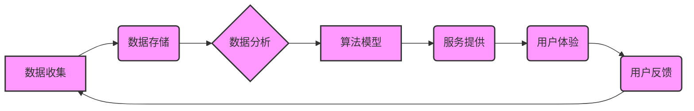

> 平台经济、数据伦理、数据规范、隐私保护、算法透明度、公平性、可解释性、责任机制

## 1. 背景介绍

平台经济的蓬勃发展，为人们带来了便捷的生活方式和丰富的服务体验。然而，平台经济的快速扩张也引发了人们对数据伦理的关注。平台企业往往掌握着海量用户数据，这些数据蕴含着用户的个人信息、行为模式、偏好等等，其收集、使用、存储和共享都可能引发隐私泄露、算法歧视、数据滥用等伦理问题。

数据伦理是指在数据收集、使用、存储和共享过程中，遵循道德规范、法律法规，保护个人隐私和权利，促进社会公平正义的原则和实践。在平台经济背景下，数据伦理问题显得尤为重要，因为它涉及到平台企业、用户、社会三方之间的利益关系。

## 2. 核心概念与联系

**2.1 数据伦理的核心概念**

* **隐私保护:**  保护用户的个人信息不被未经授权的访问、使用、披露或修改。
* **算法透明度:**  使算法的决策过程可解释、可理解，避免算法黑箱化和不可控。
* **公平性:**  确保算法和数据的使用不产生歧视、偏见，公平对待所有用户。
* **责任机制:**  明确平台企业、用户、监管机构等各方的责任和义务，建立健全的责任追溯机制。

**2.2 平台数据伦理的联系**

平台数据伦理是一个复杂的系统，涉及到多个核心概念之间的相互关联。



## 3. 核心算法原理 & 具体操作步骤

**3.1 算法原理概述**

平台经济中常用的算法包括推荐算法、搜索算法、广告算法等。这些算法通常基于机器学习技术，通过对海量用户数据进行分析和建模，来预测用户的行为、兴趣和需求，从而提供个性化服务和精准广告。

**3.2 算法步骤详解**

1. **数据收集:** 收集用户行为数据、兴趣偏好数据、 demographic 信息等。
2. **数据预处理:** 清洗、转换、格式化数据，使其适合算法训练。
3. **特征工程:** 从原始数据中提取有价值的特征，用于算法训练。
4. **模型训练:** 使用机器学习算法对数据进行训练，建立预测模型。
5. **模型评估:** 使用测试数据评估模型的性能，并进行调优。
6. **模型部署:** 将训练好的模型部署到线上环境，用于实际服务。

**3.3 算法优缺点**

* **优点:** 能够提供个性化服务、提高用户体验、精准广告投放。
* **缺点:** 容易产生算法歧视、数据偏差、隐私泄露等问题。

**3.4 算法应用领域**

* **推荐系统:**  推荐用户可能感兴趣的商品、内容、服务等。
* **搜索引擎:**  根据用户的搜索关键词，返回相关结果。
* **广告投放:**  根据用户的兴趣和行为，精准投放广告。

## 4. 数学模型和公式 & 详细讲解 & 举例说明

**4.1 数学模型构建**

推荐算法中常用的数学模型包括协同过滤、内容过滤、混合推荐等。

* **协同过滤:** 基于用户的历史行为数据，预测用户对某项物品的评分或偏好。
* **内容过滤:** 基于物品的特征信息，预测用户对某项物品的兴趣。
* **混合推荐:** 将协同过滤和内容过滤相结合，提高推荐效果。

**4.2 公式推导过程**

协同过滤算法中常用的公式包括：

* **用户相似度计算:**  使用余弦相似度、皮尔逊相关系数等方法计算用户之间的相似度。
* **物品相似度计算:** 使用余弦相似度、皮尔逊相关系数等方法计算物品之间的相似度。
* **预测评分:** 使用用户相似度或物品相似度，预测用户对某项物品的评分。

**4.3 案例分析与讲解**

假设有一个电影推荐系统，用户A和用户B都喜欢观看动作片，那么根据协同过滤算法，系统可以预测用户A也可能喜欢用户B喜欢的其他动作片。

## 5. 项目实践：代码实例和详细解释说明

**5.1 开发环境搭建**

使用Python语言和相关库进行开发，例如：

* **NumPy:**  用于数值计算。
* **Pandas:**  用于数据处理和分析。
* **Scikit-learn:**  用于机器学习算法。

**5.2 源代码详细实现**

```python
import numpy as np
from sklearn.metrics.pairwise import cosine_similarity

# 用户行为数据
user_ratings = np.array([
    [5, 4, 3, 2, 1],  # 用户1对电影的评分
    [4, 5, 2, 1, 3],  # 用户2对电影的评分
    [3, 2, 5, 4, 1],  # 用户3对电影的评分
])

# 计算用户相似度
user_similarity = cosine_similarity(user_ratings)

# 预测用户1对电影5的评分
user1_predicted_rating = np.dot(user_similarity[0], user_ratings[:, 4]) / np.sum(user_similarity[0])
```

**5.3 代码解读与分析**

* 代码首先定义了用户行为数据，表示用户对不同电影的评分。
* 然后使用`cosine_similarity`函数计算用户之间的相似度。
* 最后使用用户相似度和用户评分数据，预测用户1对电影5的评分。

**5.4 运行结果展示**

运行代码后，可以得到用户1对电影5的预测评分。

## 6. 实际应用场景

**6.1 推荐系统**

电商平台、视频网站、音乐平台等都使用推荐系统，根据用户的历史行为和偏好，推荐相关商品、内容或服务。

**6.2 搜索引擎**

搜索引擎使用算法分析用户搜索关键词，并返回相关结果，提高搜索效率和用户体验。

**6.3 广告投放**

广告平台使用算法分析用户的兴趣和行为，精准投放广告，提高广告效果。

**6.4 未来应用展望**

* **个性化教育:**  根据学生的学习情况和兴趣，提供个性化的学习内容和教学方法。
* **医疗诊断:**  利用机器学习算法分析患者的病历和症状，辅助医生进行诊断。
* **金融风险控制:**  利用机器学习算法分析用户的信用记录和交易行为，降低金融风险。

## 7. 工具和资源推荐

**7.1 学习资源推荐**

* **书籍:**  《机器学习》、《深度学习》、《算法导论》
* **在线课程:**  Coursera、edX、Udacity 等平台提供机器学习和数据科学相关的课程。
* **博客和论坛:**  机器学习和数据科学相关的博客和论坛，例如：Towards Data Science、Machine Learning Mastery 等。

**7.2 开发工具推荐**

* **Python:**  机器学习和数据科学的常用编程语言。
* **NumPy:**  用于数值计算的Python库。
* **Pandas:**  用于数据处理和分析的Python库。
* **Scikit-learn:**  用于机器学习算法的Python库。

**7.3 相关论文推荐**

* **《Collaborative Filtering for Implicit Feedback Datasets》**
* **《Deep Learning》**
* **《Attention Is All You Need》**

## 8. 总结：未来发展趋势与挑战

**8.1 研究成果总结**

平台经济数据伦理研究取得了显著进展，提出了许多重要的理论和方法，例如：

* **数据隐私保护技术:**  例如差分隐私、联邦学习等。
* **算法公平性评估方法:**  例如偏见检测、公平性度量等。
* **数据伦理规范和政策:**  例如欧盟通用数据保护条例（GDPR）、中国个人信息保护法等。

**8.2 未来发展趋势**

* **更注重数据伦理的系统性思考:**  将数据伦理融入到平台经济的各个环节，构建更加完善的数据伦理体系。
* **发展更先进的数据隐私保护技术:**  例如可解释的隐私保护技术、去中心化数据管理技术等。
* **加强数据伦理的国际合作:**  建立全球性的数据伦理标准和规范，促进数据伦理的国际交流与合作。

**8.3 面临的挑战**

* **技术挑战:**  如何开发更安全、更有效的隐私保护技术，如何解决算法公平性问题等。
* **法律法规挑战:**  如何制定更加完善的数据伦理法律法规，如何平衡数据利用和隐私保护等。
* **社会认知挑战:**  如何提高公众对数据伦理的认识，如何建立数据伦理的社会共识等。

**8.4 研究展望**

未来，数据伦理研究将继续深入，探索更有效的解决方案，为平台经济的可持续发展提供保障。


## 9. 附录：常见问题与解答

**9.1 如何保护用户的隐私数据？**

* **数据最小化原则:**  只收集必要的数据，避免过度收集用户数据。
* **数据加密:**  使用加密技术保护用户数据的安全。
* **匿名化处理:**  对用户数据进行匿名化处理，避免直接识别用户身份。

**9.2 如何避免算法歧视？**

* **数据多样化:**  使用来自不同背景的用户数据进行训练，避免算法偏向特定群体。
* **算法透明度:**  使算法的决策过程可解释、可理解，方便识别和解决算法歧视问题。
* **公平性评估:**  使用公平性度量方法评估算法的公平性，并进行调优。

**9.3 如何建立平台数据伦理规范？**

* **制定数据伦理原则:**  明确平台企业在数据收集、使用、存储和共享过程中应遵循的道德规范和法律法规。
* **建立责任机制:**  明确平台企业、用户、监管机构等各方的责任和义务，建立健全的责任追溯机制。
* **加强监管和监督:**  政府和监管机构应加强对平台经济数据伦理的监管和监督，确保平台企业遵守数据伦理规范。


作者：禅与计算机程序设计艺术 / Zen and the Art of Computer Programming 
<end_of_turn>