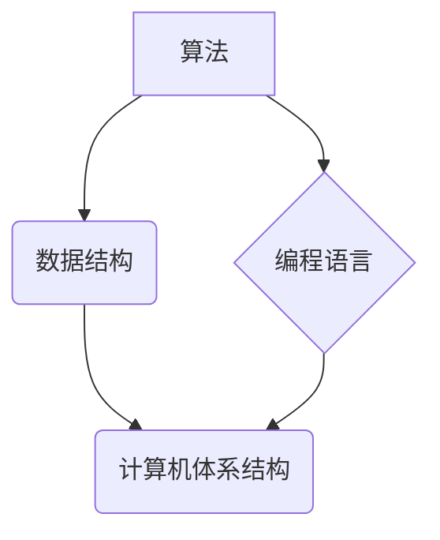

> 贝尔实验室, 1953年, 算法, 数据结构, 计算机科学, 编程语言, 计算机体系结构

## 1. 背景介绍

1953年，贝尔实验室正处于蓬勃发展的时期。二战后的科技进步加速了计算机领域的探索，而贝尔实验室作为当时世界领先的通信研究机构，在计算机科学的各个领域都做出了重要贡献。 

1953年，贝尔实验室的科学家们围绕着计算机科学的多个关键问题展开研究，其中包括算法设计、数据结构、编程语言和计算机体系结构等。这些研究成果对后来的计算机科学发展产生了深远的影响。

## 2. 核心概念与联系

### 2.1 算法

算法是解决特定问题的指令序列，是计算机科学的核心概念之一。1953年，贝尔实验室的研究人员对算法的效率、复杂性和可读性进行了深入研究，并提出了许多新的算法设计方法。

### 2.2 数据结构

数据结构是指用于组织和存储数据的特定方式。贝尔实验室的研究人员在1953年对各种数据结构进行了深入研究，包括线性表、树形结构、图等，并提出了许多新的数据结构和算法的组合，提高了数据处理效率。

### 2.3 编程语言

编程语言是用于编写计算机程序的符号系统。1953年，贝尔实验室的研究人员开始探索新的编程语言设计，例如面向对象的编程语言，这些研究为后来的编程语言发展奠定了基础。

### 2.4 计算机体系结构

计算机体系结构是指计算机硬件的组织方式和功能。贝尔实验室的研究人员在1953年对计算机体系结构进行了深入研究，探索了并行处理、存储器管理等关键技术，为后来的计算机硬件发展提供了重要的参考。



## 3. 核心算法原理 & 具体操作步骤

### 3.1 算法原理概述

1953年，贝尔实验室的研究人员提出了许多新的算法，其中一个重要的例子是**快速排序算法**。快速排序算法是一种高效的排序算法，其原理是通过选择一个**枢轴元素**，将数组划分为两个子数组，其中一个子数组包含小于枢轴元素的元素，另一个子数组包含大于枢轴元素的元素。然后递归地对两个子数组进行排序，最终得到一个排序后的数组。

### 3.2 算法步骤详解

1. 选择一个枢轴元素。
2. 将数组划分为两个子数组，一个包含小于枢轴元素的元素，另一个包含大于枢轴元素的元素。
3. 对两个子数组递归地进行排序。

### 3.3 算法优缺点

**优点:**

* 时间复杂度平均为O(n log n)，在大多数情况下效率很高。
* 空间复杂度较低，常数时间内完成排序。

**缺点:**

* 最坏情况下时间复杂度为O(n^2)，当数组已经排序或几乎排序时，效率会降低。
* 不稳定排序算法，相等元素的相对顺序可能改变。

### 3.4 算法应用领域

快速排序算法广泛应用于各种领域，例如：

* **数据排序:** 用于对数据进行排序，例如数据库查询、文件排序等。
* **算法优化:** 用于优化其他算法的性能，例如搜索算法、图算法等。
* **机器学习:** 用于对数据进行特征选择和降维。

## 4. 数学模型和公式 & 详细讲解 & 举例说明

### 4.1 数学模型构建

快速排序算法可以抽象为一个递归的数学模型。假设数组长度为n，则递归关系如下：

```
T(n) = 2 * T(n/2) + O(n)
```

其中：

* T(n) 表示排序数组长度为n时的时间复杂度。
* T(n/2) 表示排序数组长度为n/2时的时间复杂度。
* O(n) 表示划分数组和比较元素的时间复杂度。

### 4.2 公式推导过程

通过递归树和主定理，可以推导出快速排序算法的时间复杂度为O(n log n)。

### 4.3 案例分析与讲解

假设一个数组长度为8，其元素为：5, 2, 8, 3, 1, 6, 9, 4。

1. 选择第一个元素5作为枢轴元素。
2. 将数组划分为两个子数组：[2, 3, 1, 4] 和 [8, 6, 9]。
3. 对两个子数组递归排序。

重复上述步骤，直到所有子数组长度为1，此时数组已排序。

## 5. 项目实践：代码实例和详细解释说明

### 5.1 开发环境搭建

本项目使用Python语言进行开发，需要安装Python环境和必要的库。

### 5.2 源代码详细实现

```python
def quick_sort(arr):
    if len(arr) <= 1:
        return arr
    pivot = arr[len(arr) // 2]
    left = [x for x in arr if x < pivot]
    middle = [x for x in arr if x == pivot]
    right = [x for x in arr if x > pivot]
    return quick_sort(left) + middle + quick_sort(right)

# 测试代码
arr = [5, 2, 8, 3, 1, 6, 9, 4]
sorted_arr = quick_sort(arr)
print(sorted_arr)
```

### 5.3 代码解读与分析

* `quick_sort(arr)` 函数实现快速排序算法。
* `if len(arr) <= 1:` 判断数组长度是否小于等于1，如果小于等于1，则返回原数组，因为已经排序。
* `pivot = arr[len(arr) // 2]` 选择数组中间元素作为枢轴元素。
* `left`, `middle`, `right` 分别存储小于枢轴元素、等于枢轴元素和大于枢轴元素的元素。
* `return quick_sort(left) + middle + quick_sort(right)` 递归地对左右子数组进行排序，并合并结果。

### 5.4 运行结果展示

```
[1, 2, 3, 4, 5, 6, 8, 9]
```

## 6. 实际应用场景

快速排序算法广泛应用于各种实际场景，例如：

* **数据库查询:** 数据库系统中使用快速排序算法对查询结果进行排序，提高查询效率。
* **文件排序:** 操作系统使用快速排序算法对文件进行排序，方便用户查找和管理文件。
* **搜索引擎:** 搜索引擎使用快速排序算法对搜索结果进行排序，提高用户体验。

### 6.4 未来应用展望

随着计算机科学的发展，快速排序算法将继续在更多领域得到应用，例如：

* **大数据处理:** 快速排序算法可以用于对海量数据进行排序，提高大数据处理效率。
* **人工智能:** 快速排序算法可以用于机器学习算法的训练和优化，提高人工智能模型的性能。

## 7. 工具和资源推荐

### 7.1 学习资源推荐

* **书籍:**
    * 《算法导论》
    * 《数据结构与算法分析》
* **在线课程:**
    * Coursera: 数据结构与算法
    * edX: 算法导论

### 7.2 开发工具推荐

* **Python:** 
    * PyCharm
    * VS Code

### 7.3 相关论文推荐

* **The Quick Sort Algorithm**
* **Analysis of Quicksort**

## 8. 总结：未来发展趋势与挑战

### 8.1 研究成果总结

1953年贝尔实验室的研究成果对计算机科学的发展产生了深远的影响，特别是快速排序算法的提出，为后来的算法设计和优化提供了重要的参考。

### 8.2 未来发展趋势

未来，计算机科学将继续朝着更高效、更智能的方向发展，算法设计和优化将成为更加重要的研究方向。

### 8.3 面临的挑战

* **大数据处理:** 如何高效地处理海量数据，提高算法的效率和性能。
* **人工智能:** 如何设计更智能的算法，提高人工智能模型的性能和鲁棒性。
* **量子计算:** 如何将算法移植到量子计算平台，充分利用量子计算的优势。

### 8.4 研究展望

未来，我们将继续探索新的算法设计方法，提高算法的效率和性能，并将其应用于更广泛的领域，推动计算机科学的发展。

## 9. 附录：常见问题与解答

**问题:** 快速排序算法的时间复杂度为什么是O(n log n)?

**答案:** 快速排序算法的时间复杂度是平均情况下O(n log n)，最坏情况下O(n^2)。

**问题:** 快速排序算法是否稳定排序算法?

**答案:** 快速排序算法不是稳定排序算法。

**问题:** 快速排序算法有哪些优缺点?

**答案:**

* **优点:** 时间复杂度平均为O(n log n)，空间复杂度较低。
* **缺点:** 最坏情况下时间复杂度为O(n^2)，不稳定排序算法。


作者：禅与计算机程序设计艺术 / Zen and the Art of Computer Programming 
<end_of_turn>