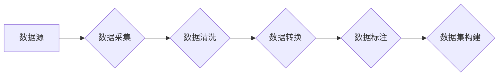

> 数据集构建,自动化,机器学习,深度学习,数据挖掘,数据清洗,数据标注

## 1. 背景介绍

在当今数据驱动时代，高质量的数据集是机器学习和深度学习模型训练的基石。然而，构建高质量数据集是一个耗时、费力且成本高昂的过程，通常需要人工标注、清洗和整理。随着人工智能技术的快速发展，对高质量数据集的需求量呈指数级增长，传统的手动构建方法已难以满足需求。因此，自动化数据集构建成为一个重要的研究方向。

## 2. 核心概念与联系

数据集萃取是指利用自动化技术从各种数据源中提取、清洗、转换和整合数据，构建高质量的训练数据集。它涵盖了数据挖掘、数据清洗、数据标注等多个环节，最终目标是构建满足特定机器学习任务的数据集。

**数据萃取流程图:**



## 3. 核心算法原理 & 具体操作步骤

### 3.1  算法原理概述

数据集萃取算法主要基于以下几个核心原理：

* **数据挖掘:** 利用数据挖掘技术从海量数据中发现隐藏的模式和规律，提取有价值的信息。
* **数据清洗:** 对采集到的数据进行清洗，去除噪声、重复数据和错误数据，保证数据质量。
* **数据转换:** 将数据转换为机器学习模型可以理解的格式，例如数值化、编码等。
* **数据标注:** 为数据添加标签或标注，以便模型进行训练和评估。

### 3.2  算法步骤详解

1. **数据源识别:** 首先需要确定需要构建数据集的领域和任务，然后识别相关的潜在数据源，例如文本文件、图像数据库、传感器数据等。
2. **数据采集:** 利用爬虫、API等工具从数据源中采集数据。
3. **数据清洗:** 对采集到的数据进行清洗，去除噪声、重复数据和错误数据。可以使用正则表达式、统计分析等方法进行清洗。
4. **数据转换:** 将数据转换为机器学习模型可以理解的格式。例如，文本数据可以转换为词向量，图像数据可以转换为像素矩阵等。
5. **数据标注:** 为数据添加标签或标注，以便模型进行训练和评估。可以使用人工标注、自动标注或半自动标注等方法进行标注。
6. **数据集构建:** 将清洗、转换和标注后的数据整合在一起，构建最终的训练数据集。

### 3.3  算法优缺点

**优点:**

* 自动化程度高，可以节省大量人工成本和时间。
* 可以构建规模庞大、覆盖面广的数据集。
* 可以提高数据集的质量和一致性。

**缺点:**

* 需要对数据源和机器学习任务有深入的了解。
* 需要开发和维护复杂的算法和工具。
* 对于需要人工判断的标注任务，自动化程度有限。

### 3.4  算法应用领域

数据集萃取算法广泛应用于以下领域：

* **图像识别:** 从图像数据库中提取和标注图像数据，用于训练图像识别模型。
* **自然语言处理:** 从文本数据中提取和标注文本数据，用于训练自然语言处理模型。
* **语音识别:** 从语音数据中提取和标注语音数据，用于训练语音识别模型。
* **推荐系统:** 从用户行为数据中提取和标注用户偏好数据，用于训练推荐系统模型。

## 4. 数学模型和公式 & 详细讲解 & 举例说明

### 4.1  数学模型构建

数据集萃取过程可以抽象为一个数学模型，其中输入是原始数据，输出是训练数据集。

**模型输入:**

* 数据源：D = {d1, d2, ..., dn}，其中di表示单个数据点。

**模型输出:**

* 训练数据集：T = {t1, t2, ..., tm}，其中ti表示单个训练样本，包含数据点和标签。

**模型过程:**

* 数据清洗：C(D)
* 数据转换：T(C(D))
* 数据标注：L(T(C(D)))

**模型公式:**

T = L(T(C(D)))

### 4.2  公式推导过程

上述公式表示数据集萃取过程是一个多步骤的转换过程。

1. **数据清洗:** 数据清洗过程可以看作是一个函数C(D)，它将原始数据D转换为清洗后的数据C(D)。
2. **数据转换:** 数据转换过程可以看作是一个函数T(C(D))，它将清洗后的数据C(D)转换为机器学习模型可以理解的格式T(C(D))。
3. **数据标注:** 数据标注过程可以看作是一个函数L(T(C(D)))，它将转换后的数据T(C(D))添加标签或标注，最终构建训练数据集T。

### 4.3  案例分析与讲解

例如，构建一个图像识别数据集，需要从图像数据库中提取图像数据，并对图像进行标注。

* 数据清洗：去除图像数据库中的重复图像、损坏图像等。
* 数据转换：将图像数据转换为像素矩阵格式。
* 数据标注：对图像进行人工标注，例如识别图像中的物体类别。

最终，通过上述步骤，可以构建一个包含大量图像和标签的训练数据集，用于训练图像识别模型。

## 5. 项目实践：代码实例和详细解释说明

### 5.1  开发环境搭建

* Python 3.x
* TensorFlow 或 PyTorch
* Numpy
* Pandas
* Scikit-learn

### 5.2  源代码详细实现

```python
import pandas as pd
from sklearn.model_selection import train_test_split

# 加载数据
data = pd.read_csv('data.csv')

# 数据清洗
data.dropna(inplace=True)
data.drop_duplicates(inplace=True)

# 数据转换
X = data[['feature1', 'feature2']]
y = data['target']

# 数据标注
# ...

# 数据分割
X_train, X_test, y_train, y_test = train_test_split(X, y, test_size=0.2, random_state=42)

# 构建训练数据集
train_dataset = {
    'features': X_train,
    'labels': y_train
}
```

### 5.3  代码解读与分析

* 代码首先加载数据，然后进行数据清洗和转换。
* 数据清洗包括去除缺失值和重复数据。
* 数据转换将数据转换为机器学习模型可以理解的格式。
* 数据标注步骤需要根据具体任务进行实现。
* 最后，代码将数据分割成训练集和测试集，并构建训练数据集。

### 5.4  运行结果展示

运行上述代码后，将生成一个训练数据集，包含特征数据和标签数据。

## 6. 实际应用场景

数据集萃取技术在各个领域都有广泛的应用场景：

### 6.1  医疗领域

* 从电子病历、医学影像等数据源中提取和标注病症信息，用于训练疾病诊断模型。
* 从基因组数据中提取和标注基因突变信息，用于训练基因疾病预测模型。

### 6.2  金融领域

* 从交易记录、客户行为数据等数据源中提取和标注欺诈行为信息，用于训练欺诈检测模型。
* 从市场数据中提取和标注股票价格走势信息，用于训练股票预测模型。

### 6.3  电商领域

* 从用户行为数据、商品信息等数据源中提取和标注用户偏好信息，用于训练推荐系统模型。
* 从商品评论数据中提取和标注商品评价信息，用于训练商品评价分类模型。

### 6.4  未来应用展望

随着人工智能技术的不断发展，数据集萃取技术将发挥越来越重要的作用。未来，数据集萃取技术将更加智能化、自动化，能够自动识别数据源、清洗数据、转换数据和标注数据，从而进一步降低数据集构建的成本和时间。

## 7. 工具和资源推荐

### 7.1  学习资源推荐

* **书籍:**
    * "Data Mining: Concepts and Techniques" by Jiawei Han, Micheline Kamber, and Jian Pei
    * "Introduction to Machine Learning" by Ethem Alpaydin
* **在线课程:**
    * Coursera: Machine Learning by Andrew Ng
    * edX: Data Science Fundamentals

### 7.2  开发工具推荐

* **数据采集工具:**
    * Scrapy
    * Beautiful Soup
* **数据清洗工具:**
    * Pandas
    * OpenRefine
* **数据标注工具:**
    * LabelImg
    * Prodigy

### 7.3  相关论文推荐

* "Data Augmentation for Deep Learning: A Survey" by Long, Shelhamer, and Darrell
* "Transfer Learning for Natural Language Processing" by Pan and Yang

## 8. 总结：未来发展趋势与挑战

### 8.1  研究成果总结

数据集萃取技术已经取得了显著的成果，能够有效地自动化构建高质量的训练数据集，为机器学习和深度学习的发展提供了重要的支持。

### 8.2  未来发展趋势

未来，数据集萃取技术将朝着以下几个方向发展：

* **更加智能化:** 利用人工智能技术，实现自动识别数据源、清洗数据、转换数据和标注数据。
* **更加自动化:** 开发更加自动化的数据集构建工具，降低人工成本和时间。
* **更加个性化:** 根据用户的特定需求，构建个性化的训练数据集。

### 8.3  面临的挑战

数据集萃取技术也面临着一些挑战：

* **数据质量问题:** 原始数据可能存在噪声、错误和不完整等问题，需要进行有效的清洗和处理。
* **数据标注问题:** 一些任务需要人工标注数据，这成本高且耗时。
* **数据隐私问题:** 数据集构建过程中需要处理大量敏感数据，需要保证数据隐私安全。

### 8.4  研究展望

未来，需要进一步研究以下问题：

* 如何提高数据清洗和标注的自动化程度。
* 如何构建更加智能的自动化数据集构建工具。
* 如何解决数据隐私问题，保证数据安全。


## 9. 附录：常见问题与解答

**Q1: 数据集萃取技术与传统数据标注有什么区别？**

**A1:** 数据集萃取技术是一种自动化构建数据集的方法，而传统数据标注是人工标注数据的方法。数据集萃取技术可以节省大量人工成本和时间，提高数据集的质量和一致性。

**Q2: 数据集萃取技术有哪些应用场景？**

**A2:** 数据集萃取技术广泛应用于各个领域，例如医疗、金融、电商等。

**Q3: 如何选择合适的工具进行数据集萃取？**

**A3:** 选择工具时需要考虑数据源类型、数据规模、任务需求等因素。

**Q4: 数据集萃取技术有哪些挑战？**

**A4:** 数据集萃取技术面临着数据质量问题、数据标注问题和数据隐私问题等挑战。

**Q5: 未来数据集萃取技术的发展趋势是什么？**

**A5:** 未来数据集萃取技术将更加智能化、自动化和个性化。


作者：禅与计算机程序设计艺术 / Zen and the Art of Computer Programming 
<end_of_turn>