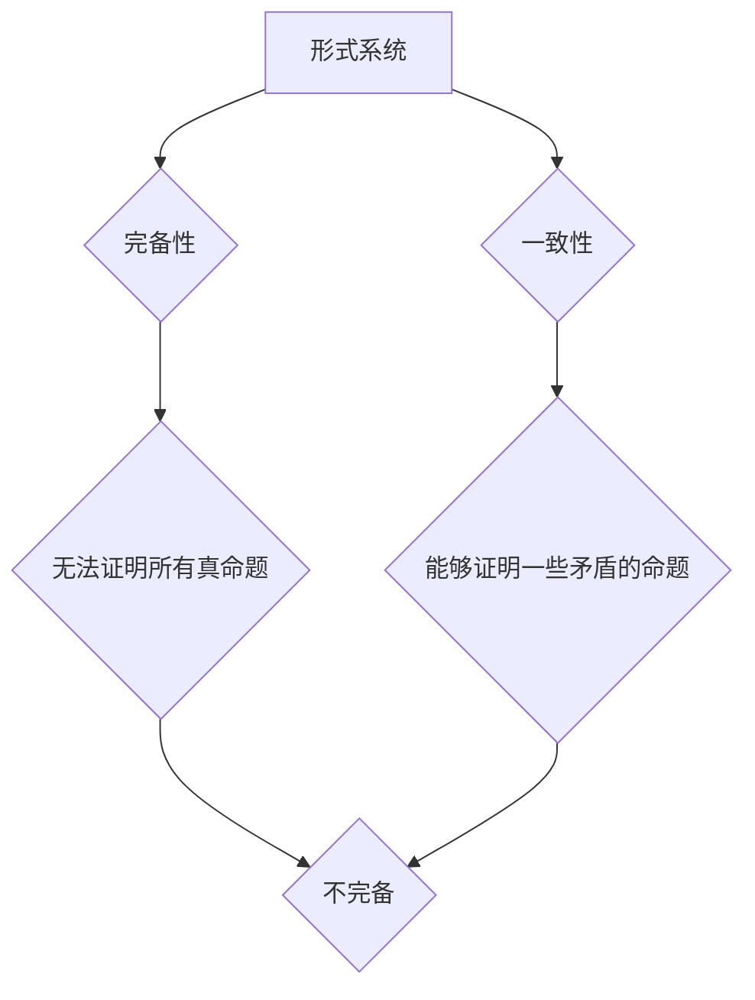

> 哥德尔不完备性定理，数理逻辑，形式系统，完备性，一致性，证明理论

## 1. 背景介绍

数理逻辑是数学与逻辑的结合，它研究的是符号系统和推理规则，旨在建立一个严密的、形式化的推理体系。哥德尔不完备性定理是数理逻辑领域的一项重大发现，它揭示了任何一个足够复杂的逻辑系统都无法同时满足完备性和一致性这两个看似简单的性质。

哥德尔不完备性定理的提出，对数学、计算机科学、哲学等多个领域产生了深远的影响。它表明了人类思维的局限性，也促使人们对逻辑系统和知识的本质进行了更深入的思考。

## 2. 核心概念与联系

### 2.1  形式系统

形式系统是一个由符号、语法规则和推理规则组成的系统。

* **符号:**  形式系统的基本组成部分，可以是字母、数字、逻辑运算符等。
* **语法规则:**  规定了符号如何组合成有效的公式。
* **推理规则:**  规定了如何从已知公式推导出新的公式。

### 2.2  完备性

一个形式系统是完备的，如果它能够证明所有真命题。换句话说，如果一个命题在该系统中是真值，那么该系统能够证明该命题是真值。

### 2.3  一致性

一个形式系统是一致的，如果它不能证明一个命题和它的否定同时成立。换句话说，在一个一致的系统中，任何命题都只能被证明为真值或假值，不能同时成立。

### 2.4  哥德尔不完备性定理

哥德尔不完备性定理指出，任何一个足够复杂的逻辑系统都无法同时满足完备性和一致性这两个性质。换句话说，任何一个足够复杂的逻辑系统，要么无法证明所有真命题（不完备），要么能够证明一些矛盾的命题（不一致）。

**Mermaid 流程图**

## 3. 核心算法原理 & 具体操作步骤

### 3.1  算法原理概述

哥德尔不完备性定理并非一个具体的算法，而是一个关于形式系统的数学定理。它通过证明逻辑系统内部的矛盾性来揭示其局限性。

### 3.2  算法步骤详解

哥德尔不完备性定理的证明过程非常复杂，涉及到数理逻辑、集合论和递归论等多个领域。

**简要概述：**

1. **构造一个“自我指称”的公式:** 哥德尔构造了一个特殊的公式，这个公式能够自我指称，即它能够表达自身的真假性。
2. **证明该公式的矛盾性:** 哥德尔证明了，如果这个形式系统能够证明这个“自我指称”公式为真，那么它就会导致矛盾。
3. **得出结论:** 哥德尔由此得出结论，这个形式系统不可能同时满足完备性和一致性。

### 3.3  算法优缺点

哥德尔不完备性定理本身没有优缺点，因为它是一个数学定理，而不是一个算法。

### 3.4  算法应用领域

哥德尔不完备性定理对计算机科学、哲学、数学等多个领域产生了深远的影响。

* **计算机科学:** 它表明了计算机程序的局限性，也促使人们研究更强大的逻辑系统和人工智能算法。
* **哲学:** 它引发了人们对知识、真理和逻辑的本质进行了更深入的思考。
* **数学:** 它促使人们对数学的完备性和一致性进行了更深入的研究。

## 4. 数学模型和公式 & 详细讲解 & 举例说明

### 4.1  数学模型构建

哥德尔不完备性定理的证明依赖于以下数学模型：

* **形式系统:**  由符号、语法规则和推理规则组成的系统。
* **Gödel numbering:**  将形式系统的公式和证明映射到自然数上的方法。
* **递归函数:**  可以通过有限步骤计算的函数。

### 4.2  公式推导过程

哥德尔不完备性定理的证明过程非常复杂，涉及到大量的数学推导。

**简要概述:**

1. **构造一个“自我指称”的公式:** 哥德尔构造了一个特殊的公式，这个公式能够自我指称，即它能够表达自身的真假性。
2. **证明该公式的矛盾性:** 哥德尔证明了，如果这个形式系统能够证明这个“自我指称”公式为真，那么它就会导致矛盾。
3. **得出结论:** 哥德尔由此得出结论，这个形式系统不可能同时满足完备性和一致性。

### 4.3  案例分析与讲解

由于哥德尔不完备性定理的证明过程非常复杂，这里不再详细讲解具体的案例分析。

## 5. 项目实践：代码实例和详细解释说明

由于哥德尔不完备性定理是一个数学定理，而不是一个具体的算法，因此无法直接用代码实现。

但是，我们可以用代码模拟一些与哥德尔不完备性定理相关的概念，例如：

* **构造一个简单的形式系统:** 可以用代码实现一个简单的形式系统，并验证其完备性和一致性。
* **模拟“自我指称”的公式:** 可以用代码模拟一个简单的“自我指称”的公式，并观察其在不同形式系统中的行为。

## 6. 实际应用场景

哥德尔不完备性定理的实际应用场景主要体现在以下几个方面：

* **人工智能:** 它表明了人工智能系统存在局限性，也促使人们研究更强大的逻辑系统和人工智能算法。
* **软件工程:** 它提醒我们软件系统也存在局限性，需要谨慎设计和开发。
* **哲学:** 它引发了人们对知识、真理和逻辑的本质进行了更深入的思考。

### 6.4  未来应用展望

随着人工智能和计算机科学的发展，哥德尔不完备性定理的应用场景将会更加广泛。

## 7. 工具和资源推荐

### 7.1  学习资源推荐

* **《数理逻辑》:**  由斯坦福大学教授Christopher Leary撰写的经典教材。
* **《Gödel's Incompleteness Theorems》:**  由Douglas Hofstadter撰写的科普书籍。
* **在线课程:**  Coursera、edX等平台上都有相关的数理逻辑课程。

### 7.2  开发工具推荐

* **Prolog:**  一种逻辑编程语言，适合用于实现形式系统的推理。
* **Coq:**  一种交互式形式化证明系统，可以用于验证形式系统的完备性和一致性。

### 7.3  相关论文推荐

* **Gödel, Kurt. "On formally undecidable propositions of Principia Mathematica and related systems." Monatshefte für Mathematik und Physik 38.1 (1931): 173-198.**
* **Church, Alonzo. "An unsolvable problem of elementary number theory." American Journal of Mathematics 58.4 (1936): 345-363.**

## 8. 总结：未来发展趋势与挑战

### 8.1  研究成果总结

哥德尔不完备性定理是数理逻辑领域的一项重大发现，它揭示了任何一个足够复杂的逻辑系统都无法同时满足完备性和一致性这两个性质。

### 8.2  未来发展趋势

未来，研究者们将继续探索哥德尔不完备性定理的应用，并试图找到新的逻辑系统来克服其局限性。

### 8.3  面临的挑战

哥德尔不完备性定理的证明过程非常复杂，并且涉及到多个数学领域。因此，理解和应用这个定理仍然是一个巨大的挑战。

### 8.4  研究展望

哥德尔不完备性定理的研究将继续推动计算机科学、哲学和数学的发展，并为我们提供更深入的理解关于知识、真理和逻辑的本质。

## 9. 附录：常见问题与解答

**常见问题:**

* 哥德尔不完备性定理是否意味着所有数学问题都无法解决？
* 哥德尔不完备性定理是否意味着逻辑是不完备的？

**解答:**

* 哥德尔不完备性定理并不意味着所有数学问题都无法解决，它只是表明了任何一个足够复杂的逻辑系统都无法证明所有真命题。
* 哥德尔不完备性定理表明了逻辑系统本身存在局限性，但并不意味着逻辑本身是不完备的。

作者：禅与计算机程序设计艺术 / Zen and the Art of Computer Programming 
<end_of_turn>