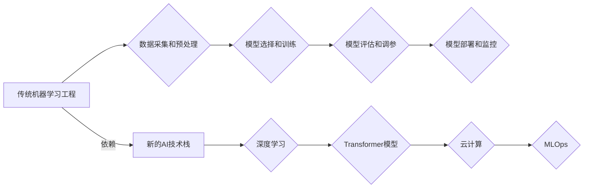

> AI技术栈,机器学习,深度学习,Transformer,云计算,数据工程,MLOps

## 1. 背景介绍

人工智能（AI）技术近年来发展迅速，从语音识别、图像识别到自然语言处理等领域取得了突破性进展。传统的机器学习工程模式已经难以满足新兴AI技术的快速迭代和部署需求。为了应对这一挑战，新的AI技术栈应运而生，它以深度学习、Transformer模型、云计算和MLOps等技术为核心，构建了更加高效、灵活和可扩展的AI开发和部署体系。

## 2. 核心概念与联系

**2.1  传统机器学习工程**

传统机器学习工程通常遵循以下步骤：

1. **数据采集和预处理:** 收集相关数据并进行清洗、转换和特征工程等预处理操作。
2. **模型选择和训练:** 选择合适的机器学习算法，并根据训练数据进行模型训练。
3. **模型评估和调参:** 使用测试数据评估模型性能，并通过调整模型参数优化模型效果。
4. **模型部署和监控:** 将训练好的模型部署到生产环境中，并持续监控模型性能，及时进行更新和维护。

**2.2  新的AI技术栈**

新的AI技术栈主要包括以下几个核心组件：

* **深度学习:** 深度学习是机器学习的一个子领域，它利用多层神经网络来学习数据中的复杂模式。
* **Transformer模型:** Transformer模型是一种新型的神经网络架构，它能够有效地处理序列数据，例如文本和语音。
* **云计算:** 云计算平台提供强大的计算资源和存储空间，可以支持大规模的AI模型训练和部署。
* **MLOps:** MLOps（机器学习运营）是一种将机器学习工程流程与DevOps理念相结合的方法，旨在提高AI模型的开发、部署和维护效率。

**2.3  核心概念关系图**



## 3. 核心算法原理 & 具体操作步骤

### 3.1  算法原理概述

深度学习算法的核心是多层神经网络，它通过多个隐藏层对数据进行特征提取和学习。每个神经元接收来自上一层的输入，并通过激活函数进行非线性变换，输出到下一层。通过训练，神经网络的参数会不断调整，使得网络能够学习到数据的复杂模式。

### 3.2  算法步骤详解

1. **数据准备:** 收集和预处理数据，将其转换为深度学习模型可以理解的格式。
2. **模型构建:** 根据任务需求选择合适的深度学习模型架构，例如卷积神经网络（CNN）、循环神经网络（RNN）或Transformer模型。
3. **模型训练:** 使用训练数据训练模型，通过反向传播算法调整模型参数，使得模型能够准确地预测输出。
4. **模型评估:** 使用测试数据评估模型性能，例如准确率、召回率和F1-score等指标。
5. **模型调参:** 根据评估结果，调整模型参数，例如学习率、批处理大小和网络结构等，以提高模型性能。
6. **模型部署:** 将训练好的模型部署到生产环境中，用于实际应用。

### 3.3  算法优缺点

**优点:**

* 能够学习到数据中的复杂模式，实现高精度预测。
* 适用于各种类型的数据，例如图像、文本和音频等。
* 随着数据量的增加，模型性能会不断提升。

**缺点:**

* 需要大量的训练数据和计算资源。
* 模型训练过程复杂，需要专业的技术人员进行操作。
* 模型解释性较差，难以理解模型的决策过程。

### 3.4  算法应用领域

深度学习算法广泛应用于以下领域：

* **计算机视觉:** 图像识别、物体检测、图像分割等。
* **自然语言处理:** 文本分类、情感分析、机器翻译等。
* **语音识别:** 语音转文本、语音合成等。
* **推荐系统:** 商品推荐、内容推荐等。
* **医疗诊断:** 病情预测、疾病诊断等。

## 4. 数学模型和公式 & 详细讲解 & 举例说明

### 4.1  数学模型构建

深度学习模型的数学基础是神经网络，它由多个层组成，每层包含多个神经元。每个神经元接收来自上一层的输入，并通过激活函数进行非线性变换，输出到下一层。

**4.1.1  神经网络结构**

一个简单的多层感知机（MLP）模型可以表示为：

```
y = f(W3 * a2 + b3)
a2 = f(W2 * a1 + b2)
a1 = f(W1 * x + b1)
```

其中：

* x 是输入数据
* a1, a2, a3 是各层的激活值
* W1, W2, W3 是权重矩阵
* b1, b2, b3 是偏置项
* f 是激活函数

**4.1.2  损失函数**

损失函数用于衡量模型预测结果与真实值的差异。常用的损失函数包括均方误差（MSE）和交叉熵损失（Cross-Entropy Loss）。

**4.1.3  优化算法**

优化算法用于调整模型参数，使得损失函数最小化。常用的优化算法包括梯度下降（Gradient Descent）、动量法（Momentum）和Adam算法。

### 4.2  公式推导过程

**4.2.1  梯度下降算法**

梯度下降算法的基本思想是沿着损失函数的负梯度方向更新模型参数。

```
W = W - lr * ∇L(W)
```

其中：

* W 是模型参数
* lr 是学习率
* ∇L(W) 是损失函数对模型参数的梯度

**4.2.2  动量法**

动量法在梯度下降算法的基础上，引入了动量项，可以加速模型收敛速度。

```
v = β * v + lr * ∇L(W)
W = W - v
```

其中：

* v 是动量项
* β 是动量系数

### 4.3  案例分析与讲解

**4.3.1  图像分类**

使用CNN模型进行图像分类，损失函数为交叉熵损失，优化算法为Adam算法。

**4.3.2  文本生成**

使用Transformer模型进行文本生成，损失函数为交叉熵损失，优化算法为Adam算法。

## 5. 项目实践：代码实例和详细解释说明

### 5.1  开发环境搭建

使用Python语言和相关的深度学习框架，例如TensorFlow或PyTorch，搭建开发环境。

### 5.2  源代码详细实现

使用深度学习框架的API，实现深度学习模型的构建、训练和部署。

### 5.3  代码解读与分析

解释代码中的关键逻辑和算法实现细节。

### 5.4  运行结果展示

展示模型训练过程中的损失函数变化曲线和模型预测结果。

## 6. 实际应用场景

### 6.1  医疗诊断

使用深度学习模型进行疾病诊断，例如癌症检测、心血管疾病预测等。

### 6.2  金融风险控制

使用深度学习模型进行金融风险评估，例如欺诈检测、信用评分等。

### 6.3  智能客服

使用深度学习模型构建智能客服系统，例如聊天机器人、语音助手等。

### 6.4  未来应用展望

深度学习技术将继续在更多领域得到应用，例如自动驾驶、机器人技术、个性化教育等。

## 7. 工具和资源推荐

### 7.1  学习资源推荐

* **书籍:**
    * 深度学习
    * 构建深度学习模型
* **在线课程:**
    * Coursera深度学习课程
    * Udacity深度学习工程师课程

### 7.2  开发工具推荐

* **深度学习框架:** TensorFlow, PyTorch, Keras
* **云计算平台:** AWS, Azure, Google Cloud

### 7.3  相关论文推荐

* **Transformer模型论文:** Attention Is All You Need
* **深度学习论文:** ImageNet Classification with Deep Convolutional Neural Networks

## 8. 总结：未来发展趋势与挑战

### 8.1  研究成果总结

新的AI技术栈为AI开发和部署带来了新的机遇和挑战。深度学习算法取得了突破性进展，Transformer模型展现出强大的能力，云计算平台提供了强大的计算资源，MLOps理念推动了AI开发效率的提升。

### 8.2  未来发展趋势

* **模型规模和复杂度不断提升:** 随着计算资源的增加，模型规模和复杂度将不断提升，从而实现更精准的预测和更复杂的应用场景。
* **模型解释性和可解释性增强:** 研究人员将致力于开发更易于理解和解释的深度学习模型，提高模型的透明度和可信度。
* **边缘计算和联邦学习的应用:** 将深度学习模型部署到边缘设备和分布式数据中心，实现更低延迟和更强的隐私保护。

### 8.3  面临的挑战

* **数据获取和隐私保护:** 深度学习算法依赖于大量的数据，如何获取高质量的数据并保护用户隐私是一个重要的挑战。
* **模型训练和部署成本:** 深度学习模型的训练和部署成本较高，需要更有效的资源利用和成本控制策略。
* **模型安全性和鲁棒性:** 深度学习模型容易受到攻击和对抗样本的影响，需要提高模型的安全性和鲁棒性。

### 8.4  研究展望

未来，AI技术将继续发展，新的算法、模型和应用场景将不断涌现。研究人员将继续探索深度学习的潜力，解决其面临的挑战，推动AI技术向更智能、更安全、更可持续的方向发展。

## 9. 附录：常见问题与解答

### 9.1  深度学习和传统机器学习的区别是什么？

### 9.2  Transformer模型的优势是什么？

### 9.3  如何选择合适的深度学习模型？

### 9.4  如何进行深度学习模型的训练和评估？

### 9.5  如何部署深度学习模型到生产环境？


作者：禅与计算机程序设计艺术 / Zen and the Art of Computer Programming 
<end_of_turn>