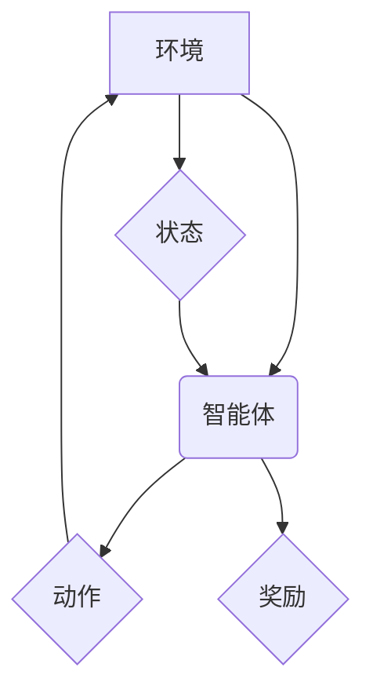

> 深度学习，强化学习，人工智能，机器学习，神经网络，算法，应用场景，未来趋势

## 1. 背景介绍

人工智能（AI）正以惊人的速度发展，深度学习和强化学习作为其两大支柱技术，正在深刻地改变着我们生活和工作的方式。深度学习通过模仿人类大脑神经网络的结构和功能，能够从海量数据中自动学习特征，从而实现图像识别、自然语言处理、语音识别等复杂任务。强化学习则通过奖励机制，让智能体在环境中学习最优策略，从而能够解决决策问题、控制系统等挑战。

近年来，深度学习和强化学习取得了令人瞩目的成就，例如AlphaGo战胜世界围棋冠军、自动驾驶汽车的快速发展、医疗诊断的精准化等。这些成就不仅证明了这两项技术的强大潜力，也预示着它们将在未来扮演更加重要的角色。

## 2. 核心概念与联系

**2.1 深度学习**

深度学习是一种机器学习的子领域，它利用多层神经网络来模拟人类大脑的学习过程。深度学习模型能够从原始数据中自动提取特征，无需人工特征工程，从而提高了模型的学习能力和泛化能力。

**2.2 强化学习**

强化学习是一种基于交互学习的机器学习方法。智能体在环境中采取行动，根据环境反馈获得奖励或惩罚，通过不断调整策略，最终学习到最优的行动策略。

**2.3 深度学习与强化学习的联系**

深度学习和强化学习可以相互补充，共同推动人工智能的发展。深度学习可以提供强大的特征提取能力，为强化学习提供更丰富的输入信息。而强化学习可以指导深度学习模型的训练，使其能够学习更符合实际需求的策略。

**2.4 深度强化学习**

深度强化学习将深度学习和强化学习相结合，利用深度神经网络来构建智能体的策略网络，从而能够解决更复杂的任务。



## 3. 核心算法原理 & 具体操作步骤

### 3.1 算法原理概述

深度强化学习的核心算法是**深度Q网络（DQN）**。DQN算法利用深度神经网络来估计状态-动作值函数（Q-value），即在给定状态下采取特定动作的期望回报。通过训练DQN网络，智能体能够学习到最优的策略，即在每个状态下选择能够获得最大回报的动作。

### 3.2 算法步骤详解

1. **初始化DQN网络:** 创建一个深度神经网络，作为状态-动作值函数的估计器。

2. **收集经验:** 智能体在环境中进行交互，收集状态、动作、奖励和下一个状态的经验数据。

3. **构建经验回放缓冲池:** 将收集到的经验数据存储在缓冲池中。

4. **训练DQN网络:** 从缓冲池中随机采样经验数据，利用这些数据训练DQN网络。训练目标是最小化DQN网络的预测值与实际回报之间的误差。

5. **更新目标网络:** 定期更新目标网络的参数，目标网络用于计算目标值，防止训练过程出现震荡。

6. **选择动作:** 根据训练好的DQN网络，选择能够获得最大Q值的行动。

7. **重复步骤3-6:** 直到智能体达到预设的目标或训练时间结束。

### 3.3 算法优缺点

**优点:**

* 能够学习复杂的任务
* 不需要人工特征工程
* 能够处理连续动作空间

**缺点:**

* 训练过程可能很慢
* 需要大量的训练数据
* 容易出现震荡问题

### 3.4 算法应用领域

* 游戏AI
* 自动驾驶
* 机器人控制
* 医疗诊断
* 金融投资

## 4. 数学模型和公式 & 详细讲解 & 举例说明

### 4.1 数学模型构建

深度强化学习的核心是状态-动作值函数（Q-value），它表示在给定状态下采取特定动作的期望回报。

**Q(s, a)** = E[R<sub>t+1</sub> + γR<sub>t+2</sub> + ... | s<sub>t</sub> = s, a<sub>t</sub> = a]

其中：

* **s** 表示状态
* **a** 表示动作
* **R<sub>t</sub>** 表示在时间步t获得的奖励
* **γ** 表示折扣因子，控制未来奖励的权重

### 4.2 公式推导过程

DQN算法的目标是学习一个能够估计Q-value的深度神经网络。训练过程使用**最小二乘法**，将DQN网络的预测值与实际回报之间的误差最小化。

**损失函数:**

L = (y - Q(s, a))<sup>2</sup>

其中：

* **y** 表示目标值，计算公式为：y = R + γmax<sub>a'</sub>Q(s', a')
* **s'** 表示下一个状态

### 4.3 案例分析与讲解

假设一个智能体在玩游戏，当前状态是“在房间里”，动作可以选择“向前走”或“向后走”。

* 如果智能体选择“向前走”，可能会获得奖励10，进入下一个状态“在走廊里”。
* 如果智能体选择“向后走”，可能会获得奖励0，保持当前状态“在房间里”。

DQN网络会根据这些经验数据，学习到在“在房间里”状态下，“向前走”的动作具有更高的Q-value，因此智能体更有可能选择“向前走”的动作。

## 5. 项目实践：代码实例和详细解释说明

### 5.1 开发环境搭建

* Python 3.6+
* TensorFlow/PyTorch
* OpenAI Gym

### 5.2 源代码详细实现

```python
import tensorflow as tf
import numpy as np

# 定义DQN网络
class DQN(tf.keras.Model):
    def __init__(self, state_size, action_size):
        super(DQN, self).__init__()
        self.dense1 = tf.keras.layers.Dense(64, activation='relu')
        self.dense2 = tf.keras.layers.Dense(64, activation='relu')
        self.output = tf.keras.layers.Dense(action_size)

    def call(self, state):
        x = self.dense1(state)
        x = self.dense2(x)
        return self.output(x)

# 定义训练函数
def train(dqn, experience_replay_buffer, optimizer):
    batch_size = 32
    batch = random.sample(experience_replay_buffer, batch_size)
    states = np.array([sample[0] for sample in batch])
    actions = np.array([sample[1] for sample in batch])
    rewards = np.array([sample[2] for sample in batch])
    next_states = np.array([sample[3] for sample in batch])
    
    with tf.GradientTape() as tape:
        q_values = dqn(states)
        target_q_values = rewards + gamma * tf.reduce_max(dqn(next_states), axis=1)
        loss = tf.keras.losses.MeanSquaredError()(target_q_values, q_values[np.arange(batch_size), actions])

    gradients = tape.gradient(loss, dqn.trainable_variables)
    optimizer.apply_gradients(zip(gradients, dqn.trainable_variables))

# ... 其他代码 ...
```

### 5.3 代码解读与分析

* **DQN网络:** 使用深度神经网络来估计状态-动作值函数。
* **训练函数:** 使用经验回放缓冲池和最小二乘法训练DQN网络。
* **代码实现:** 使用TensorFlow框架实现DQN算法。

### 5.4 运行结果展示

训练完成后，可以将DQN网络应用于实际环境中，观察智能体的行为和性能。

## 6. 实际应用场景

### 6.1 游戏AI

深度强化学习在游戏AI领域取得了显著成果，例如AlphaGo、AlphaStar等。这些AI能够学习复杂的策略，战胜人类顶尖选手。

### 6.2 自动驾驶

深度强化学习可以用于训练自动驾驶汽车，使其能够在复杂路况下安全行驶。

### 6.3 机器人控制

深度强化学习可以用于控制机器人，使其能够完成复杂的任务，例如抓取物体、导航等。

### 6.4 医疗诊断

深度强化学习可以用于辅助医生进行医疗诊断，例如识别病灶、预测疾病风险等。

### 6.5 金融投资

深度强化学习可以用于开发智能投资策略，例如股票交易、风险管理等。

## 7. 工具和资源推荐

### 7.1 学习资源推荐

* **书籍:**
    * Deep Reinforcement Learning Hands-On by Maxim Lapan
    * Reinforcement Learning: An Introduction by Richard S. Sutton and Andrew G. Barto
* **课程:**
    * Deep Reinforcement Learning Specialization by DeepLearning.AI
    * Reinforcement Learning by David Silver (University of DeepMind)
* **博客:**
    * OpenAI Blog
    * DeepMind Blog

### 7.2 开发工具推荐

* **TensorFlow:** 开源深度学习框架
* **PyTorch:** 开源深度学习框架
* **OpenAI Gym:** 机器学习环境库

### 7.3 相关论文推荐

* **Deep Q-Network (DQN)** by Volodymyr Mnih et al. (2015)
* **Proximal Policy Optimization Algorithms** by John Schulman et al. (2017)
* **Asynchronous Methods for Deep Reinforcement Learning** by Volodymyr Mnih et al. (2016)

## 8. 总结：未来发展趋势与挑战

### 8.1 研究成果总结

深度强化学习取得了令人瞩目的成果，在游戏AI、自动驾驶、机器人控制等领域展现出巨大的潜力。

### 8.2 未来发展趋势

* **更强大的算法:** 研究更有效的深度强化学习算法，例如探索-利用平衡、样本效率、可解释性等方面。
* **更复杂的应用场景:** 将深度强化学习应用于更复杂的现实世界问题，例如医疗诊断、金融投资、社会决策等。
* **更安全的系统:** 研究如何确保深度强化学习系统安全可靠，避免出现不可预知的行为。

### 8.3 面临的挑战

* **数据效率:** 深度强化学习算法通常需要大量的训练数据，这在现实世界中可能难以获取。
* **样本复杂性:** 现实世界中的环境往往非常复杂，难以建模和控制。
* **可解释性:** 深度强化学习模型的决策过程往往难以解释，这可能导致信任问题。

### 8.4 研究展望

未来，深度强化学习将继续朝着更强大、更安全、更可解释的方向发展，并将在更多领域发挥重要作用。

## 9. 附录：常见问题与解答

* **什么是深度强化学习？**

深度强化学习是一种机器学习方法，它结合了深度学习和强化学习的优势，能够学习复杂的任务。

* **深度强化学习有哪些应用场景？**

深度强化学习的应用场景非常广泛，例如游戏AI、自动驾驶、机器人控制、医疗诊断、金融投资等。

* **如何学习深度强化学习？**

可以通过阅读书籍、课程、博客等学习资源，也可以通过实践项目来加深理解。

作者：禅与计算机程序设计艺术 / Zen and the Art of Computer Programming


<end_of_turn>