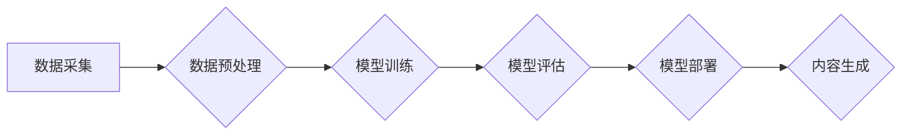

> 生成式AI，AIGC，数据驱动，模型训练，GPU，深度学习，Transformer

## 1. 背景介绍

近年来，人工智能（AI）领域取得了令人瞩目的进展，其中生成式人工智能（Generative AI）作为一类新兴技术，迅速成为研究和应用的热点。生成式AI能够根据输入的文本、图像、音频等数据，生成新的、类似于训练数据的内容，展现出强大的创造力和应用潜力。

AIGC（AI-Generated Content）是指利用人工智能技术生成各种内容，包括文本、图像、音频、视频等。它在各个领域都展现出巨大的应用价值，例如：

* **内容创作：** 自动生成新闻报道、小说、诗歌、剧本等，提高内容生产效率。
* **创意设计：** 生成图像、音乐、视频等创意作品，激发灵感和创新。
* **教育培训：** 个性化定制学习内容，提供沉浸式学习体验。
* **营销推广：** 生成个性化广告、产品描述等，提升营销效果。

然而，生成式AIGC的发展也面临着一些挑战，例如数据获取、模型训练、伦理道德等问题。

## 2. 核心概念与联系

### 2.1 生成式AI模型

生成式AI模型的核心是学习数据中的模式和规律，并根据这些模式生成新的数据。常见的生成式AI模型包括：

* **Generative Adversarial Networks (GANs):** 采用对抗性训练机制，由生成器和判别器两部分组成，生成器试图生成逼真的数据，判别器试图区分真实数据和生成数据，两者相互竞争，最终生成器能够生成高质量的生成数据。
* **Variational Autoencoders (VAEs):** 通过编码器和解码器两部分组成，将输入数据编码成低维表示，然后解码生成新的数据。
* **Transformer-based Models:** 基于Transformer架构，例如GPT-3、DALL-E 2等，能够处理长文本序列和图像数据，生成更流畅、更具创造力的内容。

### 2.2 数据驱动

数据是生成式AI模型训练和运行的基础。模型的性能直接取决于训练数据的质量和数量。

* **数据规模:** 训练大型语言模型（LLMs）通常需要海量文本数据，例如数十亿甚至数千亿个单词。
* **数据质量:** 数据需要干净、准确、无噪声，才能训练出高质量的模型。
* **数据多样性:** 数据需要涵盖不同的主题、风格、领域，才能使模型能够生成更丰富、更具多样性的内容。

### 2.3 GPU加速

GPU（图形处理单元）具有并行计算能力，能够加速深度学习模型的训练和推理。

* **并行计算:** GPU可以同时处理多个数据点，大大提高计算速度。
* **内存带宽:** GPU拥有更大的内存带宽，可以更快地访问数据。
* **专用计算单元:** GPU拥有专门用于矩阵运算的计算单元，能够高效地执行深度学习算法。

**Mermaid 流程图**



## 3. 核心算法原理 & 具体操作步骤

### 3.1 算法原理概述

生成式AI模型的核心是学习数据中的模式和规律，并根据这些模式生成新的数据。常见的生成式AI模型包括：

* **GANs:** 采用对抗性训练机制，由生成器和判别器两部分组成，生成器试图生成逼真的数据，判别器试图区分真实数据和生成数据，两者相互竞争，最终生成器能够生成高质量的生成数据。
* **VAEs:** 通过编码器和解码器两部分组成，将输入数据编码成低维表示，然后解码生成新的数据。
* **Transformer-based Models:** 基于Transformer架构，例如GPT-3、DALL-E 2等，能够处理长文本序列和图像数据，生成更流畅、更具创造力的内容。

### 3.2 算法步骤详解

**以GANs为例，详细说明其训练步骤：**

1. **初始化生成器和判别器:** 生成器和判别器都是神经网络模型，需要随机初始化其参数。
2. **生成器训练:** 生成器接收随机噪声作为输入，并生成新的数据样本。
3. **判别器训练:** 判别器接收真实数据和生成数据样本作为输入，并输出每个样本的真实性概率。
4. **损失函数计算:** 计算生成器和判别器的损失函数，生成器的损失函数衡量其生成的样本与真实样本的差异，判别器的损失函数衡量其区分真实样本和生成样本的能力。
5. **参数更新:** 使用梯度下降算法更新生成器和判别器的参数，以最小化损失函数。
6. **重复步骤2-5:** 重复上述步骤，直到生成器能够生成逼真的数据样本。

### 3.3 算法优缺点

**GANs:**

* **优点:** 可以生成高质量、逼真的数据样本。
* **缺点:** 训练过程比较复杂，容易陷入局部最优解，需要精心调参。

**VAEs:**

* **优点:** 训练过程相对稳定，能够生成具有良好多样性的数据样本。
* **缺点:** 生成的样本质量可能不如GANs。

**Transformer-based Models:**

* **优点:** 可以处理长文本序列和图像数据，生成更流畅、更具创造力的内容。
* **缺点:** 训练成本高，需要大量的计算资源。

### 3.4 算法应用领域

生成式AI模型在各个领域都展现出巨大的应用价值，例如：

* **内容创作:** 自动生成新闻报道、小说、诗歌、剧本等，提高内容生产效率。
* **创意设计:** 生成图像、音乐、视频等创意作品，激发灵感和创新。
* **教育培训:** 个性化定制学习内容，提供沉浸式学习体验。
* **营销推广:** 生成个性化广告、产品描述等，提升营销效果。

## 4. 数学模型和公式 & 详细讲解 & 举例说明

### 4.1 数学模型构建

**GANs的数学模型:**

* **生成器:** G(z)
* **判别器:** D(x)

其中，z是随机噪声向量，x是真实数据样本。

**目标函数:**

* **生成器损失函数:** L_G = -E_{z~p(z)}[log(D(G(z)))]
* **判别器损失函数:** L_D = -E_{x~p(x)}[log(D(x))] - E_{z~p(z)}[log(1-D(G(z)))]

### 4.2 公式推导过程

**生成器损失函数:**

* 目标是让生成器生成的样本能够被判别器误判为真实样本。
* 因此，生成器损失函数是判别器对生成样本的预测概率的对数的负值。

**判别器损失函数:**

* 目标是让判别器能够准确区分真实样本和生成样本。
* 因此，判别器损失函数是真实样本预测概率的对数和生成样本预测概率的对数的负值的加权平均。

### 4.3 案例分析与讲解

**DALL-E 2:**

* DALL-E 2是一个基于Transformer架构的生成式AI模型，能够根据文本描述生成图像。
* 它使用了大量的文本和图像数据进行训练，能够生成逼真、创意的图像。

## 5. 项目实践：代码实例和详细解释说明

### 5.1 开发环境搭建

* **操作系统:** Ubuntu 20.04
* **Python版本:** 3.8
* **深度学习框架:** TensorFlow 2.x
* **GPU:** NVIDIA GeForce RTX 3090

### 5.2 源代码详细实现

```python
# 生成器模型
class Generator(tf.keras.Model):
    def __init__(self):
        super(Generator, self).__init__()
        # 定义生成器网络结构
        # ...

    def call(self, z):
        # 生成图像
        # ...

# 判别器模型
class Discriminator(tf.keras.Model):
    def __init__(self):
        super(Discriminator, self).__init__()
        # 定义判别器网络结构
        # ...

    def call(self, x):
        # 判断图像是否真实
        # ...

# 训练循环
for epoch in range(num_epochs):
    for batch in dataset:
        # 训练生成器
        # ...
        # 训练判别器
        # ...
```

### 5.3 代码解读与分析

* **生成器模型:** 负责生成新的数据样本。
* **判别器模型:** 负责判断数据样本是否真实。
* **训练循环:** 迭代训练生成器和判别器，直到生成器能够生成逼真的数据样本。

### 5.4 运行结果展示

* 生成器生成的图像质量评估指标
* 判别器对真实和生成图像的分类准确率

## 6. 实际应用场景

### 6.1 文本生成

* **自动写作:** 生成新闻报道、博客文章、小说等。
* **聊天机器人:** 创建更自然、更智能的对话体验。
* **代码生成:** 自动生成代码片段，提高开发效率。

### 6.2 图像生成

* **图像合成:** 生成逼真的图像，例如人物肖像、场景合成等。
* **图像修复:** 修复损坏的图像，例如去除噪点、修复缺失部分等。
* **图像风格迁移:** 将图像转换为不同的艺术风格。

### 6.3 音频生成

* **音乐创作:** 生成新的音乐旋律、伴奏等。
* **语音合成:** 生成逼真的语音，例如语音助手、播报系统等。
* **音频降噪:** 去除音频中的噪声，例如背景噪音、人声等。

### 6.4 未来应用展望

* **虚拟现实 (VR) 和增强现实 (AR):** 生成逼真的虚拟环境和增强现实内容。
* **个性化教育:** 根据学生的学习进度和需求生成个性化的学习内容。
* **医疗保健:** 生成医学图像、辅助诊断等。

## 7. 工具和资源推荐

### 7.1 学习资源推荐

* **书籍:**
    * 《Deep Learning》 by Ian Goodfellow, Yoshua Bengio, and Aaron Courville
    * 《Generative Deep Learning》 by David Foster
* **在线课程:**
    * Coursera: Deep Learning Specialization
    * Udacity: Deep Learning Nanodegree
* **博客和论坛:**
    * Towards Data Science
    * Reddit: r/MachineLearning

### 7.2 开发工具推荐

* **深度学习框架:** TensorFlow, PyTorch, Keras
* **GPU加速库:** CUDA, cuDNN
* **数据处理工具:** Pandas, NumPy

### 7.3 相关论文推荐

* **Generative Adversarial Networks** by Ian Goodfellow et al. (2014)
* **Variational Autoencoders** by Diederik P. Kingma and Max Welling (2013)
* **Attention Is All You Need** by Ashish Vaswani et al. (2017)

## 8. 总结：未来发展趋势与挑战

### 8.1 研究成果总结

近年来，生成式AI技术取得了显著进展，能够生成逼真、高质量的文本、图像、音频等内容。

### 8.2 未来发展趋势

* **模型规模和能力提升:** 训练更大规模的模型，提高生成内容的质量和多样性。
* **多模态生成:** 融合文本、图像、音频等多种模态数据，生成更丰富的、更具沉浸感的体验。
* **可解释性增强:** 研究生成过程的机制，提高模型的可解释性和可控