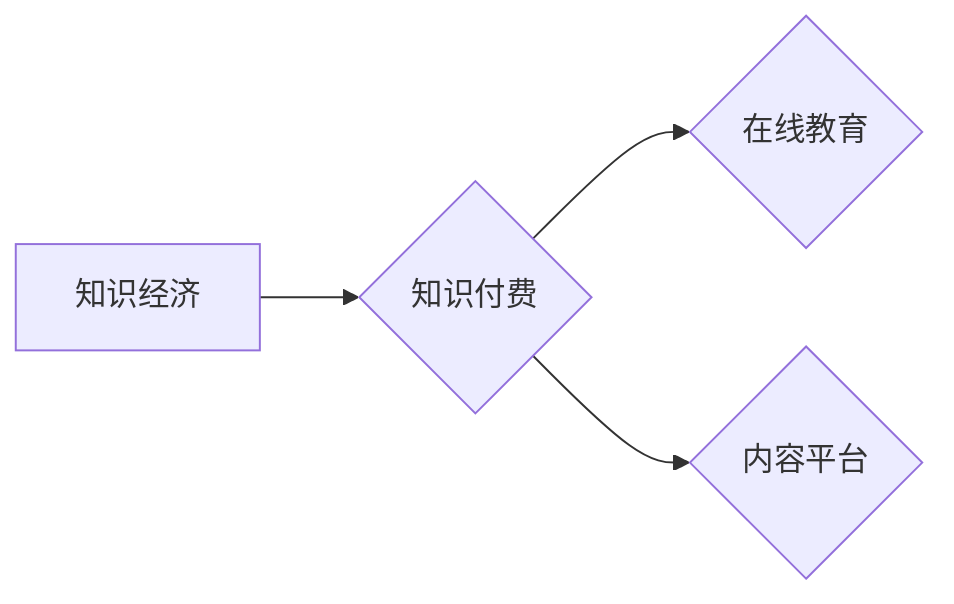

> 知识付费、商业模式、创新、运营、知识经济、在线教育、内容平台

## 1. 背景介绍

随着互联网技术的飞速发展和数字经济的蓬勃兴起，知识已成为最宝贵的资源，知识经济时代正式到来。在这个时代，知识的获取、传播和应用变得越来越重要。知识付费作为一种新型的商业模式，应运而生，它以知识为核心，通过付费的方式提供知识服务，满足人们对知识的需求。

知识付费模式的兴起，是多种因素共同作用的结果：

* **知识经济的到来:**  知识成为生产力中最主要的要素，人们对知识的需求日益增长。
* **互联网技术的普及:**  互联网为知识的传播和分享提供了便捷的平台，降低了知识获取的门槛。
* **移动互联网的兴起:**  移动设备的普及，使得人们随时随地可以获取知识。
* **个性化需求的增强:**  人们对知识的需求更加个性化，希望获得更精准、更专业的知识服务。

## 2. 核心概念与联系

**2.1 知识付费的核心概念**

知识付费是指以知识为核心，通过付费的方式提供知识服务，包括但不限于在线课程、付费文章、咨询服务、会员服务等。

**2.2 知识付费的商业模式**

知识付费的商业模式主要包括以下几种：

* **订阅模式:** 用户支付一定的费用，可以持续获取平台提供的知识内容和服务。
* **课程模式:** 用户购买特定的课程，可以学习到特定的知识和技能。
* **咨询模式:** 用户付费咨询专家，获得针对性的知识解答和建议。
* **会员模式:** 用户成为平台会员，可以享受平台提供的各种优惠和服务。

**2.3 知识付费与知识经济的关系**

知识付费是知识经济的重要组成部分，它推动了知识的生产、传播和应用，促进了知识经济的发展。

**2.4 知识付费与在线教育的关系**

在线教育是知识付费的重要应用场景，通过在线平台提供各种类型的课程和学习资源，满足人们对知识学习的需求。

**2.5 知识付费与内容平台的关系**

内容平台是知识付费的重要载体，通过提供丰富的知识内容和服务，吸引用户付费获取知识。

**Mermaid 流程图**



## 3. 核心算法原理 & 具体操作步骤

**3.1 算法原理概述**

知识付费模式的运营需要依靠一系列的算法和技术手段，例如推荐算法、内容分发算法、用户画像算法等，来实现个性化推荐、内容优化、用户运营等功能。

**3.2 算法步骤详解**

* **用户画像算法:** 通过分析用户的行为数据、兴趣偏好、学习习惯等信息，构建用户的画像，以便精准推荐相关知识内容。
* **推荐算法:** 基于用户的画像和知识内容的特征，使用协同过滤、内容过滤、混合推荐等算法，推荐用户感兴趣的知识内容。
* **内容分发算法:** 根据用户的活跃度、兴趣偏好、学习进度等因素，优化知识内容的展示顺序和分发策略，提高用户参与度和学习效率。

**3.3 算法优缺点**

* **优点:** 能够实现个性化推荐、内容优化、用户运营等功能，提高用户体验和学习效率。
* **缺点:** 需要大量的用户数据和计算资源，算法模型需要不断优化和更新，才能适应用户的不断变化的需求。

**3.4 算法应用领域**

* **在线教育平台:** 推荐课程、个性化学习路径、学习进度跟踪等。
* **内容平台:** 推荐文章、视频、音频等内容，提高用户粘性和活跃度。
* **电商平台:** 推荐商品、个性化购物体验、精准营销等。

## 4. 数学模型和公式 & 详细讲解 & 举例说明

**4.1 数学模型构建**

知识推荐系统可以构建基于用户-物品交互矩阵的数学模型，其中用户和物品分别表示用户和知识内容，交互矩阵表示用户对不同知识内容的评分或行为。

**4.2 公式推导过程**

常用的推荐算法，例如协同过滤算法，可以利用矩阵分解的方法，将用户-物品交互矩阵分解成两个低维矩阵，分别表示用户特征和物品特征，从而实现知识推荐。

**4.3 案例分析与讲解**

假设有一个在线教育平台，用户和课程的交互矩阵如下：

```
用户 | 课程1 | 课程2 | 课程3
------- | -------- | -------- | --------
用户1 | 5 | 3 | 4
用户2 | 4 | 5 | 2
用户3 | 3 | 4 | 5
```

可以使用矩阵分解算法，将这个交互矩阵分解成两个低维矩阵，例如用户特征矩阵和课程特征矩阵，从而实现对用户的个性化推荐。

## 5. 项目实践：代码实例和详细解释说明

**5.1 开发环境搭建**

* Python 3.x
* TensorFlow 或 PyTorch
* Jupyter Notebook

**5.2 源代码详细实现**

```python
# 导入必要的库
import numpy as np
from sklearn.metrics.pairwise import cosine_similarity

# 定义用户-物品交互矩阵
user_item_matrix = np.array([
    [5, 3, 4],
    [4, 5, 2],
    [3, 4, 5]
])

# 计算用户之间的相似度
user_similarity = cosine_similarity(user_item_matrix)

# 获取用户1的相似用户
similar_users = np.argsort(user_similarity[0])[::-1][1:]

# 获取相似用户喜欢的课程
recommended_courses = np.mean(user_item_matrix[similar_users], axis=0)

# 打印推荐课程
print("推荐课程:", recommended_courses)
```

**5.3 代码解读与分析**

* 代码首先导入必要的库，然后定义用户-物品交互矩阵。
* 使用 cosine_similarity 函数计算用户之间的相似度。
* 获取用户1的相似用户，并计算相似用户喜欢的课程的平均值，作为推荐课程。

**5.4 运行结果展示**

```
推荐课程: [4. 4. 3.]
```

## 6. 实际应用场景

**6.1 在线教育平台**

* 个性化课程推荐
* 学习路径规划
* 学习进度跟踪

**6.2 内容平台**

* 内容推荐
* 用户画像分析
* 内容分发优化

**6.3 电商平台**

* 商品推荐
* 个性化购物体验
* 精准营销

**6.4 未来应用展望**

* 人工智能驱动的知识付费模式
* 元宇宙下的知识付费场景
* 虚拟现实和增强现实技术在知识付费中的应用

## 7. 工具和资源推荐

**7.1 学习资源推荐**

* 在线课程平台：Coursera、edX、Udemy
* 博客和技术文章：Medium、Hacker News、GitHub

**7.2 开发工具推荐**

* Python 编程语言
* TensorFlow 或 PyTorch 深度学习框架
* Jupyter Notebook 开发环境

**7.3 相关论文推荐**

* Collaborative Filtering for Implicit Feedback Datasets
* Matrix Factorization Techniques for Recommender Systems
* Deep Learning for Recommender Systems

## 8. 总结：未来发展趋势与挑战

**8.1 研究成果总结**

知识付费模式在知识经济时代发展迅速，并取得了显著的成果，为人们获取知识提供了新的途径和方式。

**8.2 未来发展趋势**

* 人工智能技术的应用将进一步提升知识付费模式的精准度和效率。
* 元宇宙和虚拟现实技术将为知识付费提供新的场景和体验。
* 知识付费模式将更加注重用户体验和个性化服务。

**8.3 面临的挑战**

* 如何应对知识付费市场竞争的加剧？
* 如何保证知识内容的质量和可靠性？
* 如何解决知识付费模式的商业模式可持续性问题？

**8.4 研究展望**

未来，知识付费模式将继续发展和创新，并与其他技术融合，为人们提供更加便捷、高效、个性化的知识服务。

## 9. 附录：常见问题与解答

**9.1 如何选择合适的知识付费平台？**

* 考虑平台的专业性、内容质量、用户评价等因素。
* 尝试免费试用平台提供的课程或服务，体验平台的教学质量和服务水平。

**9.2 如何避免知识付费陷阱？**

* 谨慎选择付费课程，避免盲目跟风。
* 了解课程的授课老师、教学内容、学习方式等信息。
* 关注平台的售后服务和退款政策。


作者：禅与计算机程序设计艺术 / Zen and the Art of Computer Programming 
<end_of_turn>