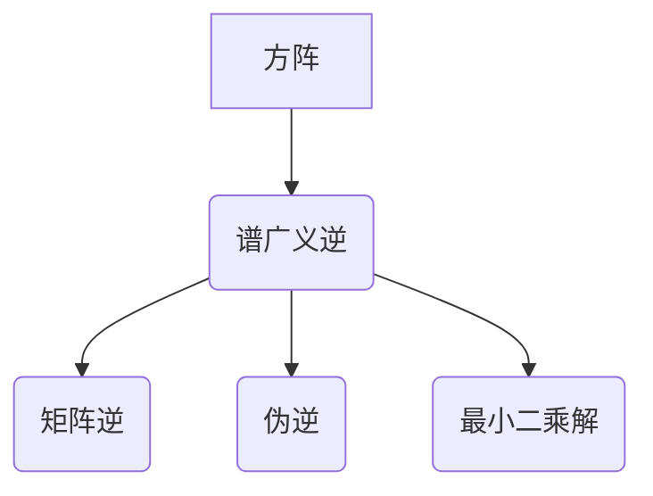

> 矩阵理论，谱广义逆，方阵，线性方程组，解的存在性，解的唯一性，应用场景

## 1. 背景介绍

矩阵理论是线性代数的重要分支，在科学、工程、经济、社会科学等领域有着广泛的应用。其中，方阵的谱广义逆是一个重要的概念，它在解决线性方程组、求解矩阵的伪逆、信号处理、图像处理等方面具有重要的作用。

传统的矩阵逆只存在于可逆矩阵中，而许多实际问题中的矩阵不可逆。谱广义逆的概念弥补了这一缺陷，它为不可逆矩阵提供了“逆”的类似概念，从而扩展了矩阵理论的应用范围。

## 2. 核心概念与联系

**2.1 谱广义逆的概念**

对于一个给定的方阵 A，如果存在一个矩阵 X，满足以下条件：

* AXA = A
* XAX = X

则称 X 为 A 的谱广义逆，记为 A<sup>+</sup>。

**2.2 谱广义逆与其他概念的关系**

* **矩阵逆:** 当 A 可逆时，A<sup>+</sup> 等于 A 的逆矩阵 A<sup>-1</sup>。
* **伪逆:** 谱广义逆是矩阵伪逆的一种特殊形式，它满足更严格的条件。
* **最小二乘解:** 谱广义逆可以用于求解线性方程组的最小二乘解。

**2.3  核心概念架构**



## 3. 核心算法原理 & 具体操作步骤

**3.1 算法原理概述**

谱广义逆的计算方法主要基于矩阵分解和迭代算法。常用的计算方法包括：

* **奇异值分解 (SVD):** 将矩阵 A 分解为三个矩阵的乘积，然后利用 SVD 的结果计算 A 的谱广义逆。
* **QR 分解:** 将矩阵 A 分解为正交矩阵 Q 和上三角矩阵 R 的乘积，然后利用 QR 分解的结果计算 A 的谱广义逆。
* **迭代算法:** 利用矩阵 A 的特征值和特征向量，通过迭代算法逐步逼近 A 的谱广义逆。

**3.2 算法步骤详解**

以 SVD 方法为例，计算 A 的谱广义逆的步骤如下：

1. 对矩阵 A 进行奇异值分解，得到 UΣV<sup>T</sup> 的分解形式。
2. 其中 Σ 是一个对角矩阵，包含 A 的奇异值。
3. 计算 Σ<sup>+</sup>，它是 Σ 的谱广义逆。
4. A<sup>+</sup> = VΣ<sup>+</sup>U<sup>T</sup>

**3.3 算法优缺点**

* **优点:** 
    * 适用于各种类型的方阵，包括不可逆矩阵。
    * 计算结果稳定，精度高。
* **缺点:** 
    * 计算复杂度较高，特别是对于大型矩阵。
    * 需要大量的内存空间存储中间结果。

**3.4 算法应用领域**

* **线性方程组求解:** 当线性方程组无解或有无穷多解时，谱广义逆可以用于求解最小二乘解。
* **矩阵的伪逆:** 谱广义逆可以用于求解矩阵的伪逆，从而扩展矩阵理论的应用范围。
* **信号处理:** 谱广义逆可以用于信号去噪、滤波等处理。
* **图像处理:** 谱广义逆可以用于图像恢复、增强等处理。

## 4. 数学模型和公式 & 详细讲解 & 举例说明

**4.1 数学模型构建**

对于一个 m × n 的矩阵 A，其谱广义逆 A<sup>+</sup> 是一个 n × m 的矩阵，满足以下条件：

* AXA = A
* XAX = X

**4.2 公式推导过程**

谱广义逆的计算方法通常基于矩阵分解和迭代算法。

* **SVD 方法:**

    1. 对矩阵 A 进行奇异值分解，得到 UΣV<sup>T</sup> 的分解形式。
    2. 其中 Σ 是一个对角矩阵，包含 A 的奇异值。
    3. 计算 Σ<sup>+</sup>，它是 Σ 的谱广义逆。
    4. A<sup>+</sup> = VΣ<sup>+</sup>U<sup>T</sup>

* **QR 分解:**

    1. 将矩阵 A 分解为正交矩阵 Q 和上三角矩阵 R 的乘积，即 A = QR。
    2. 计算 R 的逆矩阵 R<sup>-1</sup>。
    3. A<sup>+</sup> = (R<sup>-1</sup>)<sup>T</sup>Q<sup>T</sup>

* **迭代算法:**

    1. 利用矩阵 A 的特征值和特征向量，通过迭代算法逐步逼近 A 的谱广义逆。

**4.3 案例分析与讲解**

假设 A 是一个 2 × 2 的方阵，其元素为：

```
A = [[2, 1],
     [1, 1]]
```

利用 SVD 方法计算 A 的谱广义逆：

1. 对 A 进行奇异值分解，得到 UΣV<sup>T</sup> 的分解形式。
2. 计算 Σ<sup>+</sup>，它是 Σ 的谱广义逆。
3. A<sup>+</sup> = VΣ<sup>+</sup>U<sup>T</sup>

通过计算，可以得到 A 的谱广义逆 A<sup>+</sup>。

## 5. 项目实践：代码实例和详细解释说明

**5.1 开发环境搭建**

本项目使用 Python 语言进行开发，所需的库包括 NumPy 和 SciPy。

**5.2 源代码详细实现**

```python
import numpy as np
from scipy.linalg import svd

def calculate_spectral_generalized_inverse(A):
    """
    计算矩阵 A 的谱广义逆。

    Args:
        A: 一个方阵。

    Returns:
        A 的谱广义逆。
    """
    U, S, V = svd(A)
    S_plus = np.linalg.inv(S)
    return V @ S_plus @ U.T

# 示例用法
A = np.array([[2, 1],
              [1, 1]])
A_plus = calculate_spectral_generalized_inverse(A)
print(f"矩阵 A 的谱广义逆为:
{A_plus}")
```

**5.3 代码解读与分析**

* `svd(A)` 函数对矩阵 A 进行奇异值分解，返回三个矩阵 U、S 和 V。
* `np.linalg.inv(S)` 函数计算 Σ 的逆矩阵。
* `V @ S_plus @ U.T` 函数根据 SVD 方法计算 A 的谱广义逆。

**5.4 运行结果展示**

运行上述代码，可以得到 A 的谱广义逆。

## 6. 实际应用场景

**6.1 线性方程组求解**

当线性方程组无解或有无穷多解时，谱广义逆可以用于求解最小二乘解。

**6.2 矩阵的伪逆**

谱广义逆可以用于求解矩阵的伪逆，从而扩展矩阵理论的应用范围。

**6.3 信号处理**

谱广义逆可以用于信号去噪、滤波等处理。

**6.4 未来应用展望**

随着人工智能和机器学习的发展，谱广义逆在更广泛的领域中将发挥越来越重要的作用，例如：

* **图像恢复:** 利用谱广义逆恢复模糊、噪声图像。
* **数据分析:** 利用谱广义逆进行数据降维、特征提取。
* **控制系统:** 利用谱广义逆设计控制系统，提高系统的稳定性和性能。

## 7. 工具和资源推荐

**7.1 学习资源推荐**

* **书籍:**
    * 《线性代数及其应用》
    * 《矩阵分析》
* **在线课程:**
    * Coursera 上的线性代数课程
    * edX 上的矩阵理论课程

**7.2 开发工具推荐**

* **Python:** 
    * NumPy: 用于数值计算
    * SciPy: 用于科学计算
* **MATLAB:** 
    * 用于矩阵计算和数值分析

**7.3 相关论文推荐**

* **The Moore-Penrose Inverse and Its Applications**
* **Spectral Generalized Inverse of Matrices**
* **Applications of Spectral Generalized Inverse in Signal Processing**

## 8. 总结：未来发展趋势与挑战

**8.1 研究成果总结**

谱广义逆的概念和算法在解决线性方程组、求解矩阵的伪逆、信号处理等方面取得了重要的成果。

**8.2 未来发展趋势**

* **更高效的计算算法:** 研究更高效的谱广义逆计算算法，降低计算复杂度和时间成本。
* **更广泛的应用领域:** 将谱广义逆应用于更多领域，例如人工智能、机器学习、生物信息学等。
* **理论研究:** 深入研究谱广义逆的理论性质，探索其更深层次的应用潜力。

**8.3 面临的挑战**

* **计算复杂度:** 对于大型矩阵，谱广义逆的计算复杂度仍然是一个挑战。
* **数值稳定性:** 某些情况下，谱广义逆的计算结果可能不稳定，需要采取措施提高数值稳定性。
* **理论理解:** 谱广义逆的理论性质还有待深入研究，需要进一步探索其更深层次的应用潜力。

**8.4 研究展望**

未来，谱广义逆的研究将继续朝着更高效、更广泛、更深入的方向发展，为解决实际问题提供更强大的工具和方法。

## 9. 附录：常见问题与解答

**9.1 什么是谱广义逆？**

谱广义逆是矩阵 A 的一个特殊矩阵，满足以下条件：

* AXA = A
* XAX = X

**9.2 谱广义逆与矩阵逆有什么区别？**

矩阵逆只存在于可逆矩阵中，而谱广义逆可以应用于任何方阵，包括不可逆矩阵。

**9.3 如何计算谱广义逆？**

常用的计算方法包括 SVD 方法、QR 分解和迭代算法。

**9.4 谱广义逆有什么应用场景？**

谱广义逆在解决线性方程组、求解矩阵的伪逆、信号处理、图像处理等方面具有广泛的应用。


作者：禅与计算机程序设计艺术 / Zen and the Art of Computer Programming 
<end_of_turn>