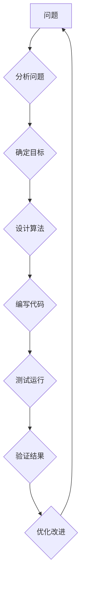

> 第一性原理，科学思维，逻辑推理，算法设计，数学建模，代码实践，实际应用，未来趋势

## 1. 背景介绍

在瞬息万变的科技时代，掌握科学思维能力显得尤为重要。科学思维的核心在于从根本原理出发，通过逻辑推理和严谨的实验验证，逐步构建知识体系。而第一性原理，作为科学思维的基础，指的就是那些最基本的、最核心的真理，它们是所有其他知识的根基。

对于程序员而言，理解和应用第一性原理同样至关重要。软件开发本质上是解决问题，而解决问题的前提是深刻理解问题的本质。通过运用第一性原理，我们可以跳出表面现象，深入到问题的根源，从而设计出更优雅、更高效的解决方案。

## 2. 核心概念与联系

**2.1 第一性原理的本质**

第一性原理并非是绝对的真理，而是基于现有知识和经验的最佳理解。它们是不断被检验和修正的，随着科学进步，我们的理解也会不断深入。

**2.2 科学思维与编程思维的联系**

科学思维和编程思维在本质上都遵循逻辑推理和问题解决的原则。

* **科学思维**：通过观察、假设、实验、验证等步骤，逐步揭示自然规律。
* **编程思维**：通过分析问题、设计算法、编写代码、测试运行等步骤，实现特定功能。

两者之间存在着密切的联系，编程思维可以看作是科学思维在计算机领域的一种应用。

**2.3  第一性原理在编程中的应用**

* **算法设计**: 运用第一性原理可以帮助我们设计更优的算法，例如，了解时间复杂度和空间复杂度的原理，可以帮助我们选择更合适的算法。
* **数据结构**: 理解数据结构的本质，例如链表、树、图等，可以帮助我们选择更合适的结构来存储和处理数据。
* **软件架构**: 运用第一性原理可以帮助我们构建更健壮、更可维护的软件架构，例如，了解面向对象编程的原则，可以帮助我们设计更清晰、更模块化的代码。

**2.4  Mermaid 流程图**



## 3. 核心算法原理 & 具体操作步骤

**3.1 算法原理概述**

算法是一种解决特定问题的步骤序列，它可以被计算机理解和执行。一个好的算法应该具有以下特点：

* **正确性**: 算法能够正确解决问题。
* **效率**: 算法能够在有限的时间和资源内完成任务。
* **可读性**: 算法易于理解和维护。

**3.2 算法步骤详解**

算法的具体步骤取决于所解决的问题，但一般来说，算法设计过程可以分为以下几个步骤：

1. **分析问题**: 首先要明确问题的本质，确定问题的输入和输出。
2. **确定目标**: 明确算法的目标，即解决问题的具体方式。
3. **设计算法**: 根据问题的特点和目标，设计出解决问题的步骤序列。
4. **编写代码**: 将算法步骤转化为计算机可以理解的代码。
5. **测试运行**: 对代码进行测试，验证算法的正确性和效率。
6. **优化改进**: 根据测试结果，对算法进行优化，提高其性能。

**3.3 算法优缺点**

不同的算法具有不同的优缺点，选择合适的算法取决于具体的问题和需求。例如，排序算法中，冒泡排序简单易懂，但效率较低；快速排序效率较高，但实现复杂度较高。

**3.4 算法应用领域**

算法广泛应用于各个领域，例如：

* **计算机科学**: 数据结构、算法设计、人工智能等。
* **生物学**: 基因序列分析、蛋白质结构预测等。
* **金融**: 风险管理、投资策略等。
* **医学**: 疾病诊断、药物研发等。

## 4. 数学模型和公式 & 详细讲解 & 举例说明

**4.1 数学模型构建**

数学模型是利用数学语言和符号来描述客观现象的抽象模型。在算法设计和分析中，数学模型可以帮助我们理解算法的运行机制，分析算法的性能，并进行优化。

**4.2 公式推导过程**

例如，时间复杂度是一个常用的算法性能指标，它表示算法运行时间与输入数据规模的关系。时间复杂度通常用大O符号来表示，例如，O(n)表示算法运行时间与输入数据规模成正比。

**4.3 案例分析与讲解**

例如，冒泡排序算法的时间复杂度为O(n^2)，这意味着算法运行时间随着输入数据规模的增加而呈平方增长。而快速排序算法的时间复杂度为平均情况下为O(n log n)，这意味着算法运行时间随着输入数据规模的增加而呈对数增长。

**4.4 数学公式**

* **时间复杂度**: T(n) = O(f(n))
* **空间复杂度**: S(n) = O(g(n))

**4.5  举例说明**

例如，查找一个元素在排序数组中的时间复杂度为O(log n)，因为可以使用二分查找算法，每次将搜索范围缩小一半。

## 5. 项目实践：代码实例和详细解释说明

**5.1 开发环境搭建**

* 操作系统: Ubuntu 20.04 LTS
* 编程语言: Python 3.8
* 开发工具: VS Code

**5.2 源代码详细实现**

```python
def bubble_sort(arr):
    n = len(arr)
    for i in range(n):
        for j in range(0, n-i-1):
            if arr[j] > arr[j+1]:
                arr[j], arr[j+1] = arr[j+1], arr[j]
    return arr

# 测试代码
arr = [64, 34, 25, 12, 22, 11, 90]
sorted_arr = bubble_sort(arr)
print("排序后的数组:", sorted_arr)
```

**5.3 代码解读与分析**

* `bubble_sort(arr)` 函数接收一个数组 `arr` 作为输入，并返回排序后的数组。
* 外层循环 `for i in range(n)` 迭代 `n` 次，其中 `n` 是数组的长度。
* 内层循环 `for j in range(0, n-i-1)` 比较相邻元素，如果顺序错误，则交换它们的位置。
* 每次内层循环结束后，最大的元素都会“冒泡”到数组的末尾。
* 循环结束后，数组就被排序了。

**5.4 运行结果展示**

```
排序后的数组: [11, 12, 22, 25, 34, 64, 90]
```

## 6. 实际应用场景

**6.1 数据排序**

冒泡排序算法可以用于对数据进行排序，例如，对学生成绩进行排序，对商品价格进行排序等。

**6.2 查找元素**

在排序数组中查找元素时，可以使用二分查找算法，其时间复杂度为O(log n)，效率较高。

**6.3 图算法**

图算法可以用于解决各种图论问题，例如，寻找最短路径、判断图的连通性等。

**6.4 未来应用展望**

随着人工智能和机器学习的发展，算法在各个领域的应用将会更加广泛。例如，在医疗领域，算法可以用于辅助诊断、预测疾病风险等；在金融领域，算法可以用于风险管理、投资决策等。

## 7. 工具和资源推荐

**7.1 学习资源推荐**

* **书籍**: 《算法导论》、《数据结构与算法分析》
* **在线课程**: Coursera、edX、Udemy等平台上的算法课程
* **网站**: GeeksforGeeks、LeetCode等网站提供算法练习和学习资源

**7.2 开发工具推荐**

* **IDE**: VS Code、Eclipse、IntelliJ IDEA等
* **调试工具**: GDB、pdb等

**7.3 相关论文推荐**

* **时间复杂度**: Big O Notation
* **空间复杂度**: Space Complexity
* **算法设计**: Algorithm Design Techniques

## 8. 总结：未来发展趋势与挑战

**8.1 研究成果总结**

第一性原理是科学思维的基础，在编程领域，运用第一性原理可以帮助我们设计更优的算法，构建更健壮的软件架构。

**8.2 未来发展趋势**

* **人工智能**: 算法在人工智能领域将发挥越来越重要的作用，例如，深度学习、强化学习等。
* **云计算**: 云计算平台提供了强大的计算资源，可以支持更复杂的算法应用。
* **大数据**: 大数据时代，算法需要能够处理海量数据，并从中提取有价值的信息。

**8.3 面临的挑战**

* **算法复杂度**: 随着算法的复杂度增加，算法设计和分析变得更加困难。
* **数据安全**: 算法处理的数据可能包含敏感信息，需要保证数据安全。
* **伦理问题**: 算法的应用可能会带来伦理问题，例如，算法偏见、算法透明度等。

**8.4 研究展望**

未来，算法研究将继续朝着更智能、更安全、更可解释的方向发展。


## 9. 附录：常见问题与解答

**9.1 什么是时间复杂度？**

时间复杂度是指算法运行时间与输入数据规模的关系。

**9.2 什么是空间复杂度？**

空间复杂度是指算法运行过程中使用的内存空间大小与输入数据规模的关系。

**9.3 如何选择合适的算法？**

选择合适的算法取决于具体的问题和需求，需要考虑算法的正确性、效率、可读性等因素。

**9.4 如何优化算法？**

可以通过分析算法的运行机制，寻找算法瓶颈，并进行相应的改进来优化算法。


作者：禅与计算机程序设计艺术 / Zen and the Art of Computer Programming 
<end_of_turn>