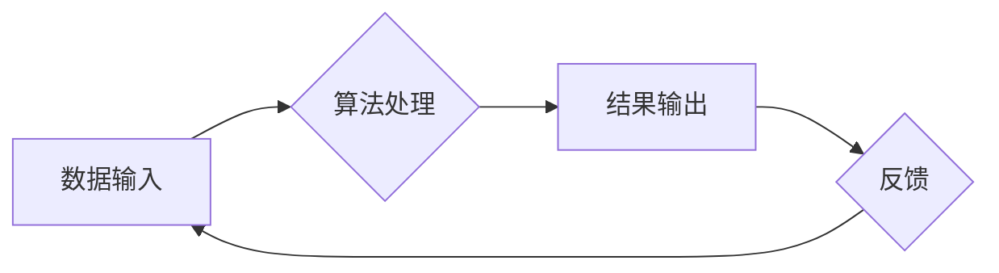

> 算法、人工智能、机器学习、深度学习、数据结构、复杂度分析、创新

## 1. 背景介绍

人工智能（AI）正以惊人的速度发展，深刻地改变着我们的生活和工作方式。从自动驾驶汽车到智能语音助手，AI技术的应用无处不在。然而，支撑AI发展的核心力量是算法。算法是人工智能的灵魂，是实现AI智能化的关键。

传统的编程方法依赖于明确的指令和规则，而AI算法则更侧重于从数据中学习和发现模式。通过对海量数据的分析和处理，AI算法能够不断提升其性能，最终实现智能化决策和行为。

## 2. 核心概念与联系

**2.1 算法概述**

算法是指解决特定问题的一系列明确步骤或规则。它是一种逻辑程序，通过输入数据进行处理，最终输出结果。

**2.2 人工智能概述**

人工智能是指模拟人类智能行为的计算机系统。它涵盖了多个领域，包括机器学习、深度学习、自然语言处理、计算机视觉等。

**2.3 算法与人工智能的关系**

算法是人工智能的核心驱动力。人工智能系统通过学习和分析数据，最终实现智能化决策和行为，而这一切都离不开算法的支撑。

**2.4 算法在人工智能中的作用**

* **数据分析和模式识别:** 算法能够从海量数据中识别出隐藏的模式和趋势，为人工智能系统提供决策依据。
* **机器学习:** 算法是机器学习的核心，通过训练数据，算法能够不断学习和改进其预测和分类能力。
* **深度学习:** 深度学习是一种更高级的机器学习方法，它利用多层神经网络来模拟人类大脑的学习过程。算法是深度学习模型的基础，决定了模型的性能和效率。

**2.5 Mermaid 流程图**

## 3. 核心算法原理 & 具体操作步骤

**3.1 算法原理概述**

选择一个具体的AI算法，例如线性回归算法，详细介绍其原理。

**3.2 算法步骤详解**

1. 数据预处理：对输入数据进行清洗、转换和特征工程等操作，以提高算法的性能。
2. 模型构建：根据算法原理，构建模型结构，并设置模型参数。
3. 模型训练：使用训练数据，通过迭代优化模型参数，使模型能够准确预测输出结果。
4. 模型评估：使用测试数据，评估模型的性能，例如准确率、召回率等指标。
5. 模型部署：将训练好的模型部署到实际应用场景中，用于进行预测和决策。

**3.3 算法优缺点**

* **优点:** 
    * 简单易懂，易于实现。
    * 计算效率高，适合处理大规模数据。
* **缺点:** 
    * 对于非线性关系的拟合能力有限。
    * 对数据噪声敏感。

**3.4 算法应用领域**

* 房价预测
* 股票价格预测
* 疾病诊断

## 4. 数学模型和公式 & 详细讲解 & 举例说明

**4.1 数学模型构建**

使用数学模型描述算法的原理，例如线性回归模型的数学表达式。

$$
y = \theta_0 + \theta_1x_1 + \theta_2x_2 + ... + \theta_nx_n + \epsilon
$$

其中：

* $y$ 是预测结果
* $\theta_0, \theta_1, ..., \theta_n$ 是模型参数
* $x_1, x_2, ..., x_n$ 是输入特征
* $\epsilon$ 是误差项

**4.2 公式推导过程**

详细推导算法的数学公式，例如线性回归模型参数的求解方法。

**4.3 案例分析与讲解**

使用实际案例分析算法的应用，例如使用线性回归模型预测房价。

## 5. 项目实践：代码实例和详细解释说明

**5.1 开发环境搭建**

介绍项目开发所需的软件环境，例如Python、NumPy、Scikit-learn等。

**5.2 源代码详细实现**

提供代码示例，展示算法的具体实现过程。

**5.3 代码解读与分析**

对代码进行详细解读，解释代码的逻辑和功能。

**5.4 运行结果展示**

展示算法运行的结果，例如预测结果的准确率和误差分析。

## 6. 实际应用场景

**6.1 医疗诊断**

使用算法分析患者的病历和检查结果，辅助医生进行诊断。

**6.2 金融风险评估**

使用算法分析客户的信用记录和财务状况，评估其贷款风险。

**6.3 自动驾驶**

使用算法分析车辆周围的环境信息，控制车辆行驶。

**6.4 未来应用展望**

展望算法在未来应用的趋势，例如在个性化教育、智能制造等领域。

## 7. 工具和资源推荐

**7.1 学习资源推荐**

推荐一些学习AI算法的书籍、课程和在线资源。

**7.2 开发工具推荐**

推荐一些用于开发AI算法的工具和框架，例如TensorFlow、PyTorch等。

**7.3 相关论文推荐**

推荐一些关于AI算法的经典论文。

## 8. 总结：未来发展趋势与挑战

**8.1 研究成果总结**

总结AI算法在各个领域的应用成果。

**8.2 未来发展趋势**

展望AI算法未来的发展趋势，例如更强大的计算能力、更丰富的算法模型、更广泛的应用场景。

**8.3 面临的挑战**

分析AI算法面临的挑战，例如数据安全、算法可解释性、伦理问题等。

**8.4 研究展望**

展望未来AI算法研究的方向，例如更智能、更安全、更可解释的算法。

## 9. 附录：常见问题与解答

解答一些关于AI算法的常见问题。

作者：禅与计算机程序设计艺术 / Zen and the Art of Computer Programming

<end_of_turn>