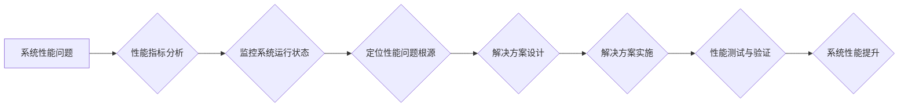

> 系统瓶颈、性能优化、负载测试、监控指标、算法分析、架构设计、数据库优化、网络优化、缓存机制

## 1. 背景介绍

在当今以数字化转型为核心的时代，软件系统扮演着越来越重要的角色。无论是企业内部的业务系统，还是面向用户的互联网应用，都面临着日益增长的性能和可靠性要求。然而，随着系统规模的不断扩大和功能的不断丰富，系统性能问题也随之而来，这些问题往往表现为响应时间过长、资源利用率低、并发能力不足等，严重影响着用户体验和业务发展。

系统瓶颈是指系统中某一环节或组件的性能无法满足系统整体需求，从而成为限制系统性能提升的因素。识别和解决系统瓶颈是提升系统性能的关键环节，也是保证系统稳定运行和持续发展的必要保障。

## 2. 核心概念与联系

**2.1 系统瓶颈类型**

系统瓶颈可以分为以下几种类型：

* **计算瓶颈:** 处理能力不足，导致CPU利用率过高，程序执行速度慢。
* **内存瓶颈:** 内存容量不足，导致频繁的页面交换，降低程序执行效率。
* **网络瓶颈:** 网络带宽不足，导致数据传输速度慢，影响系统响应时间。
* **数据库瓶颈:** 数据库查询速度慢，数据访问效率低，影响系统性能。
* **I/O 瓶颈:** 磁盘读写速度慢，导致数据访问延迟，影响系统性能。

**2.2 系统瓶颈识别与解决方案**

系统瓶颈识别和解决方案是一个迭代的过程，需要结合多种工具和技术手段，通过分析系统性能指标、监控系统运行状态、定位性能问题根源，最终找到解决方案。

**2.3 系统瓶颈解决方案**

* **优化代码:** 提高代码执行效率，减少不必要的计算和内存分配。
* **调整系统配置:** 优化系统参数，例如增加内存、调整CPU核心数等。
* **缓存机制:** 利用缓存技术，减少数据访问数据库的次数，提高数据访问速度。
* **负载均衡:** 将请求分发到多个服务器，提高系统并发能力。
* **数据库优化:** 优化数据库查询语句，调整数据库索引，提高数据库查询速度。
* **网络优化:** 优化网络带宽、降低网络延迟，提高数据传输速度。

**2.4 Mermaid 流程图**



## 3. 核心算法原理 & 具体操作步骤

### 3.1 算法原理概述

系统瓶颈识别算法通常基于以下原理：

* **性能指标分析:** 通过分析系统关键性能指标，例如CPU利用率、内存使用率、网络流量等，识别性能瓶颈的可能性。
* **监控系统运行状态:** 通过监控系统运行状态，例如进程占用资源、线程等待时间等，及时发现性能问题。
* **定位性能问题根源:** 通过分析性能指标和系统运行状态，定位性能问题发生的具体环节或组件。

### 3.2 算法步骤详解

1. **收集性能指标数据:** 使用系统监控工具收集系统关键性能指标数据，例如CPU利用率、内存使用率、网络流量等。
2. **分析性能指标趋势:** 对收集到的性能指标数据进行分析，识别性能指标的趋势变化，例如CPU利用率持续升高、内存使用率接近饱和等。
3. **监控系统运行状态:** 使用系统监控工具监控系统运行状态，例如进程占用资源、线程等待时间等，及时发现性能问题。
4. **定位性能问题根源:** 通过分析性能指标趋势和系统运行状态，定位性能问题发生的具体环节或组件。
5. **设计解决方案:** 根据定位到的性能问题根源，设计相应的解决方案，例如优化代码、调整系统配置、缓存机制等。
6. **实施解决方案:** 将设计好的解决方案实施到系统中，并进行性能测试和验证。

### 3.3 算法优缺点

**优点:**

* 能够识别系统性能瓶颈，为性能优化提供方向。
* 能够及时发现性能问题，避免系统崩溃。
* 能够量化性能问题，方便评估解决方案效果。

**缺点:**

* 需要一定的专业知识和经验，才能准确识别性能瓶颈。
* 算法本身无法解决性能问题，需要结合实际情况设计解决方案。
* 算法的准确性取决于性能指标的选取和监控数据的质量。

### 3.4 算法应用领域

系统瓶颈识别算法广泛应用于以下领域：

* **Web 应用性能优化:** 识别Web应用的性能瓶颈，例如数据库查询速度慢、页面渲染速度慢等。
* **移动应用性能优化:** 识别移动应用的性能瓶颈，例如内存占用率高、启动时间长等。
* **大数据平台性能优化:** 识别大数据平台的性能瓶颈，例如数据处理速度慢、数据存储效率低等。
* **云计算平台性能优化:** 识别云计算平台的性能瓶颈，例如虚拟机资源分配不均衡、网络带宽不足等。

## 4. 数学模型和公式 & 详细讲解 & 举例说明

### 4.1 数学模型构建

系统瓶颈识别可以利用数学模型来进行分析和预测。例如，可以建立一个基于CPU利用率、内存使用率和网络流量的系统性能模型，通过分析模型的输出结果，识别系统性能瓶颈。

### 4.2 公式推导过程

假设系统性能模型如下：

```
性能 = f(CPU利用率, 内存使用率, 网络流量)
```

其中，性能是一个衡量系统性能的指标，例如响应时间、吞吐量等。CPU利用率、内存使用率和网络流量是系统性能的关键影响因素。

可以通过数学方法推导公式，例如线性回归、多元回归等，建立系统性能与关键影响因素之间的关系。

### 4.3 案例分析与讲解

例如，假设我们通过数据分析发现，系统响应时间与CPU利用率呈正相关，即CPU利用率越高，响应时间越长。我们可以建立一个线性回归模型，将CPU利用率作为自变量，响应时间作为因变量，推导出一个线性回归方程。

通过这个线性回归方程，我们可以预测不同CPU利用率下系统的响应时间，从而识别CPU利用率过高导致的系统性能瓶颈。

## 5. 项目实践：代码实例和详细解释说明

### 5.1 开发环境搭建

* 操作系统：Linux
* 编程语言：Python
* 监控工具：Prometheus
* 数据可视化工具：Grafana

### 5.2 源代码详细实现

```python
# 导入必要的库
import requests
import time

# 定义监控接口
def monitor_system_performance():
    # 获取CPU利用率
    cpu_utilization = requests.get('http://localhost:9090/metrics/cpu').json()
    # 获取内存使用率
    memory_utilization = requests.get('http://localhost:9090/metrics/memory').json()
    # 获取网络流量
    network_traffic = requests.get('http://localhost:9090/metrics/network').json()

    # 打印监控结果
    print(f"CPU利用率: {cpu_utilization['cpu_utilization']}")
    print(f"内存使用率: {memory_utilization['memory_utilization']}")
    print(f"网络流量: {network_traffic['network_traffic']}")

# 定期监控系统性能
while True:
    monitor_system_performance()
    time.sleep(60)
```

### 5.3 代码解读与分析

* 该代码使用Python语言实现系统性能监控功能。
* 使用`requests`库发送HTTP请求获取系统性能指标数据。
* 使用`time`库设置监控周期为60秒。
* 打印监控结果，方便观察系统性能变化趋势。

### 5.4 运行结果展示

运行该代码后，会在控制台输出系统CPU利用率、内存使用率和网络流量等指标数据，方便观察系统性能变化趋势。

## 6. 实际应用场景

### 6.1  电商平台

电商平台需要处理大量的用户请求，例如商品浏览、购物车添加、订单提交等。系统瓶颈识别可以帮助电商平台识别性能瓶颈，例如数据库查询速度慢、商品详情页渲染速度慢等，从而优化系统性能，提高用户体验。

### 6.2  金融系统

金融系统需要处理敏感的财务数据，安全性要求极高。系统瓶颈识别可以帮助金融系统识别性能瓶颈，例如交易处理速度慢、账户查询速度慢等，从而优化系统性能，提高交易效率和安全性。

### 6.3  游戏服务器

游戏服务器需要处理大量的玩家请求，例如角色操作、地图渲染、物品交易等。系统瓶颈识别可以帮助游戏服务器识别性能瓶颈，例如服务器负载过高、网络延迟过高等，从而优化系统性能，提高游戏体验。

### 6.4 未来应用展望

随着人工智能、云计算等技术的不断发展，系统瓶颈识别技术将更加智能化、自动化，能够更加准确地识别系统性能瓶颈，并提供更有效的解决方案。

## 7. 工具和资源推荐

### 7.1 学习资源推荐

* **书籍:**
    * 《系统性能优化》
    * 《性能测试与优化》
* **在线课程:**
    * Coursera: Performance Engineering
    * Udemy: Performance Testing and Optimization

### 7.2 开发工具推荐

* **监控工具:** Prometheus, Grafana, Zabbix
* **性能测试工具:** JMeter, LoadRunner, Gatling
* **代码分析工具:** SonarQube, PMD

### 7.3 相关论文推荐

* **论文:**
    * "A Survey of System Performance Monitoring and Analysis Techniques"
    * "Performance Bottleneck Identification and Mitigation in Cloud Computing Environments"

## 8. 总结：未来发展趋势与挑战

### 8.1 研究成果总结

系统瓶颈识别技术已经取得了显著的成果，能够帮助企业和组织提高系统性能，降低运营成本。

### 8.2 未来发展趋势

* **人工智能驱动的系统瓶颈识别:** 利用机器学习和深度学习算法，实现更加智能化、自动化、精准的系统瓶颈识别。
* **云原生系统瓶颈识别:** 针对云原生系统特点，开发专门的系统瓶颈识别工具和技术。
* **微服务架构下的系统瓶颈识别:** 针对微服务架构特点，开发针对微服务系统的瓶颈识别和解决方法。

### 8.3 面临的挑战

* **数据质量问题:** 系统瓶颈识别算法的准确性依赖于数据质量，如何获取高质量的系统运行数据是一个挑战。
* **复杂系统分析:** 随着系统规模和复杂度的不断增加，系统瓶颈识别变得更加困难。
* **技术迭代速度:** 随着技术的不断发展，系统架构和性能指标也在不断变化，需要不断更新和完善系统瓶颈识别技术。

### 8.4 研究展望

未来，系统瓶颈识别技术将朝着更加智能化、自动化、精准的方向发展，为企业和组织提供更加高效、可靠的系统性能优化解决方案。

## 9. 附录：常见问题与解答

### 9.1 如何识别系统瓶颈？

可以通过分析系统性能指标、监控系统运行状态、定位性能问题根源等方式识别系统瓶颈。

### 9.2 如何解决系统瓶颈？

根据定位到的性能问题根源，设计相应的解决方案，例如优化代码、调整系统配置、缓存机制等。

### 9.3 系统瓶颈识别工具有哪些？

常用的系统瓶颈识别工具包括Prometheus、Grafana、Zabbix等。

### 9.4 系统瓶颈识别技术有哪些发展趋势？

未来，系统瓶颈识别技术将朝着更加智能化、自动化、精准的方向发展。

作者：禅与计算机程序设计艺术 / Zen and the Art of Computer Programming


<end_of_turn>