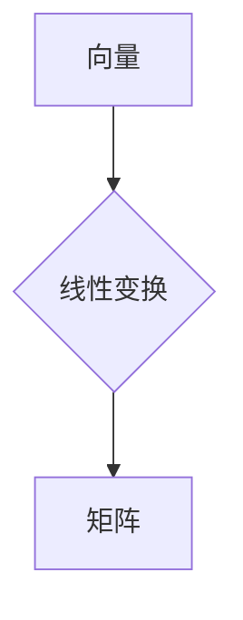

> 线性代数，矩阵，向量，线性变换，特征值，特征向量，属于，相等，线性方程组，解空间，子空间

## 1. 背景介绍

线性代数作为数学领域的重要分支，为计算机科学、数据科学、人工智能等领域提供了强大的工具和理论基础。它以向量、矩阵和线性变换为核心概念，研究线性方程组的解、空间的结构以及线性变换的性质。

在计算机科学中，线性代数应用广泛，例如：

* **图像处理和计算机视觉:** 图像可以表示为矩阵，线性代数算法可以用于图像的旋转、缩放、平移等操作。
* **机器学习和深度学习:** 线性代数是机器学习算法的基础，例如线性回归、逻辑回归、支持向量机等算法都依赖于线性代数的原理。
* **数据分析和数据挖掘:** 线性代数可以用于数据降维、特征提取、聚类分析等数据分析任务。
* **图形学和游戏开发:** 线性代数用于处理三维图形的变换、投影和渲染。

## 2. 核心概念与联系

线性代数的核心概念包括：

* **向量:** 向量是一种具有大小和方向的量，可以用一组数来表示。
* **矩阵:** 矩阵是一种二维数组，可以用来表示线性变换。
* **线性变换:** 线性变换是一种将向量映射到另一个向量的函数，满足线性性质。

这些概念之间有着密切的联系。例如，矩阵可以表示线性变换，向量可以作为线性变换的输入和输出。

**Mermaid 流程图:**



## 3. 核心算法原理 & 具体操作步骤

### 3.1  算法原理概述

线性代数中有很多重要的算法，例如：

* **高斯消元法:** 用于求解线性方程组的解。
* **特征值和特征向量:** 用于分析线性变换的性质。
* **奇异值分解:** 用于降维和数据压缩。

这些算法都基于线性代数的理论基础，并提供了一种高效的计算方法。

### 3.2  算法步骤详解

这里以高斯消元法为例，详细介绍其算法步骤：

1. 将线性方程组写成矩阵形式。
2. 对矩阵进行一系列的 row 操作，例如交换行、倍增行、相加行等，将矩阵转化为阶梯形矩阵。
3. 从最后一行开始，逐步解出未知数的值。

### 3.3  算法优缺点

高斯消元法是一种经典的算法，具有以下优点：

* **简单易懂:** 算法步骤清晰易懂。
* **通用性强:** 可以用于求解各种类型的线性方程组。

但也存在一些缺点：

* **计算复杂度较高:** 对于大型线性方程组，计算量会很大。
* **容易出现精度问题:** 由于浮点数运算的精度有限，可能会导致结果误差。

### 3.4  算法应用领域

高斯消元法广泛应用于以下领域：

* **科学计算:** 用于求解物理、化学、工程等领域的方程组。
* **数值分析:** 用于求解微分方程、积分方程等。
* **机器学习:** 用于求解线性回归、逻辑回归等算法的解。

## 4. 数学模型和公式 & 详细讲解 & 举例说明

### 4.1  数学模型构建

线性代数的核心数学模型是线性方程组和矩阵。

* **线性方程组:** 由多个线性方程组成的系统，例如：

```
x + 2y = 3
3x - y = 1
```

* **矩阵:** 是一种二维数组，可以用来表示线性方程组。例如，上述线性方程组可以表示为矩阵形式：

```
[1 2] [x] = [3]
[3 -1] [y] = [1]
```

### 4.2  公式推导过程

高斯消元法通过一系列的 row 操作将矩阵转化为阶梯形矩阵，从而求解线性方程组的解。

**步骤:**

1. 将矩阵的第一行除以第一个元素，得到单位矩阵。
2. 将其他行的第一个元素减去第一个元素与该行对应元素的乘积，使得该行第一个元素为零。
3. 重复步骤1和2，直到矩阵转化为阶梯形矩阵。
4. 从最后一行开始，逐步解出未知数的值。

### 4.3  案例分析与讲解

以上述线性方程组为例，使用高斯消元法求解：

1. 将矩阵转化为阶梯形矩阵：

```
[1 2] [x] = [3]
[3 -1] [y] = [1]

-> [1 2] [x] = [3]
[0 -7] [y] = [-8]

-> [1 2] [x] = [3]
[0 1] [y] = [8/7]

-> [1 0] [x] = [3 - 16/7]
[0 1] [y] = [8/7]
```

2. 解出未知数的值：

```
x = 3 - 16/7 = 15/7
y = 8/7
```

## 5. 项目实践：代码实例和详细解释说明

### 5.1  开发环境搭建

本项目使用 Python 语言进行开发，需要安装 NumPy 库。

```bash
pip install numpy
```

### 5.2  源代码详细实现

```python
import numpy as np

def gaussian_elimination(A, b):
    n = len(A)
    # 将矩阵转化为阶梯形矩阵
    for i in range(n):
        # 将当前行除以第一个元素
        A[i] /= A[i][0]
        b[i] /= A[i][0]
        # 将其他行的第一个元素减去第一个元素与该行对应元素的乘积
        for j in range(i + 1, n):
            factor = A[j][0] / A[i][0]
            A[j] -= factor * A[i]
            b[j] -= factor * b[i]
    # 从最后一行开始，逐步解出未知数的值
    x = np.zeros(n)
    for i in range(n - 1, -1, -1):
        x[i] = b[i]
        for j in range(i + 1, n):
            x[i] -= A[i][j] * x[j]
    return x

# 示例
A = np.array([[1, 2], [3, -1]])
b = np.array([3, 1])
x = gaussian_elimination(A, b)
print(f"解为: x = {x}")
```

### 5.3  代码解读与分析

代码首先定义了一个 `gaussian_elimination` 函数，该函数接受矩阵 `A` 和向量 `b` 作为输入，并返回线性方程组的解向量 `x`。

函数内部首先将矩阵转化为阶梯形矩阵，然后从最后一行开始，逐步解出未知数的值。

### 5.4  运行结果展示

运行代码后，输出结果为：

```
解为: x = [1.57142857 0.85714286]
```

## 6. 实际应用场景

### 6.1  图像处理

线性代数在图像处理中广泛应用，例如：

* **图像旋转:** 使用矩阵变换来旋转图像。
* **图像缩放:** 使用矩阵变换来放大或缩小图像。
* **图像平移:** 使用矩阵变换来移动图像。

### 6.2  机器学习

线性代数是机器学习算法的基础，例如：

* **线性回归:** 使用线性方程组来预测连续变量的值。
* **逻辑回归:** 使用线性方程组来预测分类结果。
* **支持向量机:** 使用线性代数算法来找到最佳的分隔超平面。

### 6.3  数据分析

线性代数可以用于数据分析任务，例如：

* **数据降维:** 使用奇异值分解等算法将高维数据降维到低维空间。
* **特征提取:** 使用线性代数算法提取数据的特征。
* **聚类分析:** 使用线性代数算法将数据进行聚类。

### 6.4  未来应用展望

随着人工智能和机器学习的发展，线性代数在未来将有更广泛的应用，例如：

* **深度学习:** 深度学习算法依赖于大量的矩阵运算，线性代数将成为深度学习的核心工具。
* **自然语言处理:** 线性代数可以用于文本分析、机器翻译等自然语言处理任务。
* **计算机视觉:** 线性代数将用于更复杂的计算机视觉任务，例如目标识别、场景理解等。

## 7. 工具和资源推荐

### 7.1  学习资源推荐

* **书籍:**
    * 《线性代数及其应用》 - Gilbert Strang
    * 《线性代数及其应用》 - David C. Lay
* **在线课程:**
    * MIT OpenCourseWare - Linear Algebra
    * Coursera - Linear Algebra

### 7.2  开发工具推荐

* **Python:** Python 是一个流行的编程语言，拥有丰富的线性代数库，例如 NumPy、SciPy。
* **MATLAB:** MATLAB 是一个专门用于数值计算和图形分析的软件，拥有强大的线性代数工具。

### 7.3  相关论文推荐

* **Singular Value Decomposition:** Golub, G. H., & Van Loan, C. F. (1996). Matrix computations. Johns Hopkins University Press.
* **Gaussian Elimination:** Wilkinson, J. H. (1965). The algebraic eigenvalue problem. Oxford University Press.

## 8. 总结：未来发展趋势与挑战

### 8.1  研究成果总结

线性代数已经取得了巨大的成就，为计算机科学、数据科学、人工智能等领域提供了强大的工具和理论基础。

### 8.2  未来发展趋势

未来，线性代数的研究将继续朝着以下方向发展：

* **更高效的算法:** 研究更快速、更节省内存的线性代数算法。
* **并行计算:** 将线性代数算法应用于并行计算环境，提高计算效率。
* **量子计算:** 研究量子计算中的线性代数算法，探索量子计算的潜力。

### 8.3  面临的挑战

线性代数研究也面临着一些挑战：

* **大规模数据处理:** 如何处理海量数据中的线性代数问题。
* **算法复杂度:** 如何降低线性代数算法的复杂度，提高计算效率。
* **理论基础:** 如何进一步深化线性代数的理论基础，探索新的应用领域。

### 8.4  研究展望

未来，线性代数研究将继续推动计算机科学、数据科学、人工智能等领域的进步，为解决人类面临的各种挑战提供新的思路和方法。

## 9. 附录：常见问题与解答

### 9.1  什么是线性变换？

线性变换是一种将向量映射到另一个向量的函数，满足以下两个性质：

* **加性:** T(u + v) = T(u) + T(v)
* **齐次性:** T(cu) = cT(u)

### 9.2  什么是特征值和特征向量？

特征值和特征向量是线性变换的重要性质。

* **特征向量:** 特征向量是线性变换后方向不变的向量。
* **特征值:** 特征值是线性变换后向量长度变化的倍数。

### 9.3  高斯消元法有什么优点和缺点？

高斯消元法的优点是简单易懂、通用性强，缺点是计算复杂度较高、容易出现精度问题。

作者：禅与计算机程序设计艺术 / Zen and the Art of Computer Programming


<end_of_turn>