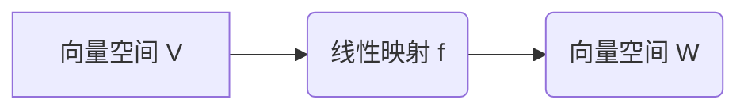

> 线性代数，矩阵，线性映射，向量空间，基底，线性变换，特征值，特征向量，应用场景

## 1. 背景介绍

线性代数作为数学领域的重要分支，为计算机科学、数据科学、人工智能等领域提供了强大的理论基础和工具。它以向量、矩阵和线性变换为核心概念，为解决各种复杂问题提供了简洁高效的框架。

在计算机科学中，线性代数应用广泛，例如：

* **图像处理和计算机视觉:** 图像可以表示为矩阵，线性代数算法可以用于图像变换、滤波、特征提取等操作。
* **机器学习和深度学习:** 线性代数是机器学习算法的基础，例如线性回归、逻辑回归、支持向量机等算法都依赖于矩阵运算。
* **数据分析和挖掘:** 线性代数可以用于数据降维、特征选择、聚类分析等数据挖掘任务。
* **图形学和游戏开发:** 线性代数用于处理三维图形的变换、投影、光照等操作。

## 2. 核心概念与联系

### 2.1 向量空间

向量空间是一个集合，其中元素称为向量，并满足以下条件：

* **加法封闭性:** 两个向量的和仍然属于该向量空间。
* **数乘封闭性:** 向量与标量相乘的结果仍然属于该向量空间。
* **结合律:** (u + v) + w = u + (v + w)
* **交换律:** u + v = v + u
* **零向量:** 存在一个零向量，满足 u + 0 = u
* **逆元:** 每个向量都有一个相反向量，满足 u + (-u) = 0

### 2.2 线性映射

线性映射是一种将一个向量空间映射到另一个向量空间的函数，它满足以下条件：

* **线性组合:** f(au + bv) = af(u) + bf(v) 其中，a, b 是标量，u, v 是向量。

### 2.3 矩阵

矩阵是一种数的排列，可以表示线性映射。

**Mermaid 流程图**



## 3. 核心算法原理 & 具体操作步骤

### 3.1 算法原理概述

线性代数算法的核心是利用矩阵和向量之间的运算关系，来解决各种线性问题。常见的线性代数算法包括：

* **矩阵加法和数乘:** 两个矩阵相加或乘以一个标量，其结果仍然是矩阵。
* **矩阵乘法:** 两个矩阵相乘，其结果是一个新的矩阵。
* **矩阵转置:** 将矩阵的行和列交换，得到一个新的矩阵。
* **矩阵逆:** 对于可逆矩阵，存在一个逆矩阵，满足 A * A^-1 = I，其中 I 是单位矩阵。
* **特征值和特征向量:** 对于一个方阵，存在一些特殊的向量和标量，满足 A * v = λ * v，其中 v 是特征向量，λ 是特征值。

### 3.2 算法步骤详解

以下以矩阵乘法为例，详细说明算法步骤：

1. **输入:** 两个矩阵 A 和 B。
2. **判断:** 检查矩阵 A 和 B 是否满足乘法条件，即 A 的列数等于 B 的行数。
3. **计算:** 
    * 创建一个新的矩阵 C，其行数等于 A 的行数，列数等于 B 的列数。
    * 对于 C 中的每个元素 c<sub>ij</sub>，计算 c<sub>ij</sub> = Σ(A<sub>i</sub>k * B<sub>k</sub>j)，其中 k 是从 1 到 A 的列数（或 B 的行数）。
4. **输出:** 返回矩阵 C。

### 3.3 算法优缺点

**优点:**

* **效率高:** 矩阵乘法算法可以利用计算机的并行计算能力，实现高效的运算。
* **通用性强:** 矩阵乘法是线性代数的基础运算，可以用于各种线性问题。

**缺点:**

* **计算量大:** 对于大型矩阵，矩阵乘法计算量很大。

### 3.4 算法应用领域

* **图像处理:** 图像可以表示为矩阵，矩阵乘法可以用于图像变换、滤波等操作。
* **机器学习:** 许多机器学习算法，例如神经网络，都依赖于矩阵乘法。
* **数据分析:** 矩阵乘法可以用于数据降维、特征选择等数据分析任务。

## 4. 数学模型和公式 & 详细讲解 & 举例说明

### 4.1 数学模型构建

线性代数的核心是向量空间和线性映射。

* **向量空间:**  一个集合 V，其中元素称为向量，并满足以下条件：
    * **加法封闭性:** 两个向量的和仍然属于该向量空间。
    * **数乘封闭性:** 向量与标量相乘的结果仍然属于该向量空间。
    * **结合律:** (u + v) + w = u + (v + w)
    * **交换律:** u + v = v + u
    * **零向量:** 存在一个零向量，满足 u + 0 = u
    * **逆元:** 每个向量都有一个相反向量，满足 u + (-u) = 0

* **线性映射:**  一个函数 f: V -> W，其中 V 和 W 是两个向量空间，满足以下条件：
    * **线性组合:** f(au + bv) = af(u) + bf(v) 其中，a, b 是标量，u, v 是向量。

### 4.2 公式推导过程

**矩阵乘法:**

设 A 是 m x n 矩阵，B 是 n x p 矩阵，则 A * B 是 m x p 矩阵。

A * B<sub>ij</sub> = Σ(A<sub>i</sub>k * B<sub>k</sub>j) 其中，k 是从 1 到 n。

**特征值和特征向量:**

对于一个方阵 A，存在一些特殊的向量 v 和标量 λ，满足 A * v = λ * v。

其中 v 是特征向量，λ 是特征值。

### 4.3 案例分析与讲解

**图像旋转:**

可以使用矩阵乘法实现图像旋转。旋转矩阵可以表示旋转角度和旋转中心。将图像矩阵与旋转矩阵相乘，可以得到旋转后的图像矩阵。

**线性回归:**

线性回归模型可以表示为 y = wx + b，其中 w 和 b 是模型参数，x 是输入特征，y 是输出结果。可以使用矩阵运算求解模型参数。

## 5. 项目实践：代码实例和详细解释说明

### 5.1 开发环境搭建

* **操作系统:** Linux, macOS, Windows
* **编程语言:** Python
* **库:** NumPy, SciPy

### 5.2 源代码详细实现

```python
import numpy as np

# 定义矩阵 A
A = np.array([[1, 2], [3, 4]])

# 定义矩阵 B
B = np.array([[5, 6], [7, 8]])

# 计算矩阵乘积 C = A * B
C = np.dot(A, B)

# 打印结果
print(C)
```

### 5.3 代码解读与分析

* `import numpy as np`: 导入 NumPy 库，用于进行矩阵运算。
* `A = np.array([[1, 2], [3, 4]])`: 创建一个 2x2 矩阵 A。
* `B = np.array([[5, 6], [7, 8]])`: 创建一个 2x2 矩阵 B。
* `C = np.dot(A, B)`: 使用 `np.dot()` 函数计算矩阵 A 和 B 的乘积，结果存储在矩阵 C 中。
* `print(C)`: 打印矩阵 C 的内容。

### 5.4 运行结果展示

```
[[19 22]
 [43 50]]
```

## 6. 实际应用场景

### 6.1 图像处理

* **图像旋转:** 使用旋转矩阵乘以图像矩阵，可以实现图像旋转。
* **图像缩放:** 使用缩放矩阵乘以图像矩阵，可以实现图像缩放。
* **图像滤波:** 使用卷积核矩阵与图像矩阵相乘，可以实现图像滤波。

### 6.2 机器学习

* **线性回归:** 使用矩阵运算求解线性回归模型参数。
* **逻辑回归:** 使用矩阵运算求解逻辑回归模型参数。
* **支持向量机:** 使用矩阵运算求解支持向量机模型参数。

### 6.3 数据分析

* **数据降维:** 使用奇异值分解等矩阵分解方法，可以将高维数据降维到低维空间。
* **特征选择:** 使用矩阵运算，可以对特征进行筛选，选择最相关的特征。
* **聚类分析:** 使用矩阵运算，可以计算数据点之间的距离，进行聚类分析。

### 6.4 未来应用展望

随着人工智能和机器学习的发展，线性代数在这些领域将发挥越来越重要的作用。例如：

* **深度学习:** 深度学习模型中广泛使用矩阵运算，例如卷积神经网络和循环神经网络。
* **自然语言处理:** 线性代数可以用于文本表示、文本分类等自然语言处理任务。
* **计算机视觉:** 线性代数可以用于图像识别、目标检测等计算机视觉任务。

## 7. 工具和资源推荐

### 7.1 学习资源推荐

* **书籍:**
    * 《线性代数及其应用》 - Gilbert Strang
    * 《线性代数及其应用》 - David C. Lay
* **在线课程:**
    * MIT OpenCourseWare: Linear Algebra
    * Coursera: Linear Algebra

### 7.2 开发工具推荐

* **NumPy:** Python 的数值计算库，提供高效的矩阵运算功能。
* **SciPy:** Python 的科学计算库，包含线性代数、优化、积分等模块。
* **Pandas:** Python 的数据分析库，可以用于处理和分析数据。

### 7.3 相关论文推荐

* **Eigenvalues and Eigenvectors:** https://en.wikipedia.org/wiki/Eigenvalue_and_eigenvector
* **Singular Value Decomposition:** https://en.wikipedia.org/wiki/Singular_value_decomposition

## 8. 总结：未来发展趋势与挑战

### 8.1 研究成果总结

线性代数已经取得了巨大的成就，为计算机科学、数据科学、人工智能等领域提供了强大的理论基础和工具。

### 8.2 未来发展趋势

* **更高效的算法:** 研究更高效的线性代数算法，例如并行计算、量子计算等。
* **更广泛的应用:** 将线性代数应用到更多领域，例如生物信息学、金融工程等。
* **更深入的理论研究:** 深入研究线性代数的理论基础，例如非线性代数、拓扑代数等。

### 8.3 面临的挑战

* **算法复杂度:** 一些线性代数问题具有很高的复杂度，例如求解大型稀疏矩阵的逆矩阵。
* **数据规模:** 随着数据规模的不断增长，线性代数算法需要能够处理海量数据。
* **理论理解:** 一些线性代数问题仍然存在理论上的挑战，需要进一步的研究和探索。

### 8.4 研究展望

未来，线性代数研究将继续朝着更高效、更广泛、更深入的方向发展，为解决更复杂的问题提供更强大的工具。

## 9. 附录：常见问题与解答

### 9.1 什么是线性变换？

线性变换是一种将向量空间映射到另一个向量空间的函数，它满足以下条件：

* **线性组合:** f(au + bv) = af(u) + bf(v) 其中，a, b 是标量，u, v 是向量。

### 9.2 如何计算矩阵的逆？

对于可逆矩阵，存在一个逆矩阵，满足 A * A^-1 = I，其中 I 是单位矩阵。可以使用高斯消元法或其他方法计算矩阵的逆。

### 9.3 什么是特征值和特征向量？

对于一个方阵 A，存在一些特殊的向量 v 和标量 λ，满足 A