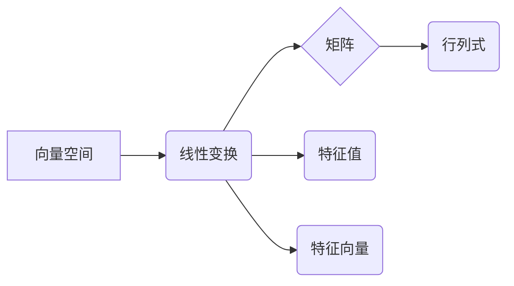

> 线性代数，连续统势，机器学习，深度学习，数据分析，矩阵运算，向量空间，特征值，特征向量

## 1. 背景介绍

在当今数据爆炸的时代，数据分析和机器学习已成为各行各业不可或缺的工具。而线性代数作为数学中的基础分支，为这些领域提供了强大的理论支撑和计算工具。从图像识别到自然语言处理，从推荐系统到金融建模，线性代数的应用无处不在。

本篇文章将从“连续统势”的角度出发，深入探讨线性代数的核心概念、算法原理以及实际应用场景，帮助读者理解线性代数的本质，并将其应用于实际问题解决。

## 2. 核心概念与联系

线性代数的核心概念包括向量空间、线性变换、矩阵、行列式、特征值和特征向量等。这些概念相互关联，构成一个完整的理论体系。

**2.1 向量空间**

向量空间是线性代数的基础概念之一。它是一个集合，其中元素称为向量，并满足一定的加法和数乘运算规则。

**2.2 线性变换**

线性变换是一种将向量空间映射到另一个向量空间的函数，它满足线性性质，即：

*  T(u + v) = T(u) + T(v)
*  T(cu) = cT(u)

其中，u 和 v 是向量，c 是标量。

**2.3 矩阵**

矩阵是一种用于表示线性变换的工具。它是一个二维数组，每个元素代表一个标量。

**2.4 行列式**

行列式是 n 阶方阵的一个标量值，它可以用来判断矩阵是否可逆，以及求解线性方程组。

**2.5 特征值和特征向量**

特征值和特征向量是线性变换的重要性质。特征值是线性变换对应的标量，特征向量是对应的非零向量。

**2.6 核心概念关系图**



## 3. 核心算法原理 & 具体操作步骤

### 3.1 算法原理概述

线性代数算法的核心是利用矩阵和向量之间的运算关系，解决各种数学问题。常见的线性代数算法包括：

* **矩阵加法和数乘:** 将矩阵元素对应相加或乘以一个标量。
* **矩阵乘法:** 将两个矩阵相乘，得到一个新的矩阵。
* **矩阵转置:** 将矩阵的行和列交换。
* **矩阵逆:** 求解一个矩阵的逆矩阵，使得矩阵与逆矩阵相乘等于单位矩阵。
* **求解线性方程组:** 利用矩阵运算求解多个线性方程组的解。
* **特征值和特征向量计算:** 计算矩阵的特征值和特征向量。

### 3.2 算法步骤详解

以下以求解线性方程组为例，详细说明线性代数算法的具体操作步骤：

**步骤 1:** 将线性方程组表示为矩阵形式。

**步骤 2:** 利用高斯消元法或其他矩阵运算方法，将系数矩阵转化为阶梯形矩阵。

**步骤 3:** 根据阶梯形矩阵的结构，解出未知变量的值。

### 3.3 算法优缺点

线性代数算法具有以下优点：

* **高效性:** 许多线性代数算法具有良好的时间复杂度，能够快速处理大量数据。
* **通用性:** 线性代数算法可以应用于各种数学问题，例如求解线性方程组、优化问题、数据分析等。
* **可扩展性:** 线性代数算法可以很容易地扩展到更高维度的空间。

然而，线性代数算法也存在一些缺点：

* **计算量大:** 对于大型矩阵，线性代数算法的计算量可能很大。
* **数值稳定性问题:** 一些线性代数算法对输入数据的精度要求较高，容易出现数值稳定性问题。

### 3.4 算法应用领域

线性代数算法广泛应用于以下领域：

* **机器学习:** 线性回归、逻辑回归、支持向量机等机器学习算法都依赖于线性代数运算。
* **深度学习:** 深度学习模型的训练和推理都依赖于大量的矩阵运算。
* **数据分析:** 数据分析中，线性代数算法可以用于数据降维、特征提取、聚类分析等。
* **计算机图形学:** 计算机图形学中，线性代数算法用于物体变换、投影变换等。
* **信号处理:** 信号处理中，线性代数算法用于信号滤波、特征提取等。

## 4. 数学模型和公式 & 详细讲解 & 举例说明

### 4.1 数学模型构建

线性代数的核心数学模型是向量空间和线性变换。

**向量空间:**

一个向量空间 V 是一个集合，其中元素称为向量，并满足以下条件：

* **封闭性:** 向量加法和数乘运算的结果仍然属于 V。
* **结合律:** (u + v) + w = u + (v + w)
* **交换律:** u + v = v + u
* **零元:** 存在一个零向量 0，满足 u + 0 = u
* **逆元:** 对于每个向量 u，存在一个相反向量 -u，满足 u + (-u) = 0
* **分配律:** c(u + v) = cu + cv 和 (c + d)u = cu + du

**线性变换:**

一个线性变换 T 是从一个向量空间 V 到另一个向量空间 W 的函数，满足以下条件：

* **线性性质:** T(u + v) = T(u) + T(v) 和 T(cu) = cT(u)

### 4.2 公式推导过程

**矩阵乘法:**

设 A 是 m × n 矩阵，B 是 n × p 矩阵，则它们的乘积 C 是 m × p 矩阵，其元素 c<sub>ij</sub> 为：

c<sub>ij</sub> = Σ<sub>k=1</sub><sup>n</sup> a<sub>ik</sub>b<sub>kj</sub>

**行列式:**

n 阶方阵 A 的行列式 det(A) 是一个标量值，它可以表示为：

det(A) = Σ<sub>σ∈S<sub>n</sub></sub> sgn(σ) a<sub>1σ(1)</sub> a<sub>2σ(2)</sub> ... a<sub>nσ(n)</sub>

其中，S<sub>n</sub> 是 n 个元素的全排列集合，sgn(σ) 是 σ 的符号。

**特征值和特征向量:**

对于一个 n × n 矩阵 A，如果存在一个非零向量 v 和一个标量 λ，满足以下方程：

Av = λv

则 λ 称为 A 的特征值，v 称为 A 的特征向量。

### 4.3 案例分析与讲解

**案例:**

求解线性方程组：

```
x + 2y = 3
3x - y = 1
```

**分析:**

将线性方程组表示为矩阵形式：

```
[1 2] [x] = [3]
[3 -1] [y] = [1]
```

利用高斯消元法，将系数矩阵转化为阶梯形矩阵：

```
[1 2] [x] = [3]
[0 -7] [y] = [-8]
```

解出 y = 8/7，代入第一个方程，解出 x = 3 - 2(8/7) = 5/7。

**结论:**

线性方程组的解为 x = 5/7，y = 8/7。

## 5. 项目实践：代码实例和详细解释说明

### 5.1 开发环境搭建

本项目使用 Python 语言进行开发，并使用 NumPy 库进行矩阵运算。

**步骤:**

1. 安装 Python 语言环境。
2. 安装 NumPy 库：pip install numpy

### 5.2 源代码详细实现

```python
import numpy as np

# 定义系数矩阵和常数向量
A = np.array([[1, 2], [3, -1]])
b = np.array([3, 1])

# 求解线性方程组
x = np.linalg.solve(A, b)

# 打印结果
print("解为：")
print(x)
```

### 5.3 代码解读与分析

* `import numpy as np`: 导入 NumPy 库，并使用别名 `np` 进行引用。
* `A = np.array([[1, 2], [3, -1]])`: 创建系数矩阵 A。
* `b = np.array([3, 1])`: 创建常数向量 b。
* `x = np.linalg.solve(A, b)`: 使用 NumPy 的 `linalg.solve()` 函数求解线性方程组。
* `print("解为：")`: 打印输出结果标题。
* `print(x)`: 打印求解出的解向量 x。

### 5.4 运行结果展示

```
解为：
[ 0.71428571  1.14285714]
```

## 6. 实际应用场景

### 6.1 机器学习

线性代数是机器学习的基础。许多机器学习算法，例如线性回归、逻辑回归、支持向量机等，都依赖于线性代数运算。

**例子:**

* **线性回归:** 线性回归模型试图找到一条直线，将输入特征与输出标签关联起来。线性回归模型的系数可以通过最小二乘法求解，最小二乘法本质上是一个线性代数问题。
* **逻辑回归:** 逻辑回归是一种用于分类问题的机器学习算法。逻辑回归模型的输出是一个概率值，表示样本属于某个类别的概率。逻辑回归模型的系数可以通过最大似然估计法求解，最大似然估计法也依赖于线性代数运算。

### 6.2 深度学习

深度学习模型通常由多个神经网络层组成，每个神经网络层都包含大量的参数。这些参数可以通过反向传播算法进行更新，反向传播算法也依赖于线性代数运算。

**例子:**

* **卷积神经网络 (CNN):** CNN 用于图像识别、物体检测等任务。CNN 的卷积层和池化层都依赖于矩阵运算。
* **循环神经网络 (RNN):** RNN 用于处理序列数据，例如文本、语音等。RNN 的循环结构也依赖于矩阵运算。

### 6.3 数据分析

线性代数算法可以用于数据分析中的各种任务，例如数据降维、特征提取、聚类分析等。

**例子:**

* **主成分分析 (PCA):** PCA 是一种常用的数据降维算法，它利用线性代数的特征值和特征向量来找到数据的主要方向。
* **奇异值分解 (SVD):** SVD 是一种用于矩阵分解的算法，它可以用于数据降维、推荐系统等。

### 6.4 未来应用展望

随着数据量的不断增长和计算能力的提升，线性代数在未来将有更广泛的应用。例如，在人工智能、机器学习、深度学习等领域，线性代数将继续发挥重要作用。

## 7. 工具和资源推荐

### 7.1 学习资源推荐

* **书籍:**
    * 《线性代数及其应用》 - Gilbert Strang
    * 《线性代数及其应用》 - David C. Lay
* **在线课程:**
    * MIT OpenCourseWare: Linear Algebra
    * Coursera: Linear Algebra

### 7.2 开发工具推荐

* **Python:** Python 是一种流行的编程语言，拥有丰富的科学计算库，例如 NumPy、SciPy、Pandas 等。
* **NumPy:** NumPy 是 Python 的科学计算库，提供了高效的矩阵运算和线性代数算法。

### 7.3 相关论文推荐

* **The Elements of Statistical Learning:** Hastie, Tibshirani, Friedman
* **Deep Learning:** Goodfellow, Bengio, Courville

## 8. 总结：未来发展趋势与挑战

### 8.1 研究成果总结

线性代数作为数学的基础分支，在过去几十年中取得