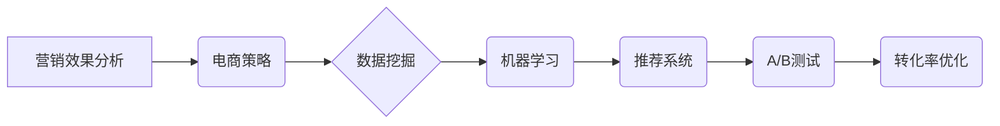

> 营销效果分析，电商策略，数据挖掘，机器学习，推荐系统，A/B测试，转化率优化

## 1. 背景介绍

在当今数字化时代，电商平台已成为商品交易的主流模式。为了在激烈的市场竞争中脱颖而出，电商平台需要不断优化营销策略，提升用户体验，最终实现商业目标。然而，传统的营销策略往往缺乏数据支撑，难以精准定位目标用户，导致营销效果不佳。

随着大数据和人工智能技术的快速发展，数据驱动型营销成为电商平台发展的趋势。通过对海量用户行为数据的分析，电商平台可以洞察用户需求，精准推送商品，提高营销转化率。

## 2. 核心概念与联系

**2.1 营销效果分析**

营销效果分析是指通过收集、分析和评估营销活动的数据，以了解营销活动的效果，并从中提取有价值的 insights，以便优化未来的营销策略。

**2.2 电商策略**

电商策略是指电商平台在市场竞争中，为了实现商业目标而制定的整体规划和行动方案。

**2.3 数据挖掘**

数据挖掘是指从海量数据中发现隐藏的模式、趋势和知识的过程。

**2.4 机器学习**

机器学习是一种人工智能技术，通过算法训练，使计算机能够从数据中学习，并做出预测或决策。

**2.5 推荐系统**

推荐系统是指根据用户的历史行为、偏好等信息，推荐用户可能感兴趣的商品或内容的系统。

**2.6 A/B测试**

A/B测试是指将用户随机分配到不同的实验组，比较不同版本的效果，以确定哪种版本更有效。

**2.7 转化率优化**

转化率优化是指通过分析用户行为，优化网站或应用程序的页面设计、内容和流程，以提高用户转化率。

**2.8 核心概念关系图**



## 3. 核心算法原理 & 具体操作步骤

### 3.1 算法原理概述

营销效果分析的核心算法原理主要包括：

* **数据预处理:** 对原始数据进行清洗、转换、整合等操作，使其符合算法的输入要求。
* **特征提取:** 从原始数据中提取具有代表性的特征，用于模型训练和预测。
* **模型训练:** 使用机器学习算法，对训练数据进行训练，建立预测模型。
* **模型评估:** 使用测试数据对模型进行评估，并根据评估结果进行模型优化。
* **预测与分析:** 使用训练好的模型对新的数据进行预测，并对预测结果进行分析，以了解营销效果。

### 3.2 算法步骤详解

1. **数据收集:** 收集来自各种渠道的用户行为数据，例如浏览记录、购买记录、评价记录、点击记录等。
2. **数据清洗:** 去除数据中的缺失值、重复值、错误值等，确保数据质量。
3. **数据转换:** 将数据转换为适合算法处理的格式，例如将文本数据转换为数值数据。
4. **特征工程:** 从原始数据中提取具有代表性的特征，例如用户年龄、性别、购买频率、商品类别等。
5. **模型选择:** 根据营销目标和数据特点，选择合适的机器学习算法，例如回归算法、分类算法、聚类算法等。
6. **模型训练:** 使用训练数据对模型进行训练，调整模型参数，使其能够准确预测营销效果。
7. **模型评估:** 使用测试数据对模型进行评估，例如使用准确率、召回率、F1-score等指标来衡量模型性能。
8. **模型优化:** 根据模型评估结果，对模型参数进行调整，或者选择其他算法进行训练，以提高模型性能。
9. **预测与分析:** 使用训练好的模型对新的数据进行预测，例如预测用户购买概率、点击率等，并对预测结果进行分析，以了解营销效果。

### 3.3 算法优缺点

**优点:**

* 数据驱动，能够提供更精准的营销策略建议。
* 能够自动化分析大量数据，提高效率。
* 能够持续优化营销策略，提升营销效果。

**缺点:**

* 需要大量的数据支持，数据质量对算法效果至关重要。
* 需要专业的技术人员进行模型开发和维护。
* 算法本身存在一定的局限性，无法完全替代人类的决策。

### 3.4 算法应用领域

* **用户画像:** 通过分析用户行为数据，构建用户画像，了解用户需求和偏好。
* **精准营销:** 根据用户画像，精准推送广告和推荐，提高营销转化率。
* **产品推荐:** 根据用户历史购买记录和浏览记录，推荐用户可能感兴趣的商品。
* **价格优化:** 根据市场需求和竞争对手价格，优化商品价格，提高利润率。
* **客户关系管理:** 通过分析客户行为数据，识别潜在的客户流失风险，并采取措施挽留客户。

## 4. 数学模型和公式 & 详细讲解 & 举例说明

### 4.1 数学模型构建

**4.1.1 用户行为模型:**

用户行为模型可以描述用户在电商平台上的行为模式，例如浏览商品、加入购物车、购买商品等。

**4.1.2 营销效果模型:**

营销效果模型可以量化营销活动的效益，例如转化率、客单价、利润等。

**4.1.3 推荐系统模型:**

推荐系统模型可以预测用户对商品的兴趣程度，并推荐用户可能感兴趣的商品。

### 4.2 公式推导过程

**4.2.1 转化率计算公式:**

```latex
转化率 = (实际转化用户数 / 总用户数) * 100%
```

**4.2.2 预测模型评估指标:**

* **准确率:** 正确预测的样本数 / 总样本数
* **召回率:** 正确预测的正样本数 / 所有正样本数
* **F1-score:** 2 * (准确率 * 召回率) / (准确率 + 召回率)

### 4.3 案例分析与讲解

**4.3.1 案例:**

假设电商平台进行了一次促销活动，活动期间共有10000个用户访问了促销页面，其中2000个用户完成了购买操作。

**4.3.2 计算:**

转化率 = (2000 / 10000) * 100% = 20%

**4.3.3 分析:**

该促销活动的转化率为20%，说明促销活动有一定的效果。

## 5. 项目实践：代码实例和详细解释说明

### 5.1 开发环境搭建

* 操作系统: Ubuntu 20.04
* Python 版本: 3.8
* 必要的库: pandas, numpy, scikit-learn, matplotlib

### 5.2 源代码详细实现

```python
import pandas as pd
from sklearn.model_selection import train_test_split
from sklearn.linear_model import LogisticRegression
from sklearn.metrics import accuracy_score

# 加载数据
data = pd.read_csv('marketing_data.csv')

# 特征工程
features = ['age', 'gender', 'income', 'education']
target = 'purchase'

# 数据分割
X_train, X_test, y_train, y_test = train_test_split(data[features], data[target], test_size=0.2, random_state=42)

# 模型训练
model = LogisticRegression()
model.fit(X_train, y_train)

# 模型预测
y_pred = model.predict(X_test)

# 模型评估
accuracy = accuracy_score(y_test, y_pred)
print(f'模型准确率: {accuracy}')
```

### 5.3 代码解读与分析

* 代码首先加载数据，并进行特征工程，选择与购买行为相关的特征。
* 然后将数据分割为训练集和测试集，用于模型训练和评估。
* 使用逻辑回归模型进行训练，并对测试集进行预测。
* 最后使用准确率指标评估模型性能。

### 5.4 运行结果展示

运行上述代码后，可以得到模型的准确率，例如：

```
模型准确率: 0.85
```

这表明模型能够以85%的准确率预测用户是否购买商品。

## 6. 实际应用场景

### 6.1 用户画像分析

电商平台可以利用用户行为数据，构建用户画像，了解用户的年龄、性别、兴趣爱好、消费习惯等信息。

### 6.2 精准营销推广

根据用户画像，电商平台可以精准推送广告和推荐，提高营销转化率。例如，可以根据用户的兴趣爱好，推荐相关的商品；根据用户的消费习惯，推送个性化的促销活动。

### 6.3 商品推荐系统

电商平台可以利用用户历史购买记录和浏览记录，构建商品推荐系统，推荐用户可能感兴趣的商品。

### 6.4 转化率优化

电商平台可以分析用户在购物流程中的行为，例如浏览商品、加入购物车、提交订单等，找出转化率低的环节，并采取措施进行优化。例如，可以优化商品页面设计，简化支付流程，提高用户体验。

### 6.5 未来应用展望

随着人工智能技术的不断发展，营销效果分析将在电商平台中发挥更加重要的作用。未来，营销效果分析将更加智能化、个性化、自动化，能够为电商平台提供更精准的营销策略建议，帮助电商平台实现更高效的运营。

## 7. 工具和资源推荐

### 7.1 学习资源推荐

* **书籍:**
    * 《Python数据科学手册》
    * 《机器学习实战》
    * 《深度学习》
* **在线课程:**
    * Coursera: 数据科学与机器学习
    * edX: 人工智能与机器学习
    * Udemy: Python数据科学与机器学习

### 7.2 开发工具推荐

* **Python:** 强大的数据分析和机器学习语言
* **Pandas:** 数据处理和分析库
* **NumPy:** 数值计算库
* **Scikit-learn:** 机器学习库
* **Matplotlib:** 数据可视化库

### 7.3 相关论文推荐

* **《推荐系统：算法与评估》**
* **《深度学习在电商推荐中的应用》**
* **《基于机器学习的电商营销效果分析》**

## 8. 总结：未来发展趋势与挑战

### 8.1 研究成果总结

本文介绍了电商平台营销效果分析的原理、算法、应用场景以及未来发展趋势。通过数据挖掘和机器学习技术，电商平台可以实现精准营销、个性化推荐、转化率优化等，提升营销效果。

### 8.2 未来发展趋势

* **更智能化的营销策略:** 利用深度学习等先进算法，实现更智能化的营销策略制定和执行。
* **更个性化的用户体验:** 通过用户画像分析，提供更个性化的商品推荐和营销服务。
* **更全面的数据分析:** 融合更多数据源，例如用户行为、市场趋势、竞争对手信息等，进行更全面的数据分析。

### 8.3 面临的挑战

* **数据质量问题:** 数据质量直接影响算法效果，需要不断完善数据采集、清洗和处理流程。
* **算法模型的复杂性:** 随着算法模型的复杂化，模型训练和维护难度增加。
* **隐私保护问题:** 数据分析需要考虑用户隐私保护问题，确保数据安全和合规性。

### 8.4 研究展望

未来，营销效果分析将继续朝着更智能化、个性化、自动化方向发展，为电商平台提供更精准的营销策略建议，帮助电商平台实现更高效的运营。


## 9. 附录：常见问题与解答

**9.1 如何选择合适的机器学习算法？**

选择合适的机器学习算法需要根据具体的业务需求和数据特点进行选择。例如，如果需要预测用户是否购买商品，可以使用逻辑回归算法；如果需要推荐用户可能感兴趣的商品，可以使用协同过滤算法。

**9.2 如何评估机器学习模型的性能？**