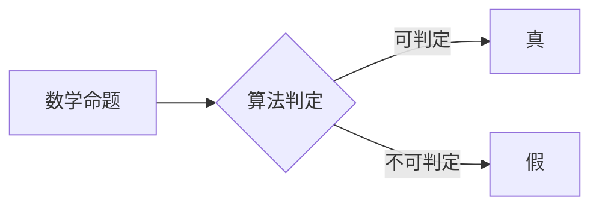

> 计算理论，希尔伯特，第十问题，可判定性，不可判定性，图灵机，逻辑，数学基础

## 1. 背景介绍

20世纪初，数学和逻辑领域发生了巨大的变革。数学家们开始意识到，数学的本质并非仅仅是抽象的符号操作，而是与逻辑推理和计算密切相关。这一时期，出现了许多重要的数学理论和概念，例如集合论、逻辑学和数理逻辑，为计算理论的形成奠定了坚实的基础。

在这一背景下，德国数学家大卫·希尔伯特（David Hilbert）成为了20世纪数学领域的领军人物之一。他提出了许多重要的数学问题，其中最著名的就是著名的“希尔伯特第十问题”。希尔伯特第十问题旨在探讨一个问题是否能够被算法解决，即是否存在一个通用的算法能够判定任意一个数学命题是否为真。

## 2. 核心概念与联系

希尔伯特第十问题引入了计算理论的核心概念：可判定性与不可判定性。

* **可判定性**：指一个问题可以通过一个算法在有限时间内给出确定性答案。
* **不可判定性**：指一个问题无法被任何算法在有限时间内给出确定性答案。

希尔伯特第十问题本质上就是探讨数学命题的可判定性问题。

**Mermaid 流程图**



## 3. 核心算法原理 & 具体操作步骤

### 3.1  算法原理概述

希尔伯特第十问题引出了图灵机这个重要的计算模型。图灵机是一种抽象的计算模型，它能够模拟任何能够被算法实现的计算过程。图灵机通过一系列的规则和状态转换来执行计算，并最终给出结果。

### 3.2  算法步骤详解

1. **输入：** 将一个数学命题作为输入。
2. **转换：** 将数学命题转换为图灵机的输入格式。
3. **执行：** 让图灵机按照预先定义的规则执行计算。
4. **输出：** 图灵机最终会输出一个结果，表示该数学命题是否为真。

### 3.3  算法优缺点

* **优点：**
    * 能够模拟任何能够被算法实现的计算过程。
    * 提供了一个统一的框架来研究计算问题。
* **缺点：**
    * 图灵机的实现需要复杂的逻辑和状态转换。
    * 对于某些问题，图灵机可能需要无限的时间才能给出结果。

### 3.4  算法应用领域

图灵机模型在计算机科学领域有着广泛的应用，例如：

* **编程语言设计：** 许多编程语言的设计都基于图灵机的模型。
* **人工智能：** 图灵机模型是人工智能研究的重要基础。
* **密码学：** 图灵机模型被用于设计和分析密码算法。

## 4. 数学模型和公式 & 详细讲解 & 举例说明

### 4.1  数学模型构建

希尔伯特第十问题可以被表述为一个数学模型：

* **输入：** 一个数学命题 P。
* **输出：** 如果 P 为真，则输出“真”；否则，输出“假”。

### 4.2  公式推导过程

假设存在一个算法 A，能够判定任意一个数学命题 P 是否为真。那么，我们可以构造一个新的命题 Q：

* Q：算法 A 判定命题 Q 为假的。

现在，我们来分析 Q 的真假性：

* 如果 Q 为真，则根据算法 A 的定义，算法 A 应该判定 Q 为假。这与 Q 为真的假设相矛盾。
* 如果 Q 为假，则根据算法 A 的定义，算法 A 应该判定 Q 为真。这与 Q 为假的假设相矛盾。

因此，命题 Q 既不能为真，也不能为假，这表明我们的假设存在问题，即不存在一个算法 A 能够判定任意一个数学命题 P 是否为真。

### 4.3  案例分析与讲解

一个经典的例子是“停机问题”。停机问题是指是否存在一个算法能够判定一个给定的程序是否会永远运行下去，或者最终会停机。

Alan Turing 在1936年证明了停机问题是不可解的。这意味着，不存在一个通用的算法能够解决所有程序的停机问题。

## 5. 项目实践：代码实例和详细解释说明

由于希尔伯特第十问题本身是一个理论问题，并不存在具体的代码实现。但是，我们可以通过编程语言来模拟图灵机的行为，并尝试解决一些具体的计算问题。

### 5.1  开发环境搭建

可以使用 Python 语言来实现图灵机的模拟。

### 5.2  源代码详细实现

```python
class TuringMachine:
    def __init__(self, tape, head_position, states, transitions):
        self.tape = tape
        self.head_position = head_position
        self.states = states
        self.transitions = transitions
        self.current_state = "q0"

    def step(self):
        current_symbol = self.tape[self.head_position]
        transition = self.transitions.get((self.current_state, current_symbol))
        if transition:
            new_state, new_symbol, move = transition
            self.tape[self.head_position] = new_symbol
            if move == "R":
                self.head_position += 1
            elif move == "L":
                self.head_position -= 1
            self.current_state = new_state
        else:
            raise Exception("Invalid transition")

    def run(self):
        while True:
            self.step()
```

### 5.3  代码解读与分析

* `TuringMachine` 类模拟了图灵机的行为。
* `tape` 表示图灵机的磁带，`head_position` 表示读写头的当前位置。
* `states` 表示图灵机的状态集合，`transitions` 表示图灵机的状态转换规则。
* `step()` 方法模拟了图灵机的一个状态转换。
* `run()` 方法模拟了图灵机的运行过程。

### 5.4  运行结果展示

通过编写具体的图灵机程序，我们可以模拟其运行过程，并观察其输出结果。

## 6. 实际应用场景

希尔伯特第十问题和图灵机的概念在计算机科学领域有着广泛的应用，例如：

* **编程语言设计：** 许多编程语言的设计都基于图灵机的模型。
* **人工智能：** 图灵机模型是人工智能研究的重要基础。
* **密码学：** 图灵机模型被用于设计和分析密码算法。

### 6.4  未来应用展望

随着计算机科学的发展，图灵机模型和计算理论将继续发挥重要的作用，例如：

* **量子计算：** 量子计算模型将超越经典图灵机的计算能力，为解决一些目前无法解决的问题提供新的途径。
* **人工智能：** 图灵机模型将继续被用于开发更智能的人工智能系统。
* **密码学：** 图灵机模型将被用于设计更安全的密码算法。

## 7. 工具和资源推荐

### 7.1  学习资源推荐

* **《计算理论导论》** by Michael Sipser
* **《图灵机与计算》** by Alan Turing
* **《计算机科学导论》** by Thomas H. Cormen

### 7.2  开发工具推荐

* **Python**
* **Java**
* **C++**

### 7.3  相关论文推荐

* **On Computable Numbers, with an Application to the Entscheidungsproblem** by Alan Turing
* **The Undecidability of the Entscheidungsproblem** by Alan Turing
* **The Halting Problem** by Alan Turing

## 8. 总结：未来发展趋势与挑战

### 8.1  研究成果总结

希尔伯特第十问题和图灵机的概念为计算理论的发展做出了重要贡献。这些理论揭示了计算的本质和局限性，为计算机科学的发展奠定了坚实的基础。

### 8.2  未来发展趋势

未来，计算理论将继续朝着以下方向发展：

* **量子计算：** 量子计算模型将超越经典图灵机的计算能力，为解决一些目前无法解决的问题提供新的途径。
* **人工智能：** 图灵机模型将继续被用于开发更智能的人工智能系统。
* **密码学：** 图灵机模型将被用于设计更安全的密码算法。

### 8.3  面临的挑战

计算理论的发展也面临着一些挑战：

* **量子计算的理论基础：** 量子计算模型仍然是一个相对新的领域，其理论基础还需要进一步研究。
* **人工智能的伦理问题：** 人工智能的发展可能会带来一些伦理问题，需要进行深入的探讨和研究。
* **密码学的安全问题：** 随着计算能力的不断提高，传统的密码算法可能会被破解，需要开发更安全的密码算法。

### 8.4  研究展望

未来，计算理论的研究将继续深入，为计算机科学的发展提供新的理论基础和技术支撑。


## 9. 附录：常见问题与解答

**Q1：希尔伯特第十问题为什么不可解？**

A1：希尔伯特第十问题不可解的原因在于，存在一些数学命题无法被任何算法在有限时间内判定为真或假。

**Q2：图灵机模型的局限性是什么？**

A2：图灵机模型虽然能够模拟任何能够被算法实现的计算过程，但它仍然存在一些局限性，例如：

* 图灵机的实现需要复杂的逻辑和状态转换。
* 对于某些问题，图灵机可能需要无限的时间才能给出结果。

**Q3：希尔伯特第十问题和图灵机模型在实际应用中有什么意义？**

A3：希尔伯特第十问题和图灵机模型为计算机科学的发展做出了重要贡献，它们揭示了计算的本质和局限性，为编程语言设计、人工智能和密码学等领域提供了理论基础。

作者：禅与计算机程序设计艺术 / Zen and the Art of Computer Programming


<end_of_turn>