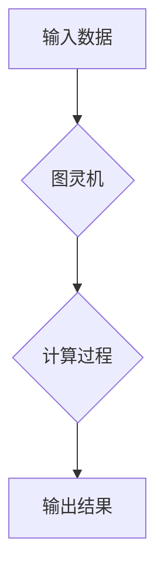

> 计算不可判定性，哥德尔不完备性定理，图灵机，逻辑推理，算法复杂度，人工智能，计算极限

## 1. 背景介绍

自人类开始思考计算的本质以来，我们一直试图用更抽象、更通用的方式来描述计算过程。从亚里士多德的逻辑演绎到现代计算机的二进制运算，我们不断地探索计算的边界，试图找到一个能够囊括所有计算问题的通用模型。

20世纪初，图灵机应运而生，它以其简洁的定义和强大的计算能力，成为了现代计算机科学的基石。图灵机为我们提供了描述计算过程的抽象模型，并为我们指明了计算的本质：通过一系列有限的规则，将输入数据变换为输出结果。

然而，即使是如此强大的计算模型，也无法解决所有问题。哥德尔不完备性定理的提出，揭示了计算的局限性，告诉我们，有些问题是无法用任何算法来解决的。

## 2. 核心概念与联系

### 2.1 哥德尔不完备性定理

哥德尔不完备性定理是20世纪数学领域最重要的成果之一，它揭示了任何一个足够强大的逻辑系统，都存在着无法被该系统证明的真命题。换句话说，任何一个逻辑系统都无法包含所有可能的真命题。

### 2.2 计算不可判定性

计算不可判定性是指，对于某些问题，不存在任何算法能够在有限时间内给出正确答案。哥德尔不完备性定理为计算不可判定性提供了理论基础。

### 2.3 图灵机

图灵机是一种抽象的计算模型，它由一个无限长的带、一个读写头和一个状态机组成。图灵机通过一系列有限的规则，将输入数据变换为输出结果。图灵机能够模拟任何计算机，因此它成为了现代计算机科学的基石。

**Mermaid 流程图**

## 3. 核心算法原理 & 具体操作步骤

### 3.1 算法原理概述

哥德尔不完备性定理证明了计算的局限性，它告诉我们，有些问题是无法用任何算法来解决的。这些问题被称为“不可判定问题”。不可判定问题通常涉及到逻辑推理、证明论证等领域，它们往往具有复杂的结构和高度的抽象性。

### 3.2 算法步骤详解

由于不可判定问题无法用算法解决，因此我们无法给出具体的算法步骤。

### 3.3 算法优缺点

不可判定问题本身并不具备优缺点，因为它们无法被算法解决。

### 3.4 算法应用领域

不可判定问题在理论计算机科学、逻辑学、哲学等领域具有重要的意义。它们帮助我们理解计算的边界，并探索人类认知能力的极限。

## 4. 数学模型和公式 & 详细讲解 & 举例说明

### 4.1 数学模型构建

哥德尔不完备性定理可以用数学模型来描述。

**定义：**

* **符号系统：** 一个符号系统由符号集和符号之间的组合规则组成。
* **公式：** 一个公式是由符号系统中的符号按照组合规则生成的表达式。
* **证明：** 一个证明是一个从已知公式推导出目标公式的一系列逻辑推理步骤。

**定理：**

任何一个足够强大的符号系统，都存在着无法被该系统证明的真命题。

### 4.2 公式推导过程

哥德尔不完备性定理的证明过程非常复杂，涉及到数理逻辑、集合论等高级数学知识。

### 4.3 案例分析与讲解

一个简单的例子可以帮助我们理解哥德尔不完备性定理的含义。

假设我们有一个符号系统，它能够表达所有关于自然数的真命题。那么，我们可以用这个符号系统来表达一个关于自身命题的真命题，例如：

“这个命题是不可证明的”。

如果这个命题是可证明的，那么它就意味着它本身是可证伪的，这与它的内容相矛盾。如果这个命题是不可证明的，那么它就意味着它本身是真命题，这与哥德尔不完备性定理的结论相符。

## 5. 项目实践：代码实例和详细解释说明

由于不可判定问题无法用算法解决，因此我们无法给出具体的代码实例。

## 6. 实际应用场景

哥德尔不完备性定理在人工智能领域具有重要的意义。它告诉我们，即使是拥有强大计算能力的人工智能，也无法解决所有问题。

### 6.4 未来应用展望

随着人工智能技术的不断发展，哥德尔不完备性定理将继续影响着人工智能的未来发展。它将帮助我们更好地理解人工智能的局限性，并引导我们探索新的人工智能发展方向。

## 7. 工具和资源推荐

### 7.1 学习资源推荐

* 《Gödel, Escher, Bach: An Eternal Golden Braid》 by Douglas Hofstadter
* 《The Undecidable》 by Alan Turing
* 《Logicomix: An Epic Search for Truth》 by Apostolos Doxiadis and Christos H. Papadimitriou

### 7.2 开发工具推荐

* Coq
* Isabelle/HOL

### 7.3 相关论文推荐

* “On Formally Undecidable Propositions of Principia Mathematica and Related Systems” by Kurt Gödel
* “On Computable Numbers, with an Application to the Entscheidungsproblem” by Alan Turing

## 8. 总结：未来发展趋势与挑战

### 8.1 研究成果总结

哥德尔不完备性定理是20世纪数学领域最重要的成果之一，它揭示了计算的局限性，并为我们提供了理解人工智能局限性的重要理论基础。

### 8.2 未来发展趋势

未来，研究人员将继续探索哥德尔不完备性定理的应用，并试图找到新的方法来解决不可判定问题。

### 8.3 面临的挑战

哥德尔不完备性定理的证明过程非常复杂，并且涉及到许多高级数学知识。因此，理解和应用哥德尔不完备性定理仍然是一个巨大的挑战。

### 8.4 研究展望

未来，我们将继续探索哥德尔不完备性定理的奥秘，并将其应用于人工智能、逻辑学、哲学等领域，以更好地理解计算的本质和人类认知能力的极限。

## 9. 附录：常见问题与解答

**问题：** 哥德尔不完备性定理证明了所有问题都是不可解的吗？

**答案：** 不，哥德尔不完备性定理只证明了某些问题是不可解的，即存在一些问题无法用任何算法在有限时间内给出正确答案。

**问题：** 哥德尔不完备性定理对人工智能有什么影响？

**答案：** 哥德尔不完备性定理告诉我们，即使是拥有强大计算能力的人工智能，也无法解决所有问题。它提醒我们人工智能的局限性，并引导我们探索新的人工智能发展方向。

作者：禅与计算机程序设计艺术 / Zen and the Art of Computer Programming 
<end_of_turn>