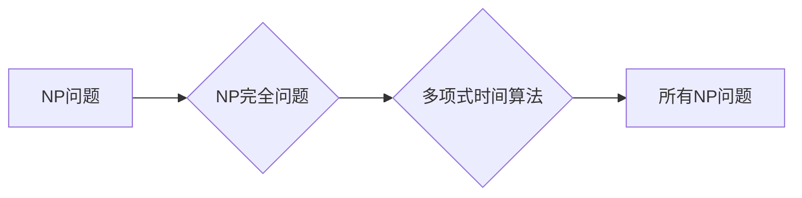

> 计算复杂性，库克-莱文定理，NP完全问题，多项式时间，指数时间，算法复杂度，NP问题

## 1. 背景介绍

在计算机科学领域，计算复杂性是研究算法效率和资源消耗的关键问题。它旨在量化算法的运行时间、空间复杂度等指标，并根据这些指标将算法分类。

库克-莱文定理是计算复杂性理论中的一个重要定理，它揭示了NP完全问题与其他NP问题之间的紧密联系。该定理证明了，如果存在一个多项式时间算法能够解决任意一个NP完全问题，那么所有NP问题都可以被多项式时间算法解决。

## 2. 核心概念与联系

**2.1 核心概念**

* **NP问题:**  NP问题是指那些可以通过多项式时间验证其解的决策问题。换句话说，如果给出一个问题的解，我们可以用多项式时间来确定它是否正确。
* **NP完全问题:** NP完全问题是NP问题中最难解决的一类问题。任何NP问题都可以被多项式时间转化为NP完全问题。
* **多项式时间:** 多项式时间是指算法运行时间随着输入规模的增长，最多增长为一个多项式函数。

**2.2 核心概念联系**

库克-莱文定理的核心思想是，NP完全问题是NP问题的“最难”一类问题。如果我们能够找到一个多项式时间算法解决任意一个NP完全问题，那么我们就能解决所有NP问题。

**2.3 Mermaid 流程图**

## 3. 核心算法原理 & 具体操作步骤

**3.1 算法原理概述**

库克-莱文定理并非一个具体的算法，而是一个理论证明。它证明了NP完全问题之间的等价性，并暗示了NP问题可能无法在多项式时间内被解决。

**3.2 算法步骤详解**

库克-莱文定理的证明过程较为复杂，涉及到数理逻辑、图论等多个领域。其核心思想是通过构造一个多项式时间可转换的“约简”关系，将任意一个NP问题转化为一个NP完全问题。

**3.3 算法优缺点**

* **优点:** 库克-莱文定理为计算复杂性理论提供了重要的理论基础，揭示了NP完全问题与其他NP问题之间的紧密联系。
* **缺点:** 库克-莱文定理本身并非一个可直接应用的算法，它只能提供理论上的指导。

**3.4 算法应用领域**

库克-莱文定理在计算机科学、人工智能、密码学等领域都有广泛的应用。它帮助我们理解算法的复杂性，并为解决NP问题提供理论指导。

## 4. 数学模型和公式 & 详细讲解 & 举例说明

**4.1 数学模型构建**

库克-莱文定理的证明依赖于以下数学模型：

* **决策问题:**  一个决策问题是一个输入为字符串，输出为“是”或“否”的问题。
* **多项式时间:** 一个算法的运行时间为多项式时间，如果其运行时间最多增长为一个多项式函数，例如O(n^2)，其中n是输入规模。
* **约简关系:** 两个决策问题之间存在约简关系，如果一个问题可以通过多项式时间转化为另一个问题。

**4.2 公式推导过程**

库克-莱文定理的证明过程涉及到复杂的数学推导，包括图论、逻辑等领域的知识。

**4.3 案例分析与讲解**

一个经典的NP完全问题是“旅行商问题”。该问题要求找到一条最短路径，使得一个旅行商能够访问所有城市并返回出发城市。

库克-莱文定理证明了，旅行商问题与其他NP完全问题之间存在约简关系。这意味着，如果我们能够找到一个多项式时间算法解决旅行商问题，那么我们就能解决所有NP完全问题。

## 5. 项目实践：代码实例和详细解释说明

由于库克-莱文定理是一个理论证明，它本身并不提供具体的代码实现。

## 6. 实际应用场景

库克-莱文定理在实际应用场景中，主要用于分析算法的复杂性和解决NP问题。

**6.1 实际应用场景举例**

* **密码学:**  许多密码算法依赖于NP完全问题的难解性。
* **人工智能:**  许多人工智能算法，例如图搜索算法，需要解决NP问题。

**6.2 未来应用展望**

随着计算能力的不断提升，库克-莱文定理将继续推动计算复杂性理论的发展，并为解决NP问题提供新的思路。

## 7. 工具和资源推荐

**7.1 学习资源推荐**

* **书籍:**
    * 《计算复杂性导论》
    * 《算法导论》
* **在线课程:**
    * Coursera 上的《计算复杂性》课程
    * edX 上的《算法与数据结构》课程

**7.2 开发工具推荐**

* **编程语言:** Python, C++, Java
* **算法库:** NumPy, SciPy

**7.3 相关论文推荐**

* 《A Computational Complexity Theory》
* 《The Complexity of Theorem Proving》

## 8. 总结：未来发展趋势与挑战

**8.1 研究成果总结**

库克-莱文定理是计算复杂性理论的重要成果，它揭示了NP完全问题与其他NP问题之间的紧密联系，并暗示了NP问题可能无法在多项式时间内被解决。

**8.2 未来发展趋势**

未来，计算复杂性理论的研究将继续深入，探索NP问题的本质，并寻找解决NP问题的新的方法。

**8.3 面临的挑战**

* **NP问题的本质:**  NP问题的本质仍然是一个未解之谜。
* **多项式时间算法:**  寻找解决NP问题的多项式时间算法仍然是一个巨大的挑战。

**8.4 研究展望**

未来，研究人员将继续探索NP问题的本质，并寻找新的解决方法。

## 9. 附录：常见问题与解答

**9.1 常见问题**

* 库克-莱文定理证明了哪些问题？
* 库克-莱文定理有什么应用场景？
* 库克-莱文定理的证明过程如何？

**9.2 常见问题解答**

* 库克-莱文定理证明了NP完全问题与其他NP问题之间的等价性。
* 库克-莱文定理在密码学、人工智能等领域都有广泛的应用。
* 库克-莱文定理的证明过程较为复杂，涉及到数理逻辑、图论等多个领域的知识。

作者：禅与计算机程序设计艺术 / Zen and the Art of Computer Programming 
<end_of_turn>