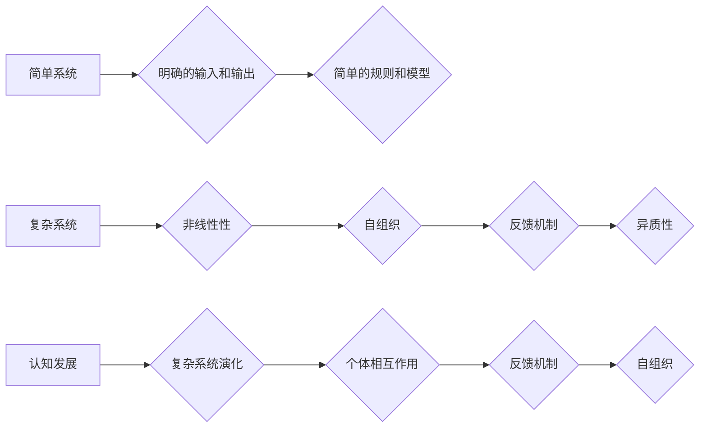

> 认知发展，简单系统，复杂系统，自组织，网络，人工智能，学习，进化

## 1. 背景介绍

认知发展是一个复杂而引人入胜的领域，它涉及到人类从出生到成熟的思维过程，以及我们如何理解世界、解决问题和创造新事物。从简单的反射动作到复杂的抽象思考，认知发展是一个不断演化的过程，它受到生物学、心理学、神经科学等多学科的影响。

近年来，复杂系统理论为理解认知发展提供了新的视角。复杂系统理论认为，认知系统并非简单的机械装置，而是由相互关联的众多个体组成的网络，这些个体通过相互作用和反馈机制形成复杂的整体行为。

## 2. 核心概念与联系

**2.1 简单系统与复杂系统**

简单系统通常具有明确的输入和输出，其行为可以通过简单的规则和模型来预测。例如，一个简单的机械钟，其行为可以由简单的物理定律和机械结构来解释。

复杂系统则具有以下特征：

* **非线性性:** 复杂系统的输出与其输入之间并非简单的比例关系，微小的变化可能导致巨大的影响。
* **自组织:** 复杂系统能够从简单的规则和初始条件中自发地组织成复杂的结构和模式。
* **反馈机制:** 复杂系统内部存在着反馈机制，即输出会反馈到输入，从而影响系统的行为。
* **异质性:** 复杂系统由多种不同类型的个体组成，这些个体具有不同的特性和行为。

**2.2 认知发展与复杂系统**

认知发展可以看作是一个复杂系统的演化过程。

* **个体:** 认知系统中的个体可以是神经元、脑区、认知模块等。
* **相互作用:** 这些个体通过神经递质、突触连接、活动模式等方式相互作用。
* **反馈机制:** 认知活动会产生反馈，影响后续的认知过程。
* **自组织:** 随着个体之间的相互作用和反馈机制的不断调整，认知系统会自发地组织成越来越复杂的结构和功能。

**2.3  Mermaid 流程图**



## 3. 核心算法原理 & 具体操作步骤

**3.1 算法原理概述**

在认知发展研究中，许多算法被用来模拟和解释认知过程。例如，神经网络算法可以用来模拟大脑的结构和功能，支持向量机算法可以用来分类和识别认知模式，遗传算法可以用来优化认知策略。

**3.2 算法步骤详解**

以神经网络算法为例，其基本步骤如下：

1. **构建神经网络结构:** 根据任务需求，定义神经网络的层数、节点数和连接方式。
2. **初始化权重:** 为神经网络中的连接赋予初始权重，这些权重决定了信号在网络中传播的方式。
3. **输入数据:** 将训练数据输入到神经网络中。
4. **前向传播:** 将输入数据通过神经网络层层传递，计算每个节点的激活值。
5. **反向传播:** 计算输出结果与目标值的误差，并根据误差调整神经网络的权重。
6. **迭代训练:** 重复步骤3-5，直到网络的性能达到预设标准。

**3.3 算法优缺点**

* **优点:** 神经网络算法能够学习复杂的非线性关系，并具有强大的泛化能力。
* **缺点:** 神经网络算法训练过程复杂，需要大量的训练数据和计算资源。

**3.4 算法应用领域**

神经网络算法在图像识别、自然语言处理、语音识别等领域有着广泛的应用。

## 4. 数学模型和公式 & 详细讲解 & 举例说明

**4.1 数学模型构建**

认知发展可以被建模为一个动态系统，其中个体之间的相互作用和反馈机制导致系统的演化。

**4.2 公式推导过程**

例如，我们可以使用微分方程来描述个体之间的相互作用和系统演化的速度。

**4.3 案例分析与讲解**

我们可以通过分析特定认知任务的数学模型，来理解认知过程背后的机制。例如，我们可以使用博弈论来分析决策过程，使用信息论来分析知识的获取和传播。

## 5. 项目实践：代码实例和详细解释说明

**5.1 开发环境搭建**

可以使用Python语言和相关的库来实现认知发展模型的仿真。

**5.2 源代码详细实现**

```python
# 这是一个简单的认知发展模型的代码示例
import numpy as np

# 定义个体之间的相互作用规则
def interaction_rule(x, y):
  return x + y

# 定义系统演化的规则
def evolution_rule(state, interaction_rule):
  new_state = np.zeros_like(state)
  for i in range(len(state)):
    for j in range(len(state)):
      if i != j:
        new_state[i] += interaction_rule(state[i], state[j])
  return new_state

# 初始化系统状态
state = np.random.rand(10)

# 迭代演化
for i in range(100):
  state = evolution_rule(state, interaction_rule)

# 打印最终状态
print(state)
```

**5.3 代码解读与分析**

这段代码定义了一个简单的认知发展模型，其中个体之间的相互作用规则是简单的加法，系统演化的规则是将所有个体之间的相互作用结果累加到每个个体上。

**5.4 运行结果展示**

运行这段代码后，会输出一个10维的数组，表示系统最终的状态。

## 6. 实际应用场景

认知发展理论和复杂系统理论的结合，为理解和解决许多实际问题提供了新的视角。例如，

* **教育:** 可以根据学生的认知发展水平，设计更有效的教学方法。
* **人工智能:** 可以借鉴认知发展过程中的机制，开发更智能的人工智能系统。
* **社会科学:** 可以理解社会群体行为的复杂性，预测社会趋势。

**6.4 未来应用展望**

随着认知科学和复杂系统理论的不断发展，我们对认知发展的理解将更加深入，并为更多领域的应用提供新的思路和方法。

## 7. 工具和资源推荐

**7.1 学习资源推荐**

* **书籍:**
    * 《复杂系统》 - 约翰·霍尔
    * 《认知科学》 - 斯坦福大学认知科学系
* **在线课程:**
    * Coursera: 复杂系统
    * edX: 认知科学

**7.2 开发工具推荐**

* **Python:** 广泛用于机器学习和人工智能开发。
* **TensorFlow:** 深度学习框架。
* **PyTorch:** 深度学习框架。

**7.3 相关论文推荐**

* **The Complexity of Cognition** - Steven Pinker
* **Emergence: The Connected Lives of Ants, Brains, Cities, and Software** - Steven Johnson

## 8. 总结：未来发展趋势与挑战

**8.1 研究成果总结**

认知发展研究取得了显著进展，我们对认知过程的机制有了更深入的理解。复杂系统理论为理解认知发展提供了新的视角，并为开发更智能的人工智能系统提供了新的思路。

**8.2 未来发展趋势**

未来，认知发展研究将更加注重以下几个方面:

* **多学科交叉:** 将认知科学、神经科学、心理学、计算机科学等多学科的知识和方法结合起来，更加全面地理解认知发展。
* **个体差异:** 研究个体之间的认知差异，并开发个性化的学习和教育方法。
* **人工智能与认知发展:** 研究人工智能如何模拟和超越人类的认知能力，并探讨人工智能对人类认知发展的影响。

**8.3 面临的挑战**

认知发展研究仍然面临着许多挑战，例如:

* **复杂性:** 认知系统非常复杂，难以用简单的模型来描述。
* **数据获取:** 认知数据难以获取和分析。
* **伦理问题:** 人工智能的发展可能会带来伦理问题，例如人工智能的自主性、责任和公平性。

**8.4 研究展望**

尽管面临着挑战，但认知发展研究的前景依然光明。随着技术的进步和多学科交叉的深入，我们相信未来能够更加深入地理解认知发展，并为人类社会带来更多福祉。

## 9. 附录：常见问题与解答

**常见问题:**

* 什么是复杂系统？
* 认知发展与复杂系统有什么关系？
* 如何用数学模型来描述认知发展？

**解答:**

* 复杂系统是指具有非线性性、自组织、反馈机制和异质性的系统。
* 认知发展可以看作是一个复杂系统的演化过程，个体之间的相互作用和反馈机制导致系统的演化。
* 可以使用微分方程、博弈论、信息论等数学模型来描述认知发展。


作者：禅与计算机程序设计艺术 / Zen and the Art of Computer Programming 
<end_of_turn>