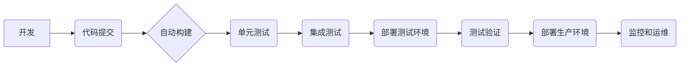

DevOps, 软件2.0, 持续集成, 持续交付, 自动化, 云原生, 容器化, 监控, 性能优化

## 1. 背景介绍

软件行业正经历着前所未有的变革，传统的软件开发模式已经难以满足快速迭代、敏捷交付和持续创新的需求。随着云计算、容器化、微服务架构等技术的兴起，软件2.0时代悄然到来。软件2.0强调敏捷开发、自动化运维、持续交付和可观测性，旨在构建更加高效、灵活、可靠的软件系统。

DevOps作为软件2.0的核心实践，旨在打破开发和运维之间的壁垒，实现开发、测试、部署和运维的自动化和协同。DevOps强调文化变革、流程优化和工具链建设，旨在提高软件开发和交付效率，缩短交付周期，降低风险，提升软件质量。

## 2. 核心概念与联系

DevOps的核心概念包括：

* **持续集成 (Continuous Integration):** 开发人员频繁地将代码提交到共享代码库，并自动构建和测试代码，确保代码质量和稳定性。
* **持续交付 (Continuous Delivery):** 将代码自动构建、测试和部署到测试环境，并随时准备进行生产环境部署。
* **持续部署 (Continuous Deployment):** 将代码自动构建、测试、部署到生产环境，实现自动化交付。
* **自动化运维 (Automated Operations):** 通过自动化工具和脚本，实现服务器 provisioning、配置管理、监控和故障恢复等运维任务。
* **可观测性 (Observability):** 通过监控、日志和追踪等手段，实时了解软件系统的运行状态和性能，以便快速定位和解决问题。

DevOps的实践需要结合多种工具和技术，形成完整的DevOps工具链。



## 3. 核心算法原理 & 具体操作步骤

### 3.1  算法原理概述

DevOps的核心算法原理是基于自动化和反馈机制的持续改进。通过自动化工具和脚本，实现代码构建、测试、部署和运维的自动化流程，并通过监控和日志分析，收集运行数据，进行分析和反馈，不断优化DevOps流程，提高效率和质量。

### 3.2  算法步骤详解

1. **代码提交:** 开发人员将代码提交到共享代码库。
2. **自动构建:** 构建系统自动触发构建过程，编译代码、生成可执行文件。
3. **单元测试:** 自动执行单元测试，验证代码的正确性。
4. **集成测试:** 自动执行集成测试，验证不同模块之间的集成性。
5. **部署测试环境:** 将构建好的软件部署到测试环境，进行功能测试和性能测试。
6. **测试验证:** 测试人员验证软件功能和性能，并反馈问题。
7. **部署生产环境:** 将经过测试验证的软件部署到生产环境。
8. **监控和运维:** 监控软件运行状态，收集日志和性能数据，进行分析和故障处理。

### 3.3  算法优缺点

**优点:**

* **提高效率:** 自动化流程可以显著提高软件开发和交付效率。
* **提高质量:** 自动化测试可以帮助发现和修复代码缺陷，提高软件质量。
* **降低风险:** 持续交付和部署可以降低软件发布风险。
* **提高协作:** DevOps强调开发和运维之间的协作，提高团队效率。

**缺点:**

* **实施成本:** 建立DevOps工具链和流程需要一定的成本投入。
* **文化变革:** DevOps需要改变传统的开发和运维文化，需要团队成员的积极参与和支持。
* **技术复杂性:** DevOps涉及多种技术和工具，需要团队成员具备相应的技术能力。

### 3.4  算法应用领域

DevOps的应用领域非常广泛，包括：

* **软件开发:** 提高软件开发效率和质量。
* **云计算:** 简化云资源管理和部署。
* **容器化:** 提高容器化应用的部署和管理效率。
* **微服务架构:** 提高微服务架构的开发和运维效率。
* **数据科学:** 提高数据科学模型的开发和部署效率。

## 4. 数学模型和公式 & 详细讲解 & 举例说明

DevOps的实践可以借助数学模型和公式进行分析和优化。例如，可以使用蒙特卡罗模拟法来评估软件发布风险，可以使用 queuing theory 来分析软件部署的等待时间，可以使用机器学习算法来预测软件故障。

### 4.1  数学模型构建

**软件发布风险评估模型:**

假设软件发布的风险可以表示为一个随机变量X，其概率分布为P(X)。我们可以使用蒙特卡罗模拟法来估计软件发布风险的概率。

**步骤:**

1. 确定软件发布风险的因素，例如代码缺陷数量、测试覆盖率、部署环境复杂度等。
2. 为每个因素赋予一个概率分布。
3. 使用蒙特卡罗模拟法生成多个随机样本，模拟软件发布过程。
4. 计算每个样本的风险值，并统计风险值的分布。

**结果:**

通过蒙特卡罗模拟，我们可以得到软件发布风险的概率分布，并评估软件发布的风险等级。

### 4.2  公式推导过程

**软件部署等待时间公式:**

假设软件部署的等待时间为T，其平均值和标准差分别为μ和σ。可以使用以下公式来估计软件部署等待时间:

```latex
T = μ + σ * Z
```

其中，Z是标准正态分布的随机变量。

### 4.3  案例分析与讲解

**案例:**

假设一个软件项目的平均部署等待时间为1小时，标准差为30分钟。我们可以使用上述公式来估计软件部署等待时间的概率分布。

**分析:**

当Z=0时，软件部署等待时间为1小时。当Z=1时，软件部署等待时间为1.5小时。当Z=-1时，软件部署等待时间为0.5小时。

**结论:**

通过分析软件部署等待时间的概率分布，我们可以了解软件部署等待时间的范围和可能性。

## 5. 项目实践：代码实例和详细解释说明

### 5.1  开发环境搭建

DevOps项目实践需要搭建一个完整的开发环境，包括代码库、构建服务器、测试环境和生产环境。可以使用开源工具和平台来搭建DevOps环境，例如：

* **代码库:** GitLab, GitHub, Bitbucket
* **构建服务器:** Jenkins, GitLab CI/CD, CircleCI
* **测试环境:** Docker, Kubernetes
* **生产环境:** AWS, Azure, GCP

### 5.2  源代码详细实现

以下是一个简单的DevOps流程的代码示例，使用Python语言实现自动化构建和测试脚本:

```python
# build.py
import subprocess

def build_project():
    subprocess.run(["mvn", "clean", "package"])

def test_project():
    subprocess.run(["mvn", "test"])

if __name__ == "__main__":
    build_project()
    test_project()
```

### 5.3  代码解读与分析

* `build_project()`函数使用`subprocess`模块执行Maven命令，清理项目代码并打包成可执行文件。
* `test_project()`函数使用`subprocess`模块执行Maven命令，运行项目单元测试。
* `if __name__ == "__main__":`语句确保脚本在直接执行时才会执行构建和测试过程。

### 5.4  运行结果展示

运行上述脚本后，会自动执行项目构建和测试过程，并输出构建和测试结果。

## 6. 实际应用场景

DevOps的实践可以应用于各种软件开发场景，例如：

* **电商平台:** 提高电商平台的开发和交付效率，快速响应用户需求。
* **金融系统:** 提高金融系统的稳定性和安全性，降低风险。
* **医疗系统:** 提高医疗系统的可靠性和可用性，保障患者安全。
* **物联网:** 提高物联网设备的开发和部署效率，实现快速迭代和创新。

### 6.4  未来应用展望

DevOps的应用场景将不断扩展，未来将与人工智能、机器学习、云计算等新兴技术深度融合，实现更加智能化、自动化和高效的软件开发和运维。

## 7. 工具和资源推荐

### 7.1  学习资源推荐

* **书籍:**
    * The Phoenix Project: A Novel About IT, DevOps, and Helping Your Business Win
    * DevOps Handbook: How to Create World-Class Agility, Reliability, and Security in Technology Organizations
    * Accelerate: The Science of Lean Software and DevOps: Building and Scaling High Performing Technology Organizations
* **在线课程:**
    * Udemy: DevOps Fundamentals
    * Coursera: DevOps Specialization
    * Linux Academy: DevOps Training

### 7.2  开发工具推荐

* **代码库:** GitLab, GitHub, Bitbucket
* **构建服务器:** Jenkins, GitLab CI/CD, CircleCI
* **容器化平台:** Docker, Kubernetes
* **监控工具:** Prometheus, Grafana, Datadog

### 7.3  相关论文推荐

* The DevOps Handbook: How to Create World-Class Agility, Reliability, and Security in Technology Organizations
* Accelerate: The Science of Lean Software and DevOps: Building and Scaling High Performing Technology Organizations
* Building Microservices: Designing Fine-Grained Systems

## 8. 总结：未来发展趋势与挑战

### 8.1  研究成果总结

DevOps实践已经取得了显著的成果，提高了软件开发和交付效率，降低了风险，提升了软件质量。

### 8.2  未来发展趋势

DevOps将继续朝着更加智能化、自动化和高效的方向发展，未来将与人工智能、机器学习、云计算等新兴技术深度融合。

### 8.3  面临的挑战

DevOps的实践仍然面临一些挑战，例如：

* **文化变革:** DevOps需要改变传统的开发和运维文化，需要团队成员的积极参与和支持。
* **技术复杂性:** DevOps涉及多种技术和工具，需要团队成员具备相应的技术能力。
* **安全风险:** DevOps需要关注软件安全风险，确保软件的安全性。

### 8.4  研究展望

未来研究方向包括：

* **DevOps自动化:** 进一步提高DevOps流程的自动化程度，减少人工干预。
* **DevOps智能化:** 利用人工智能和机器学习技术，实现DevOps流程的智能化优化。
* **DevOps安全:** 研究DevOps安全最佳实践，确保软件的安全性。

## 9. 附录：常见问题与解答

**常见问题:**

* **DevOps和Agile开发有什么区别？**
* **DevOps需要哪些工具？**
* **如何实施DevOps？**

**解答:**

* DevOps和Agile开发都是软件开发方法论，但DevOps更侧重于开发和运维之间的协作和自动化。
* DevOps需要多种工具，例如代码库、构建服务器、容器化平台、监控工具等。
* 实施DevOps需要逐步推进，从文化变革、流程优化、工具链建设等方面入手。


作者：禅与计算机程序设计艺术 / Zen and the Art of Computer Programming 
<end_of_turn>