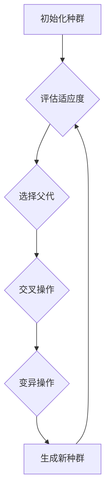

> 遗传算法, GA, 进化算法, 优化算法, 适应度函数, 选择, 交叉, 变异, 代码实例, Python

## 1. 背景介绍

在现代人工智能和机器学习领域，优化问题占据着重要地位。从机器学习模型的超参数调优到机器人路径规划，从金融风险管理到药物设计，优化算法无处不在。 遗传算法 (Genetic Algorithms, GA) 作为一种启发式优化算法，以其强大的全局搜索能力和对复杂问题的适应性，在解决各种优化问题中展现出巨大的潜力。

遗传算法的灵感来源于自然界生物的进化过程。它模拟自然选择、交叉和变异等机制，通过迭代优化个体，最终找到最优解或近似最优解。与传统梯度下降等优化算法相比，遗传算法更适合处理非线性、多峰值和离散型优化问题。

## 2. 核心概念与联系

**2.1 核心概念**

* **种群:** 遗传算法的核心概念之一是种群，它是一个包含多个个体的集合。每个个体代表一个可能的解决方案，通常用二进制编码或其他表示形式表示。
* **适应度函数:** 适应度函数用于评估每个个体的优劣，它将个体映射到一个数值，数值越高表示个体越优。适应度函数的设计是遗传算法的关键，它直接影响着算法的搜索方向和效率。
* **选择:** 选择操作模拟自然界中适者生存的机制，它根据个体的适应度选择部分个体作为下一代的父代。常用的选择方法包括轮盘赌选择、锦标赛选择等。
* **交叉:** 交叉操作模拟生物的遗传过程，它将两个父代个体进行组合，产生两个新的子代个体。交叉操作可以促进种群的多样性，提高算法的探索能力。
* **变异:** 变异操作模拟基因突变的现象，它以一定的概率改变个体的基因，引入新的变异个体，防止算法陷入局部最优解。

**2.2 核心流程图**



## 3. 核心算法原理 & 具体操作步骤

### 3.1 算法原理概述

遗传算法的基本原理是通过模拟自然选择、交叉和变异等机制，迭代优化个体，最终找到最优解或近似最优解。

算法流程如下：

1. **初始化种群:** 生成一个包含多个个体的初始种群。每个个体代表一个可能的解决方案，通常用二进制编码或其他表示形式表示。
2. **评估适应度:** 计算每个个体的适应度值，适应度值越高表示个体越优。
3. **选择父代:** 根据个体的适应度值，选择部分个体作为下一代的父代。常用的选择方法包括轮盘赌选择、锦标赛选择等。
4. **交叉操作:** 将两个父代个体进行组合，产生两个新的子代个体。交叉操作可以促进种群的多样性，提高算法的探索能力。
5. **变异操作:** 以一定的概率改变个体的基因，引入新的变异个体，防止算法陷入局部最优解。
6. **生成新种群:** 将新产生的子代个体组成新的种群，重复步骤2-5，直到达到终止条件。

### 3.2 算法步骤详解

1. **初始化种群:** 随机生成一个包含多个个体的初始种群。每个个体可以表示为一个二进制串、实数向量或其他形式。
2. **评估适应度:** 定义一个适应度函数，用于评估每个个体的优劣。适应度函数通常根据个体与目标值的距离或其他指标进行计算。
3. **选择父代:** 使用选择算法从当前种群中选择部分个体作为父代，用于生成下一代个体。常用的选择算法包括轮盘赌选择、锦标赛选择等。
4. **交叉操作:** 将两个父代个体进行交叉操作，产生两个新的子代个体。交叉操作可以模拟生物的遗传过程，将父代个体的基因进行组合，产生新的变异个体。
5. **变异操作:** 以一定的概率对子代个体的基因进行变异操作，引入新的变异个体，防止算法陷入局部最优解。
6. **生成新种群:** 将新产生的子代个体组成新的种群，重复步骤2-5，直到达到终止条件。

### 3.3 算法优缺点

**优点:**

* **全局搜索能力强:** 遗传算法可以有效地搜索解空间中的全局最优解，而不是局限于局部最优解。
* **适应性强:** 遗传算法可以处理各种类型的问题，包括非线性、多峰值和离散型问题。
* **易于实现:** 遗传算法的实现相对简单，可以使用现有的编程语言和库进行实现。

**缺点:**

* **收敛速度慢:** 遗传算法的收敛速度相对较慢，尤其是在解空间较大时。
* **参数设置敏感:** 遗传算法的性能受参数设置的影响较大，需要进行仔细的调优。
* **易陷入局部最优解:** 虽然遗传算法具有全局搜索能力，但仍然可能陷入局部最优解。

### 3.4 算法应用领域

遗传算法在各个领域都有广泛的应用，例如：

* **机器学习:** 超参数调优、特征选择、模型结构优化
* **优化问题:** 生产调度、资源分配、路径规划
* **金融领域:** 风险管理、投资组合优化
* **生物信息学:** 基因序列分析、蛋白质结构预测
* **工程设计:** 结构优化、电路设计

## 4. 数学模型和公式 & 详细讲解 & 举例说明

### 4.1 数学模型构建

遗传算法的数学模型主要包括适应度函数、选择算子、交叉算子和变异算子。

* **适应度函数:** 适应度函数用于评估每个个体的优劣，通常定义为目标函数的倒数或其他指标。

* **选择算子:** 选择算子用于从当前种群中选择部分个体作为父代，常用的选择算子包括轮盘赌选择、锦标赛选择等。

* **交叉算子:** 交叉算子用于将两个父代个体进行组合，产生两个新的子代个体，常用的交叉算子包括单点交叉、双点交叉等。

* **变异算子:** 变异算子用于以一定的概率改变个体的基因，引入新的变异个体，常用的变异算子包括比特翻转、基因交换等。

### 4.2 公式推导过程

**4.2.1 轮盘赌选择**

轮盘赌选择是一种概率选择算法，每个个体的选择概率与其适应度值成正比。

假设种群中个体数量为N，个体i的适应度值为f(i)，则个体i被选择的概率为：

```
P(i) = f(i) / sum(f(j)) (j=1 to N)
```

**4.2.2 单点交叉**

单点交叉是一种常用的交叉算子，它随机选择一个交叉点，将父代个体的基因进行交换。

假设两个父代个体为A和B，交叉点为k，则子代个体C和D的基因表示为：

```
C = A[1:k] + B[k+1:end]
D = B[1:k] + A[k+1:end]
```

### 4.3 案例分析与讲解

**4.3.1 寻优问题**

假设我们要寻找一个函数f(x)的最小值，其中x是一个实数。我们可以使用遗传算法来解决这个问题。

* **适应度函数:** f(x)的最小值
* **种群:** 初始种群包含多个随机生成的实数个体。
* **选择算子:** 轮盘赌选择
* **交叉算子:** 单点交叉
* **变异算子:** 随机扰动

通过迭代优化个体，最终找到函数f(x)的最小值。

## 5. 项目实践：代码实例和详细解释说明

### 5.1 开发环境搭建

* Python 3.x
* NumPy
* matplotlib

### 5.2 源代码详细实现

```python
import numpy as np
import matplotlib.pyplot as plt

# 定义适应度函数
def fitness_function(x):
    return x**2

# 定义遗传算法
def genetic_algorithm(population_size, generations, mutation_rate):
    # 初始化种群
    population = np.random.rand(population_size)

    # 迭代优化
    for generation in range(generations):
        # 计算适应度
        fitness = fitness_function(population)

        # 选择父代
        parents = np.random.choice(population, size=population_size, p=fitness / np.sum(fitness))

        # 交叉操作
        offspring = np.zeros_like(parents)
        for i in range(0, population_size, 2):
            crossover_point = np.random.randint(1, len(parents[i]))
            offspring[i] = np.concatenate((parents[i][:crossover_point], parents[i+1][crossover_point:]))
            offspring[i+1] = np.concatenate((parents[i+1][:crossover_point], parents[i][crossover_point:]))

        # 变异操作
        for i in range(population_size):
            if np.random.rand() < mutation_rate:
                mutation_point = np.random.randint(0, len(offspring[i]))
                offspring[i][mutation_point] = np.random.rand()

        # 更新种群
        population = offspring

    # 返回最优解
    return population[np.argmin(fitness_function(population))]

# 设置参数
population_size = 100
generations = 100
mutation_rate = 0.1

# 运行遗传算法
best_solution = genetic_algorithm(population_size, generations, mutation_rate)

# 打印结果
print("最优解:", best_solution)

# 绘制结果
plt.plot(fitness_function(population))
plt.xlabel("Generation")
plt.ylabel("Fitness")
plt.title("Genetic Algorithm")
plt.show()
```

### 5.3 代码解读与分析

* **适应度函数:** `fitness_function(x)` 定义了需要优化的目标函数，在本例中是寻找函数x^2的最小值。
* **遗传算法函数:** `genetic_algorithm(population_size, generations, mutation_rate)` 实现遗传算法的核心逻辑，包括初始化种群、评估适应度、选择父代、交叉操作、变异操作和更新种群。
* **参数设置:** `population_size`, `generations` 和 `mutation_rate` 分别控制种群大小、迭代次数和变异概率。
* **结果展示:** 代码最后打印出最优解，并绘制适应度随迭代次数变化的曲线。

### 5.4 运行结果展示

运行代码后，会输出最优解以及适应度随迭代次数变化的曲线图。

## 6. 实际应用场景

### 6.1 机器学习

* **超参数调优:** 遗传算法可以用于优化机器学习模型的超参数，例如学习率、正则化参数等，提高模型的性能。
* **特征选择:** 遗传算法可以用于从大量特征中选择最优特征子集，减少模型复杂度，提高训练效率。
* **模型结构优化:** 遗传算法可以用于搜索最优模型结构，例如神经网络的层数、节点数等，提高模型的表达能力。

### 6.2 优化问题

* **生产