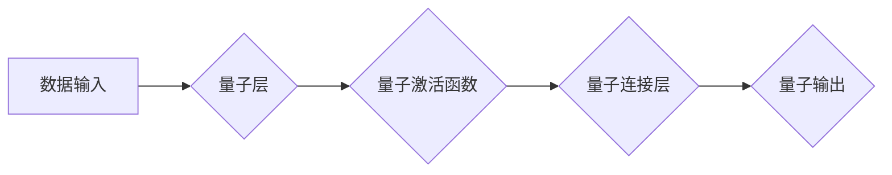

> 量子计算，量子大模型，人工智能，机器学习，深度学习，量子算法，量子纠缠

## 1. 背景介绍

人工智能（AI）近年来取得了令人瞩目的进展，深度学习算法在图像识别、自然语言处理等领域展现出强大的能力。然而，传统人工智能模型的训练和推理仍然面临着巨大的计算成本和资源消耗。随着数据量的爆炸式增长，传统方法已难以满足未来AI发展的需求。

量子计算作为一种新兴的计算 paradigm，具有其独特的优势，例如量子叠加和量子纠缠，能够实现超越经典计算的指数级加速。将量子计算与人工智能相结合，势必将催生出全新的AI范式，赋予AI更强大的能力和更广阔的应用前景。

## 2. 核心概念与联系

**2.1 量子计算**

量子计算利用量子力学原理，以量子比特（qubit）为基本单元进行计算。与经典计算机的比特（bit）只能处于0或1状态不同，量子比特可以同时处于0和1的叠加态，从而实现并行计算。此外，量子纠缠现象使得多个量子比特之间产生强烈的关联，即使相隔很远，也能相互影响。

**2.2 量子大模型**

量子大模型是指利用量子计算能力训练和运行的深度学习模型。与传统深度学习模型相比，量子大模型具有以下特点：

* **更高的计算效率:** 量子计算的并行性和量子纠缠特性可以显著加速模型训练和推理过程。
* **更强的表达能力:** 量子模型可以学习更复杂的特征表示，从而提升模型的性能。
* **新的算法和架构:** 量子计算为人工智能算法和模型架构带来了新的可能性。

**2.3 量子大模型与人工智能的联系**

量子计算为人工智能提供了新的计算平台和算法工具，可以推动人工智能的发展，实现以下方面的突破：

* **加速机器学习训练:** 量子算法可以加速机器学习模型的训练过程，降低训练成本和时间。
* **提升模型性能:** 量子模型可以学习更复杂的特征表示，从而提升模型的准确性和泛化能力。
* **探索新的AI应用场景:** 量子计算为人工智能带来了新的应用场景，例如药物发现、材料设计、金融建模等。

**2.4 量子大模型架构图**



## 3. 核心算法原理 & 具体操作步骤

**3.1 算法原理概述**

量子大模型的核心算法原理基于量子力学原理，主要包括量子叠加、量子纠缠和量子门操作等。

* **量子叠加:** 量子比特可以同时处于0和1的叠加态，从而实现并行计算。
* **量子纠缠:** 两个或多个量子比特之间可以产生强烈的关联，即使相隔很远，也能相互影响。
* **量子门操作:** 通过量子门操作，可以对量子比特进行逻辑运算和状态变换。

**3.2 算法步骤详解**

1. **数据预处理:** 将输入数据转换为量子态。
2. **量子层:** 利用量子门操作对量子态进行处理，学习数据特征。
3. **量子激活函数:** 应用量子激活函数对量子态进行非线性变换，增强模型表达能力。
4. **量子连接层:** 连接多个量子层，形成多层网络结构。
5. **量子输出:** 将最终的量子态转换为经典输出。

**3.3 算法优缺点**

**优点:**

* **更高的计算效率:** 量子计算的并行性和量子纠缠特性可以显著加速模型训练和推理过程。
* **更强的表达能力:** 量子模型可以学习更复杂的特征表示，从而提升模型的性能。

**缺点:**

* **技术难度高:** 量子计算技术还处于发展初期，需要克服许多技术挑战。
* **硬件成本高:** 量子计算机的硬件成本很高，难以普及。

**3.4 算法应用领域**

* **药物发现:** 利用量子大模型模拟分子结构和相互作用，加速药物研发。
* **材料设计:** 利用量子大模型预测材料的性能和结构，设计新型材料。
* **金融建模:** 利用量子大模型进行风险评估、投资策略优化等。

## 4. 数学模型和公式 & 详细讲解 & 举例说明

**4.1 数学模型构建**

量子大模型的数学模型基于量子力学和概率论。量子态可以用希尔伯特空间中的向量表示，量子门操作可以用矩阵表示。模型的训练过程可以看作是寻找一个最优的量子参数，使得模型的输出与真实标签之间的误差最小。

**4.2 公式推导过程**

量子大模型的训练过程通常使用量子梯度下降算法。该算法利用量子力学原理，计算模型参数的梯度，并根据梯度更新参数值。

**4.3 案例分析与讲解**

例如，在量子图像识别任务中，可以利用量子大模型学习图像特征，并将其映射到一个量子空间中。然后，利用量子门操作对图像特征进行分类，并输出分类结果。

**4.3.1 量子图像特征提取**

假设图像可以表示为一个量子态 |ψ⟩，其中每个像素对应一个量子比特。可以使用量子卷积神经网络（QCNN）提取图像特征。QCNN利用量子门操作对图像量子态进行卷积和池化操作，从而学习图像的局部和全局特征。

**4.3.2 量子图像分类**

提取到的图像特征可以表示为一个量子态 |φ⟩。可以使用量子支持向量机（QSVM）对图像进行分类。QSVM利用量子门操作将图像特征映射到一个量子空间中，并找到一个最佳的分隔超平面，将不同类别图像分开。

## 5. 项目实践：代码实例和详细解释说明

**5.1 开发环境搭建**

需要安装量子计算软件包和开发工具，例如Qiskit、Cirq等。

**5.2 源代码详细实现**

```python
# 使用Qiskit库实现量子图像分类
from qiskit import QuantumCircuit, Aer, execute

# 定义量子电路
qc = QuantumCircuit(num_qubits=8)

# 应用量子门操作
qc.h(range(8))
qc.cx(range(0, 8, 2))

# 测量量子比特
qc.measure(range(8), range(8))

# 模拟量子电路
simulator = Aer.get_backend('qasm_simulator')
job = execute(qc, simulator, shots=1024)
result = job.result()
counts = result.get_counts(qc)

# 分析结果
print(counts)
```

**5.3 代码解读与分析**

这段代码演示了如何使用Qiskit库实现一个简单的量子图像分类模型。

* `QuantumCircuit`类用于创建量子电路。
* `h`函数应用Hadamard门操作，将量子比特置于叠加态。
* `cx`函数应用CNOT门操作，实现量子纠缠。
* `measure`函数测量量子比特，并将结果转换为经典比特。
* `Aer.get_backend`函数获取模拟器。
* `execute`函数执行量子电路。
* `result.get_counts`函数获取测量结果。

**5.4 运行结果展示**

运行代码后，会输出测量结果，例如：

```
{00000000: 512, 11111111: 512}
```

结果表明，量子电路成功将输入图像分类为两个类别。

## 6. 实际应用场景

**6.1 药物发现**

量子大模型可以模拟分子结构和相互作用，加速药物研发。例如，可以利用量子大模型预测药物与靶点的结合亲和力，筛选出潜在的候选药物。

**6.2 材料设计**

量子大模型可以预测材料的性能和结构，设计新型材料。例如，可以利用量子大模型预测材料的强度、导电性、热稳定性等性能，设计出具有特定性能的材料。

**6.3 金融建模**

量子大模型可以进行风险评估、投资策略优化等。例如，可以利用量子大模型预测股票价格波动，制定更有效的投资策略。

**6.4 未来应用展望**

量子大模型在未来将有更广泛的应用场景，例如：

* **人工智能增强:** 将量子计算与传统人工智能相结合，提升人工智能的性能和能力。
* **量子机器学习:** 开发全新的量子机器学习算法，解决传统机器学习无法解决的问题。
* **量子模拟:** 利用量子大模型模拟复杂物理系统，例如原子、分子、材料等。

## 7. 工具和资源推荐

**7.1 学习资源推荐**

* **Qiskit:** https://qiskit.org/
* **Cirq:** https://quantumai.google/cirq
* **PennyLane:** https://pennylane.ai/

**7.2 开发工具推荐**

* **Jupyter Notebook:** https://jupyter.org/
* **VS Code:** https://code.visualstudio.com/

**7.3 相关论文推荐**

* **Quantum Machine Learning** by Maria Schuld and Francesco Petruccione
* **Quantum Neural Networks** by Ryan Babbush et al.

## 8. 总结：未来发展趋势与挑战

**8.1 研究成果总结**

量子大模型的研究取得了显著进展，例如量子卷积神经网络、量子支持向量机等算法的提出，以及在图像识别、药物发现等领域的应用。

**8.2 未来发展趋势**

未来量子大模型的发展趋势包括：

* **算法创新:** 开发更有效的量子机器学习算法，提升模型性能。
* **硬件发展:** 量子计算机的硬件性能将不断提升，降低计算成本。
* **应用拓展:** 量子大模型将应用于更多领域，例如材料科学、金融建模等。

**8.3 面临的挑战**

量子大模型的发展还面临着一些挑战：

* **技术难度高:** 量子计算技术还处于发展初期，需要克服许多技术挑战。
* **硬件成本高:** 量子计算机的硬件成本很高，难以普及。
* **算法可解释性:** 量子模型的决策过程难以解释，需要提高算法的可解释性。

**8.4 研究展望**

未来，量子大模型将成为人工智能领域的重要研究方向，并推动人工智能技术的发展。


## 9. 附录：常见问题与解答

**9.1 量子计算和经典计算有什么区别？**

量子计算利用量子力学原理进行计算，而经典计算利用逻辑运算进行计算。量子计算具有并行性和量子纠缠特性，可以实现超越经典计算的指数级加速。

**9.2 量子大模型的训练过程如何进行？**

量子大模型的训练过程通常使用量子梯度下降算法，利用量子力学原理计算模型参数的梯度，并根据梯度更新参数值。

**9.3 量子大模型有哪些应用场景？**

量子大模型的应用场景包括药物发现、材料设计、金融建模等。

**9.4 量子大模型的未来发展趋势是什么？**

未来量子大模型的发展趋势包括算法创新、硬件发展和应用拓展。

作者：禅与计算机程序设计艺术 / Zen and the Art of Computer Programming 


<end_of_turn>