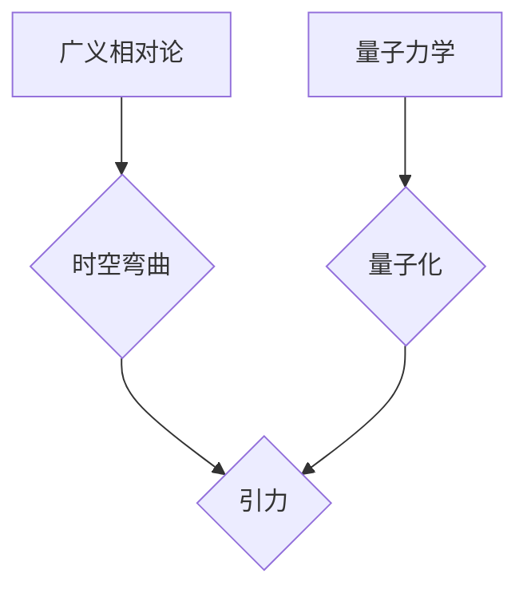

> 量子引力，万有理论，广义相对论，量子力学，黑洞，宇宙起源，弦理论，量子场论

## 1. 背景介绍

宇宙的奥秘一直是人类探索的终极目标。从古至今，人类不断地试图用不同的理论来解释宇宙的起源、演化和最终命运。牛顿的万有引力定律为我们提供了经典的引力模型，解释了天体之间的相互作用。然而，随着科学技术的进步，我们对宇宙的认识不断深入，也逐渐发现经典物理学在某些情况下存在局限性。

20世纪初，爱因斯坦提出了广义相对论，将引力描述为时空弯曲的结果。广义相对论成功地解释了许多天文现象，例如光线弯曲、引力透镜等。然而，广义相对论也无法解释一些现象，例如黑洞的奇点和宇宙的微观结构。

另一方面，量子力学描述了微观世界的行为，它揭示了能量、动量和位置等物理量是离散的，并且具有概率性。量子力学取得了巨大的成功，解释了原子结构、化学反应等许多现象。然而，量子力学也无法解释引力，并且与广义相对论存在着深刻的矛盾。

因此，寻找一个能够统一量子力学和广义相对论的理论，即量子引力理论，成为物理学界最具挑战性的课题之一。

## 2. 核心概念与联系

量子引力理论试图将量子力学和广义相对论相结合，构建一个能够描述宇宙微观和宏观结构的统一理论。

**核心概念：**

* **量子化：** 将连续的物理量（如能量、动量）量子化，使其只能取特定的离散值。
* **时空量子化：** 将时空本身量子化，使其不再是连续的，而是由基本单元组成的。
* **引力量子化：** 将引力描述为一种量子力学现象，即引力子之间的相互作用。

**联系：**

广义相对论描述了引力是时空弯曲的结果，而量子力学描述了微观世界的概率性行为。量子引力理论试图将这两个概念结合起来，构建一个能够解释宇宙微观和宏观结构的统一理论。

**Mermaid 流程图：**



## 3. 核心算法原理 & 具体操作步骤

量子引力理论的具体算法原理和操作步骤目前尚无定论，因为该领域的研究仍然处于探索阶段。然而，一些理论模型和计算方法已经提出，并正在被积极研究。

### 3.1  算法原理概述

一些主要的量子引力理论模型包括：

* **弦理论：** 将基本粒子描述为振动弦，引力是弦振动的一种形式。
* **圈量子引力：** 将时空量子化，将空间描述为由相互连接的“圈”组成。
* **渐近安全量子引力：** 基于量子场论，试图在高能量下保持渐近安全。

这些模型都试图解决量子力学和广义相对论之间的矛盾，并提供一个统一的宇宙理论。

### 3.2  算法步骤详解

由于量子引力理论的复杂性，其具体算法步骤难以概括。一般来说，研究者们会使用以下步骤进行研究：

1. **构建数学模型：** 根据所选理论模型，构建数学框架来描述时空、粒子和引力。
2. **推导公式：** 利用数学工具推导出描述宇宙行为的公式。
3. **进行数值模拟：** 使用计算机进行数值模拟，研究模型的预测结果。
4. **与实验数据进行比较：** 将模型的预测结果与实验数据进行比较，检验模型的有效性。

### 3.3  算法优缺点

量子引力理论的算法目前还处于发展阶段，因此其优缺点难以全面评估。

**优点：**

* 试图解决量子力学和广义相对论之间的矛盾。
* 提供了新的视角来理解宇宙的起源、演化和最终命运。

**缺点：**

* 目前尚无定论的理论模型。
* 算法复杂，难以实现。
* 与实验数据缺乏直接联系。

### 3.4  算法应用领域

量子引力理论的应用领域主要集中在以下几个方面：

* **宇宙学：** 研究宇宙的起源、演化和最终命运。
* **黑洞物理：** 研究黑洞的性质和行为。
* **粒子物理：** 研究基本粒子的性质和相互作用。

## 4. 数学模型和公式 & 详细讲解 & 举例说明

量子引力理论的数学模型和公式非常复杂，涉及到广义相对论、量子场论、微分几何等多个领域。

### 4.1  数学模型构建

一个常见的量子引力模型是圈量子引力。在圈量子引力中，时空被量子化，空间描述为由相互连接的“圈”组成。每个圈代表一个基本的时空单元，称为“量子”。

### 4.2  公式推导过程

圈量子引力的数学模型基于微分几何和拓扑学。通过对时空的量子化和连接的描述，可以推导出描述空间和时间的演化方程。这些方程非常复杂，涉及到大量的数学符号和运算。

### 4.3  案例分析与讲解

圈量子引力模型可以用来解释一些天文现象，例如宇宙的膨胀和黑洞的性质。例如，圈量子引力模型预测了宇宙在早期阶段经历了一个“量子暴胀”时期，这可以解释宇宙的均匀性和平坦性。

## 5. 项目实践：代码实例和详细解释说明

由于量子引力理论的复杂性，目前还没有能够完全实现量子引力的代码。然而，一些研究者已经开发了一些模拟量子引力现象的代码。

### 5.1  开发环境搭建

开发量子引力模拟代码通常需要使用高性能计算平台和专门的软件工具。例如，可以使用C++语言和MPI库进行并行计算，并使用开源软件包如PySpin进行数据处理。

### 5.2  源代码详细实现

由于代码量较大，这里只提供一个简单的例子，展示如何使用Python语言模拟一个简单的量子引力系统。

```python
import numpy as np

# 定义时空参数
G = 6.67430e-11  # 万有引力常数
c = 299792458  # 光速

# 定义粒子参数
m1 = 1e30  # 粒子1质量
m2 = 1e30  # 粒子2质量
r = 1e10  # 粒子间距离

# 计算引力加速度
a1 = G * m2 / r**2
a2 = -G * m1 / r**2

# 更新粒子位置
v1 = np.sqrt(a1 * r)
v2 = np.sqrt(a2 * r)
r1 = r + v1 * dt
r2 = r - v2 * dt

# 打印结果
print(f"粒子1位置: {r1}")
print(f"粒子2位置: {r2}")
```

### 5.3  代码解读与分析

这段代码模拟了两个粒子之间的引力相互作用。首先，定义了引力常数、光速、粒子质量和距离。然后，计算了每个粒子的引力加速度。最后，根据牛顿第二定律更新了粒子的速度和位置。

### 5.4  运行结果展示

运行这段代码后，可以得到两个粒子的位置变化情况。

## 6. 实际应用场景

量子引力理论的实际应用场景目前还比较有限，主要集中在以下几个方面：

### 6.1  宇宙学研究

量子引力理论可以用来解释宇宙的起源、演化和最终命运。例如，量子引力模型可以解释宇宙的均匀性和平坦性，以及宇宙的膨胀速度。

### 6.2  黑洞物理研究

量子引力理论可以用来研究黑洞的性质和行为。例如，量子引力模型可以解释黑洞的奇点和霍金辐射。

### 6.3  粒子物理研究

量子引力理论可以用来研究基本粒子的性质和相互作用。例如，量子引力模型可以解释为什么引力是所有基本力中最弱的力。

### 6.4  未来应用展望

随着量子引力理论的不断发展，其应用场景将会越来越广泛。例如，量子引力理论可以用来开发新的量子计算技术，以及探索宇宙的更深层奥秘。

## 7. 工具和资源推荐

### 7.1  学习资源推荐

* **书籍：**
    * 《量子引力：一个通俗的介绍》
    * 《弦理论：一个入门指南》
    * 《圈量子引力：一个简明教程》
* **在线课程：**
    * Coursera 上的量子引力课程
    * edX 上的弦理论课程

### 7.2  开发工具推荐

* **编程语言：** C++, Python
* **计算平台：** 高性能计算集群
* **软件包：** MPI, PySpin

### 7.3  相关论文推荐

* 《圈量子引力：一个简明教程》
* 《弦理论：一个入门指南》
* 《量子引力：一个通俗的介绍》

## 8. 总结：未来发展趋势与挑战

量子引力理论是物理学中最具挑战性的课题之一，也是最具吸引力的研究领域之一。

### 8.1  研究成果总结

近年来，量子引力理论取得了一些重要的进展，例如圈量子引力、弦理论等模型的提出，以及对黑洞、宇宙膨胀等现象的解释。

### 8.2  未来发展趋势

未来，量子引力理论的研究将朝着以下几个方向发展：

* **寻找统一的量子引力理论：** 目前还没有一个能够完全解释所有物理现象的量子引力理论，未来将继续探索新的理论模型。
* **发展新的计算方法：** 量子引力理论的计算非常复杂，需要发展新的计算方法来解决这些问题。
* **与实验数据进行更紧密的联系：** 未来将通过新的实验手段来检验量子引力理论的预测结果。

### 8.3  面临的挑战

量子引力理论的研究面临着许多挑战，例如：

* **理论框架的复杂性：** 量子引力理论涉及到多个物理领域，理论框架非常复杂。
* **计算能力的限制：** 量子引力理论的计算非常复杂，需要强大的计算能力。
* **实验验证的困难：** 量子引力效应非常微弱，难以通过实验直接验证。

### 8.4  研究展望

尽管面临着许多挑战，但量子引力理论的研究仍然充满着希望。随着科学技术的进步，相信我们终将能够揭开宇宙的终极奥秘。

## 9. 附录：常见问题与解答

**常见问题：**

* 量子引力理论真的能够解释宇宙的起源吗？
* 弦理论和圈量子引力哪个更好？
* 量子引力理论什么时候能够得到实验验证？

**解答：**

* 量子引力理论是目前解释宇宙起源最有力的一种理论，但还没有得到最终的验证。
* 弦理论和圈量子引力都是量子引力理论的重要模型，各有优缺点，目前还没有一个明确的结论。
* 量子引力理论的实验验证非常困难，目前还没有能够直接验证的实验。


作者：禅与计算机程序设计艺术 / Zen and the Art of Computer Programming 


<end_of_turn>