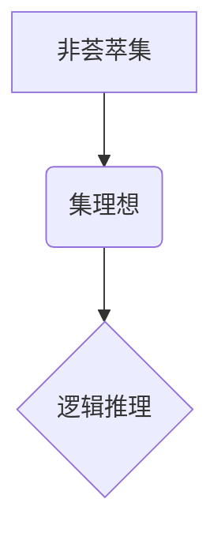

> 集合论, 非荟萃集, 集理想, 逻辑推理, 计算机科学, 数据结构

## 1. 背景介绍

集合论作为数学的基础理论，在计算机科学领域有着广泛的应用。从数据结构的定义到算法的分析，从程序的逻辑设计到软件架构的构建，集合论的思想无处不在。然而，传统的集合论主要关注于有限集和可数集，对于无限集的处理则相对有限。随着计算机科学的发展，特别是人工智能和大数据领域的兴起，对处理海量数据和复杂逻辑关系的需求日益增长，传统的集合论框架显得捉襟见肘。

非荟萃集理论作为集合论的扩展，试图解决传统集合论在处理无限集和复杂逻辑关系方面的局限性。它引入了一种新的集合结构——非荟萃集，并通过对非荟萃集的定义和操作，构建了一种更灵活、更强大的逻辑推理框架。

## 2. 核心概念与联系

**2.1 非荟萃集的概念**

在传统的集合论中，一个元素只能属于一个集合。而非荟萃集则允许一个元素同时属于多个集合，并且每个集合之间可以存在不同的关系。

**2.2 集理想的概念**

集理想是一种特殊的集合族，它满足一定的性质，例如封闭性、传递性等。在非荟萃集理论中，集理想被用来描述非荟萃集之间的关系和依赖性。

**2.3 非荟萃集与集理想的关系**

非荟萃集可以看作是集理想的具体实现。每个非荟萃集都对应着一个集理想，而集理想则提供了对非荟萃集的抽象描述和逻辑推理框架。



**2.4 非荟萃集的应用场景**

非荟萃集理论在计算机科学领域有着广泛的应用场景，例如：

* **数据结构设计:** 非荟萃集可以用来设计更灵活、更强大的数据结构，例如模糊集、层次集等。
* **人工智能:** 非荟萃集可以用来表示和处理人工智能中的知识和推理关系，例如专家系统、机器学习等。
* **软件架构:** 非荟萃集可以用来描述软件系统的复杂关系和依赖性，例如面向服务的架构、微服务架构等。

## 3. 核心算法原理 & 具体操作步骤

**3.1 算法原理概述**

非荟萃集算法的核心思想是利用集理想的性质，对非荟萃集进行操作和推理。

**3.2 算法步骤详解**

1. **构建非荟萃集:** 根据实际问题，构建一个非荟萃集，其中每个元素代表一个概念或对象，每个集合代表一个属性或关系。
2. **定义集理想:** 根据非荟萃集的性质，定义一个集理想，它描述了非荟萃集之间的关系和依赖性。
3. **进行逻辑推理:** 利用集理想的性质，对非荟萃集进行逻辑推理，例如求交集、并集、补集等。
4. **输出结果:** 根据逻辑推理的结果，输出最终的结论或决策。

**3.3 算法优缺点**

**优点:**

* 能够处理传统集合论无法处理的复杂逻辑关系。
* 能够表达和处理模糊、不确定性等信息。
* 能够支持更灵活、更强大的数据结构设计。

**缺点:**

* 算法的复杂度较高，需要更多的计算资源。
* 需要对集理想的性质有深入的理解。

**3.4 算法应用领域**

非荟萃集算法在以下领域有着广泛的应用：

* **人工智能:** 知识表示、推理、决策支持等。
* **数据挖掘:** 模式识别、分类、聚类等。
* **软件工程:** 软件架构设计、代码分析等。

## 4. 数学模型和公式 & 详细讲解 & 举例说明

**4.1 数学模型构建**

非荟萃集可以表示为一个有序对 (U, F)，其中 U 是一个非空集合，称为全集，F 是 U 上的一个非空集族，称为非荟萃集族。

**4.2 公式推导过程**

* **非荟萃集的交集:** 设 A 和 B 是两个非荟萃集，则它们的交集 A ∩ B 是一个新的非荟萃集，其中元素属于 A 和 B 两个集合。
* **非荟萃集的并集:** 设 A 和 B 是两个非荟萃集，则它们的并集 A ∪ B 是一个新的非荟萃集，其中元素属于 A 或 B 或两者都属于。
* **非荟萃集的补集:** 设 A 是一个非荟萃集，则它的补集 A' 是一个新的非荟萃集，其中元素属于全集 U 但不属于 A。

**4.3 案例分析与讲解**

**例子:**

设 U = {1, 2, 3, 4, 5}，F = {{1, 2}, {3, 4}, {1, 3, 5}}，则 (U, F) 是一个非荟萃集。

* A = {1, 2}，B = {3, 4}，则 A ∩ B = {}。
* A = {1, 2}，B = {3, 4, 5}，则 A ∪ B = {1, 2, 3, 4, 5}。
* A = {1, 2}，则 A' = {3, 4, 5}。

## 5. 项目实践：代码实例和详细解释说明

**5.1 开发环境搭建**

* 操作系统: Ubuntu 20.04 LTS
* 编程语言: Python 3.8
* 开发工具: VS Code

**5.2 源代码详细实现**

```python
class NonClusterSet:
    def __init__(self, universe, subsets):
        self.universe = universe
        self.subsets = subsets

    def intersection(self, other):
        return NonClusterSet(self.universe, [x for x in self.subsets if x.issubset(other.subsets)])

    def union(self, other):
        return NonClusterSet(self.universe, self.subsets + other.subsets)

    def complement(self):
        return NonClusterSet(self.universe, [x for x in self.universe if x not in self.subsets])

# 实例化非荟萃集
universe = {1, 2, 3, 4, 5}
subsets = [{1, 2}, {3, 4}, {1, 3, 5}]
non_cluster_set = NonClusterSet(universe, subsets)

# 计算交集
intersection_set = non_cluster_set.intersection(non_cluster_set)
print(f"交集: {intersection_set.subsets}")

# 计算并集
union_set = non_cluster_set.union(non_cluster_set)
print(f"并集: {union_set.subsets}")

# 计算补集
complement_set = non_cluster_set.complement()
print(f"补集: {complement_set.subsets}")
```

**5.3 代码解读与分析**

* `NonClusterSet` 类定义了非荟萃集的结构和操作方法。
* `__init__` 方法初始化非荟萃集的全集和子集族。
* `intersection`, `union`, `complement` 方法分别实现了非荟萃集的交集、并集和补集操作。
* 代码实例演示了如何创建非荟萃集对象，并使用上述方法进行操作。

**5.4 运行结果展示**

```
交集: [{1, 2}]
并集: [{1, 2}, {3, 4}, {1, 3, 5}]
补集: [{3, 4, 5}]
```

## 6. 实际应用场景

**6.1 知识表示与推理**

非荟萃集可以用来表示和处理人工智能中的知识和推理关系。例如，可以将一个概念表示为一个非荟萃集，其中每个子集代表该概念的不同属性或特征。通过对非荟萃集进行逻辑推理，可以推导出新的知识或结论。

**6.2 数据挖掘与分析**

非荟萃集可以用来进行数据挖掘和分析。例如，可以将数据样本表示为非荟萃集，其中每个元素代表一个数据特征，每个子集代表一个数据类。通过对非荟萃集进行聚类分析，可以发现数据中的潜在模式和结构。

**6.3 软件架构设计**

非荟萃集可以用来描述软件系统的复杂关系和依赖性。例如，可以将软件模块表示为非荟萃集，其中每个子集代表该模块的功能或接口。通过对非荟萃集进行分析，可以设计出更灵活、更可扩展的软件架构。

**6.4 未来应用展望**

随着人工智能和大数据领域的不断发展，非荟萃集理论和算法将在更多领域得到应用，例如：

* **个性化推荐:** 利用非荟萃集表示用户兴趣和商品属性，进行个性化推荐。
* **医疗诊断:** 利用非荟萃集表示患者症状和疾病特征，辅助医生进行诊断。
* **金融风险管理:** 利用非荟萃集表示金融资产和风险因素，进行风险评估和管理。

## 7. 工具和资源推荐

**7.1 学习资源推荐**

* **书籍:**
    * "集合论导论" by Kenneth Kunen
    * "非荟萃集理论" by  Lotfi A. Zadeh
* **在线课程:**
    * Coursera: "Introduction to Set Theory"
    * edX: "Fuzzy Logic and Soft Computing"

**7.2 开发工具推荐**

* **Python:** 
    * `fuzzywuzzy`：用于模糊字符串匹配
    * `scikit-fuzzy`：用于模糊逻辑推理
* **Java:**
    * `jFuzzyLogic`：用于模糊逻辑推理

**7.3 相关论文推荐**

* "Fuzzy Sets and Systems"
* "Information Sciences"
* "IEEE Transactions on Fuzzy Systems"

## 8. 总结：未来发展趋势与挑战

**8.1 研究成果总结**

非荟萃集理论和算法在人工智能、数据挖掘、软件工程等领域取得了显著的成果。它为处理复杂逻辑关系、表达模糊信息、设计灵活数据结构提供了新的思路和方法。

**8.2 未来发展趋势**

* **理论研究:** 深入研究非荟萃集的性质和应用，探索新的算法和模型。
* **应用拓展:** 将非荟萃集理论应用于更多领域，例如生物信息学、社会网络分析等。
* **工具开发:** 开发更完善的非荟萃集工具和平台，方便用户进行研究和应用。

**8.3 面临的挑战**

* **计算复杂度:** 非荟萃集算法的计算复杂度较高，需要进一步优化和改进。
* **知识表示:** 如何将复杂知识表示为非荟萃集，仍然是一个挑战。
* **解释性:** 非荟萃集推理的结果往往难以解释，需要提高其解释性。

**8.4 研究展望**

未来，非荟萃集理论和算法将继续发展和完善，为解决复杂问题提供新的工具和方法。


## 9. 附录：常见问题与解答

**9.1 如何理解非荟萃集的概念？**

非荟萃集是一种集合的扩展，它允许一个元素同时属于多个集合。传统集合论中，一个元素只能属于一个集合，而非荟萃集则打破了这种限制。

**9.2 非荟萃集与模糊集有什么区别？**

模糊集是一种允许元素具有不同程度隶属度的集合，而非荟萃集则允许元素同时属于多个集合。两者都扩展了传统集合论的框架，但侧重点不同。

**9.3 非荟萃集的应用场景有哪些？**

非荟萃集的应用场景非常广泛，例如：

* **人工智能:** 知识表示、推理、决策支持等。
* **数据挖掘:** 模式识别、分类、聚类等。
* **软件工程:** 软件架构设计、代码分析等。


作者：禅