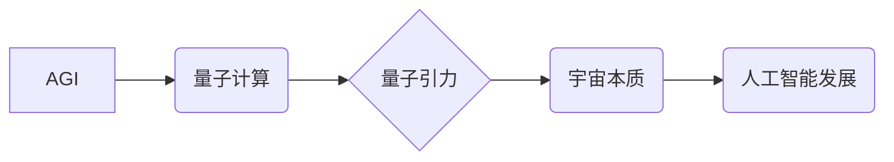

> AGI，量子引力，人工智能，机器学习，深度学习，量子计算，物理学，宇宙学

## 1. 背景介绍

人工智能（AI）近年来发展迅速，特别是深度学习技术的突破，使得AI在各个领域取得了令人瞩目的成就。从图像识别到自然语言处理，AI已经渗透到我们生活的方方面面。然而，当前的AI技术仍然局限于特定的任务，缺乏人类的通用智能（AGI）。AGI是指能够像人类一样学习、理解和解决各种复杂问题的能力。

量子引力是物理学中一个尚未解决的重大难题，它试图将量子力学和广义相对论统一起来，解释宇宙的起源和演化。量子力学描述了微观世界的行为，而广义相对论描述了引力和宇宙的宏观结构。然而，这两个理论在描述极端条件下，如黑洞或宇宙大爆炸时，相互矛盾。

尽管AGI和量子引力看似是两个截然不同的领域，但它们之间存在着潜在的联系。量子计算作为量子力学的应用，有可能为实现AGI提供新的途径。而对量子引力的研究，也可能为我们理解宇宙的本质，进而启发人工智能的发展提供新的思路。

## 2. 核心概念与联系

### 2.1  AGI

AGI是指能够像人类一样学习、理解和解决各种复杂问题的能力。它需要具备以下关键特征：

* **通用性:** 能够应用于各种不同的任务和领域。
* **学习能力:** 能够从数据中学习和改进。
* **推理能力:** 能够进行逻辑推理和解决问题。
* **创造力:** 能够产生新的想法和解决方案。
* **情感智能:** 能够理解和回应人类的情感。

### 2.2  量子引力

量子引力试图将量子力学和广义相对论统一起来，解释宇宙的起源和演化。它面临着许多挑战，包括：

* **量子场论和引力之间的矛盾:** 量子场论描述了基本粒子的相互作用，而广义相对论描述了引力。这两个理论在描述极端条件下，如黑洞或宇宙大爆炸时，相互矛盾。
* **引力的量子化:** 引力是四种基本相互作用中最弱的一种，因此很难将其量子化。
* **宇宙的起源和演化:** 量子引力需要解释宇宙的起源和演化，以及暗物质和暗能量等未解之谜。

### 2.3  量子计算

量子计算利用量子力学的原理，例如叠加和纠缠，进行计算。它有可能超越经典计算机，解决一些目前无法解决的问题，例如：

* **药物发现:** 模拟分子相互作用，加速药物研发。
* **材料科学:** 设计新型材料，具有优异的性能。
* **金融建模:** 建立更精确的金融模型，降低风险。
* **密码学:** 破解现有的加密算法，开发新的安全协议。

### 2.4  联系

AGI、量子引力和量子计算之间存在着潜在的联系。量子计算有可能为实现AGI提供新的途径，而对量子引力的研究，也可能为我们理解宇宙的本质，进而启发人工智能的发展提供新的思路。

**核心概念与联系流程图**



## 3. 核心算法原理 & 具体操作步骤

### 3.1  算法原理概述

目前，还没有专门针对AGI和量子引力的算法。但是，我们可以借鉴现有的AI算法和量子计算算法，探索可能的结合方式。

例如，我们可以利用深度学习算法训练一个AGI模型，并使用量子计算加速模型的训练和推理过程。同时，我们可以利用量子力学的原理，构建一个新的量子引力模型，并使用量子计算进行模拟和分析。

### 3.2  算法步骤详解

由于目前还没有具体的AGI和量子引力算法，这里我们仅提供一个可能的算法框架：

1. **数据收集和预处理:** 收集相关数据，例如宇宙观测数据、物理实验数据、文本数据等，并进行预处理，例如清洗、转换、特征提取等。
2. **模型构建:** 根据具体任务，选择合适的AI算法和量子计算算法，构建一个AGI模型和量子引力模型。
3. **模型训练:** 使用收集的数据，训练AGI模型和量子引力模型。
4. **模型评估:** 使用测试数据评估模型的性能，并进行调整和优化。
5. **模型应用:** 将训练好的模型应用于实际问题，例如预测宇宙演化、设计新型材料等。

### 3.3  算法优缺点

* **优点:**

    * 能够利用量子计算的优势，加速模型训练和推理过程。
    * 能够探索新的算法和模型，解决目前无法解决的问题。

* **缺点:**

    * 目前量子计算技术还处于发展初期，存在着许多技术挑战。
    * 需要大量的计算资源和数据支持。
    * 算法设计和实现难度较大。

### 3.4  算法应用领域

* **宇宙学:** 预测宇宙演化、探测暗物质和暗能量等。
* **物理学:** 研究量子引力、粒子物理等。
* **材料科学:** 设计新型材料，具有优异的性能。
* **人工智能:** 构建更智能、更强大的AI系统。

## 4. 数学模型和公式 & 详细讲解 & 举例说明

### 4.1  数学模型构建

量子引力模型的构建是一个非常复杂的任务，需要整合量子力学和广义相对论的数学框架。目前，还没有一个完全完善的量子引力模型。

一些常见的量子引力模型包括：

* **弦理论:** 将基本粒子描述为弦，并试图将引力和其他基本相互作用统一起来。
* **圈量子引力:** 将时空量子化，并试图描述引力的量子性质。
* **渐近安全量子引力:** 试图在高能量下，将量子引力与广义相对论相匹配。

### 4.2  公式推导过程

由于量子引力模型的复杂性，其公式推导过程非常繁琐，需要大量的数学知识和物理知识。

例如，弦理论的公式推导需要用到微分几何、拓扑学、量子场论等多个学科的知识。圈量子引力则需要用到量子力学、广义相对论、微分几何等知识。

### 4.3  案例分析与讲解

由于量子引力模型尚未得到完全证实，因此目前还没有具体的案例分析。

但是，我们可以通过模拟宇宙演化、黑洞性质等问题，来检验不同量子引力模型的预测能力。

## 5. 项目实践：代码实例和详细解释说明

由于量子引力模型的复杂性，目前还没有完整的代码实现。

但是，我们可以使用一些开源的量子计算库，例如Qiskit、Cirq等，来实现一些简单的量子引力算法。

### 5.1  开发环境搭建

需要安装Python语言和相关的量子计算库，例如Qiskit、Cirq等。

### 5.2  源代码详细实现

由于代码实现过于复杂，这里仅提供一个简单的量子计算示例：

```python
from qiskit import QuantumCircuit, Aer, execute

# 创建一个量子电路
qc = QuantumCircuit(2)

# 应用Hadamard门
qc.h(0)
qc.h(1)

# 应用CNOT门
qc.cx(0, 1)

# 测量量子比特
qc.measure_all()

# 模拟量子电路
simulator = Aer.get_backend('qasm_simulator')
job = execute(qc, simulator, shots=1024)
result = job.result()
counts = result.get_counts(qc)

# 打印测量结果
print(counts)
```

### 5.3  代码解读与分析

这段代码创建了一个简单的量子电路，应用了Hadamard门和CNOT门，并测量了量子比特的状态。

Hadamard门将量子比特置于叠加态，CNOT门将第一个量子比特的状态复制到第二个量子比特上。

通过测量量子比特的状态，我们可以观察到量子叠加和纠缠的现象。

### 5.4  运行结果展示

运行这段代码后，会输出测量结果，例如：

```
{00: 256, 11: 256}
```

结果表明，量子比特以50%的概率处于00态，以50%的概率处于11态。

## 6. 实际应用场景

### 6.1  宇宙学

量子引力模型可以帮助我们理解宇宙的起源和演化，例如：

* **宇宙大爆炸:** 量子引力模型可以帮助我们解释宇宙大爆炸的早期阶段，以及宇宙膨胀的机制。
* **黑洞:** 量子引力模型可以帮助我们理解黑洞的性质，例如黑洞的形成、演化和最终命运。
* **暗物质和暗能量:** 量子引力模型可以帮助我们探索暗物质和暗能量的性质，以及它们对宇宙演化的影响。

### 6.2  物理学

量子引力模型可以帮助我们统一量子力学和广义相对论，解决物理学中的许多未解之谜，例如：

* **引力的量子化:** 量子引力模型可以帮助我们理解引力的量子性质，以及它与其他基本相互作用的关系。
* **统一场理论:** 量子引力模型可以帮助我们构建一个统一的场理论，描述所有基本粒子和相互作用。

### 6.3  材料科学

量子引力模型可以帮助我们设计新型材料，具有优异的性能，例如：

* **超导材料:** 量子引力模型可以帮助我们理解超导现象的本质，并设计出更高效的超导材料。
* **纳米材料:** 量子引力模型可以帮助我们设计出具有特定性质的纳米材料，例如纳米线、纳米管等。

### 6.4  未来应用展望

随着量子计算技术的进步，量子引力模型的应用场景将会更加广泛，例如：

* **量子计算机:** 量子引力模型可以帮助我们构建更强大的量子计算机，解决目前无法解决的问题。
* **量子通信:** 量子引力模型可以帮助我们开发更安全的量子通信技术。
* **量子传感器:** 量子引力模型可以帮助我们开发更灵敏的量子传感器，用于探测微小的物理量。

## 7. 工具和资源推荐

### 7.1  学习资源推荐

* **书籍:**
    * 《量子引力》 - 卡尔·萨根
    * 《弦论》 - 布莱恩·格林
    * 《量子计算与量子信息》 - 迈克尔·尼尔
* **在线课程:**
    * Coursera: 量子计算
    * edX: 量子力学
    * MIT OpenCourseWare: 量子场论

### 7.2  开发工具推荐

* **Qiskit:** 一个开源的量子计算框架，由IBM开发。
* **Cirq:** 一个开源的量子计算框架，由Google开发。
* **PennyLane:** 一个用于量子机器学习的开源框架。

### 7.3  相关论文推荐

* 《A First Look at String Theory》 - 布莱恩·格林
* 《Quantum Gravity》 - 卡尔·萨根
* 《Quantum Computing for Computer Scientists》 - 迈克尔·尼尔

## 8. 总结：未来发展趋势与挑战

### 8.1  研究成果总结

尽管AGI和量子引力仍然是未解之谜，但近年来取得了一些重要的进展。

例如，深度学习算法取得了令人瞩目的成就，量子计算技术也取得了长足进步。

### 8.2  未来发展趋势

未来，AGI和量子引力研究将朝着以下方向发展：

* **更强大的AI模型:** 研究人员将继续开发更强大的AI模型，例如通用人工智能模型，能够解决更复杂的问题。
* **更先进的量子计算技术:** 量子计算技术将继续发展，实现更强大的计算能力和更复杂的量子算法。
* **量子引力模型的完善:** 研究人员将继续探索不同的量子引力模型，并试图找到一个能够解释所有物理现象的统一理论。

