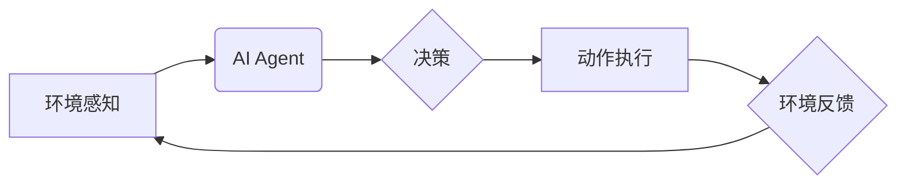

> AI Agent, 具身机器人, 工业自动化, 深度学习, 自然语言处理, 计算机视觉, 协作机器人, 智能制造

## 1. 背景介绍

人工智能（AI）技术近年来取得了飞速发展，从语音识别、图像识别到自然语言处理等领域取得了突破性进展。然而，传统的AI模型大多局限于数字空间，缺乏与物理世界直接交互的能力。而具身机器人作为AI技术的延伸，能够将AI算法与物理世界相结合，拥有感知、运动和决策的能力，为AI技术的发展提供了新的方向。

工业领域一直是AI技术应用的重点领域之一。传统的工业生产模式面临着效率低下、成本高昂、劳动强度大等问题。而具身机器人能够通过自动化、智能化等手段，提高生产效率、降低生产成本、改善工作环境，为工业生产带来革命性的变革。

## 2. 核心概念与联系

**2.1 AI Agent**

AI Agent是指能够感知环境、做出决策并执行行动的智能体。它是一个独立的软件系统，能够根据预设的目标和环境信息，自主地学习、规划和执行任务。

**2.2 具身机器人**

具身机器人是指具有物理实体的机器人，能够感知周围环境并与之交互。它通常由传感器、执行器、控制系统和人工智能算法组成。

**2.3 AI Agent与具身机器人的联系**

AI Agent可以作为具身机器人的智能控制系统，负责感知环境、规划任务和控制机器人的动作。具身机器人为AI Agent提供了感知物理世界和执行动作的平台，而AI Agent则赋予了具身机器人智能化和自主化的能力。

**2.4 架构图**



## 3. 核心算法原理 & 具体操作步骤

**3.1 算法原理概述**

具身机器人中的AI Agent通常采用强化学习算法进行训练。强化学习是一种机器学习方法，通过在环境中与环境交互，学习最优的策略来最大化奖励。

**3.2 算法步骤详解**

1. **环境建模:** 建立一个数学模型来描述具身机器人的环境，包括状态空间、动作空间和奖励函数。
2. **策略学习:** 使用强化学习算法，例如Q学习或深度Q网络，训练一个策略函数，该函数能够根据当前状态预测最优的动作。
3. **环境交互:** 让具身机器人与环境交互，根据策略函数选择动作，并根据环境反馈获得奖励。
4. **策略更新:** 使用获得的奖励信息更新策略函数，使其朝着最大化奖励的方向学习。
5. **重复步骤3和4:** 持续地与环境交互和更新策略函数，直到策略函数收敛到一个稳定的状态。

**3.3 算法优缺点**

**优点:**

* 可以学习复杂的任务，无需人工编程。
* 可以适应动态变化的环境。
* 可以通过奖励机制引导机器人学习目标行为。

**缺点:**

* 训练时间长，需要大量的环境交互数据。
* 容易陷入局部最优解。
* 难以解释模型的决策过程。

**3.4 算法应用领域**

* **工业自动化:** 自动化生产线、机器人协作、物流配送等。
* **医疗保健:** 机器人手术、康复训练、药物配送等。
* **服务业:** 机器人客服、家政服务、餐饮服务等。

## 4. 数学模型和公式 & 详细讲解 & 举例说明

**4.1 数学模型构建**

我们用一个简单的状态空间和动作空间来描述具身机器人的环境。

* **状态空间:** S = {s1, s2, ..., sn}，其中si表示机器人处于某个特定的状态。
* **动作空间:** A = {a1, a2, ..., am}，其中ai表示机器人可以执行的动作。

**4.2 公式推导过程**

强化学习的目标是找到一个策略函数π(s)来最大化累积奖励。策略函数π(s)将状态s映射到动作a。

* **奖励函数:** R(s, a)表示在状态s执行动作a获得的奖励。
* **价值函数:** V(s)表示从状态s开始执行最优策略的累积奖励。

**Bellman方程:**

```latex
V(s) = \max_{a \in A} [R(s, a) + \gamma \sum_{s' \in S} P(s' | s, a) V(s')]
```

其中：

* γ是折扣因子，控制未来奖励的权重。
* P(s' | s, a)是状态s执行动作a转移到状态s'的概率。

**4.3 案例分析与讲解**

假设一个具身机器人需要在迷宫中找到出口。

* **状态空间:** 每个房间都是一个状态。
* **动作空间:** 向上、向下、向左、向右四个方向。
* **奖励函数:** 找到出口获得最大奖励，迷路或撞墙获得负奖励。

通过强化学习算法，机器人可以学习最优的路径，找到出口。

## 5. 项目实践：代码实例和详细解释说明

**5.1 开发环境搭建**

* 操作系统: Ubuntu 20.04
* Python 版本: 3.8
* 库依赖: TensorFlow, PyTorch, ROS

**5.2 源代码详细实现**

```python
import tensorflow as tf

# 定义神经网络模型
model = tf.keras.models.Sequential([
    tf.keras.layers.Dense(128, activation='relu', input_shape=(input_dim,)),
    tf.keras.layers.Dense(64, activation='relu'),
    tf.keras.layers.Dense(num_actions)
])

# 定义损失函数和优化器
optimizer = tf.keras.optimizers.Adam()
loss_fn = tf.keras.losses.CategoricalCrossentropy()

# 训练模型
for epoch in range(num_epochs):
    for state, action, reward, next_state, done in dataset:
        with tf.GradientTape() as tape:
            predictions = model(state)
            loss = loss_fn(action, predictions)
        gradients = tape.gradient(loss, model.trainable_variables)
        optimizer.apply_gradients(zip(gradients, model.trainable_variables))

# 保存模型
model.save('trained_model.h5')
```

**5.3 代码解读与分析**

* 代码定义了一个简单的深度神经网络模型，用于预测最优动作。
* 模型输入是当前状态，输出是每个动作的概率分布。
* 使用强化学习算法训练模型，目标是最大化累积奖励。
* 训练完成后，保存模型以便后续使用。

**5.4 运行结果展示**

通过训练后的模型，可以控制具身机器人完成任务，例如在迷宫中找到出口。

## 6. 实际应用场景

**6.1 工业自动化**

* **机器人协作:** 多个具身机器人协同工作，完成复杂的任务，例如装配、焊接、搬运等。
* **智能制造:** 利用AI Agent控制生产线，实现自动化生产、质量控制和生产优化。

**6.2 医疗保健**

* **机器人手术:** AI Agent辅助医生进行手术，提高手术精度和安全性。
* **康复训练:** 机器人提供个性化的康复训练，帮助患者恢复功能。

**6.3 其他应用场景**

* **物流配送:** 自动化物流配送，提高效率和准确性。
* **农业生产:** 智能农业机器人，实现精准种植、施肥和病虫害防治。

**6.4 未来应用展望**

随着AI技术和机器人技术的不断发展，具身机器人将在更多领域得到应用，例如：

* **服务机器人:** 提供个性化服务，例如家政服务、陪伴服务、教育服务等。
* **探索机器人:** 用于探索未知环境，例如深海、太空等。
* **灾害救援机器人:** 用于灾害救援，例如地震、洪水等。

## 7. 工具和资源推荐

**7.1 学习资源推荐**

* **书籍:**
    * 《Reinforcement Learning: An Introduction》
    * 《Deep Reinforcement Learning Hands-On》
* **在线课程:**
    * Coursera: Reinforcement Learning Specialization
    * Udacity: Intro to Artificial Intelligence

**7.2 开发工具推荐**

* **ROS (Robot Operating System):** 用于机器人开发的开源平台。
* **Gazebo:** 用于机器人仿真和测试的开源软件。
* **TensorFlow/PyTorch:** 用于深度学习模型开发的开源框架。

**7.3 相关论文推荐**

* **DeepMind's AlphaGo:** 
* **OpenAI Five:** 
* **Deep Reinforcement Learning for Robotics:**

## 8. 总结：未来发展趋势与挑战

**8.1 研究成果总结**

近年来，AI Agent与具身机器人的结合取得了显著进展，在工业自动化、医疗保健等领域展现出巨大的应用潜力。

**8.2 未来发展趋势**

* **更强大的AI算法:** 发展更强大的强化学习算法，能够解决更复杂的任务。
* **更灵活的机器人平台:** 开发更灵活、更适应不同环境的机器人平台。
* **更安全的AI系统:** 确保AI系统安全可靠，避免潜在的风险。

**8.3 面临的挑战**

* **数据获取和标注:** 强化学习算法需要大量的环境交互数据，数据获取和标注成本高昂。
* **模型解释性和可信度:** 强化学习模型的决策过程难以解释，难以获得用户的信任。
* **伦理和社会影响:** AI Agent的应用可能带来伦理和社会问题，需要进行深入的思考和讨论。

**8.4 研究展望**

未来，AI Agent与具身机器人的研究将继续深入，推动人工智能技术向更智能、更安全、更可持续的方向发展。


## 9. 附录：常见问题与解答

**9.1 如何选择合适的强化学习算法？**

选择合适的强化学习算法取决于具体的应用场景和任务需求。例如，对于离散动作空间的任务，可以使用Q学习算法；对于连续动作空间的任务，可以使用深度Q网络算法。

**9.2 如何解决数据获取和标注问题？**

可以利用模拟环境进行数据生成，或者使用迁移学习技术，将已有的知识迁移到新的任务中。

**9.3 如何提高模型的解释性和可信度？**

可以使用可解释机器学习方法，例如LIME或SHAP，解释模型的决策过程。也可以通过进行安全性测试和评估，提高模型的可信度。


作者：禅与计算机程序设计艺术 / Zen and the Art of Computer Programming 
<end_of_turn>