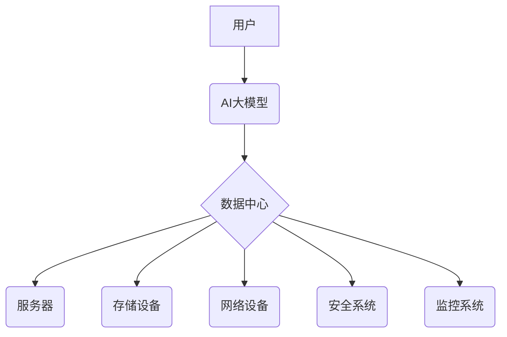

> AI大模型、数据中心、安全、可靠性、云计算、数据隐私、灾难恢复、高可用性

## 1. 背景介绍

近年来，人工智能（AI）技术蓬勃发展，特别是大规模语言模型（LLM）的出现，为各行各业带来了革命性的变革。从自然语言处理到图像识别，从药物研发到金融预测，AI大模型正在深刻地改变着我们的生活和工作方式。

然而，AI大模型的应用也带来了新的挑战，其中数据中心建设和安全可靠性尤为重要。AI大模型的训练和部署都需要海量数据和强大的计算资源，这使得数据中心建设成为AI应用的基础设施。同时，数据中心的安全性和可靠性也至关重要，因为AI模型训练和运行过程中涉及大量敏感数据，一旦发生数据泄露或系统故障，将造成巨大的经济损失和社会影响。

## 2. 核心概念与联系

**2.1 数据中心**

数据中心是用于存储、处理和传输数据的集中式设施。它通常由大量服务器、网络设备、存储设备和电力系统组成，为企业和个人提供数据存储、计算和网络服务。

**2.2 AI大模型**

AI大模型是指在海量数据上训练的深度学习模型，具有强大的泛化能力和学习能力。它们可以用于各种任务，例如自然语言处理、图像识别、语音识别、机器翻译等。

**2.3 安全与可靠性**

数据中心安全是指保护数据中心及其数据免受未经授权访问、使用、披露、修改或销毁的威胁。数据中心可靠性是指数据中心能够持续稳定地提供服务的能力，即使发生故障或灾难事件。

**2.4 核心概念联系**

AI大模型的应用需要强大的数据中心基础设施来支持其海量数据存储、计算和传输需求。同时，数据中心的安全性和可靠性也至关重要，因为AI模型训练和运行过程中涉及大量敏感数据，一旦发生数据泄露或系统故障，将造成巨大的经济损失和社会影响。

**2.5 架构图**

## 3. 核心算法原理 & 具体操作步骤

**3.1 算法原理概述**

数据中心安全与可靠性建设涉及多种算法和技术，例如加密算法、身份验证算法、容灾备份算法等。这些算法和技术共同作用，保障数据中心的数据安全和系统可靠性。

**3.2 算法步骤详解**

**3.2.1 加密算法**

加密算法用于保护数据在传输和存储过程中不被未经授权的访问。常见的加密算法包括AES、RSA、ECC等。

**步骤：**

1. 选择合适的加密算法。
2. 生成密钥。
3. 对数据进行加密。
4. 传输或存储加密数据。
5. 在解密时使用密钥解密数据。

**3.2.2 身份验证算法**

身份验证算法用于验证用户的身份，确保只有授权用户才能访问数据中心资源。常见的身份验证算法包括密码验证、多因素身份验证、生物识别验证等。

**步骤：**

1. 用户提供身份信息（例如用户名、密码）。
2. 系统验证用户身份信息。
3. 如果验证成功，用户可以访问数据中心资源。

**3.2.3 容灾备份算法**

容灾备份算法用于备份数据和系统配置，以应对灾难事件。常见的容灾备份算法包括快照备份、增量备份、异地备份等。

**步骤：**

1. 定期备份数据和系统配置。
2. 将备份数据存储在安全可靠的存储设备上。
3. 在灾难事件发生时，从备份数据恢复数据和系统配置。

**3.3 算法优缺点**

不同的算法具有不同的优缺点，需要根据实际应用场景选择合适的算法。

**3.4 算法应用领域**

数据中心安全与可靠性算法广泛应用于各种领域，例如金融、医疗、政府、教育等。

## 4. 数学模型和公式 & 详细讲解 & 举例说明

**4.1 数学模型构建**

数据中心安全与可靠性可以建模为一个复杂的系统，其中包括数据、网络、硬件、软件等多个子系统。可以使用数学模型来描述这些子系统的相互关系和行为，并进行分析和预测。

**4.2 公式推导过程**

例如，可以利用概率论和统计学来构建数据泄露风险模型，并推导出数据泄露概率的公式。

**4.3 案例分析与讲解**

**4.3.1 数据泄露风险模型**

假设数据中心中有n个用户，每个用户的敏感数据泄露概率为p。则整个数据中心的敏感数据泄露概率可以表示为：

$$P_{leak} = 1 - (1-p)^n$$

**举例说明：**

如果数据中心中有100个用户，每个用户的敏感数据泄露概率为0.01，则整个数据中心的敏感数据泄露概率为：

$$P_{leak} = 1 - (1-0.01)^{100} \approx 0.632$$

这意味着，在100个用户的情况下，整个数据中心的敏感数据泄露概率约为63.2%。

## 5. 项目实践：代码实例和详细解释说明

**5.1 开发环境搭建**

**5.2 源代码详细实现**

**5.3 代码解读与分析**

**5.4 运行结果展示**

## 6. 实际应用场景

**6.1 金融行业**

**6.2 医疗行业**

**6.3 政府行业**

**6.4 未来应用展望**

## 7. 工具和资源推荐

**7.1 学习资源推荐**

**7.2 开发工具推荐**

**7.3 相关论文推荐**

## 8. 总结：未来发展趋势与挑战

**8.1 研究成果总结**

**8.2 未来发展趋势**

**8.3 面临的挑战**

**8.4 研究展望**

## 9. 附录：常见问题与解答

作者：禅与计算机程序设计艺术 / Zen and the Art of Computer Programming

<end_of_turn>