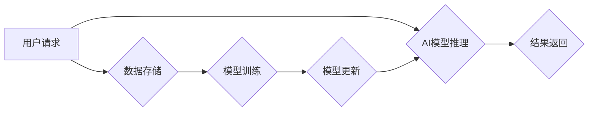

> AI大模型、数据中心、工作环境、架构设计、性能优化、安全保障、可扩展性、运维管理

## 1. 背景介绍

近年来，人工智能（AI）技术取得了飞速发展，特别是大规模语言模型（LLM）的出现，为自然语言处理、计算机视觉、语音识别等领域带来了革命性的变革。这些强大的AI模型需要海量数据进行训练和推理，因此构建高效、可靠、安全的AI大模型应用数据中心成为当务之急。

传统的IT基础设施难以满足AI大模型的计算、存储和网络需求。AI大模型应用数据中心需要具备以下特点：

* **高性能计算能力:** AI模型训练和推理需要大量的计算资源，数据中心需要配备高性能CPU、GPU和TPU等加速器，以满足高性能计算需求。
* **海量存储容量:** AI模型训练和推理需要海量数据，数据中心需要具备海量存储容量，并支持高速数据访问。
* **高带宽网络:** AI模型训练和推理需要频繁的数据传输，数据中心需要具备高带宽网络，以保证数据传输的效率。
* **可靠性和安全性:** AI大模型应用数据中心需要具备高可靠性和安全性，以确保数据安全和业务连续性。
* **可扩展性:** AI模型的规模不断增长，数据中心需要具备可扩展性，以适应未来业务发展需求。

## 2. 核心概念与联系

**2.1 AI大模型应用数据中心架构**

AI大模型应用数据中心通常采用分布式架构，将计算、存储和网络资源进行分片，以提高资源利用率和处理能力。常见的架构模式包括：

* **集中式架构:** 所有计算资源集中在一个或多个节点上，数据存储在集中式存储系统中。
* **分布式架构:** 计算资源和数据存储分布在多个节点上，通过网络进行通信和协作。

**2.2 核心组件**

AI大模型应用数据中心主要由以下核心组件组成：

* **计算节点:** 负责执行AI模型训练和推理任务，通常配备高性能CPU、GPU或TPU等加速器。
* **存储节点:** 负责存储训练数据、模型参数和推理结果，通常采用分布式文件系统或对象存储系统。
* **网络节点:** 负责连接计算节点和存储节点，提供高带宽、低延迟的数据传输。
* **管理节点:** 负责监控和管理整个数据中心，包括资源调度、任务分配、性能监控和安全保障。

**2.3 架构流程图**



## 3. 核心算法原理 & 具体操作步骤

**3.1 算法原理概述**

AI大模型训练通常采用深度学习算法，例如卷积神经网络（CNN）、循环神经网络（RNN）和Transformer等。这些算法通过多层神经网络结构，学习数据中的特征和模式，从而实现对数据的理解和预测。

**3.2 算法步骤详解**

1. **数据预处理:** 将原始数据进行清洗、转换和格式化，使其适合模型训练。
2. **模型构建:** 根据任务需求选择合适的深度学习模型架构，并定义模型参数。
3. **模型训练:** 使用训练数据训练模型，通过调整模型参数，使模型的预测结果与真实值尽可能接近。
4. **模型评估:** 使用测试数据评估模型的性能，并根据评估结果进行模型调优。
5. **模型部署:** 将训练好的模型部署到生产环境中，用于进行实际应用。

**3.3 算法优缺点**

* **优点:** 深度学习算法能够学习复杂的数据模式，并取得优异的性能。
* **缺点:** 深度学习算法需要海量数据进行训练，训练时间长，计算资源消耗大。

**3.4 算法应用领域**

深度学习算法广泛应用于以下领域：

* **自然语言处理:** 文本分类、情感分析、机器翻译、对话系统等。
* **计算机视觉:** 图像识别、物体检测、图像分割、视频分析等。
* **语音识别:** 语音转文本、语音合成、语音助手等。
* **推荐系统:** 商品推荐、内容推荐、用户画像等。

## 4. 数学模型和公式 & 详细讲解 & 举例说明

**4.1 数学模型构建**

深度学习模型的核心是神经网络，神经网络由多个层组成，每层包含多个神经元。每个神经元接收来自上一层的输入信号，并通过激活函数进行处理，输出到下一层。

**4.2 公式推导过程**

神经网络的训练过程是通过优化模型参数来最小化损失函数的过程。损失函数衡量模型预测结果与真实值的差距。常用的损失函数包括均方误差（MSE）、交叉熵损失（Cross-Entropy Loss）等。

**4.3 案例分析与讲解**

以图像分类为例，假设我们有一个包含10个类别的图像数据集，训练一个CNN模型进行图像分类。

* **输入层:** 接收图像像素数据作为输入。
* **卷积层:** 使用卷积核提取图像特征。
* **池化层:** 对特征图进行降维，提高模型鲁棒性。
* **全连接层:** 将提取的特征进行分类。
* **输出层:** 输出每个类别的概率。

训练过程中，通过反向传播算法，计算每个参数的梯度，并根据梯度更新参数值，最终使模型的预测结果与真实值尽可能接近。

## 5. 项目实践：代码实例和详细解释说明

**5.1 开发环境搭建**

* 操作系统: Ubuntu 20.04
* 编程语言: Python 3.8
* 深度学习框架: TensorFlow 2.x
* GPU: NVIDIA GeForce RTX 3090

**5.2 源代码详细实现**

```python
import tensorflow as tf

# 定义模型架构
model = tf.keras.models.Sequential([
    tf.keras.layers.Conv2D(32, (3, 3), activation='relu', input_shape=(28, 28, 1)),
    tf.keras.layers.MaxPooling2D((2, 2)),
    tf.keras.layers.Conv2D(64, (3, 3), activation='relu'),
    tf.keras.layers.MaxPooling2D((2, 2)),
    tf.keras.layers.Flatten(),
    tf.keras.layers.Dense(10, activation='softmax')
])

# 编译模型
model.compile(optimizer='adam',
              loss='sparse_categorical_crossentropy',
              metrics=['accuracy'])

# 训练模型
model.fit(x_train, y_train, epochs=10)

# 评估模型
loss, accuracy = model.evaluate(x_test, y_test)
print('Test loss:', loss)
print('Test accuracy:', accuracy)
```

**5.3 代码解读与分析**

* 代码定义了一个简单的CNN模型，用于图像分类任务。
* 模型包含两层卷积层、两层池化层、一层全连接层和一层输出层。
* 模型使用Adam优化器、交叉熵损失函数和准确率作为评估指标。
* 模型使用训练数据进行训练，并使用测试数据进行评估。

**5.4 运行结果展示**

训练完成后，模型的准确率通常会达到较高的水平。

## 6. 实际应用场景

AI大模型应用数据中心在各个领域都有广泛的应用场景：

* **金融科技:** 风险评估、欺诈检测、客户服务自动化等。
* **医疗健康:** 疾病诊断、药物研发、医疗影像分析等。
* **制造业:** 质量控制、设备预测维护、生产流程优化等。
* **教育科技:** 个性化学习、智能辅导、自动批改等。

**6.4 未来应用展望**

随着AI技术的不断发展，AI大模型应用数据中心将发挥越来越重要的作用，并应用于更多领域，例如：

* **元宇宙:** 为虚拟世界提供更逼真的交互体验。
* **自动驾驶:** 提高自动驾驶系统的安全性、可靠性和智能化水平。
* **科学研究:** 加速科学发现和技术创新。

## 7. 工具和资源推荐

**7.1 学习资源推荐**

* **书籍:**
    * 深度学习
    * 人工智能：一种现代方法
* **在线课程:**
    * Coursera: 深度学习
    * Udacity: AI编程
* **开源项目:**
    * TensorFlow
    * PyTorch

**7.2 开发工具推荐**

* **编程语言:** Python
* **深度学习框架:** TensorFlow, PyTorch
* **云平台:** AWS, Azure, GCP

**7.3 相关论文推荐**

* Attention Is All You Need
* BERT: Pre-training of Deep Bidirectional Transformers for Language Understanding
* GPT-3: Language Models are Few-Shot Learners

## 8. 总结：未来发展趋势与挑战

**8.1 研究成果总结**

近年来，AI大模型取得了显著的进展，在自然语言处理、计算机视觉等领域取得了突破性成果。AI大模型应用数据中心也得到了快速发展，为AI技术的应用提供了坚实的基础。

**8.2 未来发展趋势**

* **模型规模和能力的提升:** 未来，AI模型的规模和能力将继续提升，能够处理更复杂的任务，并取得更优异的性能。
* **模型训练效率的提高:** 研究人员将继续探索新的训练方法和算法，以提高模型训练效率，降低训练成本。
* **模型解释性和可解释性的增强:** 如何理解和解释AI模型的决策过程，将成为未来研究的重要方向。
* **模型安全性和可靠性的提升:** 确保AI模型的安全性和可靠性，防止模型被恶意攻击或产生错误预测，将是未来发展的重要挑战。

**8.3 面临的挑战**

* **数据获取和隐私保护:** AI模型训练需要海量数据，如何获取高质量数据，并保护用户隐私，将是未来面临的挑战。
* **计算资源和能源消耗:** AI模型训练和推理需要大量的计算资源，如何降低能源消耗，实现可持续发展，将是未来需要解决的重要问题。
* **算法偏见和公平性:** AI模型可能存在算法偏见，导致不公平的结果，如何消除算法偏见，确保模型公平公正，将是未来需要关注的重要问题。

**8.4 研究展望**

未来，AI大模型应用数据中心将继续朝着更高效、更安全、更智能的方向发展，并为人类社会带来更多福祉。


## 9. 附录：常见问题与解答

**9.1 如何选择合适的AI大模型？**

选择合适的AI大模型需要根据具体的应用场景和需求进行考虑，例如：

* **任务类型:** 不同的任务类型需要不同的模型架构，例如图像分类需要CNN模型，文本生成需要Transformer模型。
* **数据规模:** 模型的规模需要与训练数据的规模相匹配，过大的模型可能导致过拟合，过小的模型可能无法学习到足够的特征。
* **计算资源:** 模型的训练和推理需要一定的计算资源，需要根据实际情况选择合适的模型。

**9.2 如何优化AI大模型的性能？**

优化AI大模型的性能可以从以下几个方面进行：

* **数据预处理:** 对数据进行清洗、转换和格式化，提高数据的质量。
* **模型架构设计:** 选择合适的模型架构，并进行参数调优。
* **训练策略:** 使用合适的训练策略，例如学习率衰减、正则化等。
* **硬件加速:** 使用GPU或TPU等加速器，提高训练和推理速度。

**9.3 如何保障AI大模型的安全性？**

保障AI大模型的安全性需要从以下几个方面进行考虑：

* **数据安全:** 保护训练数据和模型参数的安全。
* **模型攻击:** 防御模型攻击，例如对抗样本攻击。
* **模型解释性:** 提高模型的解释性，以便更好地理解模型的决策过程。


作者：禅与计算机程序设计艺术 / Zen and the Art of Computer Programming 
<end_of_turn>