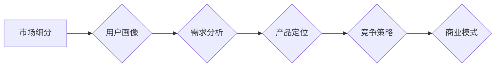

> AI创业公司,市场细分,用户画像,需求分析,产品定位,竞争策略,商业模式

## 1. 背景介绍

人工智能 (AI) 技术的快速发展，为创业者带来了前所未有的机遇。然而，AI 领域的竞争也日益激烈。为了在激烈的市场竞争中脱颖而出，AI 创业公司必须进行精准的市场细分，找到自己的目标用户群体，并针对他们的需求开发出具有竞争力的产品和服务。

传统的市场细分方法，例如根据人口统计学特征、地理位置等，在 AI 领域并不适用。因为 AI 技术的应用场景广泛，用户群体也更加多元化。因此，AI 创业公司需要采用更细致、更精准的市场细分方法，才能有效地锁定目标用户，并实现商业成功。

## 2. 核心概念与联系

### 2.1 市场细分

市场细分是指将一个庞大的市场分割成若干个相对独立、具有共同特征的子市场。每个子市场都拥有特定的需求、行为模式和购买力。通过对市场进行细分，企业可以更精准地了解目标用户的需求，并针对性地开发产品和服务，提高市场营销的效率和效果。

### 2.2 用户画像

用户画像是指对目标用户进行深入分析，并构建出其特征、行为、需求等方面的详细描述。用户画像可以帮助 AI 创业公司更深入地了解目标用户的需求，并为产品开发、市场营销等方面提供参考。

### 2.3 需求分析

需求分析是指对目标用户群体进行调查研究，了解其对 AI 技术的期望、需求和痛点。通过需求分析，AI 创业公司可以确定产品的核心功能和价值主张，并制定相应的市场策略。

### 2.4 产品定位

产品定位是指在目标市场中确定产品的独特价值和竞争优势，并将其与竞争对手进行区分。产品定位需要考虑目标用户的需求、市场竞争情况以及企业的自身优势。

### 2.5 竞争策略

竞争策略是指企业在市场竞争中采取的策略，例如价格竞争、差异化竞争、成本领先竞争等。AI 创业公司需要根据自身的优势和市场环境，制定合理的竞争策略，才能在市场竞争中取得成功。

**Mermaid 流程图**



## 3. 核心算法原理 & 具体操作步骤

### 3.1 算法原理概述

市场细分算法通常基于数据挖掘、机器学习等技术，通过分析用户数据、市场数据等，识别出潜在的市场细分群体。常见的市场细分算法包括：

* **聚类算法:** 将用户数据按照相似性进行分组，识别出具有共同特征的用户群体。
* **关联规则挖掘:** 发现用户行为之间的关联关系，例如哪些用户同时购买了哪些产品，从而识别出潜在的市场细分群体。
* **决策树算法:** 根据用户特征和行为数据，构建决策树模型，预测用户的购买行为，从而识别出潜在的市场细分群体。

### 3.2 算法步骤详解

1. **数据收集:** 收集用户数据、市场数据等，例如用户 demographics、购买行为、浏览记录、社交媒体数据等。
2. **数据预处理:** 对收集到的数据进行清洗、转换、编码等预处理操作，确保数据质量和算法的有效性。
3. **特征选择:** 选择与市场细分相关的特征，例如用户年龄、性别、收入、兴趣爱好、购买历史等。
4. **算法训练:** 使用选定的算法对数据进行训练，构建市场细分模型。
5. **模型评估:** 使用测试数据对模型进行评估，评估模型的准确性和有效性。
6. **市场细分:** 根据模型的预测结果，将用户数据进行细分，识别出潜在的市场细分群体。

### 3.3 算法优缺点

**优点:**

* **精准度高:** 基于数据分析的市场细分算法可以识别出更精准的市场细分群体。
* **效率高:** 算法可以自动完成市场细分任务，提高效率。
* **可扩展性强:** 随着数据量的增加，算法可以自动适应，并识别出新的市场细分群体。

**缺点:**

* **数据依赖性强:** 算法的准确性依赖于数据的质量和数量。
* **算法选择:** 需要根据具体情况选择合适的算法，不同的算法适用于不同的场景。
* **解释性:** 一些算法的预测结果难以解释，难以理解算法背后的逻辑。

### 3.4 算法应用领域

* **电商:** 根据用户的购买历史、浏览记录等数据，进行用户画像和市场细分，推荐个性化商品。
* **金融:** 根据用户的信用记录、收入水平等数据，进行用户画像和市场细分，提供个性化的金融产品和服务。
* **教育:** 根据用户的学习习惯、知识水平等数据，进行用户画像和市场细分，提供个性化的教育课程和服务。
* **医疗:** 根据用户的健康状况、病史等数据，进行用户画像和市场细分，提供个性化的医疗服务。

## 4. 数学模型和公式 & 详细讲解 & 举例说明

### 4.1 数学模型构建

市场细分算法通常基于聚类算法，例如 K-means 聚类算法。K-means 聚类算法的目标是将数据点划分为 K 个簇，使得每个簇内的数据点彼此相似，而不同簇之间的数据点差异较大。

### 4.2 公式推导过程

K-means 聚类算法的迭代过程如下：

1. **随机初始化 K 个聚类中心:** 每个聚类中心代表一个簇的中心点。
2. **计算每个数据点到每个聚类中心的距离:** 使用欧氏距离或其他距离度量方法。
3. **将每个数据点分配到距离最近的聚类中心:** 每个数据点属于距离它最近的聚类中心所在的簇。
4. **重新计算每个聚类中心的坐标:** 将每个簇内的所有数据点平均值作为新的聚类中心坐标。
5. **重复步骤 2-4:** 直到聚类中心不再发生变化，或者达到预设的迭代次数。

### 4.3 案例分析与讲解

假设我们有一组用户数据，包含用户的年龄、性别、收入等特征。我们想要将这些用户数据进行细分，识别出具有共同特征的用户群体。

我们可以使用 K-means 聚类算法，将用户数据划分为 3 个簇。通过分析每个簇的用户特征，我们可以发现：

* **簇 1:** 年龄较低、收入较低的用户群体，主要关注时尚、娱乐等方面。
* **簇 2:** 年龄适中、收入适中的用户群体，主要关注生活品质、健康等方面。
* **簇 3:** 年龄较高、收入较高用户群体，主要关注投资理财、养老等方面。

## 5. 项目实践：代码实例和详细解释说明

### 5.1 开发环境搭建

* Python 3.x
* scikit-learn 库

### 5.2 源代码详细实现

```python
from sklearn.cluster import KMeans
import pandas as pd

# 加载用户数据
data = pd.read_csv('user_data.csv')

# 选择特征
features = ['age', 'income', 'education']
X = data[features]

# 使用 K-means 聚类算法进行细分
kmeans = KMeans(n_clusters=3, random_state=0)
kmeans.fit(X)

# 获取聚类结果
labels = kmeans.labels_
data['cluster'] = labels

# 分析每个簇的用户特征
for i in range(3):
    cluster_data = data[data['cluster'] == i]
    print(f'Cluster {i+1}特征:')
    print(cluster_data.describe())
```

### 5.3 代码解读与分析

* 首先，我们加载用户数据，并选择与市场细分相关的特征。
* 然后，我们使用 K-means 聚类算法进行细分，指定聚类数量为 3。
* 接下来，我们获取聚类结果，并将聚类标签添加到用户数据中。
* 最后，我们分析每个簇的用户特征，了解每个簇的用户群体特点。

### 5.4 运行结果展示

运行代码后，我们可以得到每个簇的用户特征描述，例如年龄、收入、教育水平等。通过分析这些特征，我们可以了解每个簇的用户群体特点，并制定相应的市场策略。

## 6. 实际应用场景

### 6.1 电商平台

电商平台可以根据用户的购买历史、浏览记录等数据，进行用户画像和市场细分，推荐个性化商品，提高转化率。例如，可以将用户细分为“时尚爱好者”、“科技控”、“家庭主妇”等不同群体，并针对每个群体推荐相应的商品。

### 6.2 金融机构

金融机构可以根据用户的信用记录、收入水平等数据，进行用户画像和市场细分，提供个性化的金融产品和服务。例如，可以将用户细分为“高净值客户”、“中产阶级”、“低收入群体”等不同群体，并针对每个群体提供相应的理财产品、贷款产品等。

### 6.3 教育机构

教育机构可以根据用户的学习习惯、知识水平等数据，进行用户画像和市场细分，提供个性化的教育课程和服务。例如，可以将用户细分为“初学者”、“进阶用户”、“专家”等不同群体，并针对每个群体提供相应的课程、辅导服务等。

### 6.4 医疗机构

医疗机构可以根据用户的健康状况、病史等数据，进行用户画像和市场细分，提供个性化的医疗服务。例如，可以将用户细分为“慢性病患者”、“亚健康人群”、“健康人群”等不同群体，并针对每个群体提供相应的健康管理服务、疾病预防服务等。

### 6.5 未来应用展望

随着 AI 技术的不断发展，市场细分将更加精准、更加智能。未来，AI 创业公司可以利用更先进的 AI 技术，例如深度学习、自然语言处理等，进行更深入的用户画像和市场细分，为用户提供更加个性化、更加精准的服务。

## 7. 工具和资源推荐

### 7.1 学习资源推荐

* **书籍:**
    * 《Python数据科学手册》
    * 《机器学习实战》
    * 《深入理解机器学习》
* **在线课程:**
    * Coursera: 机器学习
    * edX: 数据科学
    * Udacity: AI 编程

### 7.2 开发工具推荐

* **Python:** 
    * scikit-learn: 机器学习库
    * pandas: 数据分析库
    * matplotlib: 数据可视化库
* **云平台:**
    * AWS
    * Azure
    * GCP

### 7.3 相关论文推荐

* **K-means 聚类算法:**
    * MacQueen, J. (1967). Some methods for classification and analysis of multivariate observations.
* **用户画像:**
    * Chen, Y., & Liu, Y. (2018). User profiling for personalized recommendations.
* **市场细分:**
    * Kotler, P., & Keller, K. L. (2016). Marketing management.

## 8. 总结：未来发展趋势与挑战

### 8.1 研究成果总结

AI 创业公司可以通过利用 AI 技术进行市场细分，精准定位目标用户，开发个性化产品和服务，从而提高市场竞争力。

### 8.2 未来发展趋势

* **更精准的市场细分:** 利用更先进的 AI 技术，例如深度学习、自然语言处理等，进行更深入的用户画像和市场细分。
* **更个性化的产品和服务:** 根据用户的个性化需求，提供更加个性化的产品和服务。
* **更智能的营销策略:** 利用 AI 技术，自动分析用户数据，制定更智能的营销策略。

### 8.3 面临的挑战

* **数据质量:** AI 算法的准确性依赖于数据的质量，需要确保数据的准确性、完整性和一致性。
* **算法选择:** 需要根据具体情况选择合适的算法，不同的算法适用于不同的场景。
* **解释性:** 一