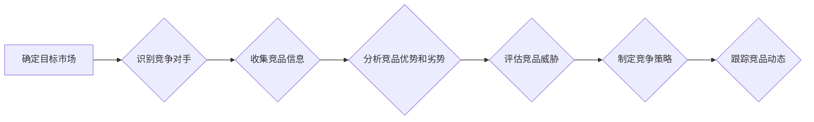

> AI创业公司,竞品分析,市场调研,数据分析,竞争策略,SWOT分析,商业模式,产品定位

## 1. 背景介绍

在瞬息万变的科技市场中，AI创业公司面临着激烈的竞争压力。为了在市场中脱颖而出，深入了解竞争对手是至关重要的。竞品分析可以帮助AI创业公司全面了解竞争对手的优势、劣势、策略和目标，从而制定更有效的市场策略和产品发展方向。

## 2. 核心概念与联系

**2.1 竞品分析的概念**

竞品分析是指对竞争对手进行系统性的研究和评估，以了解其产品、服务、市场定位、营销策略、财务状况等关键信息。通过分析竞争对手的优势和劣势，AI创业公司可以识别市场机会，制定差异化策略，提升自身竞争力。

**2.2 竞品分析与市场调研的关系**

竞品分析是市场调研的重要组成部分。市场调研旨在全面了解目标市场、客户需求、竞争环境等信息，而竞品分析则聚焦于竞争对手，深入挖掘其竞争策略和商业模式。两者相互补充，共同为AI创业公司提供决策依据。

**2.3 竞品分析与商业模式的关系**

商业模式是企业创造价值和获取利润的方式。竞品分析可以帮助AI创业公司了解竞争对手的商业模式，识别其盈利模式、客户获取渠道、成本结构等关键要素。通过分析竞争对手的商业模式，AI创业公司可以借鉴成功经验，避免重蹈覆辙，构建更具竞争力的商业模式。

**2.4 竞品分析流程图**



## 3. 核心算法原理 & 具体操作步骤

**3.1 算法原理概述**

竞品分析算法通常基于数据挖掘、机器学习等技术，通过分析大量竞品数据，识别关键特征和趋势，帮助AI创业公司做出更明智的决策。常见的竞品分析算法包括：

* **文本挖掘算法**: 用于分析竞品网站、产品描述、用户评论等文本数据，提取关键词、主题、情感等信息。
* **网络分析算法**: 用于分析竞品之间的关联关系，识别合作伙伴、竞争对手、潜在客户等。
* **机器学习算法**: 用于预测竞品未来的发展趋势，识别潜在的市场机会和风险。

**3.2 算法步骤详解**

1. **数据收集**: 收集竞品相关数据，包括网站内容、产品信息、用户评论、社交媒体数据等。
2. **数据清洗**: 对收集到的数据进行清洗和预处理，去除噪声数据、重复数据等，确保数据质量。
3. **特征提取**: 使用文本挖掘、网络分析等算法，从数据中提取关键特征，例如关键词、主题、情感、关联关系等。
4. **模型训练**: 使用机器学习算法，对提取的特征进行训练，构建竞品分析模型。
5. **模型评估**: 对模型进行评估，验证其准确性和有效性。
6. **结果分析**: 对模型预测结果进行分析，识别竞品的优势、劣势、市场定位、竞争策略等关键信息。

**3.3 算法优缺点**

* **优点**: 能够自动化分析大量数据，识别隐藏的趋势和模式，提供更客观、更全面的竞品分析结果。
* **缺点**: 需要大量的训练数据，算法模型的准确性依赖于数据质量，对数据安全和隐私保护也提出了更高的要求。

**3.4 算法应用领域**

竞品分析算法广泛应用于各个行业，例如：

* **电商**: 分析竞争对手的产品价格、促销活动、用户评价等信息，制定更有效的定价策略和营销策略。
* **金融**: 分析竞争对手的金融产品、服务、客户群体等信息，识别市场机会，开发新的金融产品。
* **科技**: 分析竞争对手的技术路线、产品功能、市场份额等信息，制定更有效的技术研发和市场推广策略。

## 4. 数学模型和公式 & 详细讲解 & 举例说明

**4.1 数学模型构建**

竞品分析模型通常基于以下数学模型：

* **竞争力指数**: 用于衡量竞争对手的整体竞争力，可以根据多个指标进行加权计算，例如市场份额、品牌知名度、产品质量、客户满意度等。

```latex
竞争力指数 = w1 * 市场份额 + w2 * 品牌知名度 + w3 * 产品质量 + w4 * 客户满意度
```

其中，w1、w2、w3、w4为各个指标的权重，根据实际情况进行调整。

* **市场份额增长率**: 用于衡量竞争对手在市场上的增长速度，可以根据过去一段时间内的市场份额变化率进行计算。

```latex
市场份额增长率 = (当前市场份额 - 过去市场份额) / 过去市场份额
```

**4.2 公式推导过程**

上述公式的推导过程基于以下假设：

* 每个指标对竞争力的影响程度不同，需要赋予不同的权重。
* 市场份额增长率可以反映竞争对手的市场竞争力。

**4.3 案例分析与讲解**

假设我们想要分析一家电商平台的竞争对手，我们可以使用上述公式计算竞争力指数和市场份额增长率。

* **市场份额**: 可以通过搜索引擎数据、市场调研报告等获取。
* **品牌知名度**: 可以通过社交媒体关注度、品牌搜索量等指标进行衡量。
* **产品质量**: 可以通过用户评价、产品退换货率等指标进行评估。
* **客户满意度**: 可以通过用户调查、客户服务反馈等方式进行收集。

通过收集上述数据，我们可以计算出竞争对手的竞争力指数和市场份额增长率，从而了解其竞争优势和劣势。

## 5. 项目实践：代码实例和详细解释说明

**5.1 开发环境搭建**

* 操作系统: Ubuntu 20.04 LTS
* Python 版本: 3.8.10
* 必要的库: pandas, numpy, scikit-learn, matplotlib

**5.2 源代码详细实现**

```python
import pandas as pd
from sklearn.cluster import KMeans

# 加载竞品数据
data = pd.read_csv('competitor_data.csv')

# 数据预处理
# ...

# 特征提取
# ...

# 模型训练
kmeans = KMeans(n_clusters=3)
kmeans.fit(data)

# 结果分析
# ...
```

**5.3 代码解读与分析**

* 代码首先加载竞品数据，并进行数据预处理，例如删除重复数据、处理缺失值等。
* 然后，代码使用KMeans算法对数据进行聚类，将竞争对手分为不同的类别。
* 最后，代码对聚类结果进行分析，例如识别每个类别的特征，分析每个类别竞争对手的优势和劣势等。

**5.4 运行结果展示**

运行代码后，可以得到以下结果：

* 竞争对手聚类结果
* 每个类别的特征描述
* 每个类别竞争对手的优势和劣势分析

## 6. 实际应用场景

**6.1 AI创业公司产品定位**

竞品分析可以帮助AI创业公司了解竞争对手的产品定位，识别市场空白，制定更精准的产品定位策略。例如，一家AI语音识别创业公司可以通过竞品分析了解竞争对手的产品功能、价格、用户群体等信息，从而确定自身产品的差异化优势，制定更有效的市场推广策略。

**6.2 AI创业公司营销策略**

竞品分析可以帮助AI创业公司了解竞争对手的营销策略，识别有效的营销渠道和方法，制定更有效的营销策略。例如，一家AI图像识别创业公司可以通过竞品分析了解竞争对手的广告投放渠道、内容营销策略、社交媒体运营等信息，从而制定更精准的营销策略，提升品牌知名度和用户转化率。

**6.3 AI创业公司商业模式创新**

竞品分析可以帮助AI创业公司了解竞争对手的商业模式，识别潜在的商业模式创新机会，构建更具竞争力的商业模式。例如，一家AI客服机器人创业公司可以通过竞品分析了解竞争对手的收费模式、服务内容、客户获取渠道等信息，从而探索新的商业模式，例如订阅制、按需付费等，提升盈利能力。

**6.4 未来应用展望**

随着人工智能技术的不断发展，竞品分析将更加智能化、自动化，能够提供更深入、更全面的竞争情报。未来，竞品分析将更加注重数据分析、预测分析和情景模拟，帮助AI创业公司更准确地预测市场趋势，制定更有效的竞争策略。

## 7. 工具和资源推荐

**7.1 学习资源推荐**

* **书籍**:
    * 《竞品分析》
    * 《市场调研》
    * 《数据挖掘》
* **在线课程**:
    * Coursera: 数据分析
    * Udemy: 市场调研
    * edX: 数据科学

**7.2 开发工具推荐**

* **数据分析工具**:
    * Python: pandas, numpy, scikit-learn
    * R: tidyverse
    * Tableau
* **网络分析工具**:
    * Gephi
    * Cytoscape

**7.3 相关论文推荐**

* **竞品分析算法**:
    * "A Survey of Competitive Intelligence Techniques"
    * "Competitive Intelligence: A Framework for Analysis"
* **数据挖掘**:
    * "Data Mining: Concepts and Techniques"
    * "Introduction to Data Mining"

## 8. 总结：未来发展趋势与挑战

**8.1 研究成果总结**

竞品分析已经成为AI创业公司不可或缺的战略工具，能够帮助企业深入了解竞争对手，制定更有效的市场策略和产品发展方向。随着人工智能技术的不断发展，竞品分析将更加智能化、自动化，能够提供更深入、更全面的竞争情报。

**8.2 未来发展趋势**

* **更智能化的分析**: 利用深度学习等人工智能技术，自动识别竞争对手的战略意图、产品发展趋势等关键信息。
* **更个性化的分析**: 根据企业的具体需求和目标，提供定制化的竞品分析报告和建议。
* **更全面的分析**: 不仅关注产品和市场层面，还包括竞争对手的财务状况、组织结构、人才队伍等信息。

**8.3 面临的挑战**

* **数据获取**: 竞品数据往往分散、难以获取，需要开发更有效的获取和整合数据的方法。
* **数据质量**: 竞品数据往往存在噪声、不完整等问题，需要开发更有效的清洗和预处理方法。
* **算法模型**: 竞品分析算法需要不断改进，提高其准确性和有效性。

**8.4 研究展望**

未来，竞品分析研究将更加注重以下几个方面：

* **开发更智能、更精准的竞品分析算法。**
* **构建更完善的竞品数据平台，提供更丰富、更可靠的竞品数据。**
* **将竞品分析与其他业务分析方法结合，提供更全面的决策支持。**


## 9. 附录：常见问题与解答

**9.1 如何收集竞品数据？**

竞品数据可以从以下渠道收集：

* **公开信息**: 竞品网站、产品页面、新闻报道、社交媒体等。
* **市场调研**: 通过市场调研机构获取竞品数据。
* **网络爬虫**: 使用网络爬虫工具自动采集竞品数据。

**9.2 如何进行竞品数据分析？**

竞品数据分析可以使用以下方法：

* **文本挖掘**: 分析竞品网站、产品描述、用户评论等文本数据，提取关键词、主题、情感等信息。
* **网络分析**: 分析竞品之间的关联关系，识别合作伙伴、竞争对手、潜在客户等。
* **数据可视化**: 使用图表、地图等方式直观展示竞品数据，帮助用户快速理解竞品情况。

**9.3 如何制定竞品分析报告？**

竞品分析报告应包含以下内容：

* **竞