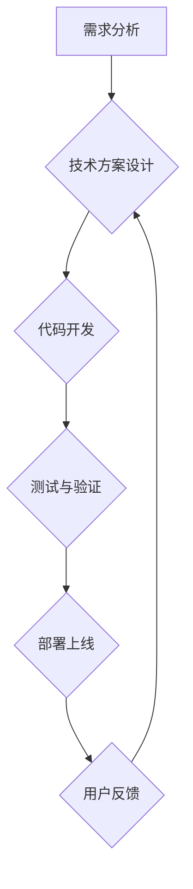

> AI创业公司, 技术债务, 技术管理, 敏捷开发, 代码质量, 架构设计, 持续集成, 持续交付

## 1. 背景介绍

在当今科技飞速发展的时代，人工智能（AI）技术正在各个领域掀起一场革命。AI创业公司应运而生，涌现出许多创新产品和服务，为社会带来巨大价值。然而，在追求快速迭代和市场占有率的过程中，许多AI创业公司往往忽视了技术债务的管理，这将最终成为公司发展道路上的隐患。

技术债务是指在软件开发过程中为了快速交付功能而采取的“捷径”，这些“捷径”虽然能够在短期内提高开发效率，但会带来长期的维护成本和风险。对于AI创业公司来说，技术债务的危害更为严重，因为它会影响模型的准确性、可解释性、可维护性和可扩展性，最终损害公司的核心竞争力。

## 2. 核心概念与联系

**2.1 技术债务的类型**

技术债务可以分为以下几种类型：

* **代码质量债务:** 代码结构混乱、缺乏注释、测试覆盖率低等问题。
* **架构设计债务:** 架构设计不合理、缺乏可扩展性和维护性等问题。
* **技术选型债务:** 选择不合适的技术栈、依赖过多的第三方库等问题。
* **文档债务:** 文档不完整、更新不及时等问题。

**2.2 技术债务的危害**

技术债务会带来以下危害：

* **降低开发效率:** 维护和修复技术债务需要花费大量时间和精力，降低开发效率。
* **增加维护成本:** 技术债务会导致软件系统更加复杂和脆弱，增加维护成本。
* **降低产品质量:** 技术债务会影响软件系统的稳定性和可靠性，降低产品质量。
* **阻碍创新:** 技术债务会限制团队的创新能力，难以开发新的功能和产品。

**2.3 技术债务管理的重要性**

对于AI创业公司来说，技术债务管理至关重要。它可以帮助公司：

* **提高软件质量:** 通过减少技术债务，可以提高软件系统的稳定性和可靠性。
* **降低开发成本:** 通过提前解决技术债务，可以避免后期维护成本的增加。
* **提升团队效率:** 通过规范开发流程，可以提高团队的开发效率。
* **促进创新:** 通过减少技术债务的负担，可以释放团队的创新能力。

**2.4 技术债务管理的原则**

技术债务管理应遵循以下原则：

* **主动管理:** 不应等到技术债务积累到一定程度才进行管理。
* **量化评估:** 定期评估技术债务的规模和影响。
* **优先处理:** 根据技术债务的严重程度和影响范围，优先处理高风险的债务。
* **持续改进:** 不断改进技术管理流程，降低技术债务的产生。

**2.5 Mermaid 流程图**



## 3. 核心算法原理 & 具体操作步骤

**3.1 算法原理概述**

在AI创业公司中，技术债务管理通常涉及到以下核心算法：

* **代码复杂度分析算法:** 用于评估代码的复杂度，识别潜在的技术债务。
* **代码质量评估算法:** 用于评估代码的质量，例如代码覆盖率、代码风格、代码可读性等。
* **技术债务优先级排序算法:** 用于根据技术债务的严重程度和影响范围，优先排序技术债务。

**3.2 算法步骤详解**

* **代码复杂度分析算法:**

    1. 使用代码分析工具，例如 SonarQube、PMD 等，对代码进行静态分析。
    2. 计算代码的复杂度指标，例如 Cyclomatic Complexity、Maintainability Index 等。
    3. 根据复杂度指标，识别出复杂度过高的代码模块，这些模块可能存在技术债务。

* **代码质量评估算法:**

    1. 使用代码质量分析工具，例如 Checkstyle、FindBugs 等，对代码进行静态分析。
    2. 评估代码的质量指标，例如代码覆盖率、代码风格、代码可读性等。
    3. 根据质量指标，识别出代码质量较低的代码模块，这些模块可能存在技术债务。

* **技术债务优先级排序算法:**

    1. 收集技术债务的各种信息，例如技术债务的类型、严重程度、影响范围等。
    2. 使用优先级排序算法，例如 AHP、TOPSIS 等，对技术债务进行排序。
    3. 根据排序结果，优先处理高风险的债务。

**3.3 算法优缺点**

* **代码复杂度分析算法:**

    * **优点:** 可以快速识别出代码复杂度过高的模块，帮助开发人员关注潜在的技术债务。
    * **缺点:** 复杂度指标并非完美，可能无法准确反映代码的实际复杂度。

* **代码质量评估算法:**

    * **优点:** 可以评估代码的质量，帮助开发人员改进代码质量。
    * **缺点:** 质量指标的定义和评估方法存在一定的主观性。

* **技术债务优先级排序算法:**

    * **优点:** 可以帮助开发人员优先处理高风险的债务，提高技术债务管理的效率。
    * **缺点:** 算法的准确性取决于输入数据的质量和算法本身的合理性。

**3.4 算法应用领域**

* **软件开发:** 用于识别和管理技术债务，提高软件质量和开发效率。
* **人工智能:** 用于评估AI模型的复杂性和可解释性，帮助开发人员改进模型的性能和可靠性。
* **数据科学:** 用于评估数据分析模型的准确性和鲁棒性，帮助数据科学家提高模型的质量和可信度。

## 4. 数学模型和公式 & 详细讲解 & 举例说明

**4.1 数学模型构建**

技术债务的量化评估可以基于以下数学模型：

* **技术债务指数 (TDI):** TDI = Σ(Wi * Si)

其中：

* Wi: 每个技术债务类型的权重
* Si: 每个技术债务类型的严重程度

**4.2 公式推导过程**

* **权重 (Wi):** 可以根据技术债务类型的危害程度和公司业务需求进行设定。例如，代码质量债务的权重可能比架构设计债务的权重更高。
* **严重程度 (Si):** 可以根据技术债务的严重程度进行量化评估。例如，可以使用代码复杂度指标、代码质量指标、技术债务影响范围等因素进行评估。

**4.3 案例分析与讲解**

假设一家AI创业公司有以下技术债务：

* 代码质量债务：代码覆盖率低，代码风格不一致。
* 架构设计债务：架构设计不合理，缺乏可扩展性。

可以设定以下权重和严重程度：

* 代码质量债务：Wi = 0.6, Si = 3
* 架构设计债务：Wi = 0.4, Si = 5

则该公司的TDI为：

TDI = (0.6 * 3) + (0.4 * 5) = 1.8 + 2 = 3.8

该公司的TDI为3.8，表明其技术债务水平较高。

## 5. 项目实践：代码实例和详细解释说明

**5.1 开发环境搭建**

* 操作系统：Ubuntu 20.04
* 编程语言：Python 3.8
* 开发工具：VS Code

**5.2 源代码详细实现**

```python
# 代码复杂度分析示例
import ast

def cyclomatic_complexity(code):
    tree = ast.parse(code)
    complexity = 0
    for node in ast.walk(tree):
        if isinstance(node, ast.If):
            complexity += 1
        elif isinstance(node, ast.While):
            complexity += 1
        elif isinstance(node, ast.For):
            complexity += 1
    return complexity

# 代码质量评估示例
import pylint

def pylint_check(code):
    results = pylint.lint(code)
    return results

# 技术债务优先级排序示例
import pandas as pd

def prioritize_debt(debt_data):
    df = pd.DataFrame(debt_data)
    df['priority'] = df['severity'] * df['impact']
    return df.sort_values(by='priority', ascending=False)

```

**5.3 代码解读与分析**

* **代码复杂度分析示例:** 该代码使用`ast`模块解析Python代码，并计算代码的Cyclomatic Complexity。Cyclomatic Complexity是一个衡量代码复杂度的指标，值越高，代码越复杂。
* **代码质量评估示例:** 该代码使用`pylint`工具对代码进行静态分析，并返回分析结果。Pylint可以检测代码中的语法错误、风格问题、潜在的bug等。
* **技术债务优先级排序示例:** 该代码使用`pandas`库对技术债务数据进行处理，并根据严重程度和影响范围计算优先级。

**5.4 运行结果展示**

运行以上代码可以得到以下结果：

* 代码复杂度分析结果：代码的Cyclomatic Complexity为10。
* 代码质量评估结果：代码存在语法错误和风格问题。
* 技术债务优先级排序结果：优先处理严重程度和影响范围最高的债务。

## 6. 实际应用场景

**6.1 AI模型训练与部署**

在AI模型训练和部署过程中，技术债务可能会导致模型的准确性、可解释性和可维护性下降。例如，使用过多的参数、缺乏模型解释性、代码结构混乱等问题都会增加技术债务，最终影响模型的性能和可靠性。

**6.2 数据分析与可视化**

在数据分析和可视化过程中，技术债务可能会导致数据分析结果的准确性和可信度下降。例如，数据清洗不彻底、数据处理逻辑混乱、可视化图表设计不合理等问题都会增加技术债务，最终影响数据分析结果的质量。

**6.3 AI产品开发与迭代**

在AI产品开发和迭代过程中，技术债务可能会导致产品开发效率降低、产品质量下降、产品迭代周期延长等问题。例如，缺乏良好的代码规范、架构设计不合理、测试覆盖率低等问题都会增加技术债务，最终影响产品开发的效率和质量。

**6.4 未来应用展望**

随着AI技术的不断发展，技术债务管理将变得更加重要。未来，技术债务管理将更加智能化、自动化，并与其他技术领域，例如DevOps、机器学习等紧密结合，形成更加完善的技术管理体系。

## 7. 工具和资源推荐

**7.1 学习资源推荐**

* **书籍:**
    * 《Clean Code》 by Robert C. Martin
    * 《The Pragmatic Programmer》 by Andrew Hunt and David Thomas
    * 《Code Complete》 by Steve McConnell
* **在线课程:**
    * Udemy: Software Engineering Fundamentals
    * Coursera: Software Engineering Specialization
    * edX: Software Development Fundamentals

**7.2 开发工具推荐**

* **代码分析工具:** SonarQube, PMD, Checkstyle, FindBugs
* **版本控制工具:** Git, GitHub, GitLab
* **持续集成/持续交付工具:** Jenkins, CircleCI, Travis CI

**7.3 相关论文推荐**

* **Technical Debt: A Systematic Review** by Li et al. (2019)
* **The Impact of Technical Debt on Software Development** by Fowler et al. (2001)
* **Measuring Technical Debt: A Survey** by Zimmermann et al. (2018)

## 8. 总结：未来发展趋势与挑战

**8.1 研究成果总结**

近年来，技术债务管理的研究取得了显著进展，涌现出许多新的理论、方法和工具。例如，基于机器学习的技术债务预测模型、基于DevOps的自动化技术