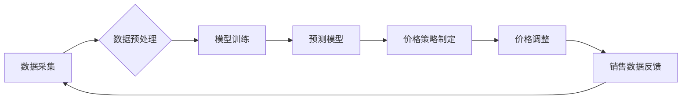

> 电商价格优化，人工智能，机器学习，深度学习，预测模型，需求预测，价格策略

## 1. 背景介绍

在当今激烈的电商市场竞争中，价格优化已成为企业提升利润率和市场份额的关键策略。传统的定价方法往往依赖于经验和主观判断，难以适应市场需求的快速变化和复杂性。随着人工智能（AI）技术的快速发展，AI在电商价格优化领域展现出巨大的潜力，能够帮助企业实现更精准、高效、智能的价格决策。

电商价格优化的核心目标是找到一个最佳的定价策略，既能最大化企业利润，又能满足消费者需求，并保持市场竞争力。传统的定价方法通常采用成本加成法、竞争对手定价法等静态定价策略，难以应对市场动态变化和消费者行为的多样性。

AI技术能够通过分析海量数据，识别价格与销量之间的关系，预测未来市场需求，并根据实时市场情况动态调整价格，从而实现更精准、高效的价格优化。

## 2. 核心概念与联系

**2.1 核心概念**

* **电商价格优化:** 通过数据分析和算法模型，动态调整商品价格，以最大化企业利润和市场份额。
* **人工智能 (AI):**  模拟人类智能的计算机系统，能够学习、推理和决策。
* **机器学习 (ML):**  一种AI子领域，通过算法训练模型，从数据中学习规律，并进行预测或分类。
* **深度学习 (DL):**  一种更高级的机器学习方法，利用多层神经网络模拟人类大脑的学习过程，能够处理更复杂的数据和任务。
* **需求预测:**  预测未来一段时间内消费者对特定商品的需求量。
* **价格策略:**  制定商品定价的规则和策略，例如动态定价、捆绑销售、限时促销等。

**2.2 架构图**



## 3. 核心算法原理 & 具体操作步骤

**3.1 算法原理概述**

电商价格优化算法通常基于机器学习和深度学习技术，通过训练模型预测商品需求和价格敏感度，从而制定最优价格策略。常见的算法包括：

* **线性回归:**  用于预测商品价格与销量之间的线性关系。
* **逻辑回归:**  用于预测商品是否会被购买，以及购买概率。
* **决策树:**  用于根据商品特征和市场条件，构建决策规则，确定最佳价格。
* **支持向量机 (SVM):**  用于分类和回归，可以处理高维数据和非线性关系。
* **神经网络:**  能够学习更复杂的非线性关系，并进行更精准的预测。

**3.2 算法步骤详解**

1. **数据采集:** 收集商品销售数据、市场价格数据、用户行为数据等相关信息。
2. **数据预处理:** 清洗、转换和格式化数据，使其适合模型训练。
3. **特征工程:**  提取和选择重要的特征变量，例如商品属性、价格、时间、季节、促销活动等。
4. **模型训练:**  使用机器学习算法训练模型，并根据训练数据评估模型性能。
5. **模型评估:**  使用测试数据评估模型的预测精度和泛化能力。
6. **模型部署:**  将训练好的模型部署到生产环境中，用于实时预测和价格调整。

**3.3 算法优缺点**

| 算法 | 优点 | 缺点 |
|---|---|---|
| 线性回归 | 简单易懂，计算效率高 | 只能处理线性关系 |
| 逻辑回归 | 适用于分类问题，解释性强 | 只能处理线性关系 |
| 决策树 | 能够处理非线性关系，解释性强 | 容易过拟合 |
| 支持向量机 | 能够处理高维数据和非线性关系 | 计算复杂度高 |
| 神经网络 | 能够学习更复杂的非线性关系，预测精度高 | 计算复杂度高，训练时间长 |

**3.4 算法应用领域**

* **电商平台:**  商品价格优化、促销活动策划、库存管理
* **旅游行业:**  机票和酒店价格优化、旅游套餐推荐
* **金融行业:**  贷款利率优化、风险评估
* **医疗行业:**  医疗费用预测、疾病诊断

## 4. 数学模型和公式 & 详细讲解 & 举例说明

**4.1 数学模型构建**

电商价格优化模型通常基于需求预测和利润最大化目标。

* **需求预测模型:**  预测商品在特定价格下的销量。常用的模型包括线性回归、逻辑回归、时间序列模型等。
* **利润最大化模型:**  根据需求预测和成本信息，计算不同价格下的利润，并选择利润最大化的价格。

**4.2 公式推导过程**

假设商品的成本为C，需求函数为Q(P)，价格为P，则商品的利润为：

```latex
利润 = P * Q(P) - C * Q(P)
```

**4.3 案例分析与讲解**

假设一个电商平台销售一款商品，成本为10元，需求函数为：

```latex
Q(P) = 100 - 2P
```

则商品的利润函数为：

```latex
利润 = P * (100 - 2P) - 10 * (100 - 2P)
```

通过求导和解方程，可以找到利润最大化的价格。

## 5. 项目实践：代码实例和详细解释说明

**5.1 开发环境搭建**

* Python 3.x
* Jupyter Notebook
* pandas
* scikit-learn
* matplotlib

**5.2 源代码详细实现**

```python
import pandas as pd
from sklearn.linear_model import LinearRegression
from sklearn.model_selection import train_test_split
import matplotlib.pyplot as plt

# 加载数据
data = pd.read_csv('sales_data.csv')

# 特征工程
X = data[['price']]
y = data['sales']

# 数据分割
X_train, X_test, y_train, y_test = train_test_split(X, y, test_size=0.2, random_state=42)

# 模型训练
model = LinearRegression()
model.fit(X_train, y_train)

# 模型评估
y_pred = model.predict(X_test)
print('模型R方:', model.score(X_test, y_test))

# 可视化结果
plt.scatter(X_test, y_test, color='blue', label='实际销量')
plt.plot(X_test, y_pred, color='red', label='预测销量')
plt.xlabel('价格')
plt.ylabel('销量')
plt.legend()
plt.show()
```

**5.3 代码解读与分析**

* 代码首先加载销售数据，并进行特征工程，选择价格作为预测变量，销量作为目标变量。
* 然后使用训练测试集分割数据，训练线性回归模型。
* 模型评估使用R方作为指标，R方值越高，模型拟合度越好。
* 最后使用可视化工具展示实际销量和预测销量的关系。

**5.4 运行结果展示**

运行代码后，会输出模型的R方值，以及实际销量和预测销量的散点图。

## 6. 实际应用场景

**6.1 电商平台价格优化**

电商平台可以利用AI技术，根据商品属性、市场价格、用户行为等数据，动态调整商品价格，以最大化利润和市场份额。例如，在双十一购物节期间，平台可以根据实时销量和库存情况，动态调整商品价格，以满足消费者需求和提高销售额。

**6.2 旅游行业价格优化**

旅游行业可以利用AI技术，预测机票和酒店价格，并根据市场需求和竞争情况，制定最优价格策略。例如，航空公司可以根据航班剩余座位数、乘客预订情况等数据，动态调整机票价格，以提高收益率。

**6.3 金融行业价格优化**

金融行业可以利用AI技术，优化贷款利率、保险费率等价格，以提高盈利能力和客户满意度。例如，银行可以根据客户信用评分、贷款用途等数据，动态调整贷款利率，以满足不同客户的需求。

**6.4 未来应用展望**

随着AI技术的不断发展，其在电商价格优化领域的应用将更加广泛和深入。未来，AI技术将能够更加精准地预测市场需求，制定更个性化的价格策略，并与其他技术如物联网、大数据等相结合，实现更智能、高效的价格优化。

## 7. 工具和资源推荐

**7.1 学习资源推荐**

* **书籍:**
    * 《机器学习》 - 周志华
    * 《深度学习》 - Ian Goodfellow
* **在线课程:**
    * Coursera: Machine Learning
    * edX: Deep Learning
* **博客和网站:**
    * Towards Data Science
    * Machine Learning Mastery

**7.2 开发工具推荐**

* **Python:**  数据分析和机器学习的常用语言
* **Jupyter Notebook:**  交互式编程环境，方便数据分析和模型开发
* **pandas:**  数据处理和分析库
* **scikit-learn:**  机器学习库
* **TensorFlow/PyTorch:**  深度学习框架

**7.3 相关论文推荐**

* **Deep Learning for Dynamic Pricing**
* **A Survey of Reinforcement Learning for Dynamic Pricing**
* **Personalized Pricing with Deep Learning**

## 8. 总结：未来发展趋势与挑战

**8.1 研究成果总结**

AI在电商价格优化领域取得了显著成果，能够帮助企业实现更精准、高效的价格决策，提高利润率和市场竞争力。

**8.2 未来发展趋势**

* **更精准的预测模型:**  利用更先进的机器学习和深度学习算法，构建更精准的市场需求预测模型。
* **更个性化的价格策略:**  根据用户的购买历史、偏好和行为特征，制定更个性化的价格策略。
* **更智能的自动化决策:**  利用AI技术实现价格优化决策的自动化，减少人工干预。
* **更全面的数据融合:**  融合更多数据源，例如用户画像、市场趋势、竞争对手信息等，构建更全面的价格优化模型。

**8.3 面临的挑战**

* **数据质量和隐私问题:**  AI模型的性能依赖于数据质量，而电商平台的数据往往存在不完整、不准确、隐私敏感等问题。
* **算法解释性和可解释性:**  一些深度学习模型的决策过程难以解释，这可能会导致企业难以理解模型的决策逻辑，并难以进行监管和控制。
* **公平性和伦理问题:**  AI算法可能会存在偏见，导致价格歧视等问题，需要关注算法的公平性和伦理问题。

**8.4 研究展望**

未来，AI在电商价格优化领域的应用将更加广泛和深入，需要进一步研究更精准、更智能、更公平的AI算法，并解决数据质量、算法解释性和伦理等问题，以确保AI技术在电商价格优化领域的健康发展。

## 9. 附录：常见问题与解答

**9.1 如何选择合适的AI算法？**

选择合适的AI算法取决于具体应用场景和数据特点。例如，对于线性关系的数据，可以使用线性回归模型；对于分类问题，可以使用逻辑回归模型；对于更复杂的非线性关系，可以使用神经网络模型。

**9.2 如何解决数据质量问题？**

数据质量问题是AI模型性能的重要影响因素。可以采取以下措施解决数据质量问题：

* 数据清洗：删除重复数据、错误数据和缺失数据。
* 数据转换：将数据转换为统一的格式。
* 数据标准化：将数据转换为特定范围，例如0到1之间。

**9.3 如何保证算法的公平性和伦理？**

算法的公平性和伦理需要在设计和训练阶段进行考虑。可以采取以下措施保证算法的公平性和伦理：

* 使用