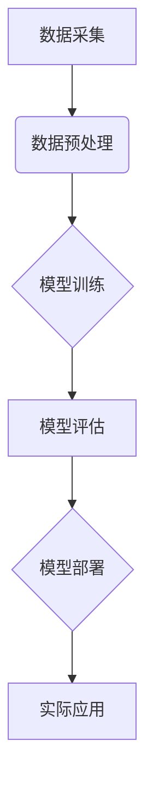

>  人工智能、深度学习、自然语言处理、计算机视觉、强化学习、机器学习、AI应用

## 1. 背景介绍

人工智能（AI）技术近年来发展迅速，已从实验室的理论研究走向了现实生活的各个领域。从智能手机的语音助手到自动驾驶汽车，AI正在改变着我们的生活方式。随着计算能力的提升和算法的不断改进，AI技术的应用范围将更加广泛，对社会的影响也将更加深远。

本篇文章将探讨AI应用的新趋势和实践，重点关注以下几个方面：

* 深度学习在AI应用中的重要作用
* 自然语言处理（NLP）和计算机视觉（CV）的最新进展
* 强化学习在机器人控制和游戏领域的应用
* AI应用的伦理和社会影响

## 2. 核心概念与联系

**2.1  人工智能（AI）**

人工智能是指模拟人类智能行为的计算机系统。AI的目标是使机器能够像人类一样学习、推理、解决问题和做出决策。

**2.2  机器学习（ML）**

机器学习是AI的一个子领域，它使机器能够从数据中学习，无需明确编程。机器学习算法通过分析数据模式来识别趋势和规律，并根据这些模式做出预测或决策。

**2.3  深度学习（DL）**

深度学习是机器学习的一个子领域，它使用多层神经网络来模拟大脑的结构和功能。深度学习算法能够学习更复杂的模式和特征，从而在图像识别、语音识别和自然语言处理等领域取得了突破性的进展。

**2.4  强化学习（RL）**

强化学习是一种机器学习方法，它通过奖励和惩罚机制来训练智能体。智能体在环境中采取行动，并根据环境的反馈获得奖励或惩罚。通过不断学习和调整策略，智能体最终能够找到最优的行动方案。

**2.5  自然语言处理（NLP）**

自然语言处理是指使计算机能够理解、处理和生成人类语言的技术。NLP应用广泛，包括机器翻译、文本摘要、情感分析和对话系统等。

**2.6  计算机视觉（CV）**

计算机视觉是指使计算机能够“看”和理解图像的技术。CV应用广泛，包括图像识别、物体检测、图像分割和视频分析等。

**2.7  AI应用场景**

AI技术已广泛应用于各个领域，例如：

* **医疗保健:** 疾病诊断、药物研发、个性化医疗
* **金融服务:** 风险管理、欺诈检测、客户服务
* **制造业:** 自动化生产、质量控制、预测维护
* **零售业:** 个性化推荐、库存管理、客户服务
* **交通运输:** 自动驾驶、交通管理、物流优化

**2.8  AI应用架构**

AI应用通常由以下几个部分组成：

* **数据采集:** 收集和存储用于训练和测试AI模型的数据。
* **数据预处理:** 对数据进行清洗、转换和特征工程，使其适合AI模型的训练。
* **模型训练:** 使用机器学习算法训练AI模型，使其能够学习数据中的模式和规律。
* **模型评估:** 评估AI模型的性能，并进行调优。
* **模型部署:** 将训练好的AI模型部署到生产环境中，用于实际应用。



## 3. 核心算法原理 & 具体操作步骤

### 3.1  算法原理概述

深度学习算法的核心是多层神经网络。神经网络由多个层组成，每层包含多个神经元。神经元之间通过连接进行信息传递，每个连接都有一个权重。通过训练神经网络，可以调整这些权重，使网络能够学习数据中的模式和规律。

### 3.2  算法步骤详解

1. **数据准备:** 收集和预处理训练数据。
2. **网络结构设计:** 设计神经网络的结构，包括层数、神经元数量和激活函数。
3. **权重初始化:** 为神经网络的连接赋予初始权重。
4. **前向传播:** 将输入数据通过神经网络传递，计算输出结果。
5. **反向传播:** 计算输出结果与真实值的误差，并根据误差调整神经网络的权重。
6. **迭代训练:** 重复前向传播和反向传播的过程，直到模型性能达到预期的水平。

### 3.3  算法优缺点

**优点:**

* 能够学习复杂的数据模式
* 性能优于传统机器学习算法
* 广泛应用于图像识别、语音识别和自然语言处理等领域

**缺点:**

* 需要大量的训练数据
* 训练时间长
* 难以解释模型的决策过程

### 3.4  算法应用领域

深度学习算法已广泛应用于以下领域：

* **图像识别:** 人脸识别、物体检测、图像分类
* **语音识别:** 语音转文本、语音助手
* **自然语言处理:** 机器翻译、文本摘要、情感分析
* **推荐系统:** 商品推荐、内容推荐
* **医疗诊断:** 疾病诊断、影像分析

## 4. 数学模型和公式 & 详细讲解 & 举例说明

### 4.1  数学模型构建

深度学习模型通常使用多层感知机（MLP）或卷积神经网络（CNN）作为基础架构。

**4.1.1  多层感知机（MLP）**

MLP由多个全连接层组成，每层神经元之间全连接。每个神经元接收来自上一层的输入，并通过激活函数进行处理，输出到下一层。

**4.1.2  卷积神经网络（CNN）**

CNN专门用于处理图像数据。CNN包含卷积层、池化层和全连接层。卷积层使用卷积核提取图像特征，池化层降低特征图尺寸，全连接层进行分类或回归。

### 4.2  公式推导过程

**4.2.1  激活函数**

激活函数用于引入非线性，使神经网络能够学习复杂的数据模式。常见的激活函数包括 sigmoid 函数、ReLU 函数和 tanh 函数。

**4.2.2  损失函数**

损失函数用于衡量模型预测结果与真实值的差异。常见的损失函数包括均方误差（MSE）和交叉熵损失（CE）。

**4.2.3  梯度下降**

梯度下降是一种优化算法，用于调整神经网络的权重，使模型性能达到最佳。梯度下降算法通过计算损失函数的梯度，沿着梯度方向更新权重。

### 4.3  案例分析与讲解

**4.3.1  图像分类**

使用 CNN 对图像进行分类。训练数据包括大量带标签的图像，CNN 学习图像特征，并根据特征预测图像类别。

**4.3.2  机器翻译**

使用 RNN 或 Transformer 模型进行机器翻译。训练数据包括对齐的文本对，模型学习语言之间的映射关系，并根据输入文本生成目标语言文本。

## 5. 项目实践：代码实例和详细解释说明

### 5.1  开发环境搭建

使用 Python 语言和 TensorFlow 或 PyTorch 深度学习框架进行开发。

### 5.2  源代码详细实现

```python
import tensorflow as tf

# 定义模型结构
model = tf.keras.models.Sequential([
    tf.keras.layers.Conv2D(32, (3, 3), activation='relu', input_shape=(28, 28, 1)),
    tf.keras.layers.MaxPooling2D((2, 2)),
    tf.keras.layers.Conv2D(64, (3, 3), activation='relu'),
    tf.keras.layers.MaxPooling2D((2, 2)),
    tf.keras.layers.Flatten(),
    tf.keras.layers.Dense(10, activation='softmax')
])

# 编译模型
model.compile(optimizer='adam',
              loss='sparse_categorical_crossentropy',
              metrics=['accuracy'])

# 训练模型
model.fit(x_train, y_train, epochs=5)

# 评估模型
loss, accuracy = model.evaluate(x_test, y_test)
print('Test loss:', loss)
print('Test accuracy:', accuracy)
```

### 5.3  代码解读与分析

* 代码定义了一个简单的 CNN 模型，用于 MNIST 手写数字识别任务。
* 模型包含两层卷积层、两层池化层、一层 Flatten 层和一层全连接层。
* 模型使用 Adam 优化器、交叉熵损失函数和准确率作为评估指标。
* 模型在训练集上训练 5 个 epoch。
* 最后，模型在测试集上进行评估，并打印测试损失和准确率。

### 5.4  运行结果展示

训练完成后，模型的准确率通常会达到 98% 以上。

## 6. 实际应用场景

### 6.1  医疗诊断

AI 算法可以分析医学影像，辅助医生诊断疾病。例如，AI 可以识别肺部肿瘤、乳腺癌和脑肿瘤。

### 6.2  金融风险管理

AI 算法可以分析金融数据，识别欺诈交易和预测风险。例如，AI 可以检测信用卡欺诈、识别洗钱行为和评估贷款风险。

### 6.3  个性化推荐

AI 算法可以分析用户行为数据，提供个性化推荐。例如，电商平台可以使用 AI 算法推荐商品、音乐平台可以使用 AI 算法推荐歌曲。

### 6.4  未来应用展望

AI 技术将继续发展，并在更多领域得到应用。例如：

* **自动驾驶:** AI 将推动自动驾驶汽车的普及。
* **机器人:** AI 将使机器人更加智能和灵活。
* **个性化教育:** AI 将提供个性化的教育方案。
* **医疗保健:** AI 将帮助医生更快、更准确地诊断和治疗疾病。

## 7. 工具和资源推荐

### 7.1  学习资源推荐

* **在线课程:** Coursera、edX、Udacity 等平台提供深度学习和机器学习课程。
* **书籍:** 《深度学习》、《机器学习实战》等书籍。
* **博客和论坛:** TensorFlow、PyTorch 等框架的官方博客和论坛。

### 7.2  开发工具推荐

* **TensorFlow:** Google 开发的开源深度学习框架。
* **PyTorch:** Facebook 开发的开源深度学习框架。
* **Keras:** TensorFlow 上的深度学习 API。

### 7.3  相关论文推荐

* **《ImageNet Classification with Deep Convolutional Neural Networks》**
* **《Attention Is All You Need》**
* **《Deep Reinforcement Learning》**

## 8. 总结：未来发展趋势与挑战

### 8.1  研究成果总结

近年来，AI 技术取得了显著进展，特别是深度学习算法在图像识别、语音识别和自然语言处理等领域取得了突破性的成果。

### 8.2  未来发展趋势

* **模型规模和复杂度提升:** 未来 AI 模型将更加大规模和复杂，能够学习更复杂的模式和规律。
* **跨模态学习:** AI 将能够学习和理解多种模态数据，例如文本、图像、音频和视频。
* **边缘计算:** AI 将更加广泛地部署到边缘设备，实现更快速的响应和更低的延迟。
* **可解释性:** 研究人员将更加关注 AI 模型的可解释性，使 AI 的决策过程更加透明和可理解。

### 8.3  面临的挑战

* **数据获取和隐私保护:** AI 算法需要大量数据进行训练，如何获取高质量数据并保护用户隐私是一个挑战。
* **算法偏见:** AI 算法可能存在偏见，导致不公平的结果。如何解决算法偏见是一个重要的研究方向。
* **安全性和可靠性:** AI 系统的安全性和可靠性至关重要，需要开发更安全的 AI 算法和系统架构。

### 8.4  研究展望

未来 AI 研究将继续探索新的算法、模型和应用场景，推动 AI 技术的进一步发展，并为人类社会带来更多福祉。

## 9. 附录：常见问题与解答

**9.1  什么是深度学习？**

深度学习是一种机器学习方法，它使用多层神经网络来模拟大脑的结构和