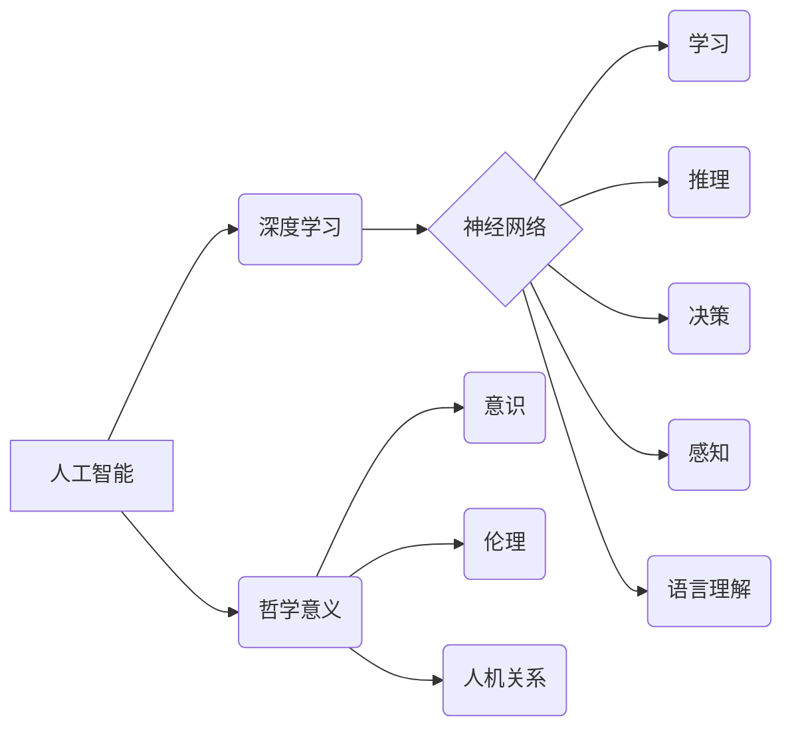

> 人工智能，深度学习，神经网络，哲学，伦理，未来

## 1. 背景介绍

人工智能（AI）正以惊人的速度发展，从自动驾驶到医疗诊断，AI正在改变着我们生活的方方面面。而Andrej Karpathy，作为一位杰出的AI研究者和工程师，在推动AI发展的同时，也深刻思考着AI的哲学意义。他的研究和观点，为我们理解AI的本质和未来发展方向提供了重要的启示。

## 2. 核心概念与联系

**2.1 人工智能的本质**

人工智能的核心是模拟人类智能的行为。这包括学习、推理、决策、感知和语言理解等能力。深度学习作为AI的重要分支，通过构建多层神经网络，模拟大脑的结构和功能，从而实现对复杂数据的学习和处理。

**2.2 哲学意义的探讨**

Andrej Karpathy认为，AI的发展不仅仅是技术上的进步，更涉及到对人类自身认知和存在的深刻思考。

* **意识与智能:** AI是否能够拥有意识？如果拥有，它与人类意识有什么区别？
* **伦理与责任:** AI的决策是否具有伦理道德？谁来承担AI带来的风险和责任？
* **人机关系:** AI的发展将如何改变人与机器的关系？

**2.3  核心概念关系图**



## 3. 核心算法原理 & 具体操作步骤

**3.1 算法原理概述**

深度学习的核心算法是反向传播算法（Backpropagation）。该算法通过不断调整神经网络的权重，使网络的输出与实际目标值之间的误差最小化。

**3.2 算法步骤详解**

1. **前向传播:** 将输入数据通过神经网络传递，得到输出结果。
2. **误差计算:** 计算输出结果与实际目标值之间的误差。
3. **反向传播:** 将误差反向传播到神经网络的各个层，计算每个神经元的权重梯度。
4. **权重更新:** 根据权重梯度，更新神经网络的权重，使误差最小化。
5. **重复步骤1-4:** 迭代执行上述步骤，直到误差达到预设阈值。

**3.3 算法优缺点**

* **优点:** 能够学习复杂的数据模式，具有强大的泛化能力。
* **缺点:** 需要大量的训练数据和计算资源，训练过程时间长。

**3.4 算法应用领域**

* **图像识别:** 人脸识别、物体检测、图像分类
* **自然语言处理:** 机器翻译、文本摘要、情感分析
* **语音识别:** 语音转文本、语音助手
* **医疗诊断:** 病情预测、疾病诊断

## 4. 数学模型和公式 & 详细讲解 & 举例说明

**4.1 数学模型构建**

深度学习模型通常由多层神经网络组成，每层神经元之间通过权重连接。每个神经元接收来自上一层的输入信号，经过激活函数处理后，输出到下一层。

**4.2 公式推导过程**

反向传播算法的核心是计算每个神经元的权重梯度。权重梯度表示权重变化对误差的影响。

* **损失函数:** 用于衡量模型预测结果与实际目标值之间的误差。常见的损失函数包括均方误差（MSE）和交叉熵损失（Cross-Entropy Loss）。
* **梯度下降:** 用于更新权重的优化算法。梯度下降算法通过沿着梯度方向调整权重，使损失函数最小化。

**4.3 案例分析与讲解**

假设我们有一个简单的线性回归模型，用于预测房价。模型输入特征包括房屋面积和房间数量，输出房价。

* **损失函数:** MSE
* **梯度下降:** 随机梯度下降（SGD）

通过反向传播算法，我们可以计算出每个权重的梯度，并使用梯度下降算法更新权重，最终得到一个能够准确预测房价的模型。

## 5. 项目实践：代码实例和详细解释说明

**5.1 开发环境搭建**

* Python 3.x
* TensorFlow 或 PyTorch

**5.2 源代码详细实现**

```python
import tensorflow as tf

# 定义模型
model = tf.keras.models.Sequential([
    tf.keras.layers.Dense(64, activation='relu', input_shape=(2,)),
    tf.keras.layers.Dense(1)
])

# 编译模型
model.compile(optimizer='adam', loss='mse')

# 训练模型
model.fit(X_train, y_train, epochs=10)

# 评估模型
loss = model.evaluate(X_test, y_test)
```

**5.3 代码解读与分析**

* `tf.keras.models.Sequential`: 创建一个顺序模型，神经层按顺序连接。
* `tf.keras.layers.Dense`: 定义一个全连接层，每个神经元连接到上一层的所有神经元。
* `activation='relu'`: 使用ReLU激活函数。
* `optimizer='adam'`: 使用Adam优化器。
* `loss='mse'`: 使用均方误差损失函数。
* `model.fit`: 训练模型。
* `model.evaluate`: 评估模型。

**5.4 运行结果展示**

训练完成后，我们可以使用模型预测新的房价数据。

## 6. 实际应用场景

**6.1 图像识别**

* **自动驾驶:** 识别道路、行人、车辆等物体。
* **医疗诊断:** 识别病灶、肿瘤等异常区域。
* **安防监控:** 人脸识别、行为识别。

**6.2 自然语言处理**

* **机器翻译:** 将文本从一种语言翻译成另一种语言。
* **文本摘要:** 自动生成文本的简短摘要。
* **聊天机器人:** 与用户进行自然语言对话。

**6.3 语音识别**

* **语音助手:** 例如Siri、Alexa、Google Assistant。
* **语音转文本:** 将语音转换为文本。
* **听力辅助设备:** 为听障人士提供听力帮助。

**6.4 未来应用展望**

* **个性化教育:** 根据学生的学习情况提供个性化的学习内容和辅导。
* **精准医疗:** 根据患者的基因信息和病史提供个性化的治疗方案。
* **科学研究:** 加速科学发现，例如药物研发、材料科学。

## 7. 工具和资源推荐

**7.1 学习资源推荐**

* **书籍:**
    * 深度学习 (Deep Learning) - Ian Goodfellow, Yoshua Bengio, Aaron Courville
    * 人工智能：一种现代方法 (Artificial Intelligence: A Modern Approach) - Stuart Russell, Peter Norvig
* **在线课程:**
    * Coursera: 深度学习 Specialization
    * Udacity: AI Programming with Python Nanodegree
* **博客和网站:**
    * Andrej Karpathy's Blog: https://karpathy.github.io/
    * OpenAI Blog: https://openai.com/blog/

**7.2 开发工具推荐**

* **TensorFlow:** https://www.tensorflow.org/
* **PyTorch:** https://pytorch.org/
* **Keras:** https://keras.io/

**7.3 相关论文推荐**

* **ImageNet Classification with Deep Convolutional Neural Networks** - Alex Krizhevsky, Ilya Sutskever, Geoffrey E. Hinton
* **Attention Is All You Need** - Ashish Vaswani, Noam Shazeer, Niki Parmar, Jakob Uszkoreit, Llion Jones, Aidan N. Gomez, Łukasz Kaiser, Illia Polosukhin

## 8. 总结：未来发展趋势与挑战

**8.1 研究成果总结**

近年来，深度学习取得了令人瞩目的成就，在图像识别、自然语言处理、语音识别等领域取得了突破性进展。

**8.2 未来发展趋势**

* **更强大的模型:** 研究更深、更复杂的模型，提高模型的性能和泛化能力。
* **更有效的训练方法:** 研究更有效的训练方法，降低训练成本和时间。
* **更广泛的应用:** 将AI技术应用到更多领域，例如医疗、教育、金融等。

**8.3 面临的挑战**

* **数据隐私和安全:** AI模型的训练需要大量数据，如何保护数据隐私和安全是一个重要挑战。
* **算法可解释性:** AI模型的决策过程往往难以理解，如何提高算法的可解释性是一个重要问题。
* **伦理和社会影响:** AI技术的发展可能带来一些伦理和社会问题，例如就业失业、算法偏见等，需要认真思考和应对。

**8.4 研究展望**

未来，AI研究将继续朝着更智能、更安全、更可解释的方向发展。我们需要加强跨学科合作，促进AI技术与伦理、社会等领域的融合发展，确保AI技术造福人类。

## 9. 附录：常见问题与解答

**9.1 什么是深度学习？**

深度学习是一种机器学习的子领域，它使用多层神经网络来模拟大脑的结构和功能，从而实现对复杂数据的学习和处理。

**9.2 深度学习有哪些应用？**

深度学习的应用非常广泛，包括图像识别、自然语言处理、语音识别、医疗诊断、自动驾驶等。

**9.3 如何学习深度学习？**

有很多学习深度学习的资源，例如书籍、在线课程、博客和网站。

**9.4 深度学习的未来发展趋势是什么？**

深度学习的未来发展趋势包括更强大的模型、更有效的训练方法、更广泛的应用等。


作者：禅与计算机程序设计艺术 / Zen and the Art of Computer Programming 
<end_of_turn>