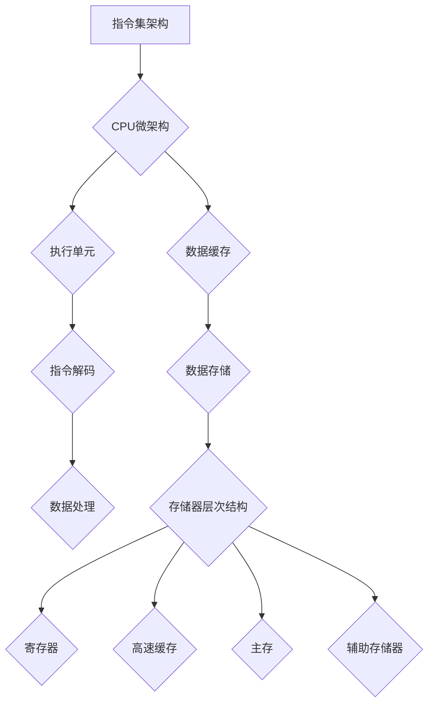

> CPU, 体系结构, 历史演进, 指令集, 微架构, 并行计算, 存储器层次结构, 虚拟化, 安全

## 1. 背景介绍

中央处理器（CPU），作为计算机系统的核心部件，负责执行程序指令，控制计算机的运行。自诞生以来，CPU的体系结构经历了长期的演进，从最初的简单指令集到如今的复杂多层次架构，其性能和功能不断提升，推动着计算机技术的发展。

## 2. 核心概念与联系

**2.1 CPU体系结构概述**

CPU体系结构是指CPU内部的硬件设计和组织方式，包括指令集、数据路径、控制单元、寄存器等组成部分。

**2.2 指令集架构**

指令集架构（ISA）定义了CPU能够理解和执行的指令集，是CPU体系结构的核心。常见的指令集架构包括x86、ARM、RISC-V等。

**2.3 微架构**

微架构是CPU内部实现指令集架构的具体细节，包括指令解码、执行单元、数据缓存等。微架构的设计决定了CPU的性能、功耗和成本等特性。

**2.4 存储器层次结构**

CPU与存储器之间通过层次结构进行数据访问，包括寄存器、高速缓存、主存和辅助存储器等。层次结构的设计可以提高数据访问速度和效率。

**2.5 并行计算**

现代CPU采用多核设计，通过并行执行指令来提高性能。并行计算技术包括多线程、多进程和多核并行等。

**2.6 虚拟化**

虚拟化技术允许在单一物理CPU上运行多个虚拟机，每个虚拟机拥有独立的CPU资源和操作系统。

**2.7 安全**

CPU的安全机制包括指令级安全、内存保护和硬件加密等，旨在保护CPU和系统数据免受攻击。

**Mermaid 流程图**

## 3. 核心算法原理 & 具体操作步骤

**3.1 算法原理概述**

CPU执行指令的过程可以看作是一个复杂的算法执行过程。指令被解码成操作码和操作数，然后由执行单元进行处理。数据路径负责传输数据，控制单元协调各个部件的运作。

**3.2 算法步骤详解**

1. **获取指令:** CPU从内存中读取指令。
2. **解码指令:** CPU解码指令，识别操作码和操作数。
3. **获取操作数:** CPU从内存或寄存器中获取操作数。
4. **执行操作:** CPU执行操作，例如加减乘除、逻辑运算等。
5. **存储结果:** CPU将结果存储到内存或寄存器中。
6. **跳转控制:** 根据指令内容，CPU可能跳转到其他指令地址。

**3.3 算法优缺点**

* **优点:** 
    * 效率高: CPU执行指令的速度非常快。
    * 灵活性强: 不同的指令集架构和微架构可以实现不同的功能。
    * 可扩展性好: 通过增加核心数和缓存容量，可以提高CPU的性能。
* **缺点:** 
    * 功耗高: CPU的运算过程会消耗大量的能量。
    * 复杂性高: CPU的内部结构非常复杂，设计和调试难度大。

**3.4 算法应用领域**

CPU算法广泛应用于各种领域，例如：

* **通用计算:** 处理文字、图像、视频等各种数据。
* **科学计算:** 进行复杂的数学运算和模拟。
* **人工智能:** 训练和运行机器学习模型。
* **游戏开发:** 提供游戏运行所需的计算能力。

## 4. 数学模型和公式 & 详细讲解 & 举例说明

**4.1 数学模型构建**

CPU性能可以采用指令吞吐量和指令时钟周期来衡量。指令吞吐量是指CPU每秒钟可以执行的指令数量，指令时钟周期是指执行一条指令所需的时钟周期数。

**4.2 公式推导过程**

CPU性能 (MIPS) = 指令吞吐量 (Instructions per second) / 指令时钟周期 (Clock cycles per instruction)

**4.3 案例分析与讲解**

假设一个CPU的指令吞吐量为1000条/秒，指令时钟周期为2个时钟周期，则其性能为：

CPU性能 (MIPS) = 1000 / 2 = 500 MIPS

## 5. 项目实践：代码实例和详细解释说明

**5.1 开发环境搭建**

使用QEMU虚拟机环境搭建CPU模拟器。

**5.2 源代码详细实现**

使用汇编语言编写简单的CPU指令集，例如加法指令、减法指令等。

**5.3 代码解读与分析**

解释汇编语言代码的执行过程，包括指令解码、数据处理和结果存储等步骤。

**5.4 运行结果展示**

使用QEMU模拟器运行CPU代码，并展示执行结果。

## 6. 实际应用场景

**6.1 通用计算**

CPU在各种通用计算任务中发挥着核心作用，例如文本处理、图像处理、视频编码等。

**6.2 科学计算**

CPU在科学计算领域用于进行复杂的数学运算和模拟，例如天气预报、分子动力学模拟等。

**6.3 人工智能**

CPU在人工智能领域用于训练和运行机器学习模型，例如图像识别、自然语言处理等。

**6.4 未来应用展望**

随着人工智能、大数据等技术的快速发展，CPU将面临更大的挑战和机遇。未来CPU的发展趋势包括：

* **更强大的并行计算能力:** 通过增加核心数和采用新的并行计算技术，提高CPU的性能。
* **更低的功耗:** 通过采用新的工艺技术和设计理念，降低CPU的功耗。
* **更强的安全性能:** 通过集成更先进的安全机制，保护CPU和系统数据免受攻击。

## 7. 工具和资源推荐

**7.1 学习资源推荐**

* **书籍:**
    * 《计算机体系结构：设计与实现》
    * 《深入理解计算机系统》
* **在线课程:**
    * Coursera: Computer Architecture
    * edX: Introduction to Computer Architecture

**7.2 开发工具推荐**

* **QEMU:** CPU模拟器
* **GCC:** 汇编语言编译器
* **GDB:** 调试工具

**7.3 相关论文推荐**

* **The Architecture of Modern Processors**
* **A Survey of Modern Processor Architectures**

## 8. 总结：未来发展趋势与挑战

**8.1 研究成果总结**

CPU体系结构的演进历程经历了从简单指令集到复杂多层次架构的转变，性能和功能不断提升。

**8.2 未来发展趋势**

未来CPU的发展趋势包括更强大的并行计算能力、更低的功耗和更强的安全性能。

**8.3 面临的挑战**

CPU的发展面临着摩尔定律的减缓、功耗瓶颈和安全威胁等挑战。

**8.4 研究展望**

未来研究方向包括探索新的并行计算模型、开发低功耗的CPU设计方案和构建更安全的CPU体系结构。

## 9. 附录：常见问题与解答

**9.1 CPU指令集架构有哪些？**

常见的CPU指令集架构包括x86、ARM、RISC-V等。

**9.2 CPU的微架构是什么？**

CPU的微架构是CPU内部实现指令集架构的具体细节，包括指令解码、执行单元、数据缓存等。

**9.3 CPU的性能如何衡量？**

CPU性能可以采用指令吞吐量和指令时钟周期来衡量。

**9.4 CPU的功耗如何降低？**

可以通过采用新的工艺技术、降低电压和频率、优化指令集架构等方式降低CPU的功耗。

作者：禅与计算机程序设计艺术 / Zen and the Art of Computer Programming 
<end_of_turn>