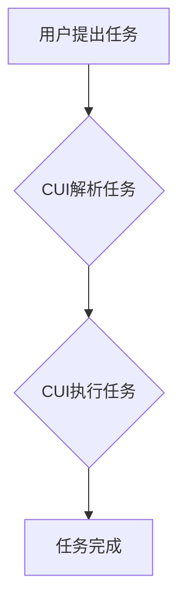

> CUI, 数字产品设计, 任务导向, 功能导向, 用户体验, 人机交互, 认知科学

## 1. 背景介绍

在当今数字产品蓬勃发展的时代，用户体验 (UX) 已成为产品成功的关键因素。传统的功能导向设计模式，往往将产品设计重点放在功能的实现上，而忽略了用户实际需求和任务场景。随着人工智能、物联网等技术的快速发展，数字产品越来越复杂，用户对产品体验的要求也越来越高。因此，我们需要一种新的设计模式，能够更好地理解用户需求，并提供更便捷、更智能的用户体验。

CUI (Command-line Interface，命令行界面) 作为一种古老的交互方式，近年来在人工智能、数据科学等领域重新焕发光彩。CUI 的精简、高效、可定制的特点，为数字产品设计提供了新的思路。本文将探讨 CUI 如何推动数字产品设计从功能导向向任务导向的转变，并分析其背后的原理、优势和挑战。

## 2. 核心概念与联系

### 2.1 功能导向设计

功能导向设计将产品设计重点放在功能的实现上，以功能模块为核心，将产品分解成一个个独立的功能单元。这种设计模式简单易懂，但往往忽略了用户实际需求和任务场景，导致产品使用体验不佳。

### 2.2 任务导向设计

任务导向设计将产品设计重点放在用户完成特定任务上的，以用户任务为核心，将产品设计成一系列能够帮助用户完成任务的步骤或流程。这种设计模式更加注重用户体验，能够提供更便捷、更智能的用户体验。

### 2.3 CUI 与任务导向设计

CUI 的精简、高效、可定制的特点，使其成为任务导向设计的理想工具。

* **精简:** CUI 的命令结构简洁明了，易于理解和记忆，能够帮助用户快速完成任务。
* **高效:** CUI 的交互方式直接高效，能够减少用户操作步骤，提高工作效率。
* **可定制:** CUI 可以根据用户的需求进行定制，例如自定义命令、快捷键等，能够提供更个性化的用户体验。

**Mermaid 流程图**



## 3. 核心算法原理 & 具体操作步骤

### 3.1 算法原理概述

CUI 的核心算法是命令解析和执行算法。该算法将用户的命令分解成一个个指令，并根据指令执行相应的操作。

### 3.2 算法步骤详解

1. **命令输入:** 用户输入命令到 CUI 中。
2. **命令解析:** CUI 解析用户的命令，识别命令名称和参数。
3. **命令匹配:** CUI 将解析后的命令与预定义的命令集进行匹配。
4. **命令执行:** 如果命令匹配成功，CUI 将执行相应的操作。
5. **结果反馈:** CUI 将执行结果反馈给用户。

### 3.3 算法优缺点

**优点:**

* 简洁高效
* 可定制性强
* 易于理解和使用

**缺点:**

* 学习曲线相对陡峭
* 不适合图形化操作

### 3.4 算法应用领域

CUI 广泛应用于以下领域:

* **系统管理:** Linux、Unix 等操作系统
* **软件开发:** 编译器、构建工具
* **数据科学:** Python、R 等编程语言
* **人工智能:** 机器学习、深度学习

## 4. 数学模型和公式 & 详细讲解 & 举例说明

### 4.1 数学模型构建

CUI 的命令解析可以看作是一个有限状态机 (Finite State Machine, FSM) 的模型。

* 状态: 命令解析过程中的不同阶段，例如命令输入、命令解析、命令匹配等。
* 转移: 根据用户输入的命令字符，从一个状态转移到另一个状态。
* 状态输出: 在每个状态下，可以输出相应的命令信息或执行操作。

### 4.2 公式推导过程

假设 CUI 的命令结构为 `命令名称 参数1 参数2 ...`，则可以使用以下公式来描述命令解析过程:

```latex
C(command, args) = {
    if command in commands:
        execute(command, args)
    else:
        error("Invalid command")
}
```

其中:

* `C(command, args)`: 命令解析函数
* `command`: 用户输入的命令名称
* `args`: 用户输入的命令参数
* `commands`: 预定义的命令集
* `execute(command, args)`: 执行命令函数
* `error("Invalid command")`: 返回错误信息

### 4.3 案例分析与讲解

例如，用户输入命令 `ls -l`，则 CUI 会解析出命令名称为 `ls`，参数为 `-l`。根据预定义的命令集，CUI 会识别 `ls` 命令，并执行相应的操作，即列出当前目录下的文件列表，并以详细格式显示。

## 5. 项目实践：代码实例和详细解释说明

### 5.1 开发环境搭建

本项目使用 Python 语言开发，开发环境如下:

* 操作系统: Ubuntu 20.04
* Python 版本: 3.8.10
* IDE: VS Code

### 5.2 源代码详细实现

```python
import argparse

def execute_command(command, args):
    if command == "ls":
        if args == "-l":
            print("Listing files in long format...")
        else:
            print("Listing files...")
    elif command == "mkdir":
        print(f"Creating directory: {args}")
    else:
        print("Invalid command")

if __name__ == "__main__":
    parser = argparse.ArgumentParser(description="Simple CUI example")
    parser.add_argument("command", help="Command to execute")
    parser.add_argument("args", nargs="*", help="Arguments for the command")
    args = parser.parse_args()

    execute_command(args.command, args.args)
```

### 5.3 代码解读与分析

* `argparse` 模块用于解析命令行参数。
* `execute_command` 函数根据命令名称和参数执行相应的操作。
* `if __name__ == "__main__":` 块用于执行程序的主体逻辑。

### 5.4 运行结果展示

```
python my_cui.py ls -l
Listing files in long format...

python my_cui.py mkdir new_dir
Creating directory: new_dir
```

## 6. 实际应用场景

### 6.1 数据分析

CUI 可以用于数据分析任务，例如：

* 使用 `grep` 命令查找特定数据
* 使用 `sort` 命令排序数据
* 使用 `awk` 命令提取数据

### 6.2 软件开发

CUI 可以用于软件开发任务，例如：

* 使用 `git` 命令管理代码版本
* 使用 `make` 命令构建软件
* 使用 `npm` 命令管理软件包

### 6.3 系统管理

CUI 可以用于系统管理任务，例如：

* 使用 `ps` 命令查看进程信息
* 使用 `top` 命令查看系统资源使用情况
* 使用 `ssh` 命令远程登录服务器

### 6.4 未来应用展望

随着人工智能、物联网等技术的快速发展，CUI 将在更多领域得到应用，例如：

* 智能家居控制
* 自动驾驶系统
* 人机交互

## 7. 工具和资源推荐

### 7.1 学习资源推荐

* **书籍:**
    * "The Unix Programming Environment" by Brian Kernighan and Rob Pike
    * "Learning the Shell" by William Shotts
* **在线课程:**
    * Coursera: "Unix Shell Programming"
    * edX: "Introduction to Linux"

### 7.2 开发工具推荐

* **终端:**
    * Bash
    * Zsh
* **代码编辑器:**
    * VS Code
    * Atom

### 7.3 相关论文推荐

* "Command-Line Interfaces: A Survey" by Michael J. Smith
* "The Design and Evaluation of a Command-Line Interface for a Machine Learning Platform" by David J. C. MacKay

## 8. 总结：未来发展趋势与挑战

### 8.1 研究成果总结

本文探讨了 CUI 如何推动数字产品设计从功能导向向任务导向的转变，并分析了其背后的原理、优势和挑战。CUI 的精简、高效、可定制的特点，使其成为任务导向设计的理想工具。

### 8.2 未来发展趋势

未来，CUI 将朝着以下方向发展:

* **更智能化:** 利用人工智能技术，实现命令自动补全、智能提示等功能。
* **更图形化:** 将 CUI 与图形界面结合，提供更直观的用户体验。
* **更个性化:** 支持用户自定义命令、快捷键等，提供更个性化的用户体验。

### 8.3 面临的挑战

CUI 的发展也面临一些挑战:

* **学习曲线:** CUI 的学习曲线相对陡峭，需要用户花费时间学习和掌握。
* **用户体验:** CUI 的用户体验不如图形界面友好，需要不断改进。
* **安全性:** CUI 命令的执行权限较高，需要加强安全性防护。

### 8.4 研究展望

未来，我们将继续研究 CUI 的应用场景，并探索如何利用人工智能技术，提升 CUI 的智能化、图形化和个性化程度，为用户提供更便捷、更智能的用户体验。

## 9. 附录：常见问题与解答

### 9.1 如何学习 CUI?

* 阅读相关书籍和在线课程。
* 练习使用 CUI 命令。
* 参阅 CUI 命令手册。

### 9.2 CUI 与图形界面哪个更好?

CUI 和图形界面各有优缺点，选择哪种界面取决于用户的需求和场景。

* CUI 更适合需要快速执行命令、处理大量数据的用户。
* 图形界面更适合需要直观操作、交互体验更好的用户。

### 9.3 CUI 安全吗?

CUI 命令的执行权限较高，需要加强安全性防护。建议使用安全的密码、限制命令执行权限等措施，保障 CUI 的安全性。


作者：禅与计算机程序设计艺术 / Zen and the Art of Computer Programming 
<end_of_turn>