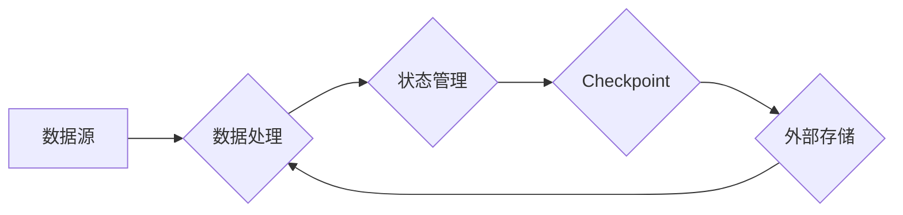

> Flink, Checkpoint, 容错, 数据流, 恢复, 异步, 同步, 状态管理

## 1. 背景介绍

Apache Flink 作为一款高性能、分布式流处理引擎，在处理海量实时数据方面展现出强大的能力。然而，在实际应用中，系统故障、网络波动等不可预知的因素可能会导致数据丢失或处理中断。为了保证数据流的可靠性和持续性，Flink 引入了 Checkpoint 机制，它可以定期将流处理状态保存到外部存储，并提供数据恢复机制，确保在发生故障时能够快速恢复到上次 Checkpoint 的状态。

## 2. 核心概念与联系

**2.1 核心概念**

* **Checkpoint:** Flink 中的 Checkpoint 是一个将流处理状态持久化的过程。它会将当前状态序列化并保存到外部存储，例如 HDFS、S3 等。
* **状态管理:** Flink 使用状态管理机制来存储流处理过程中产生的中间结果和状态信息。状态可以是键值对，也可以是更复杂的结构。
* **容错:** 容错机制是指在系统发生故障时，能够保证数据流的连续性，并尽可能减少数据丢失。

**2.2 核心架构**



**2.3 核心联系**

Checkpoint 机制与状态管理和容错机制紧密相关。

* Checkpoint 会定期将状态管理中的状态信息持久化到外部存储，从而实现数据持久化。
* 当系统发生故障时，Flink 可以根据 Checkpoint 的信息恢复到上次 Checkpoint 的状态，从而保证数据流的连续性。

## 3. 核心算法原理 & 具体操作步骤

**3.1 算法原理概述**

Flink 的 Checkpoint 机制基于以下核心算法：

* **状态序列化:** 将状态信息序列化成字节流，以便存储和传输。
* **状态持久化:** 将序列化后的状态信息写入外部存储。
* **状态恢复:** 从外部存储中读取状态信息，并反序列化成原状态。

**3.2 算法步骤详解**

1. **触发 Checkpoint:** Flink 会根据配置的周期或事件触发 Checkpoint 操作。
2. **状态快照:** 所有任务都将当前状态快照并发送给 Checkpoint Coordinator。
3. **Checkpoint Coordinator 收集状态:** Checkpoint Coordinator 收集所有任务的状态快照，并进行校验。
4. **状态持久化:** Checkpoint Coordinator 将校验通过的状态快照持久化到外部存储。
5. **Checkpoint 完成:** Checkpoint Coordinator 通知所有任务 Checkpoint 完成。
6. **状态恢复:** 当系统发生故障时，Flink 会从最近的 Checkpoint 中恢复状态。

**3.3 算法优缺点**

* **优点:**
    * 保证数据可靠性，即使发生故障也能恢复到上次 Checkpoint 的状态。
    * 支持数据流的连续性，避免数据丢失。
* **缺点:**
    * Checkpoint 操作会占用资源，可能会影响数据处理速度。
    * Checkpoint 的频率和存储位置需要根据实际情况进行配置。

**3.4 算法应用领域**

* 实时数据处理系统
* 流式机器学习
* 互联网金融
* 物联网

## 4. 数学模型和公式 & 详细讲解 & 举例说明

**4.1 数学模型构建**

假设一个流处理系统包含 N 个任务，每个任务的状态信息可以用一个向量 S_i 表示，其中 i = 1, 2, ..., N。Checkpoint 操作可以看作是一个将所有任务的状态信息 S_1, S_2, ..., S_N 映射到一个新的状态向量 S' 的过程。

**4.2 公式推导过程**

Checkpoint 操作的数学模型可以表示为：

```latex
S' = f(S_1, S_2, ..., S_N)
```

其中，f 是一个将多个状态向量映射到一个状态向量的函数。

**4.3 案例分析与讲解**

例如，在一个简单的流处理系统中，每个任务的状态信息是一个整数，表示当前处理到的数据条数。当触发 Checkpoint 操作时，Checkpoint Coordinator 会收集所有任务的状态信息，并将它们拼接成一个新的状态向量，表示整个系统的状态。

## 5. 项目实践：代码实例和详细解释说明

**5.1 开发环境搭建**

* Java Development Kit (JDK) 8 或以上
* Apache Flink 1.13 或以上
* Maven 或 Gradle

**5.2 源代码详细实现**

```java
// 定义一个简单的状态类
public class CounterState {
    private int count;

    public int getCount() {
        return count;
    }

    public void increment() {
        count++;
    }
}

// 定义一个数据流处理程序
public class CheckpointExample {
    public static void main(String[] args) {
        // 创建 Flink 流处理环境
        StreamExecutionEnvironment env = StreamExecutionEnvironment.getExecutionEnvironment();

        // 定义数据源
        DataStream<Integer> dataStream = env.fromElements(1, 2, 3, 4, 5);

        // 定义状态变量
        StateSpec<KeyedStateBackend, CounterState> stateSpec = StateSpecs. keyedState(CounterState.class);

        // 定义数据处理逻辑
        dataStream.keyBy(value -> value)
                .process(new ProcessFunction<Integer, Integer>() {
                    @Override
                    public void processElement(
                            ReadContext ctx,
                            Integer value,
                            Collector<Integer> out) throws Exception {
                        // 获取状态变量
                        CounterState state = ctx.getPartitionedState(stateSpec);

                        // 更新状态变量
                        state.increment();

                        // 输出状态变量
                        out.collect(state.getCount());
                    }
                });

        // 设置 Checkpoint 配置
        env.enableCheckpointing(5000);

        // 执行流处理程序
        env.execute("CheckpointExample");
    }
}
```

**5.3 代码解读与分析**

* 代码定义了一个简单的状态类 `CounterState`，用于存储每个任务处理到的数据条数。
* 代码定义了一个数据流处理程序 `CheckpointExample`，它从一个数据源获取数据，并使用状态变量 `CounterState` 来存储每个任务处理到的数据条数。
* 代码设置了 Checkpoint 的周期为 5000 毫秒，并使用 `enableCheckpointing()` 方法启用 Checkpoint 机制。

**5.4 运行结果展示**

当运行代码时，Flink 会每隔 5000 毫秒将每个任务的状态信息保存到外部存储，并输出每个任务处理到的数据条数。

## 6. 实际应用场景

**6.1 实时数据分析**

Flink 可以用于实时分析海量数据，例如网站访问日志、社交媒体数据等。通过 Checkpoint 机制，可以保证数据分析结果的可靠性和连续性。

**6.2 流式机器学习**

Flink 可以用于构建流式机器学习模型，例如实时预测、异常检测等。Checkpoint 机制可以保证模型训练的稳定性和可靠性。

**6.3 互联网金融**

Flink 可以用于构建互联网金融系统，例如实时交易、风险控制等。Checkpoint 机制可以保证交易的安全性、可靠性和连续性。

**6.4 未来应用展望**

随着数据量的不断增长和实时计算需求的增加，Flink 的 Checkpoint 机制将发挥越来越重要的作用。未来，Checkpoint 机制可能会更加智能化、高效化，并支持更多类型的状态管理和容错机制。

## 7. 工具和资源推荐

**7.1 学习资源推荐**

* Apache Flink 官方文档：https://flink.apache.org/docs/stable/
* Apache Flink 中文社区：https://flink.apache.org/zh-cn/

**7.2 开发工具推荐**

* IntelliJ IDEA
* Eclipse

**7.3 相关论文推荐**

* Apache Flink: A Unified Engine for Batch and Stream Processing
* Fault-Tolerant Stream Processing with Apache Flink

## 8. 总结：未来发展趋势与挑战

**8.1 研究成果总结**

Flink 的 Checkpoint 机制是一个重要的技术创新，它为流处理系统提供了可靠性和连续性的保障。

**8.2 未来发展趋势**

* 更智能化的 Checkpoint 机制，例如基于机器学习的 Checkpoint 周期优化。
* 更高效的 Checkpoint 操作，例如异步 Checkpoint 和压缩 Checkpoint。
* 支持更多类型的状态管理和容错机制。

**8.3 面临的挑战**

* Checkpoint 操作会占用资源，需要平衡性能和可靠性。
* Checkpoint 的配置需要根据实际情况进行调整，需要更智能的配置策略。
* 复杂状态管理场景下的 Checkpoint 恢复效率需要进一步提升。

**8.4 研究展望**

未来，Checkpoint 机制将会继续发展，并与其他流处理技术相结合，为构建更可靠、更高效的流处理系统提供更强大的支持。

## 9. 附录：常见问题与解答

**9.1 如何配置 Checkpoint 周期？**

Checkpoint 周期可以通过 `enableCheckpointing()` 方法配置。

**9.2 如何选择 Checkpoint 的存储位置？**

Checkpoint 的存储位置需要根据实际情况选择，例如 HDFS、S3 等。

**9.3 如何恢复 Checkpoint？**

当系统发生故障时，Flink 会自动从最近的 Checkpoint 中恢复状态。


作者：禅与计算机程序设计艺术 / Zen and the Art of Computer Programming 
<end_of_turn>