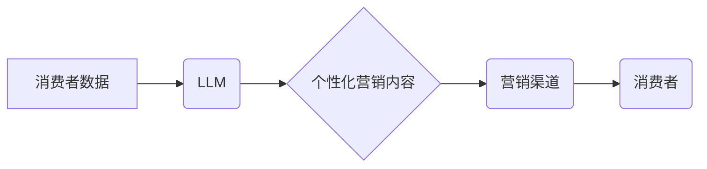

> Large Language Model (LLM), 个性化营销, 自然语言处理 (NLP), 深度学习, 消费者行为分析, 营销自动化

## 1. 背景介绍

在当今数据爆炸的时代，消费者对个性化体验的需求日益增长。传统营销模式的“一刀切”策略已难以满足消费者多元化的需求，智能个性化营销应运而生。智能个性化营销旨在通过对消费者行为、偏好和需求的深入理解，提供定制化的产品推荐、内容推送和营销活动，从而提升营销效果和消费者满意度。

Large Language Model (LLM) 作为一种强大的自然语言处理 (NLP) 技术，具备强大的文本理解、生成和对话能力，为智能个性化营销提供了新的可能性。LLM 可以分析海量消费者数据，识别消费者的兴趣、需求和痛点，并根据这些信息生成个性化的营销内容，例如产品推荐、广告文案、邮件营销和聊天机器人对话等。

## 2. 核心概念与联系

**2.1  智能个性化营销**

智能个性化营销是指利用数据分析、人工智能等技术，根据消费者个体差异，提供定制化的营销服务，以提升营销效果和消费者体验。

**2.2  Large Language Model (LLM)**

LLM 是指训练规模庞大、参数数量众多的深度学习模型，能够理解和生成人类语言。例如，GPT-3、BERT、LaMDA 等都是著名的 LLM。

**2.3  自然语言处理 (NLP)**

NLP 是计算机科学的一个分支，致力于使计算机能够理解、处理和生成人类语言。

**2.4  消费者行为分析**

消费者行为分析是指通过收集和分析消费者行为数据，以了解消费者的购买习惯、偏好和决策过程。

**2.5  营销自动化**

营销自动化是指利用软件工具自动执行营销任务，例如电子邮件营销、社交媒体营销和客户关系管理 (CRM)。

**2.6  架构图**



## 3. 核心算法原理 & 具体操作步骤

**3.1  算法原理概述**

LLM 在智能个性化营销中的应用主要基于以下核心算法：

* **文本分类:** 将消费者评论、反馈等文本数据分类，识别消费者的情感倾向和需求。
* **文本聚类:** 将消费者数据进行聚类，将具有相似兴趣和行为特征的消费者归为一组。
* **文本生成:** 根据消费者数据和营销目标，生成个性化的营销文案、产品推荐和聊天机器人对话。
* **推荐系统:** 基于消费者的历史行为和偏好，推荐个性化的产品和服务。

**3.2  算法步骤详解**

1. **数据收集:** 收集消费者行为数据，例如浏览记录、购买历史、评论反馈等。
2. **数据预处理:** 对收集到的数据进行清洗、转换和格式化，以便于后续算法的训练和应用。
3. **模型训练:** 使用 LLM 模型训练，训练模型能够理解和生成人类语言，并完成上述核心算法任务。
4. **模型评估:** 对训练好的模型进行评估，评估模型的准确率、召回率和F1-score等指标。
5. **模型部署:** 将训练好的模型部署到生产环境中，用于实时处理消费者数据和生成个性化营销内容。

**3.3  算法优缺点**

**优点:**

* **个性化程度高:** 可以根据每个消费者的个体差异提供定制化的营销服务。
* **营销效果提升:** 通过精准的营销内容和目标群体，提升营销转化率和ROI。
* **消费者体验增强:** 提供更符合消费者需求的个性化体验，提升消费者满意度和忠诚度。

**缺点:**

* **数据依赖性强:** 需要大量高质量的消费者数据才能训练出有效的模型。
* **模型训练成本高:** 训练大型 LLM 模型需要大量的计算资源和时间。
* **隐私安全问题:** 需要妥善处理消费者数据，确保数据安全和隐私保护。

**3.4  算法应用领域**

* **电商推荐:** 根据用户的浏览历史、购买记录等数据，推荐个性化的商品。
* **内容推荐:** 根据用户的阅读习惯、兴趣爱好等数据，推荐个性化的文章、视频和音频内容。
* **广告投放:** 根据用户的兴趣爱好、行为特征等数据，精准投放个性化的广告。
* **客户服务:** 利用聊天机器人技术，提供个性化的客户服务和技术支持。

## 4. 数学模型和公式 & 详细讲解 & 举例说明

**4.1  数学模型构建**

在智能个性化营销中，常用的数学模型包括：

* **协同过滤:** 基于用户的行为相似性，推荐用户可能感兴趣的商品或内容。
* **内容基准:** 基于商品或内容的特征，推荐与用户兴趣相符的商品或内容。
* **深度学习:** 利用深度神经网络，学习用户行为和偏好，进行更精准的推荐。

**4.2  公式推导过程**

协同过滤算法中常用的公式包括：

* **相似度计算:** 使用余弦相似度或皮尔逊相关系数计算用户之间的相似度。
* **预测评分:** 使用用户相似度加权平均，预测用户对商品的评分。

**4.3  案例分析与讲解**

假设有一个电商平台，想要推荐用户个性化的商品。可以使用协同过滤算法，根据用户的购买历史和商品评分数据，计算用户之间的相似度。然后，对于某个用户，可以根据与该用户相似度高的其他用户的购买记录，推荐该用户可能感兴趣的商品。

**举例说明:**

用户 A 和用户 B 都购买了商品 X 和商品 Y，但用户 A 对商品 Z 感兴趣，而用户 B 对商品 W 感兴趣。根据协同过滤算法，可以计算出用户 A 和用户 B 的相似度，并根据用户 B 对商品 W 的购买记录，推荐用户 A 商品 W。

## 5. 项目实践：代码实例和详细解释说明

**5.1  开发环境搭建**

* Python 3.7+
* TensorFlow 或 PyTorch
* Jupyter Notebook

**5.2  源代码详细实现**

```python
# 导入必要的库
import numpy as np
from sklearn.metrics.pairwise import cosine_similarity

# 定义用户-商品评分矩阵
ratings = np.array([
    [5, 4, 3, 0],
    [4, 5, 0, 3],
    [3, 0, 5, 4],
    [0, 3, 4, 5]
])

# 计算用户之间的相似度
user_similarity = cosine_similarity(ratings)

# 获取用户 A 的相似用户
user_a_index = 0
similar_users = np.argsort(user_similarity[user_a_index])[::-1][1:]

# 获取用户 A 未评分的商品
unrated_items = np.where(ratings[user_a_index] == 0)[0]

# 预测用户 A 对未评分商品的评分
for item in unrated_items:
    predicted_rating = np.mean([ratings[user, item] for user in similar_users if ratings[user, item] != 0])
    print(f"用户 A 对商品 {item+1} 的预测评分: {predicted_rating}")
```

**5.3  代码解读与分析**

* 代码首先定义了一个用户-商品评分矩阵，其中每个元素代表用户对商品的评分。
* 然后，使用余弦相似度计算用户之间的相似度。
* 接着，获取用户 A 的相似用户，并获取用户 A 未评分的商品。
* 最后，使用相似用户的评分数据，预测用户 A 对未评分商品的评分。

**5.4  运行结果展示**

运行代码后，会输出用户 A 对未评分商品的预测评分。

## 6. 实际应用场景

**6.1  电商推荐**

* 根据用户的浏览历史、购买记录等数据，推荐个性化的商品。
* 提供“你可能也喜欢”或“其他人也买了”等推荐功能。

**6.2  内容推荐**

* 根据用户的阅读习惯、兴趣爱好等数据，推荐个性化的文章、视频和音频内容。
* 提供“为你推荐”或“个性化订阅”等内容推荐功能。

**6.3  广告投放**

* 根据用户的兴趣爱好、行为特征等数据，精准投放个性化的广告。
* 提高广告点击率和转化率。

**6.4  未来应用展望**

* **更精准的个性化推荐:** 利用更先进的机器学习算法和数据分析技术，提供更精准的个性化推荐。
* **多模态个性化营销:** 将文本、图像、音频等多模态数据融合，提供更丰富的个性化营销体验。
* **虚拟助手和聊天机器人:** 利用 LLM 技术，开发更智能的虚拟助手和聊天机器人，为消费者提供更个性化的服务。

## 7. 工具和资源推荐

**7.1  学习资源推荐**

* **斯坦福大学 NLP课程:** https://web.stanford.edu/class/cs224n/
* **DeepLearning.AI 自然语言处理课程:** https://www.deeplearning.ai/courses/natural-language-processing-with-deep-learning/
* **Hugging Face Transformers库:** https://huggingface.co/docs/transformers/index

**7.2  开发工具推荐**

* **TensorFlow:** https://www.tensorflow.org/
* **PyTorch:** https://pytorch.org/
* **Jupyter Notebook:** https://jupyter.org/

**7.3  相关论文推荐**

* **BERT: Pre-training of Deep Bidirectional Transformers for Language Understanding:** https://arxiv.org/abs/1810.04805
* **GPT-3: Language Models are Few-Shot Learners:** https://arxiv.org/abs/2005.14165

## 8. 总结：未来发展趋势与挑战

**8.1  研究成果总结**

LLM 在智能个性化营销领域取得了显著的成果，能够提供更精准的推荐、更个性化的内容和更有效的营销活动。

**8.2  未来发展趋势**

* **模型规模和能力提升:** 随着计算资源的不断发展，LLM 模型的规模和能力将不断提升，能够处理更复杂的数据和完成更复杂的任务。
* **多模态融合:** 将文本、图像、音频等多模态数据融合，提供更丰富的个性化营销体验。
* **解释性增强:** 提高 LLM 模型的解释性，让用户能够更好地理解模型的决策过程。

**8.3  面临的挑战**

* **数据隐私和安全:** LLM 模型需要大量数据进行训练，如何保护用户数据隐私和安全是一个重要的挑战。
* **模型偏见和公平性:** LLM 模型可能存在偏见和不公平性，需要采取措施 mitigating 这些问题。
* **可解释性和信任度:** LLM 模型的决策过程往往是复杂的，需要提高模型的可解释性和信任度。

**8.4  研究展望**

未来，LLM 在智能个性化营销领域将继续发挥重要作用，并与其他技术融合，例如增强现实 (AR)、虚拟现实 (VR) 和区块链技术，为消费者提供更智能、更个性化的营销体验。

## 9. 附录：常见问题与解答

**9.1  LLM 模型训练需要多少数据？**

LLM 模型的训练数据量取决于模型的规模和复杂度。一般来说，大型 LLM 模型需要数十亿甚至数百亿条文本数据进行训练。

**9.2  如何解决 LLM 模型的偏见问题？**

可以通过以下方法解决 LLM 模型的偏见问题：

* 使用更公平、更代表性的训练数据。
* 在训练过程中加入公平性约束。
* 对模型输出进行评估和修正。

**9.3  LLM 模型的决策过程如何解释？**

可以通过以下方法解释 LLM 模型的决策过程：

* 使用可视化技术展示模型的注意力机制。
* 使用反向传播算法分析模型的权重。
* 使用人类专家进行模型解释。