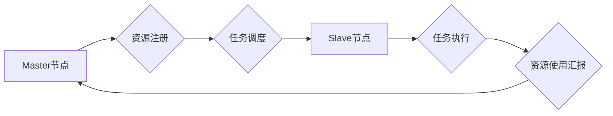

> Mesos, 分布式系统, 资源管理, 集群调度, 容器化, 框架

## 1. 背景介绍

随着大数据、云计算和人工智能等技术的蓬勃发展，分布式系统架构逐渐成为主流。在分布式系统中，高效地管理和调度资源至关重要。Mesos 作为一款开源的资源管理平台，旨在解决分布式系统中资源分配和任务调度的问题。它提供了一种统一的接口，允许用户将各种应用程序和框架部署到集群中，并自动分配资源。

Mesos 的出现填补了 Hadoop 和 Spark 等大数据框架在资源管理方面的不足。它支持多种类型的框架，包括 Apache Spark、Apache Flink、TensorFlow 等，并能够动态地分配资源，以满足应用程序的需求。

## 2. 核心概念与联系

Mesos 的核心概念包括：

* **Master节点:** 负责管理集群资源和调度任务。
* **Slave节点:** 负责执行任务，并向 Master 节点汇报资源使用情况。
* **框架:**  用户编写的应用程序或工具，例如 Spark、Flink 等。
* **任务:** 框架执行的单个工作单元。
* **资源:** 集群中的计算资源和存储资源。

**Mesos 架构流程图:**



## 3. 核心算法原理 & 具体操作步骤

### 3.1  算法原理概述

Mesos 使用一种称为 **Auction** 的算法来调度任务。

* **资源注册:** Slave 节点向 Master 节点注册可用资源。
* **任务提交:** 框架向 Master 节点提交任务请求，并指定所需的资源。
* **资源拍卖:** Master 节点将任务请求与可用资源进行匹配，并进行资源拍卖。
* **任务分配:** 框架获得资源后，Master 节点将任务分配给相应的 Slave 节点。
* **任务执行:** Slave 节点执行任务，并向 Master 节点汇报资源使用情况。

### 3.2  算法步骤详解

1. **资源注册:** Slave 节点启动后，会向 Master 节点注册其可用的 CPU、内存等资源。
2. **任务提交:** 框架通过 Mesos API 向 Master 节点提交任务请求，请求所需的资源类型和数量。
3. **资源拍卖:** Master 节点收到任务请求后，会将该请求与注册的资源进行匹配。如果匹配成功，则会进行资源拍卖。
4. **任务分配:**  Master 节点会根据框架提交的资源请求和 Slave 节点提供的资源信息，进行资源分配。
5. **任务执行:** Slave 节点收到任务分配后，会执行任务，并向 Master 节点汇报资源使用情况。

### 3.3  算法优缺点

**优点:**

* **高效的资源利用:** 通过资源拍卖机制，Mesos 可以高效地利用集群资源，避免资源浪费。
* **灵活的框架支持:** Mesos 支持多种类型的框架，可以满足不同的应用需求。
* **动态资源分配:** Mesos 可以根据应用程序的需求动态地分配资源，提高资源利用率。

**缺点:**

* **复杂性:** Mesos 的架构相对复杂，需要一定的学习成本。
* **性能瓶颈:** Master 节点可能会成为性能瓶颈，尤其是在大型集群中。

### 3.4  算法应用领域

Mesos 的资源管理和调度能力广泛应用于以下领域:

* **大数据处理:** Spark、Flink 等大数据框架依赖 Mesos 来管理资源。
* **机器学习:** TensorFlow、PyTorch 等机器学习框架可以使用 Mesos 来训练模型。
* **云计算:** 云服务提供商可以使用 Mesos 来管理虚拟机和容器资源。

## 4. 数学模型和公式 & 详细讲解 & 举例说明

### 4.1  数学模型构建

Mesos 的资源分配算法可以抽象为一个资源分配问题，可以使用数学模型来描述。

假设有 **n** 个 Slave 节点，每个 Slave 节点拥有 **m** 种类型的资源，例如 CPU、内存等。每个 Slave 节点可以提供 **r_i** 个资源 **i** (i = 1, 2, ..., m)。

框架提交 **k** 个任务请求，每个任务请求需要 **q_j** 个资源 **i** (j = 1, 2, ..., k)。

目标是找到一个资源分配方案，使得所有任务都能得到满足资源需求。

### 4.2  公式推导过程

可以使用线性规划模型来解决资源分配问题。

**目标函数:**

```latex
min \sum_{i=1}^{m} \sum_{j=1}^{k} c_{ij} x_{ij}
```

其中， **c_{ij}** 是资源 **i** 的单位成本， **x_{ij}** 是任务 **j** 使用的资源 **i** 的数量。

**约束条件:**

```latex
\sum_{j=1}^{k} x_{ij} \leq r_i, \quad i = 1, 2, ..., m
```

```latex
\sum_{i=1}^{m} x_{ij} \geq q_j, \quad j = 1, 2, ..., k
```

其中，第一个约束条件表示每个资源的总使用量不能超过其可用量，第二个约束条件表示每个任务的资源需求必须得到满足。

### 4.3  案例分析与讲解

假设有 3 个 Slave 节点，每个 Slave 节点拥有 CPU 和内存两种资源。

* Slave 节点 1: CPU 2 核，内存 4 GB
* Slave 节点 2: CPU 4 核，内存 8 GB
* Slave 节点 3: CPU 2 核，内存 4 GB

框架提交 2 个任务请求，任务 1 需要 CPU 1 核和内存 2 GB，任务 2 需要 CPU 3 核和内存 6 GB。

使用线性规划模型可以求解资源分配方案，例如：

* 任务 1 分配给 Slave 节点 1
* 任务 2 分配给 Slave 节点 2

## 5. 项目实践：代码实例和详细解释说明

### 5.1  开发环境搭建

* 安装 Java JDK
* 安装 Apache Mesos
* 安装 Mesos 的客户端工具

### 5.2  源代码详细实现

以下是一个简单的 Mesos 框架示例代码，用于执行一个简单的计算任务。

```java
import org.apache.mesos.Protos.*;

public class SimpleMesosTask {

    public static void main(String[] args) {
        // 创建任务信息
        TaskInfo taskInfo = TaskInfo.newBuilder()
                .setName("SimpleTask")
                .setCommand(CommandInfo.newBuilder()
                        .setValue("echo Hello, Mesos!"))
                .build();

        // 创建任务
        Task task = Task.newBuilder()
                .setTaskId(TaskID.newBuilder().setValue("simple-task"))
                .setTaskInfo(taskInfo)
                .build();

        // 创建框架信息
        FrameworkInfo frameworkInfo = FrameworkInfo.newBuilder()
                .setName("SimpleFramework")
                .build();

        // 创建 Mesos 客户端
        MesosClient client = new MesosClient(frameworkInfo);

        // 提交任务
        client.submitTask(task);
    }
}
```

### 5.3  代码解读与分析

* **创建任务信息:**  任务信息包括任务名称、执行命令等。
* **创建任务:**  任务对象包含任务 ID 和任务信息。
* **创建框架信息:**  框架信息包括框架名称等。
* **创建 Mesos 客户端:**  Mesos 客户端用于与 Master 节点通信。
* **提交任务:**  使用 Mesos 客户端提交任务到 Master 节点。

### 5.4  运行结果展示

运行该代码后，Mesos 会调度资源并执行任务。任务执行完成后，会输出 "Hello, Mesos!" 到控制台。

## 6. 实际应用场景

### 6.1  大数据处理

Mesos 可以用于管理 Spark、Flink 等大数据框架的资源，提高大数据处理效率。

### 6.2  机器学习

Mesos 可以用于训练机器学习模型，例如 TensorFlow、PyTorch 等。

### 6.3  云计算

云服务提供商可以使用 Mesos 来管理虚拟机和容器资源，提高资源利用率。

### 6.4  未来应用展望

Mesos 的应用场景还在不断扩展，未来可能会应用于更多领域，例如：

* **边缘计算:**  Mesos 可以用于管理边缘设备的资源，提高边缘计算效率。
* **物联网:**  Mesos 可以用于管理物联网设备的资源，提高物联网应用的可靠性和效率。

## 7. 工具和资源推荐

### 7.1  学习资源推荐

* **Mesos 官方文档:** https://mesos.apache.org/documentation/
* **Mesos 中文社区:** https://mesos.apache.org/zh-cn/

### 7.2  开发工具推荐

* **Mesos CLI:**  用于与 Mesos 集群交互的命令行工具。
* **Mesos Web UI:**  用于监控和管理 Mesos 集群的 Web 界面。

### 7.3  相关论文推荐

* **Mesos: A Platform for Fine-Grained Resource Management in the Cloud:** https://www.usenix.org/system/files/conference/osdi13/osdi13-paper-zhou.pdf

## 8. 总结：未来发展趋势与挑战

### 8.1  研究成果总结

Mesos 作为一款开源的资源管理平台，已经取得了显著的成果，广泛应用于大数据处理、机器学习等领域。

### 8.2  未来发展趋势

Mesos 的未来发展趋势包括：

* **更强大的资源管理能力:**  Mesos 将继续改进其资源管理算法，提高资源利用率和调度效率。
* **更广泛的应用场景:**  Mesos 将应用于更多领域，例如边缘计算、物联网等。
* **更易于使用的界面:**  Mesos 将提供更易于使用的界面，方便用户管理和监控集群。

### 8.3  面临的挑战

Mesos 还面临一些挑战，例如：

* **性能瓶颈:**  Master 节点可能会成为性能瓶颈，需要进一步优化。
* **复杂性:**  Mesos 的架构相对复杂，需要一定的学习成本。

### 8.4  研究展望

未来，Mesos 的研究方向包括：

* **提高资源利用率:**  研究更有效的资源管理算法，提高资源利用率。
* **降低复杂性:**  简化 Mesos 的架构，降低学习成本。
* **扩展应用场景:**  将 Mesos 应用于更多领域，例如边缘计算、物联网等。

## 9. 附录：常见问题与解答

### 9.1  常见问题

* **Mesos 和 Kubernetes 的区别是什么？**
* **如何部署 Mesos 集群？**
* **如何使用 Mesos 调度任务？**

### 9.2  解答

* **Mesos 和 Kubernetes 的区别:** Mesos 侧重于资源管理，而 Kubernetes 侧重于容器编排。
* **如何部署 Mesos 集群:**  可以参考 Mesos 官方文档进行部署。
* **如何使用 Mesos 调度任务:**  可以使用 Mesos 的 API 或 CLI 工具提交任务。


作者：禅与计算机程序设计艺术 / Zen and the Art of Computer Programming 
<end_of_turn>