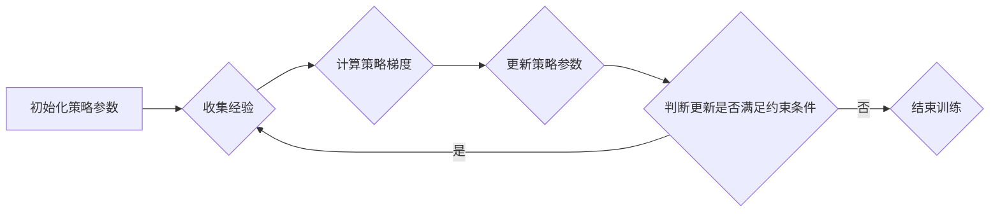

> PPO, 强化学习, 策略优化, 梯度下降, 稳定性, 代码实例

## 1. 背景介绍

强化学习 (Reinforcement Learning, RL) 作为机器学习的一个重要分支，近年来在各个领域取得了显著的成果，例如游戏、机器人控制、自动驾驶等。强化学习的核心在于训练智能体在环境中通过与环境交互学习最优策略，以最大化累积的奖励。

策略优化 (Policy Optimization) 是强化学习中的一种重要方法，其目标是直接优化策略函数，从而找到最优的行动选择策略。然而，直接优化策略函数往往容易导致策略震荡，导致训练不稳定。

PPO (Proximal Policy Optimization) 算法正是为了解决策略优化算法训练不稳定的问题而提出的。PPO 算法通过引入一个策略更新的限制条件，保证策略更新的幅度不会过大，从而提高了训练的稳定性。

## 2. 核心概念与联系

**2.1 强化学习基本概念**

* **环境 (Environment):** 智能体所处的外部世界，环境会根据智能体的动作提供奖励和新的状态。
* **智能体 (Agent):** 学习和决策的实体，智能体会根据当前状态选择动作并与环境交互。
* **状态 (State):** 环境的当前描述，例如游戏中的棋盘状态、机器人位置等。
* **动作 (Action):** 智能体在特定状态下可以执行的操作，例如游戏中的棋子移动、机器人前进等。
* **奖励 (Reward):** 环境对智能体动作的反馈，奖励可以是正数、负数或零，用于指导智能体学习最优策略。
* **策略 (Policy):** 智能体选择动作的概率分布，策略函数 π(a|s) 表示在状态 s 下选择动作 a 的概率。

**2.2 策略优化算法**

策略优化算法的目标是直接优化策略函数，从而找到最优的行动选择策略。常见的策略优化算法包括：

* **REINFORCE:** 基于蒙特卡罗采样的策略梯度算法。
* **Actor-Critic:** 将策略梯度算法与价值函数估计相结合，提高了训练效率。
* **TRPO (Trust Region Policy Optimization):** 通过引入一个信任区域约束，保证策略更新的幅度不会过大，提高了训练稳定性。

**2.3 PPO 算法**

PPO 算法是 TRPO 算法的一种改进版本，它通过使用一个更简单的约束条件来代替 TRPO 中的复杂约束，从而简化了算法的实现和训练过程。

**2.4 PPO 算法流程图**



## 3. 核心算法原理 & 具体操作步骤

### 3.1 算法原理概述

PPO 算法的核心思想是通过引入一个策略更新的限制条件，保证策略更新的幅度不会过大，从而提高了训练的稳定性。

PPO 算法的策略更新公式如下：

```
θ_new = argmax_θ  E[min(r(θ, s, a)A(s, a), clip(r(θ, s, a)A(s, a), 1-ε, 1+ε))]
```

其中：

* θ 是策略参数
* r(θ, s, a) 是策略在状态 s 下执行动作 a 的优势函数
* A(s, a) 是状态 s 下执行动作 a 的优势函数
* ε 是一个小的正数，用于控制策略更新的幅度

PPO 算法通过使用一个 clipped surrogate objective 来限制策略更新的幅度。

### 3.2 算法步骤详解

1. **初始化策略参数:** 随机初始化策略参数 θ。
2. **收集经验:** 使用策略 θ 与环境交互，收集状态、动作和奖励的经验数据。
3. **计算策略梯度:** 计算策略梯度，即策略参数 θ 对策略函数的影响。
4. **更新策略参数:** 使用策略梯度更新策略参数 θ，并使用 clipped surrogate objective 来限制策略更新的幅度。
5. **判断更新是否满足约束条件:** 判断更新后的策略参数是否满足约束条件，如果满足则返回步骤 2，否则结束训练。

### 3.3 算法优缺点

**优点:**

* 训练稳定性高，不易出现策略震荡。
* 算法实现相对简单，易于理解和应用。
* 在各种强化学习任务中都取得了不错的效果。

**缺点:**

* 训练速度相对较慢。
* 算法参数需要进行调优。

### 3.4 算法应用领域

PPO 算法在以下领域取得了广泛应用：

* **游戏:** 训练游戏 AI，例如 AlphaStar、OpenAI Five 等。
* **机器人控制:** 训练机器人执行各种任务，例如导航、抓取等。
* **自动驾驶:** 训练自动驾驶汽车，例如 Waymo、Cruise 等。
* **金融:** 训练金融交易策略，例如股票投资、风险管理等。

## 4. 数学模型和公式 & 详细讲解 & 举例说明

### 4.1 数学模型构建

在强化学习中，智能体与环境的交互过程可以建模为马尔可夫决策过程 (MDP)。MDP 由以下四个要素组成：

* 状态空间 S: 所有可能的系统状态的集合。
* 动作空间 A: 在每个状态下智能体可以执行的动作的集合。
* 转移概率分布 P(s'|s,a): 在状态 s 下执行动作 a 后转移到状态 s' 的概率。
* 奖励函数 R(s,a): 在状态 s 下执行动作 a 后获得的奖励。

PPO 算法的目标是找到一个策略函数 π(a|s)，使得智能体在与环境交互的过程中能够最大化累积的奖励。

### 4.2 公式推导过程

PPO 算法的策略更新公式如下：

```
θ_new = argmax_θ  E[min(r(θ, s, a)A(s, a), clip(r(θ, s, a)A(s, a), 1-ε, 1+ε))]
```

其中：

* θ 是策略参数
* r(θ, s, a) 是策略在状态 s 下执行动作 a 的优势函数
* A(s, a) 是状态 s 下执行动作 a 的优势函数
* ε 是一个小的正数，用于控制策略更新的幅度

优势函数 A(s, a) 表示在状态 s 下执行动作 a 的期望奖励与状态价值函数的差值。

```
A(s, a) = Q(s, a) - V(s)
```

其中：

* Q(s, a) 是状态 s 下执行动作 a 的 Q 值
* V(s) 是状态 s 的价值函数

### 4.3 案例分析与讲解

假设我们有一个简单的强化学习任务，例如训练一个智能体学习玩一个简单的游戏。

在游戏中，智能体可以执行两种动作：向上移动和向下移动。游戏环境的奖励函数如下：

* 当智能体到达游戏目标时，奖励为 1。
* 当智能体移动到一个障碍物时，奖励为 -1。
* 其他情况下，奖励为 0。

我们可以使用 PPO 算法训练智能体学习玩这个游戏。

在训练过程中，智能体会与环境交互，收集经验数据。然后，PPO 算法会使用这些经验数据计算策略梯度，并更新策略参数。

通过反复迭代，智能体最终会学习到一个能够使它在游戏中获得最大奖励的策略。

## 5. 项目实践：代码实例和详细解释说明

### 5.1 开发环境搭建

* Python 3.6+
* TensorFlow 或 PyTorch
* OpenAI Gym

### 5.2 源代码详细实现

```python
import gym
import tensorflow as tf

# 定义 PPO 算法
class PPO:
    def __init__(self, state_dim, action_dim, learning_rate=0.001, gamma=0.99, epsilon=0.2):
        # 初始化策略网络
        self.policy_net = tf.keras.Sequential([
            tf.keras.layers.Dense(64, activation='relu', input_shape=(state_dim,)),
            tf.keras.layers.Dense(64, activation='relu'),
            tf.keras.layers.Dense(action_dim, activation='softmax')
        ])
        # 初始化价值网络
        self.value_net = tf.keras.Sequential([
            tf.keras.layers.Dense(64, activation='relu', input_shape=(state_dim,)),
            tf.keras.layers.Dense(64, activation='relu'),
            tf.keras.layers.Dense(1)
        ])
        # 初始化优化器
        self.optimizer = tf.keras.optimizers.Adam(learning_rate=learning_rate)

    # 计算策略梯度
    def calculate_policy_gradient(self, states, actions, rewards, next_states, dones):
        # ...

    # 更新策略参数
    def update_policy(self, states, actions, rewards, next_states, dones):
        # ...

# 创建环境
env = gym.make('CartPole-v1')

# 初始化 PPO 算法
ppo = PPO(state_dim=env.observation_space.shape[0], action_dim=env.action_space.n)

# 训练 PPO 算法
for episode in range(1000):
    state = env.reset()
    done = False
    total_reward = 0
    while not done:
        # 选择动作
        action = ppo.policy_net(state)
        # 执行动作
        next_state, reward, done, _ = env.step(action)
        # 更新经验数据
        ppo.update_experience(state, action, reward, next_state, done)
        # 更新策略参数
        ppo.update_policy()
        # 更新状态
        state = next_state
        total_reward += reward
    print(f'Episode {episode} - Total Reward: {total_reward}')

```

### 5.3 代码解读与分析

* **策略网络:** 策略网络用于预测在给定状态下执行每个动作的概率。
* **价值网络:** 价值网络用于估计状态的价值函数。
* **优势函数:** 优势函数表示在状态 s 下执行动作 a 的期望奖励与状态价值函数的差值。
* **策略梯度:** 策略梯度表示策略参数对策略函数的影响。
* ** clipped surrogate objective:** Clipped surrogate objective 是一个用于限制策略更新幅度的技巧。

### 5.4 运行结果展示

运行上述代码后，智能体将在 CartPole-v1 环境中学习平衡杆，并随着训练的进行，能够保持杆子平衡的时间越来越长。

## 6. 实际应用场景

PPO 算法在强化学习领域有着广泛的应用场景，例如：

* **游戏 AI:** 训练游戏 AI，例如 AlphaStar、OpenAI Five 等。
* **机器人控制:** 训练机器人执行各种任务，例如导航、抓取等。
* **自动驾驶:** 训练自动驾驶汽车，例如 Waymo、Cruise 等。
* **金融:** 训练金融交易策略，例如股票投资、风险管理等。

### 6.4 未来应用展望

随着强化学习技术的不断发展，PPO 算法在未来将有更广泛的应用场景，例如：

* **医疗保健:** 训练医疗诊断系统、个性化治疗方案等。
* **教育:** 训练个性化学习系统、智能辅导系统等。
* **能源:** 训练智能能源管理系统、优化能源分配等。

## 7. 工具