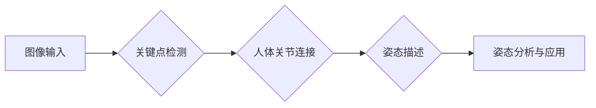

> Pose Estimation, 人体姿态估计, 深度学习, 计算机视觉, 图像处理, 关键点检测, 模型训练, 代码实现

## 1. 背景介绍

在计算机视觉领域，人体姿态估计（Pose Estimation）是一个重要的研究方向，它旨在从图像或视频中识别和定位人体关节的位置。该技术在许多应用场景中发挥着重要作用，例如：

* **运动捕捉:** 用于游戏、动画、虚拟现实等领域，捕捉人体动作并将其转化为数字模型。
* **人机交互:**  实现人机之间的自然交互，例如控制虚拟物体、进行手势识别等。
* **医疗诊断:**  分析人体姿势异常，辅助医生诊断疾病。
* **体育训练:**  评估运动员的动作规范性，提供个性化训练建议。
* **安防监控:**  识别异常行为，提高安全保障。

随着深度学习技术的快速发展，人体姿态估计取得了显著进展。基于深度学习的姿态估计方法能够准确地识别人体关键点，并对人体姿态进行精确描述。

## 2. 核心概念与联系

人体姿态估计的核心概念包括：

* **关键点检测:**  识别人体图像中的关键点，例如头部、肩膀、肘部、手腕、膝盖等。
* **人体关节连接:**  根据关键点的位置，建立人体关节之间的连接关系，形成人体姿态的骨架结构。
* **姿态描述:**  使用数学模型或向量表示人体姿态，例如欧拉角、关节角度等。

**核心概念架构流程图:**



## 3. 核心算法原理 & 具体操作步骤

### 3.1  算法原理概述

目前，基于深度学习的人体姿态估计算法主要分为两大类：

* **基于回归的算法:**  直接预测人体关键点的坐标，例如OpenPose、PoseNet等。
* **基于检测的算法:**  将人体姿态视为多个目标，并使用目标检测算法进行识别，例如HRNet、AlphaPose等。

### 3.2  算法步骤详解

以基于回归的算法为例，其具体操作步骤如下：

1. **数据预处理:**  将输入图像预处理，例如调整大小、归一化等。
2. **特征提取:**  使用卷积神经网络（CNN）提取图像特征，例如ResNet、VGG等。
3. **关键点预测:**  使用全连接层或其他回归网络预测每个关键点的坐标。
4. **姿态连接:**  根据预测的关键点坐标，连接人体关节，形成姿态骨架。
5. **姿态评估:**  使用姿态评估指标，例如平均位移误差（MPJPE）、关键点准确率等，评估算法的性能。

### 3.3  算法优缺点

**基于回归的算法:**

* **优点:**  训练简单，速度快，精度较高。
* **缺点:**  对姿态变化敏感，难以处理遮挡情况。

**基于检测的算法:**

* **优点:**  能够处理遮挡情况，对姿态变化更鲁棒。
* **缺点:**  训练复杂，速度较慢，精度相对较低。

### 3.4  算法应用领域

人体姿态估计算法广泛应用于以下领域：

* **运动捕捉:**  用于游戏、动画、虚拟现实等领域，捕捉人体动作并将其转化为数字模型。
* **人机交互:**  实现人机之间的自然交互，例如控制虚拟物体、进行手势识别等。
* **医疗诊断:**  分析人体姿势异常，辅助医生诊断疾病。
* **体育训练:**  评估运动员的动作规范性，提供个性化训练建议。
* **安防监控:**  识别异常行为，提高安全保障。

## 4. 数学模型和公式 & 详细讲解 & 举例说明

### 4.1  数学模型构建

人体姿态估计通常使用以下数学模型进行描述：

* **关键点坐标:**  每个关键点用二维坐标 (x, y) 表示。
* **关节连接关系:**  使用图论模型表示人体关节之间的连接关系，其中每个节点代表一个关键点，边代表关节连接。
* **姿态向量:**  使用向量表示人体姿态，例如欧拉角、关节角度等。

### 4.2  公式推导过程

例如，使用欧拉角描述人体姿态，其公式如下：

* **旋转矩阵:**  使用三个欧拉角 (roll, pitch, yaw) 计算旋转矩阵 R。
* **姿态向量:**  将旋转矩阵 R 转换为姿态向量，例如 [roll, pitch, yaw]。

### 4.3  案例分析与讲解

假设人体姿态为：

* 头部关键点坐标: (100, 100)
* 肩膀关键点坐标: (150, 150)
* 肘部关键点坐标: (200, 100)

可以使用上述公式计算人体姿态的欧拉角，并将其用于姿态描述和分析。

## 5. 项目实践：代码实例和详细解释说明

### 5.1  开发环境搭建

* **操作系统:**  Windows/Linux/macOS
* **编程语言:**  Python
* **深度学习框架:**  TensorFlow/PyTorch
* **库:**  OpenCV、NumPy、Matplotlib等

### 5.2  源代码详细实现

```python
import tensorflow as tf
from tensorflow.keras.models import Model
from tensorflow.keras.layers import Input, Conv2D, MaxPooling2D, Flatten, Dense

# 定义输入层
input_tensor = Input(shape=(224, 224, 3))

# 定义卷积神经网络
x = Conv2D(32, (3, 3), activation='relu')(input_tensor)
x = MaxPooling2D((2, 2))(x)
x = Conv2D(64, (3, 3), activation='relu')(x)
x = MaxPooling2D((2, 2))(x)
x = Conv2D(128, (3, 3), activation='relu')(x)
x = MaxPooling2D((2, 2))(x)
x = Flatten()(x)
x = Dense(128, activation='relu')(x)
output_tensor = Dense(17 * 2, activation='linear')(x)

# 创建模型
model = Model(inputs=input_tensor, outputs=output_tensor)

# 编译模型
model.compile(optimizer='adam', loss='mse')

# 训练模型
model.fit(train_data, train_labels, epochs=10)

# 预测姿态
predictions = model.predict(test_data)
```

### 5.3  代码解读与分析

* **输入层:**  接收输入图像，形状为 (224, 224, 3)。
* **卷积神经网络:**  使用多个卷积层和池化层提取图像特征。
* **全连接层:**  将提取的特征进行分类和回归，预测关键点的坐标。
* **模型编译:**  使用 Adam 优化器和均方误差损失函数编译模型。
* **模型训练:**  使用训练数据训练模型。
* **模型预测:**  使用测试数据预测姿态。

### 5.4  运行结果展示

运行代码后，可以得到预测的关键点坐标，并将其可视化显示在图像上。

## 6. 实际应用场景

### 6.1  运动捕捉

人体姿态估计技术广泛应用于运动捕捉领域，例如：

* **游戏开发:**  捕捉玩家的动作，实现逼真的游戏角色动作。
* **动画制作:**  捕捉演员的动作，生成逼真的动画角色。
* **虚拟现实:**  捕捉用户的动作，实现虚拟环境中的交互。

### 6.2  人机交互

人体姿态估计技术可以用于人机交互，例如：

* **手势识别:**  识别用户的手势，控制虚拟物体或应用程序。
* **体感游戏:**  使用用户的动作控制游戏角色。
* **辅助控制:**  帮助残疾人控制设备。

### 6.3  医疗诊断

人体姿态估计技术可以用于医疗诊断，例如：

* **姿势异常检测:**  识别患者的姿势异常，例如驼背、前倾等。
* **运动能力评估:**  评估患者的运动能力，例如平衡、协调等。
* **康复训练:**  指导患者进行康复训练，例如肢体运动、平衡训练等。

### 6.4  未来应用展望

人体姿态估计技术在未来将有更广泛的应用，例如：

* **智能家居:**  根据用户的动作，自动控制家居设备。
* **智慧城市:**  监控人群流动，识别异常行为。
* **自动驾驶:**  识别行人、车辆等，辅助自动驾驶系统决策。

## 7. 工具和资源推荐

### 7.1  学习资源推荐

* **书籍:**  
    * "Deep Learning for Computer Vision with Python" by Adrian Rosebrock
    * "Computer Vision: Algorithms and Applications" by Richard Szeliski
* **在线课程:**  
    * Coursera: "Deep Learning Specialization" by Andrew Ng
    * Udacity: "Computer Vision Nanodegree"
* **博客:**  
    * https://blog.openpose.org/
    * https://towardsdatascience.com/

### 7.2  开发工具推荐

* **深度学习框架:**  TensorFlow, PyTorch
* **图像处理库:**  OpenCV
* **数据可视化库:**  Matplotlib, Seaborn

### 7.3  相关论文推荐

* "OpenPose: Real-time Multi-Person 2D Pose Estimation Using Part Affinity Fields"
* "HRNet: High-Resolution Network for Human Pose Estimation"
* "AlphaPose: Realtime Multi-Person Pose Estimation via Part Affinity Fields"

## 8. 总结：未来发展趋势与挑战

### 8.1  研究成果总结

近年来，人体姿态估计技术取得了显著进展，算法精度不断提高，速度也越来越快。

### 8.2  未来发展趋势

* **3D 姿势估计:**  从 2D 姿势估计扩展到 3D 姿势估计，能够更准确地描述人体姿态。
* **多视角姿态估计:**  利用多视角图像进行姿态估计，能够克服遮挡问题，提高估计精度。
* **自监督学习:**  利用无标签数据进行自监督学习，降低对标注数据的依赖。

### 8.3  面临的挑战

* **遮挡问题:**  人体姿态估计算法难以处理遮挡情况，例如人物之间遮挡、物体遮挡等。
* **姿态变化:**  人体姿态变化多样，算法需要能够适应不同的姿态变化。
* **计算复杂度:**  一些人体姿态估计算法计算复杂度较高，难以在移动设备上部署。

### 8.4  研究展望

未来，人体姿态估计技术将继续朝着更准确、更鲁棒、更高效的方向发展，并将在更多领域得到应用。

## 9. 附录：常见问题与解答

* **Q1: 如何选择合适的姿态估计算法？**

* **A1:**  选择合适的姿态估计算法需要根据具体应用场景和需求进行考虑。例如，如果需要实时性，可以选择速度较快的基于回归的算法；如果需要处理遮挡情况，可以选择基于检测的算法。

* **Q2: 如何评估姿态估计算法的性能？**

* **A2:**  常用的姿态估计算法性能评估指标包括平均位移误差（MPJPE）、关键点准确率等。

* **Q3: 如何处理人体姿态估计中的遮挡问题？**

* **A3:**  一些方法可以用于处理遮挡问题，例如使用多视角图像、利用人体模型进行推理等。


作者：禅与计算机程序设计艺术 / Zen and the Art of Computer Programming 
<end_of_turn>