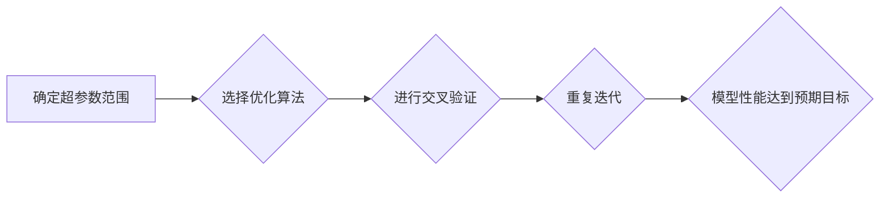

> 超参数调整, 神经网络, 机器学习, Python, 优化算法, 性能评估

## 1. 背景介绍

在机器学习领域，神经网络模型因其强大的表达能力和应用广泛性而备受关注。然而，神经网络模型的训练过程依赖于大量的超参数，这些超参数的设置直接影响模型的性能。如何有效地调整超参数，以获得最佳的模型性能，是机器学习 practitioners 面临的重大挑战。

本文将深入探讨神经网络超参数调整的技术与策略，并结合 Python 实战案例，帮助读者理解超参数的含义、调整方法以及性能评估技巧。

## 2. 核心概念与联系

**2.1 超参数的概念**

超参数是指在训练神经网络模型时，需要事先设定，并不能通过训练数据直接学习的参数。这些参数控制着模型的学习过程和结构，例如：

* 学习率 (Learning Rate)：决定模型在更新权重时，步长的大小。
* 隐藏层数量和节点数：决定模型的复杂度和表达能力。
* 正则化参数 (Regularization Parameter)：控制模型的复杂度，防止过拟合。
* 激活函数 (Activation Function)：决定神经元输出的非线性关系。

**2.2 超参数调整与模型性能的关系**

超参数的设置直接影响着模型的训练效果和最终性能。

* **过大的学习率**会导致模型训练不稳定，甚至发散。
* **过小的学习率**会导致训练过程过慢，难以收敛。
* **过多的隐藏层和节点数**会导致模型过拟合，难以泛化到新的数据。
* **过少的隐藏层和节点数**会导致模型表达能力不足，难以学习复杂的数据模式。

**2.3 超参数调整的流程**

超参数调整是一个迭代的过程，通常包括以下步骤：

1. **确定超参数范围:** 根据模型类型和数据集特点，设定超参数的初始范围。
2. **选择优化算法:** 选择合适的优化算法，例如梯度下降法、Adam 算法等。
3. **进行交叉验证:** 将数据集划分为训练集、验证集和测试集，使用验证集评估模型性能，并根据性能调整超参数。
4. **重复迭代:** 重复步骤 2 和 3，直到模型性能达到预期目标。

**2.4 Mermaid 流程图**



## 3. 核心算法原理 & 具体操作步骤

### 3.1 算法原理概述

神经网络超参数调整的核心算法主要包括：

* **梯度下降法 (Gradient Descent):** 通过计算损失函数的梯度，不断更新模型参数，以最小化损失函数的值。
* **随机梯度下降法 (Stochastic Gradient Descent):** 在梯度下降法的基础上，每次更新模型参数时只使用一个样本的梯度，可以加速训练速度。
* **Adam 算法:** 结合了梯度下降法和动量法的优点，可以更快地收敛到最优解。

### 3.2 算法步骤详解

**梯度下降法:**

1. 初始化模型参数。
2. 计算损失函数的值。
3. 计算损失函数对每个参数的梯度。
4. 根据梯度更新每个参数的值。
5. 重复步骤 2-4，直到损失函数收敛。

**随机梯度下降法:**

1. 随机选择一个样本。
2. 计算损失函数的值。
3. 计算损失函数对每个参数的梯度。
4. 根据梯度更新每个参数的值。
5. 重复步骤 1-4，直到损失函数收敛。

**Adam 算法:**

1. 初始化模型参数、动量项和学习率衰减因子。
2. 计算损失函数的值。
3. 计算损失函数对每个参数的梯度。
4. 更新动量项。
5. 根据动量项和梯度更新每个参数的值。
6. 重复步骤 2-5，直到损失函数收敛。

### 3.3 算法优缺点

| 算法 | 优点 | 缺点 |
|---|---|---|
| 梯度下降法 | 简单易实现 | 训练速度慢，容易陷入局部最优 |
| 随机梯度下降法 | 训练速度快 | 训练过程不稳定，容易震荡 |
| Adam 算法 | 收敛速度快，稳定性好 | 计算量较大 |

### 3.4 算法应用领域

* **图像识别:** 识别物体、场景、人脸等。
* **自然语言处理:** 文本分类、情感分析、机器翻译等。
* **语音识别:** 将语音转换为文本。
* **推荐系统:** 根据用户历史行为推荐商品或内容。

## 4. 数学模型和公式 & 详细讲解 & 举例说明

### 4.1 数学模型构建

神经网络模型可以看作是一个多层感知机，每个层包含多个神经元。每个神经元接收来自上一层的输入，并通过激活函数进行非线性变换，输出到下一层。

**4.1.1 神经网络结构**

```
输入层 -> 隐藏层1 -> 隐藏层2 -> ... -> 隐藏层n -> 输出层
```

**4.1.2 激活函数**

激活函数的作用是引入非线性，使神经网络能够学习复杂的数据模式。常见的激活函数包括：

* **Sigmoid 函数:** 将输入映射到 (0, 1) 之间。
* **ReLU 函数:** 将负输入映射到 0，正输入保持不变。
* **Tanh 函数:** 将输入映射到 (-1, 1) 之间。

**4.1.3 损失函数**

损失函数用于衡量模型预测结果与真实值的差距。常见的损失函数包括：

* **均方误差 (MSE):** 计算预测值与真实值之间的平方差的平均值。
* **交叉熵损失 (Cross-Entropy Loss):** 用于分类任务，计算预测概率分布与真实概率分布之间的差异。

### 4.2 公式推导过程

**4.2.1 梯度下降法公式**

```
参数更新 = 学习率 * 梯度
```

**4.2.2 Adam 算法公式**

```
参数更新 = 学习率 * 动量项 / (1 + 衰减因子 * 迭代次数)
```

### 4.3 案例分析与讲解

**4.3.1 图像分类任务**

假设我们使用神经网络模型进行图像分类任务，目标是将图像分类为不同的类别，例如猫、狗、鸟等。

* **输入层:** 接收图像的像素值。
* **隐藏层:** 学习图像特征，例如边缘、纹理等。
* **输出层:** 输出每个类别的概率。

**4.3.2 损失函数选择**

由于这是一个分类任务，我们可以选择交叉熵损失作为损失函数。

**4.3.3 超参数调整**

我们可以通过调整学习率、隐藏层数量、节点数等超参数，来优化模型性能。

## 5. 项目实践：代码实例和详细解释说明

### 5.1 开发环境搭建

* Python 3.x
* TensorFlow 或 PyTorch 深度学习框架
* Jupyter Notebook 或 VS Code 开发环境

### 5.2 源代码详细实现

```python
import tensorflow as tf

# 定义模型结构
model = tf.keras.models.Sequential([
    tf.keras.layers.Flatten(input_shape=(28, 28)),
    tf.keras.layers.Dense(128, activation='relu'),
    tf.keras.layers.Dropout(0.2),
    tf.keras.layers.Dense(10, activation='softmax')
])

# 编译模型
model.compile(optimizer='adam',
              loss='sparse_categorical_crossentropy',
              metrics=['accuracy'])

# 训练模型
model.fit(x_train, y_train, epochs=10, batch_size=32)

# 评估模型
loss, accuracy = model.evaluate(x_test, y_test)
print('Test Loss:', loss)
print('Test Accuracy:', accuracy)
```

### 5.3 代码解读与分析

* **模型结构:** 该代码定义了一个简单的全连接神经网络模型，包含一个扁平化层、两个全连接层和一个输出层。
* **激活函数:** 使用 ReLU 激活函数，可以加速训练速度。
* **Dropout 层:** 使用 Dropout 层可以防止过拟合。
* **编译模型:** 使用 Adam 优化器、交叉熵损失函数和准确率作为评估指标。
* **训练模型:** 使用训练数据训练模型，设置训练轮数和批处理大小。
* **评估模型:** 使用测试数据评估模型性能。

### 5.4 运行结果展示

运行代码后，会输出模型在测试集上的损失值和准确率。

## 6. 实际应用场景

### 6.1 图像识别

* **人脸识别:** 用于解锁手机、验证身份。
* **物体检测:** 用于自动驾驶、安防监控。
* **医学图像分析:** 用于诊断疾病、辅助手术。

### 6.2 自然语言处理

* **机器翻译:** 将文本从一种语言翻译成另一种语言。
* **文本摘要:** 自动生成文本的摘要。
* **情感分析:** 分析文本的情感倾向。

### 6.3 其他应用

* **推荐系统:** 根据用户历史行为推荐商品或内容。
* **语音识别:** 将语音转换为文本。
* **音乐生成:** 生成新的音乐作品。

### 6.4 未来应用展望

随着人工智能技术的不断发展，神经网络模型将在更多领域得到应用，例如：

* **个性化教育:** 根据学生的学习情况提供个性化的学习方案。
* **精准医疗:** 根据患者的基因信息和病史提供个性化的治疗方案。
* **自动写作:** 自动生成新闻报道、小说等文本。

## 7. 工具和资源推荐

### 7.1 学习资源推荐

* **书籍:**
    * 《深度学习》
    * 《Python机器学习实战》
* **在线课程:**
    * Coursera: 深度学习
    * Udacity: 
    * fast.ai: 深度学习课程
* **博客:**
    * TensorFlow Blog
    * PyTorch Blog

### 7.2 开发工具推荐

* **TensorFlow:** 开源深度学习框架。
* **PyTorch:** 开源深度学习框架。
* **Keras:** 高级深度学习 API，可以运行在 TensorFlow、Theano 或 CNTK 后端。

### 7.3 相关论文推荐

* **AlexNet:** ImageNet Classification with Deep Convolutional Neural Networks
* **VGGNet:** Very Deep Convolutional Networks for Large-Scale Image Recognition
* **ResNet:** Deep Residual Learning for Image Recognition

## 8. 总结：未来发展趋势与挑战

### 8.1 研究成果总结

近年来，神经网络模型取得了显著的进展，在图像识别、自然语言处理等领域取得了突破性成果。

### 8.2 未来发展趋势

* **模型规模的扩大:** 训练更大型的模型，以提高模型的表达能力和泛化能力。
* **模型效率的提升:** 探索新的模型架构和训练方法，以提高模型的训练速度和推理效率。
* **模型解释性的增强:** 研究如何解释神经网络模型的决策过程，提高模型的可解释性和可信度。

### 8.3 面临的挑战

* **数据获取和标注:** 训练高质量的神经网络模型需要大量的标注数据，数据获取和标注成本较高。
* **模型训练的复杂性:** 训练大型神经网络模型需要强大的计算资源和专业的技术人员。
* **模型的安全性与可靠性:** 神经网络模型容易受到攻击，需要保证模型的安全性与可靠性。

### 8.4 研究展望

未来，神经网络研究将继续朝着更强大、更智能、更安全的方向发展。


## 9. 附录：常见问题与解答

**9.1 如何选择合适的超参数？