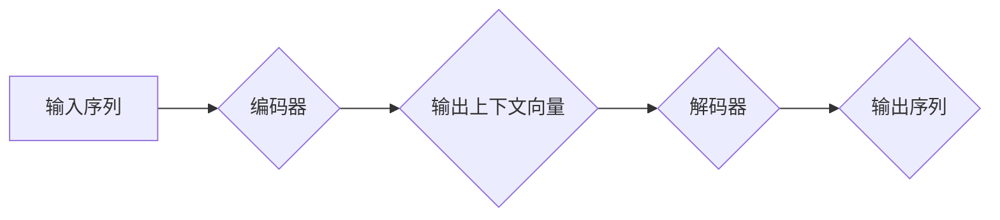

> Transformer模型，自注意力机制，编码器-解码器结构，BERT，GPT，NLP，自然语言处理

## 1. 背景介绍

自然语言处理 (NLP) 领域一直以来都是人工智能研究的热点之一。传统的基于循环神经网络 (RNN) 的模型在处理长文本序列时存在效率低下和梯度消失等问题。为了解决这些问题，谷歌于 2017 年提出了 Transformer 模型，彻底改变了 NLP 领域的发展方向。

Transformer 模型的核心创新点在于它完全摒弃了 RNN 的循环结构，而是采用了自注意力机制 (Self-Attention) 来捕捉文本序列中的长距离依赖关系。这种全新的架构使得 Transformer 模型在处理长文本序列时具有更高的效率和更强的表达能力。

自 Transformer 模型的提出以来，它在各种 NLP 任务中取得了显著的成果，例如机器翻译、文本摘要、问答系统、文本生成等。基于 Transformer 模型的预训练语言模型，如 BERT 和 GPT，也成为了 NLP 领域的新宠，为各种下游任务提供了强大的基础。

## 2. 核心概念与联系

Transformer 模型的核心概念包括：

* **自注意力机制 (Self-Attention):**  自注意力机制允许模型关注输入序列中的不同位置，并计算每个位置之间的相关性。通过这种机制，Transformer 模型能够捕捉文本序列中的长距离依赖关系。

* **编码器-解码器结构 (Encoder-Decoder):** Transformer 模型采用编码器-解码器结构，其中编码器负责将输入序列编码成上下文向量，解码器则根据上下文向量生成输出序列。

* **多头注意力 (Multi-Head Attention):** 多头注意力机制通过并行计算多个注意力头，可以捕捉不同层次的语义信息。

* **前馈神经网络 (Feed-Forward Network):**  前馈神经网络用于对每个位置的上下文向量进行非线性变换，进一步丰富模型的表达能力。

**Mermaid 流程图:**



## 3. 核心算法原理 & 具体操作步骤

### 3.1  算法原理概述

Transformer 模型的核心算法是自注意力机制和编码器-解码器结构。

* **自注意力机制:**  自注意力机制计算每个词与所有其他词之间的相关性，并生成一个加权表示，其中每个词的权重代表其与其他词的相关程度。

* **编码器-解码器结构:**  编码器将输入序列编码成上下文向量，解码器根据上下文向量生成输出序列。

### 3.2  算法步骤详解

1. **输入处理:** 将输入序列转换为词嵌入向量。

2. **编码器:**
    * 将词嵌入向量输入到多层编码器模块中。
    * 每个编码器模块包含一个多头注意力层和一个前馈神经网络层。
    * 通过多层编码器模块，将输入序列编码成上下文向量。

3. **解码器:**
    * 将上下文向量输入到多层解码器模块中。
    * 每个解码器模块也包含一个多头注意力层和一个前馈神经网络层。
    * 通过多层解码器模块，根据上下文向量生成输出序列。

4. **输出:** 将解码器输出的词嵌入向量转换为文本。

### 3.3  算法优缺点

**优点:**

* 能够捕捉长距离依赖关系。
* 并行计算能力强，训练速度快。
* 表现能力强，在各种 NLP 任务中取得了优异的成绩。

**缺点:**

* 参数量大，训练成本高。
* 对训练数据要求高。

### 3.4  算法应用领域

Transformer 模型在以下 NLP 任务中取得了广泛应用:

* 机器翻译
* 文本摘要
* 问答系统
* 文本生成
* 语义理解
* 代码生成

## 4. 数学模型和公式 & 详细讲解 & 举例说明

### 4.1  数学模型构建

Transformer 模型的核心数学模型是自注意力机制。自注意力机制的计算过程可以表示为以下公式:

$$
Attention(Q, K, V) = softmax(\frac{QK^T}{\sqrt{d_k}})V
$$

其中:

* $Q$：查询矩阵
* $K$：键矩阵
* $V$：值矩阵
* $d_k$：键向量的维度
* $softmax$：softmax 函数

### 4.2  公式推导过程

自注意力机制的计算过程可以分为以下几个步骤:

1. 计算查询矩阵 $Q$、键矩阵 $K$ 和值矩阵 $V$。

2. 计算 $QK^T$，并进行归一化，得到一个分数矩阵。

3. 对分数矩阵应用 softmax 函数，得到每个词与所有其他词的相关性权重。

4. 将权重与值矩阵相乘，得到每个词的加权表示。

### 4.3  案例分析与讲解

假设我们有一个句子 "The cat sat on the mat"，我们想要计算每个词与所有其他词的相关性。

1. 将句子中的每个词转换为词嵌入向量，得到 $Q$、$K$ 和 $V$ 三个矩阵。

2. 计算 $QK^T$，并进行归一化，得到一个分数矩阵。

3. 对分数矩阵应用 softmax 函数，得到每个词与所有其他词的相关性权重。

4. 将权重与值矩阵相乘，得到每个词的加权表示。

通过这种方式，我们可以捕捉到句子中每个词与其他词之间的关系，例如 "cat" 与 "sat" 之间的关系，"sat" 与 "on" 之间的关系，等等。

## 5. 项目实践：代码实例和详细解释说明

### 5.1  开发环境搭建

* Python 3.6+
* TensorFlow 或 PyTorch

### 5.2  源代码详细实现

```python
import tensorflow as tf

# 定义自注意力机制
def self_attention(query, key, value, mask=None):
    # 计算注意力分数
    scores = tf.matmul(query, key, transpose_b=True) / tf.math.sqrt(tf.cast(key.shape[-1], tf.float32))
    # 应用掩码
    if mask is not None:
        scores += (mask * -1e9)
    # 计算注意力权重
    attention_weights = tf.nn.softmax(scores, axis=-1)
    # 计算加权值
    context_vector = tf.matmul(attention_weights, value)
    return context_vector, attention_weights

# 定义编码器模块
class EncoderLayer(tf.keras.layers.Layer):
    def __init__(self, d_model, num_heads, dff, rate=0.1):
        super(EncoderLayer, self).__init__()
        self.mha = tf.keras.layers.MultiHeadAttention(num_heads=num_heads, key_dim=d_model)
        self.ffn = tf.keras.Sequential([
            tf.keras.layers.Dense(dff, activation='relu'),
            tf.keras.layers.Dense(d_model)
        ])
        self.layernorm1 = tf.keras.layers.LayerNormalization(epsilon=1e-6)
        self.layernorm2 = tf.keras.layers.LayerNormalization(epsilon=1e-6)
        self.dropout1 = tf.keras.layers.Dropout(rate)
        self.dropout2 = tf.keras.layers.Dropout(rate)

    def call(self, x, training):
        attn_output, _ = self.mha(x, x, x)
        attn_output = self.dropout1(attn_output, training=training)
        out1 = self.layernorm1(x + attn_output)
        ffn_output = self.ffn(out1)
        ffn_output = self.dropout2(ffn_output, training=training)
        out2 = self.layernorm2(out1 + ffn_output)
        return out2

# 定义解码器模块
class DecoderLayer(tf.keras.layers.Layer):
    def __init__(self, d_model, num_heads, dff, rate=0.1):
        super(DecoderLayer, self).__init__()
        self.mha1 = tf.keras.layers.MultiHeadAttention(num_heads=num_heads, key_dim=d_model)
        self.mha2 = tf.keras.layers.MultiHeadAttention(num_heads=num_heads, key_dim=d_model)
        self.ffn = tf.keras.Sequential([
            tf.keras.layers.Dense(dff, activation='relu'),
            tf.keras.layers.Dense(d_model)
        ])
        self.layernorm1 = tf.keras.layers.LayerNormalization(epsilon=1e-6)
        self.layernorm2 = tf.keras.layers.LayerNormalization(epsilon=1e-6)
        self.layernorm3 = tf.keras.layers.LayerNormalization(epsilon=1e-6)
        self.dropout1 = tf.keras.layers.Dropout(rate)
        self.dropout2 = tf.keras.layers.Dropout(rate)
        self.dropout3 = tf.keras.layers.Dropout(rate)

    def call(self, x, encoder_output, training):
        attn1_output, _ = self.mha1(x, x, x)
        attn1_output = self.dropout1(attn1_output, training=training)
        out1 = self.layernorm1(x + attn1_output)
        attn2_output, _ = self.mha2(out1, encoder_output, encoder_output)
        attn2_output = self.dropout2(attn2_output, training=training)
        out2 = self.layernorm2(out1 + attn2_output)
        ffn_output = self.ffn(out2)
        ffn_output = self.dropout3(ffn_output, training=training)
        out3 = self.layernorm3(out2 + ffn_output)
        return out3

# 定义 Transformer 模型
class Transformer(tf.keras.Model):
    def __init__(self, vocab_size, d_model, num_layers, num_heads, dff, rate=0.1):
        super(Transformer, self).__init__()
        self.embedding = tf.keras.layers.Embedding(vocab_size, d_model)
        self.encoder = tf.keras.Sequential([
            EncoderLayer(d_model, num_heads, dff, rate) for _ in range(num_layers)
        ])
        self.decoder = tf.keras.Sequential([
            DecoderLayer(d_model, num_heads, dff, rate) for _ in range(num_layers)
        ])
        self.fc_out = tf.keras.layers.Dense(vocab_size)

    def call(self, encoder_input, decoder_input, training):
        encoder_output = self.encoder(self.embedding(encoder_input), training=training)
        decoder_output = self.decoder(self.embedding(decoder_input), encoder_output, training=training)
        output = self.fc_out(decoder_output)
        return output

```

### 5.3  代码解读与分析

* **自注意力机制:**  `self_attention` 函数实现了一个基本的自注意力机制，计算每个词与所有其他词之间的相关性。

* **编码器模块:**  `EncoderLayer` 类定义了一个编码器模块，包含一个多头注意力层和一个前馈神经网络层。

* **解码器模块:**  `DecoderLayer` 类定义了一个解码器模块，包含两个多头注意力层和一个前馈神经网络层。

* **Transformer 模型:**  `Transformer` 类定义了一个完整的 Transformer 模型，包含嵌入层、编码器、解码器和输出层。

### 5.4  运行结果展示

运行上述代码，可以训练一个 Transformer 模型，并进行机器