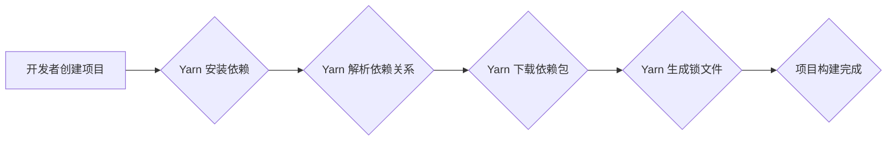

> Yarn, 包管理, 依赖管理, 构建工具, npm, 性能优化, 代码示例

## 1. 背景介绍

在现代软件开发中，依赖管理和包管理扮演着至关重要的角色。随着项目规模的不断扩大，项目依赖的第三方库和模块也越来越多，这使得依赖管理变得更加复杂。Yarn 是一个开源的包管理器，由 Facebook 开发，旨在解决 npm 存在的一些问题，例如依赖冲突、安装速度慢等。

Yarn 的出现，为开发者提供了更快速、更可靠、更安全的依赖管理解决方案。它采用了一种全新的依赖解析算法，能够有效地解决依赖冲突，并提供更快的安装速度。此外，Yarn 还支持工作空间功能，可以方便地管理多个项目之间的依赖关系。

## 2. 核心概念与联系

Yarn 的核心概念包括：

* **工作空间 (Workspaces):**  Yarn 的工作空间功能允许开发者在一个目录下管理多个独立的项目，并定义项目之间的依赖关系。
* **锁文件 (lockfile):** Yarn 会生成一个锁文件，记录项目的依赖关系和版本信息。锁文件可以确保每个开发者的环境都一致，避免依赖冲突。
* **依赖解析 (Dependency Resolution):** Yarn 使用一种高效的依赖解析算法，能够快速地解析项目依赖关系，并解决依赖冲突。
* **缓存机制 (Caching):** Yarn 会缓存已下载的包，以便下次安装时可以更快地获取。

**Yarn 工作流程:**



## 3. 核心算法原理 & 具体操作步骤

### 3.1  算法原理概述

Yarn 的依赖解析算法的核心是基于 **深度优先搜索 (DFS)** 和 **拓扑排序 (Topological Sort)**。

* **深度优先搜索 (DFS):**  Yarn 使用 DFS 算法遍历项目依赖树，从根节点开始，逐层向下搜索，直到找到所有依赖项。
* **拓扑排序 (Topological Sort):**  Yarn 使用拓扑排序算法对依赖树进行排序，将依赖关系按照依赖顺序排列，确保依赖项在安装之前已经安装完成。

### 3.2  算法步骤详解

1. **解析依赖文件:** Yarn 会解析项目依赖文件 (package.json)，获取项目依赖的包名和版本信息。
2. **构建依赖树:** Yarn 会根据依赖文件信息构建一个依赖树，其中每个节点代表一个包，边代表依赖关系。
3. **深度优先搜索:** Yarn 使用 DFS 算法遍历依赖树，找到所有依赖项。
4. **拓扑排序:** Yarn 使用拓扑排序算法对依赖树进行排序，将依赖项按照依赖顺序排列。
5. **下载依赖包:** Yarn 会根据排序后的依赖项列表，依次下载依赖包。
6. **安装依赖包:** Yarn 会将下载的依赖包安装到项目目录中。
7. **生成锁文件:** Yarn 会生成一个锁文件，记录项目的依赖关系和版本信息。

### 3.3  算法优缺点

**优点:**

* **高效:** Yarn 的依赖解析算法高效，能够快速地解析依赖关系。
* **可靠:** Yarn 的依赖解析算法能够有效地解决依赖冲突。
* **安全:** Yarn 的锁文件机制可以确保每个开发者的环境都一致，避免依赖冲突。

**缺点:**

* **复杂:** Yarn 的依赖解析算法相对复杂，需要一定的理解才能掌握。
* **资源消耗:** Yarn 的依赖解析算法可能会消耗一定的系统资源。

### 3.4  算法应用领域

Yarn 的依赖解析算法广泛应用于各种软件开发场景，例如：

* **Web 开发:** Yarn 可以用于管理 Web 项目的依赖关系，例如前端框架、库和工具。
* **移动开发:** Yarn 可以用于管理移动应用的依赖关系，例如 Android 和 iOS 开发框架。
* **数据科学:** Yarn 可以用于管理数据科学项目依赖关系，例如机器学习库和工具。

## 4. 数学模型和公式 & 详细讲解 & 举例说明

### 4.1  数学模型构建

Yarn 的依赖解析算法可以抽象为一个图论模型，其中：

* **节点:** 代表一个包。
* **边:** 代表依赖关系，从依赖项指向被依赖的包。

### 4.2  公式推导过程

Yarn 使用拓扑排序算法对依赖树进行排序，拓扑排序算法的原理是：

* **入度为 0 的节点:**  首先将入度为 0 的节点加入到排序列表中。
* **删除入度为 0 的节点:**  从排序列表中删除一个入度为 0 的节点，并将其所有出度节点的入度减 1。
* **重复步骤 2:**  重复步骤 2，直到所有节点都被加入到排序列表中。

### 4.3  案例分析与讲解

假设有一个依赖关系如下：

* 包 A 依赖包 B
* 包 B 依赖包 C
* 包 C 没有依赖

使用拓扑排序算法，可以得到以下排序结果：

1. 包 C
2. 包 B
3. 包 A

## 5. 项目实践：代码实例和详细解释说明

### 5.1  开发环境搭建

* 安装 Node.js 和 npm 或 Yarn。
* 创建一个新的项目目录。

### 5.2  源代码详细实现

```bash
# 初始化项目
yarn init -y

# 安装依赖包
yarn add express

# 创建 index.js 文件
```

```javascript
const express = require('express');
const app = express();

app.get('/', (req, res) => {
  res.send('Hello World!');
});

app.listen(3000, () => {
  console.log('Server listening on port 3000');
});
```

### 5.3  代码解读与分析

* `yarn init -y`: 初始化一个新的 Yarn 项目，并生成 package.json 文件。
* `yarn add express`: 安装 Express.js 框架。
* `require('express')`: 引入 Express.js 框架。
* `app.get('/', ...)`: 定义一个 GET 请求的路由，当访问根路径时，返回 "Hello World!"。
* `app.listen(3000, ...)`: 启动服务器，监听 3000 端口。

### 5.4  运行结果展示

运行 `yarn start` 命令，启动项目，访问 http://localhost:3000/，可以看到 "Hello World!" 的输出。

## 6. 实际应用场景

Yarn 在实际开发场景中应用广泛，例如：

* **大型 Web 项目:** Yarn 可以帮助管理大型 Web 项目的庞大依赖关系，提高开发效率。
* **开源项目:** 许多开源项目使用 Yarn 管理依赖关系，例如 React、Vue.js 等。
* **企业级开发:**  Yarn 可以帮助企业级开发团队管理项目依赖关系，提高开发协作效率。

### 6.4  未来应用展望

随着软件开发的不断发展，Yarn 将会继续演进，并应用于更多新的场景，例如：

* **云原生开发:** Yarn 可以帮助管理云原生应用的依赖关系，提高开发效率。
* **人工智能开发:** Yarn 可以帮助管理人工智能开发项目依赖关系，提高开发效率。
* **边缘计算开发:** Yarn 可以帮助管理边缘计算开发项目依赖关系，提高开发效率。

## 7. 工具和资源推荐

### 7.1  学习资源推荐

* **Yarn 官方文档:** https://yarnpkg.com/en/docs/
* **Yarn 中文文档:** https://www.npmjs.com/package/yarn
* **Yarn GitHub 仓库:** https://github.com/yarnpkg/yarn

### 7.2  开发工具推荐

* **Visual Studio Code:** https://code.visualstudio.com/
* **Atom:** https://atom.io/
* **Sublime Text:** https://www.sublimetext.com/

### 7.3  相关论文推荐

* **Yarn: A Fast, Reliable, and Secure Dependency Manager:** https://yarnpkg.com/en/docs/getting-started

## 8. 总结：未来发展趋势与挑战

### 8.1  研究成果总结

Yarn 的出现，为开发者提供了更快速、更可靠、更安全的依赖管理解决方案。其高效的依赖解析算法和锁文件机制，有效地解决了依赖冲突和环境不一致的问题。

### 8.2  未来发展趋势

未来，Yarn 将会继续朝着以下方向发展：

* **更快的安装速度:** Yarn 将会继续优化其依赖解析算法和缓存机制，以提高安装速度。
* **更强大的功能:** Yarn 将会添加更多强大的功能，例如更灵活的依赖管理策略、更完善的版本控制机制等。
* **更广泛的应用场景:** Yarn 将会应用于更多新的场景，例如云原生开发、人工智能开发等。

### 8.3  面临的挑战

Yarn 也面临着一些挑战：

* **兼容性问题:** Yarn 需要与其他包管理器和工具保持兼容。
* **安全性问题:** Yarn 需要不断加强其安全性，防止恶意代码注入。
* **社区支持:** Yarn 需要不断吸引更多开发者加入社区，共同维护和发展 Yarn。

### 8.4  研究展望

未来，Yarn 的研究方向包括：

* **更智能的依赖解析算法:** 开发更智能的依赖解析算法，能够更好地理解项目依赖关系，并自动解决依赖冲突。
* **更安全的依赖管理机制:** 开发更安全的依赖管理机制，防止恶意代码注入和依赖包篡改。
* **更强大的功能扩展:** 开发更强大的功能扩展，例如更灵活的依赖管理策略、更完善的版本控制机制等。


## 9. 附录：常见问题与解答

* **Q: Yarn 和 npm 的区别是什么？**

* **A:** Yarn 和 npm 都是包管理器，但 Yarn 针对 npm 的一些问题进行了改进，例如依赖解析算法、安装速度、锁文件机制等。

* **Q: 如何安装 Yarn？**

* **A:** 可以从 Yarn 官方网站下载安装包，或者使用 npm 安装 Yarn。

* **Q: 如何使用 Yarn 管理项目依赖？**

* **A:** 使用 `yarn add` 命令安装依赖包，使用 `yarn remove` 命令卸载依赖包，使用 `yarn list` 命令列出项目依赖包。

* **Q: 如何生成 Yarn 锁文件？**

* **A:** Yarn 会自动生成锁文件，锁文件路径为 `package-lock.json`。

* **Q: 如何解决依赖冲突？**

* **A:** Yarn 的依赖解析算法能够有效地解决依赖冲突。


作者：禅与计算机程序设计艺术 / Zen and the Art of Computer Programming<end_of_turn>