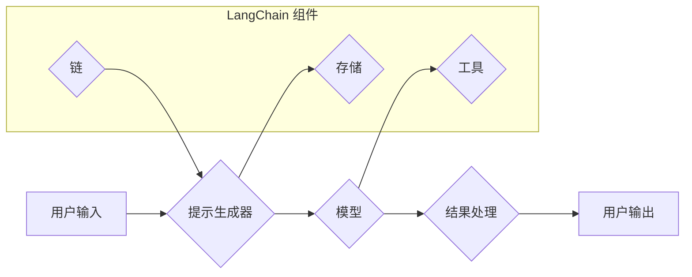

> LangChain, 语言模型, 应用开发, 编程框架, AI, 自然语言处理, 聊天机器人

## 1. 背景介绍

近年来，大型语言模型（LLM）的快速发展，如GPT-3、LaMDA等，为自然语言处理（NLP）领域带来了革命性的变革。这些模型展现出惊人的文本生成、翻译、摘要等能力，为各种应用场景提供了无限可能。然而，直接调用LLM API并不能满足复杂应用的需求，例如构建多轮对话系统、整合外部数据、执行特定任务等。

为了解决这些问题，LangChain应运而生。LangChain是一个强大的开源框架，旨在简化LLM的开发和应用。它提供了一套丰富的工具和组件，帮助开发者将LLM与其他技术集成，构建更智能、更强大的应用。

## 2. 核心概念与联系

LangChain的核心概念包括：

* **模型（Model）：** 指的是用于处理文本的LLM，例如GPT-3、BLOOM等。
* **提示（Prompt）：** 指的是输入给模型的文本指令，用于引导模型生成特定类型的输出。
* **链（Chain）：** 指的是将多个组件串联在一起的流程，用于完成复杂的任务。
* **存储（Memory）：** 用于存储对话历史、外部数据等信息，帮助模型理解上下文并提供更精准的回复。
* **工具（Tool）：** 指的是可以被模型调用的外部程序或API，例如搜索引擎、数据库等。

**LangChain 架构流程图:**



## 3. 核心算法原理 & 具体操作步骤

### 3.1  算法原理概述

LangChain的核心算法原理是基于**提示工程**和**链式调用**。

* **提示工程:** 通过精心设计提示，引导模型生成期望的输出。
* **链式调用:** 将多个组件串联起来，形成一个完成特定任务的流程。

### 3.2  算法步骤详解

1. **定义任务:** 明确需要完成的任务，例如聊天机器人、文本摘要、代码生成等。
2. **选择模型:** 根据任务需求选择合适的LLM模型。
3. **设计提示:** 根据任务需求设计合适的提示，引导模型生成期望的输出。
4. **构建链:** 将模型、提示、存储、工具等组件串联起来，形成一个完成任务的链。
5. **测试和优化:** 测试链的性能，并根据实际情况进行优化。

### 3.3  算法优缺点

**优点:**

* **易于使用:** LangChain提供了一套简洁易用的API，方便开发者快速构建应用。
* **灵活定制:** 可以根据需求灵活定制链的结构和组件。
* **可扩展性强:** 可以集成各种外部工具和数据源。

**缺点:**

* **模型依赖:** LangChain依赖于外部LLM模型，模型性能直接影响应用效果。
* **链式调用复杂:** 构建复杂的链可能需要较高的编程经验。

### 3.4  算法应用领域

LangChain的应用领域非常广泛，包括：

* **聊天机器人:** 构建更智能、更自然的对话系统。
* **文本生成:** 生成各种类型的文本，例如文章、故事、代码等。
* **数据分析:** 从文本数据中提取信息，进行分析和洞察。
* **教育:** 提供个性化的学习体验，辅助教学和学习。
* **客服:** 自动化客服回复，提高效率和客户满意度。

## 4. 数学模型和公式 & 详细讲解 & 举例说明

### 4.1  数学模型构建

LangChain的核心算法并不依赖于复杂的数学模型，而是基于统计学习和自然语言处理的原理。

### 4.2  公式推导过程

LangChain的算法原理主要基于以下几个公式：

* **概率分布:** LLMs使用概率分布来预测下一个词的出现概率。
* **交叉熵损失函数:** 用于训练LLMs，最小化模型预测结果与真实结果之间的差异。
* **梯度下降算法:** 用于优化模型参数，降低损失函数的值。

### 4.3  案例分析与讲解

例如，在文本生成任务中，LangChain会使用概率分布来预测下一个词的出现概率，并根据这些概率选择最合适的词进行生成。

## 5. 项目实践：代码实例和详细解释说明

### 5.1  开发环境搭建

1. 安装Python 3.7+
2. 安装必要的库，例如：
    ```bash
    pip install langchain transformers
    ```

### 5.2  源代码详细实现

```python
from langchain.llms import OpenAI
from langchain.chains import ConversationChain
from langchain.memory import ConversationBufferMemory

# 初始化OpenAI模型
llm = OpenAI(temperature=0.7)

# 初始化对话内存
memory = ConversationBufferMemory()

# 创建对话链
conversation = ConversationChain(
    llm=llm,
    memory=memory,
    prompt=f"你好，我是你的AI助手。请问有什么可以帮你的吗？"
)

# 与模型进行对话
while True:
    user_input = input("用户: ")
    if user_input.lower() == "exit":
        break
    response = conversation.run(user_input)
    print("AI:", response)
```

### 5.3  代码解读与分析

* **初始化模型和内存:** 代码首先初始化OpenAI模型和对话内存。
* **创建对话链:** 使用`ConversationChain`类创建对话链，并将模型和内存作为参数传入。
* **对话交互:** 使用循环进行对话交互，用户输入文本，模型根据输入和对话历史生成回复。

### 5.4  运行结果展示

```
用户: 你好
AI: 你好，我是你的AI助手。请问有什么可以帮你的吗？
用户: 你叫什么名字？
AI: 我没有名字。
用户: 你能写一首诗吗？
AI: 
春风拂柳绿如烟，
鸟语花香满山间。
阳光明媚照大地，
万物复苏生机勃。
用户: 谢谢
AI: 不客气。请问还有什么可以帮你的吗？
用户: exit
```

## 6. 实际应用场景

### 6.1  聊天机器人

LangChain可以用于构建各种类型的聊天机器人，例如客服机器人、陪伴机器人、游戏机器人等。

### 6.2  文本摘要

LangChain可以用于自动生成文本摘要，例如新闻摘要、会议记录摘要等。

### 6.3  代码生成

LangChain可以用于根据自然语言描述生成代码，例如生成Python、JavaScript等语言的代码。

### 6.4  未来应用展望

LangChain的应用场景还在不断扩展，未来可能会应用于更多领域，例如：

* **个性化教育:** 提供个性化的学习体验，辅助教学和学习。
* **医疗诊断:** 辅助医生进行诊断，提高诊断准确率。
* **法律服务:** 自动化法律文件处理，提高效率和准确性。

## 7. 工具和资源推荐

### 7.1  学习资源推荐

* **LangChain官方文档:** https://python.langchain.com/docs/
* **LangChain GitHub仓库:** https://github.com/langchain-ai/langchain

### 7.2  开发工具推荐

* **VS Code:** https://code.visualstudio.com/
* **PyCharm:** https://www.jetbrains.com/pycharm/

### 7.3  相关论文推荐

* **Attention Is All You Need:** https://arxiv.org/abs/1706.03762
* **BERT: Pre-training of Deep Bidirectional Transformers for Language Understanding:** https://arxiv.org/abs/1810.04805

## 8. 总结：未来发展趋势与挑战

### 8.1  研究成果总结

LangChain为LLM的应用开发提供了强大的工具和框架，简化了开发流程，提高了应用效率。

### 8.2  未来发展趋势

未来，LangChain可能会朝着以下方向发展：

* **更强大的模型支持:** 支持更多类型的LLM模型，例如多模态模型。
* **更丰富的组件库:** 提供更多类型的组件，例如数据库连接、图像处理等。
* **更易于使用的界面:** 提供更直观的界面，方便非技术人员使用。

### 8.3  面临的挑战

LangChain也面临一些挑战，例如：

* **模型性能瓶颈:** LLMs的性能仍然有限，需要不断改进模型架构和训练方法。
* **数据安全和隐私问题:** LLMs需要大量数据进行训练，如何保证数据安全和隐私是一个重要问题。
* **伦理问题:** LLMs可能会被用于生成虚假信息、进行恶意攻击等，需要制定相应的伦理规范和监管机制。

### 8.4  研究展望

未来，LangChain的研究方向可能会包括：

* **开发更强大的LLM模型:** 研究更有效的模型架构和训练方法，提高模型性能。
* **解决数据安全和隐私问题:** 研究数据加密、匿名化等技术，保障数据安全和隐私。
* **制定LLM伦理规范:** 研究LLM的潜在风险和伦理问题，制定相应的规范和监管机制。

## 9. 附录：常见问题与解答

### 9.1  Q: 如何选择合适的LLM模型？

A: 选择合适的LLM模型需要根据具体的应用场景和需求进行考虑。例如，如果需要生成高质量的文本，可以选择GPT-3等性能较好的模型；如果需要处理特定领域的文本，可以选择针对该领域的预训练模型。

### 9.2  Q: 如何设计有效的提示？

A: 设计有效的提示需要根据模型的特点和任务需求进行调整。一般来说，提示应该清晰、简洁、具体，并提供足够的上下文信息。

### 9.3  Q: 如何优化LangChain应用的性能？

A: 可以通过以下方式优化LangChain应用的性能：

* 选择合适的LLM模型和组件。
* 优化提示设计。
* 使用缓存机制减少重复计算。
* 使用并行处理技术提高效率。


作者：禅与计算机程序设计艺术 / Zen and the Art of Computer Programming 
<end_of_turn>